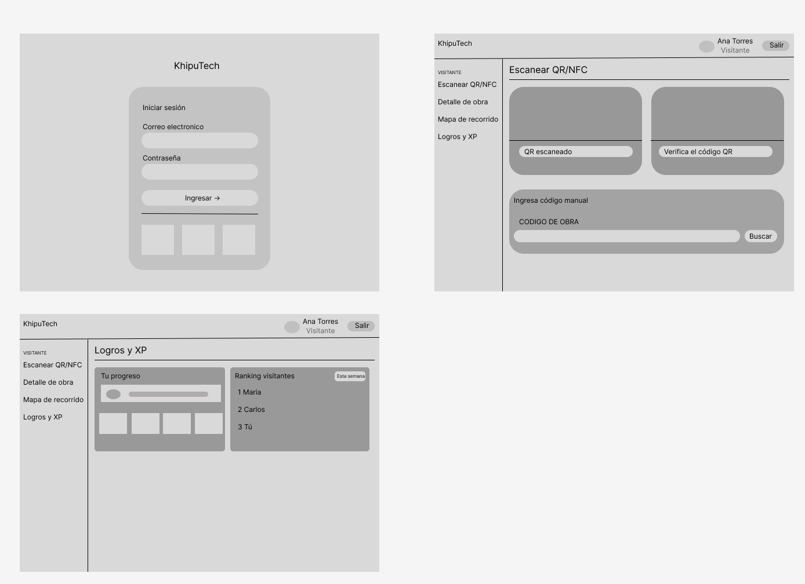
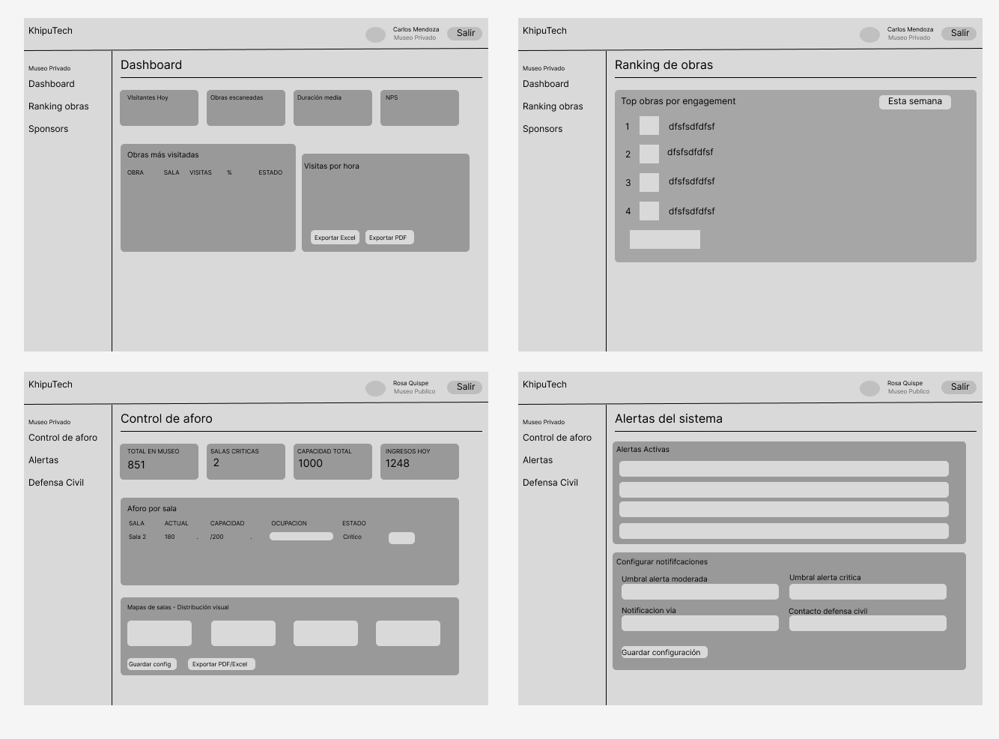
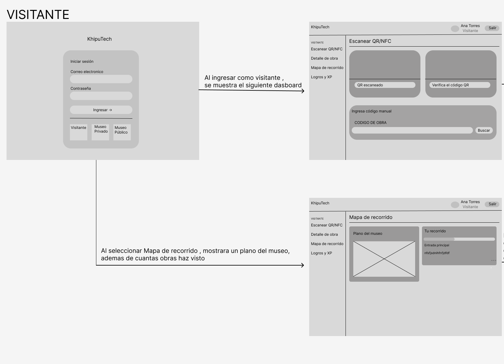
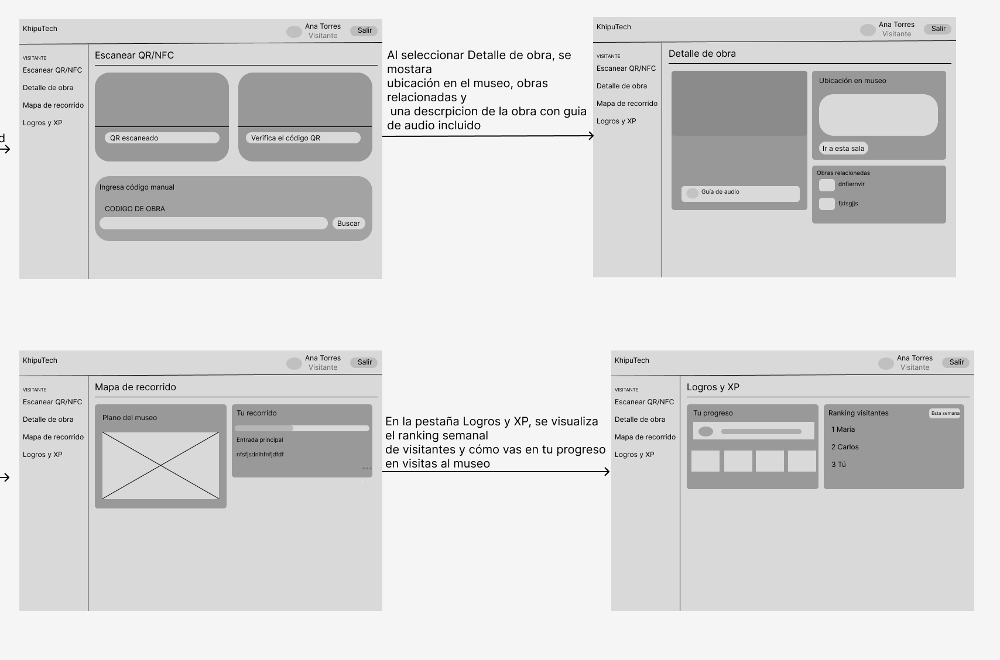
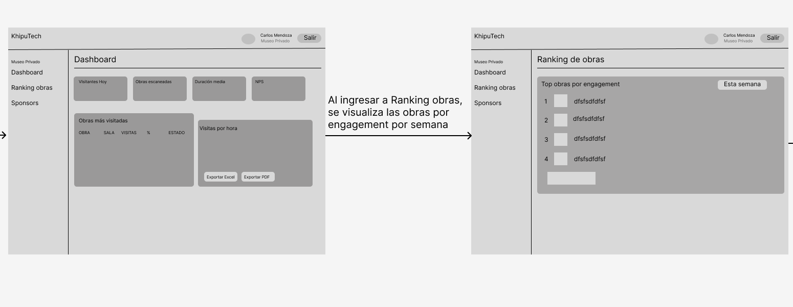
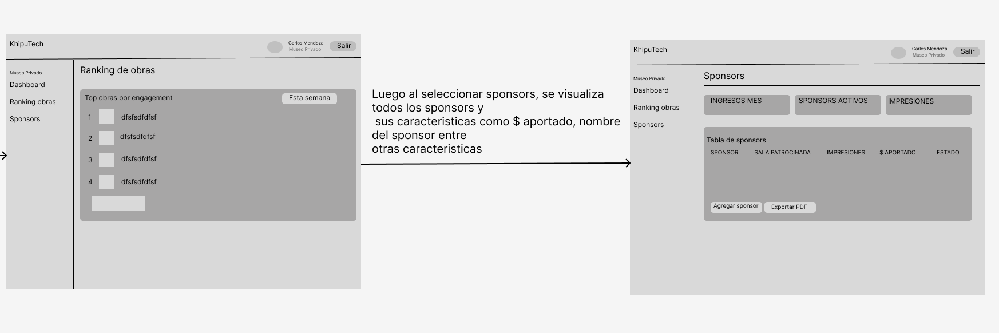

## UNIVERSIDAD PERUANA DE CIENCIAS APLICADA, INGENIERÍA DE SOFTWARE, 2026-01

## 1ASI0730 - Aplicaciones Web

## 12242

## Docente: Angel Augusto Velasquez Nuñez

### "Informe del TB1"

### **Nombre del Startup:** WebStone

### **Nombre del Producto:** KhipuTech

**Relación de Integrantes:**
|Nombres y Apellidos                |Código de estudiante |
|          :---:                    |        :---:        |
|Fabian Jesus Sandoval Cueto        |U20221a132           |
|Oscar Diego Checa Burga            |U20231E492           |
|Andrea Khristina Correa Rodriguez  |U202412041           |
|x  |x           |
|x  |x           |

Abril, 2026

## Registro de Versiones del Informe

| Versión   | Fecha       | Autor/es      | Descripción                                                                                      | Estado    |
|-----------|-------------|------------|--------------------------------------------------------------------------------------------------|-----------|
| 1.0       | 11/04/2026 | X , X , X , X , X | Realizacion del documento |  EN PROCESO|

# Project Report Collaboration Insights

# Tabla de Contenidos

## [Capítulo I: Introducción](#capítulo-i-introducción)

- [1.1. Startup Profile](#11-startup-profile)
  - [1.1.1. Descripción de la Startup](#111-descripcion-del-startup)
  - [1.1.2. Perfiles de integrantes del equipo](#112-perfiles-de-integrantes-del-equipo)
- [1.2. Solution Profile](#12-solution-profile)
  - [1.2.1. Antecedentes y problemática](#121-antecedentes-y-problemática)
  - [1.2.2. Lean UX Process](#122-lean-ux-process)
    - [1.2.2.1. Lean UX Problem Statements](#1221-lean-ux-problem-statements)
    - [1.2.2.2. Lean UX Assumptions](#1222-lean-ux-assumptions)
    - [1.2.2.3. Lean UX Hypothesis Statements](#1223-lean-ux-hypothesis-statements)
    - [1.2.2.4. Lean UX Canvas](#1224-lean-ux-canvas)
- [1.3. Segmentos objetivo](#13-segmentos-objetivos)

---

## [Capítulo II: Requirements Elicitation & Analysis](#capítulo-ii-requirements-elicitation--analysis)

- [2.1. Competidores](#21-competidores)
  - [2.1.1. Análisis competitivo](#211-analisis-competitivo)
  - [2.1.2. Estrategias y tácticas frente a competidores](#212-estrategias-y-tácticas-frente-a-competidores)
- [2.2. Entrevistas](#22-entrevistas)
  - [2.2.1. Diseño de entrevistas](#221-diseño-de-entrevistas)
  - [2.2.2. Registro de entrevistas](#222-registro-de-entrevistas)
  - [2.2.3. Análisis de entrevistas](#223-análisis-de-entrevistas)
- [2.3. Needfinding](#23-needfinding)
  - [2.3.1. User Personas](#231-user-personas)
  - [2.3.2. User Task Matrix](#232-user-task-matrix)
  - [2.3.3. User Journey Mapping](#233-user-journey-mapping)
  - [2.3.4. Empathy Mapping](#234-empathy-mapping)
- [2.4. Big Picture Event Storming](#24-big-picture-EventStorming)
- [2.5. Ubiquitous Language](#25-ubiquitous-language)

---

## [Capítulo III: Requirements Specification](#capítulo-iii-requirements-specification)

- [3.1. User Stories](#31-user-stories)
- [3.2. Impact Mapping](#32-impact-mapping)
- [3.3. Product Backlog](#33-product-backlog)

---

## [Capítulo IV: Product Design](#capítulo-iv-product-design)

- [4.1. Style Guidelines](#41-style-guidelines)
  - [4.1.1. General Style Guidelines](#411-general-style-guidelines)
  - [4.1.2. Web Style Guidelines](#412-web-style-guidelines)
- [4.2. Information Architecture](#42-information-architecture)
  - [4.2.1. Organization Systems](#421-organization-systems)
  - [4.2.2. Labeling Systems](#422-labeling-systems)
  - [4.2.3. SEO Tags and Meta Tags](#423-seo-tags-and-meta-tags)
  - [4.2.4. Searching Systems](#424-searching-systems)
  - [4.2.5. Navigation Systems](#425-navigation-systems)
- [4.3. Landing Page UI Design](#43-landing-page-ui-design)
  - [4.3.1. Landing Page Wireframe](#431-landing-page-wireframe)
  - [4.3.2. Landing Page Mock-up](#432-landing-page-mock-up)
- [4.4. Web Applications UX/UI Design](#44-web-applications-uxui-design)
  - [4.4.1. Web Applications Wireframes](#441-web-applications-wireframes)
  - [4.4.2. Web Applications Wireflow Diagrams](#442-web-applications-wireflow-diagrams)
  - [4.4.3. Web Applications Mock-ups](#443-web-applications-mock-ups)
  - [4.4.4. Web Applications User Flow Diagrams](#444-web-applications-user-flow-diagrams)
- [4.5. Web Applications Prototyping](#45-web-applications-prototyping)
- [4.6. Domain-Driven Software Architecture](#46-domain-driven-software-architecture)
  - [4.6.1. Design-Level Event Storming.](#461-design-level-event-storming.)
  - [4.6.2. Software Architecture Context Diagram](#462-software-architecture-context-diagram)
  - [4.6.3. Software Architecture Container Diagrams](#463-software-architecture-container-diagrams)
  - [4.6.4. Software Architecture Components Diagrams](#464-software-architecture-components-diagrams)
- [4.7. Software Object-Oriented Design](#47-software-object-oriented-design)
  - [4.7.1. Class Diagrams](#471-class-diagrams)
- [4.8. Database Design](#48-database-design)
  - [4.8.1. Database Diagram](#481-database-diagram)

---

## [Capítulo V: Product Implementation, Validation & Deployment](#capítulo-v-product-implementation-validation--deployment)

- [5.1. Software Configuration Management](#51-software-configuration-management)
  - [5.1.1. Software Development Environment Configuration](#511-software-development-environment-configuration)
  - [5.1.2. Source Code Management](#512-source-code-management)
  - [5.1.3. Source Code Style Guide & Conventions](#513-source-code-style-guide--conventions)
  - [5.1.4. Software Deployment Configuration](#514-software-deployment-configuration)
- [5.2. Landing Page, Services & Applications Implementation](#52-landing-page-services--applications-implementation)
  - [5.2.1. Sprint 1](#521-sprint-1)
    - [5.2.1.1. Sprint Planning 1](#5211-sprint-planning-1)
    - [5.2.1.2. Aspect Leaders and Collaborators](#5212-aspect-leaders-and-collaborators)
    - [5.2.1.3. Sprint Backlog 1](#5213-sprint-backlog-1)
    - [5.2.1.4. Development Evidence for Sprint Review](#5214-development-evidence-for-sprint-review)
    - [5.2.1.5. Execution Evidence for Sprint Review](#5215-execution-evidence-for-sprint-review)
    - [5.2.1.6. Services Documentation Evidence for Sprint Review](#5216-services-documentation-evidence-for-sprint-review)
    - [5.2.1.7. Software Deployment Evidence for Sprint Review](#5217-software-deployment-evidence-for-sprint-review)
    - [5.2.1.8. Team Collaboration Insights during Sprint](#5218-team-collaboration-insights-during-sprint)
  - [5.2.2. Sprint 2](#522-sprint-2)
    - [5.2.2.1. Sprint Planning 2](#5221-sprint-planning-2)
    - [5.2.2.2. Aspect Leaders and Collaborators](#5222-aspect-leaders-and-collaborators)
    - [5.2.2.3. Sprint Backlog 2](#5223-sprint-backlog-2)
    - [5.2.2.4. Development Evidence for Sprint Review](#5224-development-evidence-for-sprint-review)
    - [5.2.2.5. Execution Evidence for Sprint Review](#5225-execution-evidence-for-sprint-review)
    - [5.2.2.6. Services Documentation Evidence for Sprint Review](#5226-services-documentation-evidence-for-sprint-review)
    - [5.2.2.7. Software Deployment Evidence for Sprint Review](#5227-software-deployment-evidence-for-sprint-review)
    - [5.2.2.8. Team Collaboration Insights during Sprint](#5228-team-collaboration-insights-during-sprint)
  - [5.2.3. Sprint 3](#523-sprint-3)
    - [5.2.3.1. Sprint Planning 3](#5231-sprint-planning-3)
    - [5.2.3.2. Aspect Leaders and Collaborators](#5232-aspect-leaders-and-collaborators)
    - [5.2.3.3. Sprint Backlog 3](#5233-sprint-backlog-3)
    - [5.2.3.4. Development Evidence for Sprint Review](#5234-development-evidence-for-sprint-review)
    - [5.2.3.5. Execution Evidence for Sprint Review](#5235-execution-evidence-for-sprint-review)
    - [5.2.3.6. Services Documentation Evidence for Sprint Review](#5236-services-documentation-evidence-for-sprint-review)
    - [5.2.3.7. Software Deployment Evidence for Sprint Review](#5237-software-deployment-evidence-for-sprint-review)
    - [5.2.3.8. Team Collaboration Insights during Sprint](#5238-team-collaboration-insights-during-sprint)
  - [5.2.4. Sprint 4](#524-sprint-4)
    - [5.2.4.1. Sprint Planning 4](#524-1-sprint-planning-4)
    - [5.2.4.2. Aspect Leaders and Collaborators](#5242-aspect-leaders-and-collaborators)
    - [5.2.4.3. Sprint Backlog 4](#5243-sprint-backlog-4)
    - [5.2.4.4. Development Evidence for Sprint Review](#5244-development-evidence-for-sprint-review)
    - [5.2.4.5. Execution Evidence for Sprint Review](#5245-execution-evidence-for-sprint-review)
    - [5.2.4.6. Services Documentation Evidence for Sprint Review](#5246-services-documentation-evidence-for-sprint-review)
    - [5.2.4.7. Software Deployment Evidence for Sprint Review](#5247-software-deployment-evidence-for-sprint-review)
    - [5.2.4.8. Team Collaboration Insights during Sprint](#5248-team-collaboration-insights-during-sprint)
- [5.3. Validation Interviews](#53-validation-interviews)
  - [5.3.1. Diseño de entrevistas](#531-diseño-de-entrevistas)
  - [5.3.2. Registro de entrevistas](#532-registro-de-entrevistas)
  - [5.3.3. Evaluaciones según heurísticas](#533-evaluaciones-según-heurísticas)
- [5.4. Video About-the-Product](#54-video-about-the-product)

---

## [Conclusiones](#bibliografia)

- [Conclusiones y recomendaciones](#conclusiones-y-recomendaciones)
- [Video About-the-Team](#video-about-team)

---

## [Bibliografía](#bibliografia)

---

## [Anexos](#anexos)

---

### Student Outcome

|Criterio Especifico|Acciones Realizadas|Conclusiones|
|-------------------|-------------------|------------|
|Trabaja en equipo para proporcionar liderazgo en forma conjunta| xx | xx |
|Crea un entorno colaborativo e inclusivo, establece metas, planifica tareas y cumple objetivos.| xx | xx |

---

## Capítulo I: Introducción

### 1.1. **Startup Profile.**

#### 1.1.1. Descripción del startup

KhipuTech es una startup tecnológica dedicada a la transformación digital de la experiencia museística y cultural. Se desarrolla soluciones híbridas que integran infraestructura IoT de bajo costo con plataformas web dinámicas, permitiendo a los gestores culturales obtener métricas precisas sobre el comportamiento del visitante en tiempo real.

El modelo de negocio de KhipuTech se basa en la optimización del flujo interno de los recintos a través de sensores automatizados, superando las limitaciones de los métodos tradicionales de conteo manual. Simultáneamente, la compañía facilita el acceso a experiencias de contenido exclusivas mediante tecnologías de interacción móvil inmediata como QR y NFC. Al convertir al visitante en un participante activo, KhipuTech no solo enriquece la visita cultural, sino que también dota a las instituciones de datos estratégicos de permanencia e interés, optimizando la gestión de recursos y mejorando el engagement entre las obras y su audiencia.

Con un enfoque en la viabilidad económica y la escalabilidad tecnológica, KhipuTech redefine la relación entre el patrimonio histórico y las herramientas digitales del siglo XXI.

#### Misión:

Empoderar a las instituciones culturales mediante tecnología accesible para transformar el flujo de visitantes en datos estratégicos, enriqueciendo la conexión entre las personas y el patrimonio a través de experiencias digitales exclusivas y seguras

#### Visión:

Convertirnos en el estándar tecnológico de gestión y analítica para museos en Latinoamérica, siendo reconocidos por democratizar el acceso a la inteligencia de datos y por revolucionar la narrativa interactiva en espacios culturales.

#### Pilares de KhipuTech:

- **Visibilidad Cultural:** Hacer visible lo que antes era invisible (el comportamiento del visitante).

- **Accesibilidad Radical:** Crear soluciones que funcionen con el hardware que el usuario ya posee (su smartphone) y con presupuestos realistas para el sector cultural.

- **Integridad de Datos:** Garantizar que la información del museo sea un activo privado y valioso para su crecimiento.

#### 1.1.2. Perfiles de los integrantes del equipo

| Nombre                                                            | Descripción                                                                                                                                                                                                                                                                                  |
| ----------------------------------------------------------------- | -------------------------------------------------------------------------------------------------------------------------------------------------------------------------------------------------------------------------------------------------------------------------------------------- |
| Luis Alonso Huaco Oliva (U202417743)  |                                                                                                                                                                                                                                                                                              |
| (Fabian Jesus Sandoval Cueto) [IMAGEN]                            | Especialista en automatización de procesos mediante n8n e integración de APIs (Meta, Shopify). Aporta experiencia en la configuración de infraestructura en la nube (GCP) y contenedores Docker, además de liderar la estrategia de captación de datos y marketing analítico de la solución. |
| (U) [IMAGEN]                                                      |                                                                                                                                                                                                                                                                                              |
| (U) [IMAGEN]                                                      |                                                                                                                                                                                                                                                                                              |
| (U) [IMAGEN]                                                      |                                                                                                                                                                                                                                                                                              |

### 1.2. **Solution Profile.**

KhipuInsight es la plataforma centralizada de KhipuTech diseñada para la visualización de analíticas en tiempo real y la gestión de contenidos interactivos en museos. Actúa como el puente entre el hardware de conteo (sensores IoT) y la experiencia digital del usuario final.

**Características clave:**

- **Monitoreo de Afluencia en Tiempo Real:** Visualización precisa del número de visitantes por habitación mediante sensores infrarrojos de bajo costo, permitiendo detectar saturación de salas al instante.

- **Gestión de Contenido Dinámico vía QR:** Sistema de administración de subdominios que permite actualizar la información de las esculturas y pinturas de forma remota sin cambiar los códigos físicos.

- **Autenticación Invisible por Geolocalización:** Restricción de acceso al contenido premium basada en la ubicación del usuario, garantizando que el material exclusivo solo sea consumido dentro del recinto.

- **Dashboard de Permanencia Curatorial:** Reportes detallados sobre qué obras generan mayor interacción, ayudando a los curadores a tomar decisiones basadas en datos reales de interés.

#### 1.2.1. Antecedentes y Problemática

En el ecosistema cultural actual, los museos enfrentan el reto de modernizar la experiencia del visitante sin perder la esencia de la contemplación artística. Actualmente, la mayoría de los museos medianos y pequeños operan con métodos de conteo manuales (libros de visitas o contadores de mano) y ofrecen información estática (fichas técnicas físicas) que no permite capturar datos sobre el comportamiento del usuario dentro de las salas.

**Los 5 'W' y 2 'H'**

- **1. What (Qué):**

  La falta de datos sobre el flujo de personas por sala y el bajo compromiso (engagement) con la información de las obras.

  - _¿Cuál es el problema?:_ La invisibilidad de los datos de comportamiento del visitante tras cruzar la taquilla. Los museos operan "a ciegas" dentro de sus propias salas, desconociendo qué piezas generan interés y cuáles pasan desapercibidas, sumado a una oferta informativa estática que no conecta con el público digital.
  - _¿Cuál es la relación con la persona en cuestión?:_ Para el administrador, es una pérdida de oportunidad estratégica y económica. Para el visitante, es una experiencia pasiva y limitada que no aprovecha la tecnología que ya lleva en su bolsillo (smartphone).

- **2. When (Cuándo):**

  Durante el horario de apertura al público, especialmente en horas pico donde la saturación de salas es un problema de seguridad y comodidad.

  - _¿Cuándo sucede el problema?:_ El problema de datos es constante, pero la crisis de gestión ocurre en las "horas pico" o durante exhibiciones temporales, donde la falta de métricas impide redistribuir al personal de seguridad o guías para evitar cuellos de botella.
  - _¿Cuándo utiliza el cliente el producto?:_ El museo utiliza el dashboard de analíticas de forma diaria para la toma de decisiones; el visitante interactúa con la solución durante todo el recorrido de la muestra, cada vez que desea profundizar en una obra.

- **3. Where (dónde):**

  Espacios cerrados de exhibición, galerías y museos con múltiples habitaciones.

  - _¿Dónde está el cliente cuando usa el producto?:_ El visitante se encuentra frente a las piezas de arte o circulando por los pasillos del museo. El administrador puede estar en la oficina técnica del museo o monitoreando de forma remota desde cualquier dispositivo con acceso a la red.
  - _¿A dónde se dirige?:_ El flujo del visitante es dinámico entre salas (Habitaciones 1, 2 y 3). El sistema busca guiarlo orgánicamente hacia las piezas menos concurridas o asegurar que complete el recorrido informativo diseñado por el curador.
  - _¿Dónde surge el problema?:_ En los puntos de transición (puertas y pasillos) donde el conteo manual falla, y en los puntos de contacto (fichas técnicas) donde el texto impreso es insuficiente o aburrido.

- **4. Who (quién):**

  Administradores de museos y centros culturales que carecen de analíticas precisas, y visitantes que buscan una experiencia interactiva sin fricciones tecnológicas

  - _¿Quiénes están involucrados?:_ Directores de museos, curadores de arte, personal de seguridad, encargados de marketing cultural y el público visitante (turistas y estudiantes).
  - _¿A quiénes le sucede el problema?:_ Principalmente a los gestores culturales que deben rendir cuentas sobre el éxito de una exposición y a los visitantes que se sienten abrumados en salas congestionadas.
  - _¿Quién lo utilizará?:_ Los visitantes escanearán los QR/NFC para el contenido exclusivo; los administradores y analistas de datos usarán la plataforma de KhipuTech para visualizar los reportes de tráfico.

- **5. Why (por qué):**

  Porque sin métricas de permanencia y flujo, el museo no puede optimizar sus recursos, mejorar sus curadurías ni justificar presupuestos basados en el impacto real de sus exhibiciones.

  - _¿Cuál es la causa del problema?:_ El alto costo de las soluciones tecnológicas tradicionales (cámaras con IA costosas) y la falta de infraestructura digital integrada que combine hardware de conteo con entrega de contenido en una sola plataforma económica.

- **6. How (cómo):**

  Implementando un sistema híbrido de sensores de hardware de bajo costo para el conteo de flujo y una capa de software accesible vía QR/NFC para la interacción con el contenido.

  - _¿En qué condiciones los clientes usan nuestro producto?:_ En un entorno de iluminación controlada (típico de museos) donde los sensores infrarrojos son altamente efectivos y donde se requiere un acceso rápido a la información sin necesidad de descargar aplicaciones pesadas (Web-based).
  - _¿Cómo nos conocieron los compradores?:_ A través de propuestas directas B2B (Business to Business), demostraciones de MVP en galerías locales o mediante la participación en ferias de innovación tecnológica aplicada a la cultura.
  - _¿Qué llevó a la persona a llegar a esta situación?:_ La necesidad de modernizar la institución bajo un presupuesto limitado y la presión por mejorar las métricas de satisfacción y seguridad del visitante tras la digitalización global.

- **7. How much (cuánto):**

  El proyecto debe ser viable con un presupuesto inicial de $500 USD para el desarrollo del MVP y escalable mediante suscripciones o licencias de bajo costo.

  - **Costo para el cliente:** Se plantea un modelo de implementación económica (pago único por hardware) + una suscripción mensual mínima (SaaS) por el mantenimiento del subdominio y el acceso al dashboard de datos.

#### 1.2.2. Lean UX Process

##### 1.2.2.1. Lean UX Problem Statements

El estado actual de la gestión en museos medianos y galerías presenta una desconexión crítica entre la presencia física del visitante y la recolección de datos analíticos.

- **Domain:** Tecnología aplicada al patrimonio cultural y analítica de espacios físicos (Smart Museums).

- **Customer Segments:** Directores de museos, curadores de arte y gestores de centros culturales que operan con presupuestos limitados.

- **Pain Points:**

  - Incapacidad de medir el tráfico interno por sala de forma automática.

  - Falta de métricas sobre qué obras específicas generan mayor interés o tiempo de permanencia.

  - Baja interacción del público joven con fichas técnicas estáticas y tradicionales.

- **Gap:** Existe una brecha entre el conteo masivo en taquilla y el comportamiento granular dentro de las exhibiciones, lo que impide una curaduría basada en datos.

- **Vision/Strategy:** Implementar una infraestructura de bajo costo ($500 MVP) que combine sensores IoT para el conteo de flujo y una plataforma web móvil para la entrega de contenido exclusivo, transformando la visita en un flujo de datos accionables.

- **Initial Segment:** Museos municipales y galerías de arte contemporáneo con al menos 3 salas de exhibición.

##### 1.2.2.2. Lean UX Assumptions

Para el desarrollo de KhipuTech, el equipo asume los siguientes puntos como verdaderos:

- **Usuarios:** Los visitantes están dispuestos a usar sus propios dispositivos (BYOD) para acceder a información si el proceso es instantáneo y el contenido es exclusivo.

- **Negocio:** Los administradores de museos valoran más los datos de flujo por sala que un simple conteo total de entradas para justificar sus presupuestos.

- **Tecnología**: Los sensores infrarrojos conectados a microcontroladores ESP32 son lo suficientemente precisos para el conteo de personas en interiores sin requerir cámaras costosas.

- **Conectividad:** El uso de una arquitectura basada en web (subdominios) es preferible a una aplicación nativa para reducir la fricción de descarga en el usuario.

- **Seguridad/Privacidad:** Los usuarios se sienten más cómodos con un sistema de conteo anónimo (sensores) que con uno basado en reconocimiento facial (cámaras).

##### 1.2.2.3. Lean UX Hypothesis Statements

Hemos definido las siguientes hipótesis para validar el modelo de negocio:

- **Hipótesis de Valor de Datos:** Creemos que proporcionarle al administrador un reporte semanal de "Mapas de Calor" y permanencia por sala, le permitirá optimizar la distribución de sus guías y personal de seguridad, ahorrando hasta un 15% en costos operativos mensuales.

- **Hipótesis de Interacción:** Creemos que si el contenido de la obra está bloqueado fuera del museo y se accede mediante un "autologeo" por QR, el 40% de los visitantes escaneará al menos 3 obras para completar la experiencia informativa.

- **Hipótesis de Costo:** Creemos que podemos implementar un sistema funcional en un museo de 3 salas con un presupuesto de hardware de $200 USD (parte de los $500 totales), demostrando que la tecnología de punta no es exclusiva de museos con presupuestos millonarios.

- **Hipótesis de Retención:** Creemos que al ofrecer una "colección digital" de stickers o insignias por cada QR escaneado, el visitante promedio pasará un 25% más de tiempo dentro del museo para completar el recorrido.

#### 1.2.2.4. Lean UX Canvas

<strong>Figura 1</strong>

Lean UX Canvas

### 1.3. Segmento Objetivo

KhipuTech enfoca su modelo de negocio en dos segmentos institucionales distintos dentro del sector cultural. Ambos comparten la necesidad de modernización, pero difieren en su gobernanza y objetivos estratégicos.

- **Segmento A - Museos Privados y Galerías de Arte Contemporáneo:**

  Este segmento agrupa a instituciones de gestión privada que dependen de la venta de entradas, patrocinios y la rotación constante de exhibiciones.

  - _Características:_
    - Perfil: Instituciones con alta agilidad en la toma de decisiones y un enfoque fuerte en la curaduría innovadora.
    - Necesidad: Requieren métricas exactas para demostrar el valor de sus exhibiciones a los artistas y patrocinadores (sponsors). Buscan exclusividad para fidelizar a su audiencia.
    - Información Estadística: Según informes de gestión cultural en Latinoamérica, las galerías privadas reportan que el 60% de sus ingresos por patrocinios dependen de la capacidad de demostrar el alcance y la interacción real del público con las obras.
  - _Valor de KhipuTech:_ Proporciona "Prueba de Impacto" para sus patrocinadores mediante el dashboard de analíticas.

- **Segmento B - Centros Culturales Municipales y Museos Públicos**

  Este segmento comprende espacios administrados por gobiernos locales o entidades del estado que buscan democratizar la cultura y gestionar grandes flujos de personas.

  - _Características:_
    - Perfil: Instituciones con presupuestos públicos anuales limitados, enfocadas en la educación y la seguridad del ciudadano.
    - Necesidad: Optimizar el gasto operativo. Necesitan sistemas de conteo automatizados para redistribuir a su personal de seguridad y guías de manera eficiente, especialmente en días de entrada gratuita.
    - Información Estadística: De acuerdo con el Ministerio de Cultura, los museos públicos reciben picos de afluencia que pueden superar el 300% de su capacidad normal en fechas festivas. La falta de sistemas de conteo en tiempo real genera riesgos de seguridad y deterioro del patrimonio.
  - _Valor de KhipuTech:_ Gestión de aforo y seguridad mediante sensores de flujo de bajo costo, facilitando el cumplimiento de normas de Defensa Civil.

- **Sustento de Selección del Segmento Inicial**

  Aunque ambos son viables, KhipuTech iniciará operaciones con el Segmento A (Galerías Privadas). La razón técnica es que su ciclo de venta es más rápido (no requiere licitaciones públicas complejas) y el presupuesto de $500 permite instalar una red completa en sus espacios, que suelen ser más compactos y controlados, ideales para validar las hipótesis de nuestro Lean UX Canvas.

---

## Capítulo II: Requirements Elicitation & Analysis

### 2.1. Competidores
  
#### 2.1.1. Análisis competitivo

#### 2.1.2. Estrategias y tácticas frente a competidores

### 2.2. Entrevistas

#### 2.2.1. Diseño de entrevistas

#### 2.2.2. Registro de entrevistas

#### 2.2.3. Análisis de entrevistas

Se documenta la información obtenida durante las entrevistas, incluyendo los perfiles de los participantes, 
sus respuestas más relevantes y observaciones que aportan valor al análisis posterior. 
Este registro permite tener una base sólida para la interpretación de resultados.

<strong>Visitantes al museo (estudiantes, turistas): </strong>

<strong>Entrevista 1: Alessia Ximena Luque Carlos</strong>

Captura:

</img>

Duración: 3:21 minutos

Línea de Tiempo: 0:00 - 3:21

Enlace a la entrevista: https://upcedupe-my.sharepoint.com/:v:/g/personal/u20231e504_upc_edu_pe/IQDTSY8YUP-DT7YoqylJBb3jAWksMgbDf7lQ0mpIavfGdNI?nav=eyJyZWZlcnJhbEluZm8iOnsicmVmZXJyYWxBcHAiOiJPbmVEcml2ZUZvckJ1c2luZXNzIiwicmVmZXJyYWxBcHBQbGF0Zm9ybSI6IldlYiIsInJlZmVycmFsTW9kZSI6InZpZXciLCJyZWZlcnJhbFZpZXciOiJNeUZpbGVzTGlua0NvcHkifX0&e=ckg95p

Resumen:

Alessia Ximena Luque Carlos, una joven de 23 años que reside en Pueblo Libre, es estudiante de Administración en la Universidad de Lima.

Gestión y Desafíos: Actualmente, su experiencia dentro del museo es limitada, ya que depende únicamente de las descripciones físicas o guías generales, lo que dificulta profundizar en las obras que más le llaman la atención. Esto genera que, en ocasiones, no aproveche completamente la visita ni comprenda el contexto de ciertas piezas. Su principal frustración surge cuando encuentra obras interesantes pero no dispone de suficiente información para entender su significado o importancia. Por ello, valora positivamente una solución digital que le permita acceder de manera rápida, interactiva y sin fricción a contenido enriquecido, mejorando así su experiencia cultural dentro del museo.

Tecnología y Habilidades: En su día a día utiliza herramientas digitales como Facebook, WhatsApp Business, Instagram, Tiktok y Twitter. Utiliza principalmente su celular con sistema operativo IOS y su laptop con sistema operativo Windows.

Expectativas y Necesidades: Alessia desearía contar con una solución digital que le permita acceder a información en tiempo real sobre las obras que está observando dentro del museo. Le gustaría que, al escanear un código QR, pueda obtener detalles precisos como el contexto histórico, el significado de la obra, contenido multimedia y material exclusivo que enriquezca su experiencia. Entre las funcionalidades que le gustaría encontrar, destacan: acceso inmediato al contenido sin necesidad de instalar aplicaciones, disponibilidad de información en varios idiomas. Actualmente, no conoce soluciones específicas que integren este tipo de experiencia interactiva dentro de los museos que visita. Sus respuestas reflejan una personalidad curiosa, interesada en el aprendizaje y orientada a aprovechar al máximo su visita cultural, valorando especialmente herramientas tecnológicas que hagan la experiencia más dinámica, accesible y enriquecedora.

### 2.3. Needfinding

#### 2.3.1. User Personas

#### 2.3.2. User Task Matrix

#### 2.3.3. User Journey Mapping

#### 2.3.4. Empathy Mapping

### 2.4. Big Picture Event Storming

### 2.5. Ubiquitous Language

---

## Capítulo III: Requirements Specification

### 3.1. User Stories

<table style="width: 100%; border-collapse: collapse;">
  
  <tr>
    <th style="text-align: center;">Epic/Story ID</th>
    <th style="text-align: center;">Título</th>
    <th style="text-align: center;">Descripción</th>
    <th style="text-align: center;">Criterios de Aceptación</th>
    <th style="text-align: center;">Relacionado con (Epic ID)</th>
  </tr>
  <!-- EPIC 1 -->
  <tr>
    <td style="text-align: center;">
    EP01
    </td>
    <td style="text-align: center;">
    Experiencia personalizada e interactiva
    </td>
    <td style="text-align: center;">
    Como museo privado, quiero acceder a contenido digital mediante códigos QR/NFC para enriquecer el recorrido y que sea una experiencia más atractiva y moderna.
    </td>
    <td style="text-align: center;">
    </td>
    <td style="text-align: center;">
    </td>
  </tr>
  <!-- EPIC 2 -->
  <tr>
    <td style="text-align: center;">
    EP02
    </td>
    <td style="text-align: center;">
    Inteligencia de negocio basada en comportamiento
    </td>
    <td style="text-align: center;">
    Como museo privado, quiero analizar cuáles exposiciones generan más interés y engagement para tomar decisiones estratégicas de marketing y curaduría.
    </td>
    <td style="text-align: center;">
    </td>
    <td style="text-align: center;">
    </td>
  </tr>

  <!-- EPIC 3 -->
  <tr>
    <td style="text-align: center;">
    EP03
    </td>
    <td style="text-align: center;">
    Optimización de ingresos y operación del museo
    </td>
    <td style="text-align: center;">
   Como gestor de museo privado, deseo gestionar y analizar el comportamiento de los visitantes y el uso de los recursos operativos, para maximizar los ingresos y mejorar la eficiencia de la operación del museo. 
    </td>
    <td style="text-align: center;">
    </td>
    <td style="text-align: center;">
    </td>
  </tr>
  <!-- EPIC 4 -->
  <tr>
    <td style="text-align: center;">
    EP04
    </td>
    <td style="text-align: center;">
    Control de aforo y cumplimiento de normativas
    </td>
    <td style="text-align: center;">
     Como administrador de un museo público, deseo monitorear y controlar el flujo de visitantes en tiempo real, para asegurar el cumplimiento de las normativas de aforo y garantizar la seguridad dentro del museo.
    </td>
    <td style="text-align: center;">
    </td>
    <td style="text-align: center;">
    </td>
  </tr>

  <!-- EPIC 5 -->
  <tr>
    <td style="text-align: center;">
    EP05
    </td>
    <td style="text-align: center;">
    Optimización de la experiencia del visitante
    </td>
    <td style="text-align: center;">
    Museo Público
    </td>
    <td style="text-align: center;">
    </td>
    <td style="text-align: center;">
    </td>
  </tr>

  <!-- EPIC 6 -->
  <tr>
    <td style="text-align: center;">
    EP06
    </td>
    <td style="text-align: center;">
    Toma de decisiones basada en datos
    </td>
    <td style="text-align: center;">
    Museo Público
    </td>
    <td style="text-align: center;">
    </td>
    <td style="text-align: center;">
    </td>
  </tr>

  <!-- EPIC 7 -->
  <tr>
    <td style="text-align: center;">
    EP07
    </td>
    <td style="text-align: center;">
    Usuarios dentro buscar información
    </td>
    <td style="text-align: center;">
    Como Museo, quiero que controlar quienes acceden a mis datos de mis exposiciones para no congestionar mi red
    </td>
    <td style="text-align: center;">
    </td>
    <td style="text-align: center;">
    </td>
  </tr>

 <!-- US01 -->
 <tr>
 <td style="text-align: center;">US01</td>
 <td style="text-align: center;">Acceso a contenido mediante QR</td>
 <td style="text-align: center;">Como museo privado, quiero que los visitantes escaneen un código QR para acceder al contenido digital de una obra.</td>
 <td style="text-align: center;">
   Scenario 1: Acceso exitoso
  Given un código QR válido
  When el usuario lo escanea
  Then el sistema muestra el contenido asociado
   Scenario 2: QR inválido
  Given un código QR inválido
  When el usuario intenta acceder
  Then el sistema muestra un error
   Scenario 3: Rendimiento
  Given una solicitud válida
  When el sistema responde
  Then el contenido carga en menos de 3 segundos
 </td>
 <td style="text-align: center;">EP01</td>
 </tr>
 
 <!-- US02 -->
 <tr>
 <td style="text-align: center;">US02</td>
 <td style="text-align: center;">Acceso mediante NFC</td>
 <td style="text-align: center;">Como museo privado, quiero que los visitantes accedan al contenido acercando su dispositivo a un punto NFC.</td>
 <td style="text-align: center;">
   Scenario 1: Acceso válido
  Given un dispositivo compatible
  When el usuario acerca el dispositivo
  Then el sistema muestra el contenido
   Scenario 2: Dispositivo no compatible
  Given un dispositivo no compatible
  When intenta acceder
  Then el sistema informa incompatibilidad
   Scenario 3: Error de lectura
  Given fallo en NFC
  When se intenta acceder
  Then el sistema no muestra contenido
 </td>
 <td style="text-align: center;">EP01</td>
 </tr>
 
 <!-- US03 -->
 <tr>
 <td style="text-align: center;">US03</td>
 <td style="text-align: center;">Visualización multimedia</td>
 <td style="text-align: center;">Como museo privado, quiero mostrar contenido multimedia para mejorar la comprensión.</td>
 <td style="text-align: center;">
   Scenario 1: Visualización básica
  Given contenido disponible
  When el usuario accede
  Then el sistema muestra texto e imágenes
   Scenario 2: Reproducción
  Given contenido multimedia
  When el usuario reproduce
  Then funciona correctamente
   Scenario 3: Control
  Given reproducción activa
  When el usuario interactúa
  Then puede pausar o reanudar
 </td>
 <td style="text-align: center;">EP01</td>
 </tr>
 
 <!-- US04 -->
 <tr>
 <td style="text-align: center;">US04</td>
 <td style="text-align: center;">Selección de idioma</td>
 <td style="text-align: center;"> Como Museo privado, quiero dar a escoger el idioma del contenido para ser más variado.</td>
 <td style="text-align: center;">
   Scenario 1: Selección
  Given múltiples idiomas
  When el usuario selecciona uno
  Then el sistema muestra el contenido en ese idioma
   Scenario 2: Persistencia
  Given una sesión activa
  When el usuario navega
  Then el idioma se mantiene
 </td>
 <td style="text-align: center;">EP01</td>
 </tr>
 
 <!-- US05 -->
 <tr>
 <td style="text-align: center;">US05</td>
 <td style="text-align: center;">Contenido por sala</td>
 <td style="text-align: center;"> Como Museo Privado, quiero dar contenido específico según la sala para así hacerlo más interactivo.</td>
 <td style="text-align: center;">
   Scenario 1: Contenido correcto
  Given una sala identificada
  When el usuario accede
  Then el sistema muestra contenido correspondiente
   Scenario 2: Diferenciación
  Given múltiples salas
  When se accede
  Then el contenido es distinto
 </td>
 <td style="text-align: center;">EP01</td>
 </tr>
 
 <!-- US06 -->
 <tr>
 <td style="text-align: center;">US06</td>
 <td style="text-align: center;">Historial de obras visitadas</td>
 <td style="text-align: center;"> Como Museo Privado, quiero dar contenido específico según la sala para así hacerlo más interactivo.</td>
 <td style="text-align: center;">
   Scenario 1: Registro
  Given interacción
  When el usuario accede
  Then el sistema guarda historial
   Scenario 2: Consulta
  Given historial existente
  When el usuario consulta
  Then el sistema lo muestra
 </td>
 <td style="text-align: center;">EP01</td>
 </tr>
 
 <!-- US07 -->
 <tr>
 <td style="text-align: center;">US07</td>
 <td style="text-align: center;">Recomendaciones de obras</td>
 <td style="text-align: center;"> Como museo privado, quiero dar sugerencias de obras relacionadas para intentar mejorarlas. </td>
 <td style="text-align: center;">
   Scenario 1: Generación
  Given historial
  When el sistema analiza
  Then genera recomendaciones
   Scenario 2: Acceso
  Given recomendaciones
  When el usuario accede
  Then puede navegar
 </td>
 <td style="text-align: center;">EP01</td>
 </tr>
 
 <!-- US08 -->
 <tr>
 <td style="text-align: center;">US08</td>
 <td style="text-align: center;">Interacción</td>
 <td style="text-align: center;"> Como museo privado, quiero que se marquen las obras favoritas para que se guarden.</td>
 <td style="text-align: center;">
   Scenario 1: Marcar
  Given una obra
  When se marca
  Then el sistema la guarda
   Scenario 2: Desmarcar
  Given una obra marcada
  When se desmarca
  Then se elimina
 </td>
 <td style="text-align: center;">EP01</td>
 </tr>
 
 <!-- US09 -->
 <tr>
 <td style="text-align: center;">US09</td>
 <td style="text-align: center;">Conteo</td>
 <td style="text-align: center;"> Como museo privado, quiero ver cuántas veces se accede a cada obra para tener información.</td>
 <td style="text-align: center;">
   Scenario 1
  Given acceso
  When ocurre
  Then se registra
   Scenario 2
  Given datos
  When se consultan
  Then se muestran
 </td>
 <td>EP02</td>
 </tr>
 
 <!-- US10 -->
 <tr>
 <td style="text-align: center;">US10</td>
 <td style="text-align: center;">Tiempo de interacción</td>
 <td style="text-align: center;"> Como museo privado, quiero medir cuánto tiempo pasan los usuarios en cada contenido para el feedback de la experiencia. </td>
 <td style="text-align: center;">
   Scenario 1: Registro de tiempo
  Given una sesión activa
  When el usuario interactúa con el contenido
  Then el sistema registra la duración
   Scenario 2: Cálculo promedio
  Given múltiples sesiones
  When se procesan los datos
  Then el sistema calcula el promedio
   Scenario 3: Filtrado
  Given sesiones atípicas
  When se analizan
  Then el sistema las excluye
 </td>
 <td style="text-align: center;">EP02</td>
 </tr>
 
 <!-- US11 -->
 <tr>
 <td style="text-align: center;">US11</td>
 <td style="text-align: center;">Ranking de obras</td>
 <td style="text-align: center;"> Como museo privado, quiero ver un ranking de obras más visitadas para mejorar la experiencia. </td>
 <td style="text-align: center;">
   Scenario 1: Generación de ranking
  Given datos de visitas
  When se procesan
  Then el sistema ordena las obras
   Scenario 2: Actualización
  Given nuevos datos
  When se registran
  Then el ranking se actualiza
 </td>
 <td style="text-align: center;">EP02</td>
 </tr>
 
 <!-- US12 -->
 <tr>
 <td style="text-align: center;">US12</td>
 <td style="text-align: center;">Análisis por horario</td>
 <td style="text-align: center;"> Como museo privado, quiero ver en qué horas hay más interacción para mejorar la gestión. </td>
 <td style="text-align: center;">
   Scenario 1: Agrupación
  Given datos registrados
  When se agrupan
  Then el sistema los organiza por hora
   Scenario 2: Consulta
  Given datos agrupados
  When se consultan
  Then se muestran correctamente
 </td>
 <td style="text-align: center;">EP02</td>
 </tr>
 
 <!-- US13 -->
 <tr>
 <td style="text-align: center;">US13</td>
 <td style="text-align: center;">Baja interacción</td>
 <td style="text-align: center;"> Como museo privado, quiero detectar obras con poco interés para decisiones administrativas.</td>
 <td style="text-align: center;">
   Scenario 1: Identificación
  Given un umbral definido
  When una obra no lo alcanza
  Then el sistema la identifica
   Scenario 2: Consulta
  Given obras identificadas
  When se consultan
  Then se muestran
 </td>
 <td style="text-align: center;">EP02</td>
 </tr>
 
 <!-- US14 -->
 <tr>
 <td style="text-align: center;">US14</td>
 <td style="text-align: center;">Dashboard en tiempo real</td>
 <td style="text-align: center;"> Como museo privado, quiero visualizar métricas en tiempo real para acciones a tiempo real. </td>
 <td style="text-align: center;">
   Scenario 1: Actualización
  Given datos en flujo
  When cambian
  Then el sistema se actualiza automáticamente
   Scenario 2: Consulta
  Given métricas
  When se accede
  Then se muestran actualizadas
 </td>
 <td style="text-align: center;">EP02</td>
 </tr>
 
 <!-- US15 -->
 <tr>
 <td style="text-align: center;">US15</td>
 <td style="text-align: center;">Exportación de reportes</td>
 <td style="text-align: center;"> Como museo privado, quiero exportar datos para análisis externo.</td>
  <td style="text-align: center;">
   Scenario 1: Exportación válida
  Given datos disponibles
  When se solicita exportación
  Then el sistema genera un archivo
   Scenario 2: Contenido
  Given un archivo generado
  When se revisa
  Then contiene información correcta
 </td>
 <td style="text-align: center;">EP02</td>
 </tr>
 
 <!-- US16 -->
 <tr>
 <td style="text-align: center;">US16</td>
 <td style="text-align: center;">Segmentación por tipo de contenido</td>
 <td style="text-align: center;"> Como museo privado, quiero saber qué tipo de contenido genera más engagement para darle más cuidados.</td>
 <td style="text-align: center;">
   Scenario 1: Clasificación
  Given diferentes tipos
  When se analizan
  Then el sistema los clasifica
   Scenario 2: Comparación
  Given datos segmentados
  When se consultan
  Then se muestran diferencias
 </td>
 <td style="text-align: center;">EP02</td>
 </tr>
 
 <!-- US17 -->
 <tr>
 <td style="text-align: center;">US17</td>
 <td style="text-align: center;">Visualizar metricas de ingresos</td>
 <td style="text-align: center;"> Como gestor de museo privado, quiero visualizar métricas de ingresos generados por las exhibiciones, para identificar cuáles generan mayor rentabilidad.</td>
 <td style="text-align: center;">
   Scenario 1: Visualización
  Given datos financieros
  When se consultan
  Then el sistema muestra ingresos
   Scenario 2: Detalle
  Given datos disponibles
  When se revisan
  Then se diferencian por exhibición
 </td>
 <td style="text-align: center;">EP03</td>
 </tr>
 
 <!-- US18 -->
 <tr>
 <td style="text-align: center;">US18</td>
 <td style="text-align: center;">Identificar obras mas rentables</td>
 <td style="text-align: center;"> Como gestor, quiero identificar qué obras generan mayor interacción pagada, para optimizar futuras exhibiciones.</td>
 <td style="text-align: center;">
   Scenario 1: Ranking
  Given datos de ingresos
  When se analizan
  Then el sistema genera ranking
   Scenario 2: Actualización
  Given nuevos datos
  When se registran
  Then se actualiza ranking
 </td>
 <td style="text-align: center;">EP03</td>
 </tr>
 
 <!-- US19 -->
 <tr>
 <td style="text-align: center;">US19</td>
 <td style="text-align: center;">Recursos</td>
 <td style="text-align: center;"> Como gestor, quiero analizar el flujo de visitantes, para redistribuir personal y recursos de manera eficiente.</td>
 <td style="text-align: center;">
   Scenario 1: Análisis
  Given datos de flujo
  When se analizan
  Then el sistema genera recomendaciones
   Scenario 2: Consulta
  Given recomendaciones
  When se revisan
  Then se muestran
 </td>
 <td style="text-align: center;">EP03</td>
 </tr>
 
 <!-- US20 -->
 <tr>
 <td style="text-align: center;">US20</td>
 <td style="text-align: center;">Reportes</td>
 <td style="text-align: center;"> Como gestor, quiero generar reportes de desempeño de las exhibiciones, para evaluar resultados y tomar decisiones estratégicas.</td>
 <td style="text-align: center;">
   Scenario 1: Generación
  Given datos disponibles
  When se solicita reporte
  Then el sistema genera documento
   Scenario 2: Contenido
  Given un reporte
  When se revisa
  Then contiene datos correctos
 </td>
 <td style="text-align: center;">EP03</td>
 </tr>
 
 <!-- US21 -->
 <tr>
 <td style="text-align: center;">US21</td>
 <td style="text-align: center;">Monitoreo de interacción</td>
 <td style="text-align: center;"> Como gestor, quiero monitorear la interacción de los visitantes con el contenido digital, para mejorar la experiencia.</td>
 <td style="text-align: center;">
   Scenario 1: Registro de interacción
  Given un visitante accede al contenido
  When interactúa con la obra
  Then el sistema registra la interacción
   Scenario 2: Consulta de datos
  Given datos registrados
  When el gestor consulta
  Then el sistema muestra la información
 </td>
 <td style="text-align: center;">EP03</td>
 </tr>
 
 <!-- US22 -->
 <tr>
 <td style="text-align: center;">US22</td>
 <td style="text-align: center;">Comparación rendimiento de exhibiciones</td>
 <td style="text-align: center;"> Como gestor, quiero comparar el rendimiento entre exhibiciones, para identificar oportunidades de mejora. </td>
 <td style="text-align: center;">
   Scenario 1: Comparación
  Given dos o más exhibiciones
  When se analizan datos
  Then el sistema muestra diferencias
   Scenario 2: Visualización
  Given resultados comparados
  When se consultan
  Then se muestran gráficos claros
 </td>
 <td style="text-align: center;">EP03</td>
 </tr>
 
 <!-- US23 -->
 <tr>
 <td style="text-align: center;">US23</td>
 <td style="text-align: center;"> Visualizar tendencias de visitantes. </td>
 <td style="text-align: center;"> Como administrador, quiero visualizar tendencias de visitas, para anticipar picos de demanda. </td>
 <td style="text-align: center;">
   Scenario 1: Identificación de patrones
  Given datos históricos
  When se analizan
  Then el sistema muestra tendencias
   Scenario 2: Actualización
  Given nuevos datos
  When se registran
  Then las tendencias se actualizan
 </td>
 <td style="text-align: center;">EP03</td>
 </tr>
 
 <!-- US24 -->
 <tr>
 <td style="text-align: center;">US24</td>
 <td style="text-align: center;"> Optimizar contenido premium </td>
 <td style="text-align: center;"> Como gestor, quiero ajustar el contenido premium según el interés del visitante, para aumentar su valor percibido. </td>
 <td style="text-align: center;">
   Scenario 1: Edición
  Given contenido premium
  When el gestor lo modifica
  Then el sistema actualiza el contenido
   Scenario 2: Acceso
  Given contenido actualizado
  When el usuario accede
  Then se muestra correctamente
 </td>
 <td style="text-align: center;">EP03</td>
 </tr>
 
 <!-- US25 -->
 <tr>
 <td style="text-align: center;">US25</td>
 <td style="text-align: center;"> Monitorear aforo en tiempo real </td>
 <td style="text-align: center;"> Como gestor de museo público, quiero monitorear el número de visitantes en tiempo real, para controlar el aforo permitido. </td>
 <td style="text-align: center;">
   Scenario 1: Conteo en tiempo real
  Given visitantes ingresan o salen
  When el sistema registra movimientos
  Then calcula el aforo actual
   Scenario 2: Consulta
  Given datos de aforo
  When se consultan
  Then se muestran actualizados
 </td>
 <td style="text-align: center;">EP04</td>
 </tr>
 
 <!-- US26 -->
 <tr>
 <td style="text-align: center;">US26</td>
 <td style="text-align: center;">Alertas de aforo</td>
 <td style="text-align: center;"> Como gestor, quiero recibir alertas cuando se supere el aforo permitido, para tomar acciones inmediatas. </td>
 <td style="text-align: center;">
   Scenario 1: Alerta automática
  Given un límite definido
  When se supera el aforo
  Then el sistema envía una alerta
   Scenario 2: Configuración
  Given límites configurados
  When se actualizan
  Then el sistema los aplica
 </td>
 <td style="text-align: center;">EP04</td>
 </tr>
 
 <!-- US27 -->
 <tr>
 <td style="text-align: center;">US27</td>
 <td style="text-align: center;">Flujo entre salas</td>
 <td style="text-align: center;"> Como gestor, quiero controlar el flujo de visitantes entre salas, para evitar congestión. </td>
 <td style="text-align: center;">
   Scenario 1: Registro de movimiento
  Given un visitante cambia de sala
  When el sistema registra el evento
  Then se actualiza el flujo
   Scenario 2: Consulta
  Given datos de flujo
  When se consultan
  Then se muestran por sala
 </td>
 <td style="text-align: center;">EP04</td>
 </tr>
 
 <!-- US28 -->
 <tr>
 <td style="text-align: center;">US28</td>
 <td style="text-align: center;">Historial de aforo</td>
 <td style="text-align: center;"> Como gestor, quiero acceder al historial de aforo, para evaluar el cumplimiento de normativas.</td>
 <td style="text-align: center;">
   Scenario 1: Registro histórico
  Given datos de aforo
  When se almacenan
  Then quedan registrados
   Scenario 2: Consulta
  Given historial disponible
  When se consulta
  Then el sistema muestra datos
 </td>
 <td style="text-align: center;">EP04</td>
 </tr>
 
 <!-- US29 -->
 <tr>
 <td style="text-align: center;">US29</td>
 <td style="text-align: center;">Zonas congestionadas</td>
 <td style="text-align: center;"> Como administrador, quiero identificar zonas con alta concentración de visitantes, para mejorar la distribución. </td>
 <td style="text-align: center;">
   Scenario 1: Identificación
  Given datos de ubicación
  When se analizan
  Then el sistema detecta congestión
   Scenario 2: Visualización
  Given zonas identificadas
  When se consultan
  Then se muestran claramente
 </td>
 <td style="text-align: center;">EP04</td>
 </tr>
 
 <!-- US30 -->
 <tr>
 <td style="text-align: center;">US30</td>
 <td style="text-align: center;">Cumplimiento normativo</td>
 <td style="text-align: center;"> Como administrador, quiero asegurar el cumplimiento de normativas de seguridad, para evitar sanciones y garantizar la seguridad..</td>
 <td style="text-align: center;">
   Scenario 1: Validación de reglas
  Given normas definidas
  When se monitorea el sistema
  Then se valida cumplimiento
   Scenario 2: Registro
  Given eventos del sistema
  When ocurren
  Then se registran
 </td>
 <td style="text-align: center;">EP04</td>
 </tr>
 
 <!-- US31 -->
 <tr>
 <td style="text-align: center;">US31</td>
 <td style="text-align: center;">Acceso remoto al monitoreo</td>
 <td style="text-align: center;"> Como administrador, quiero acceder al sistema de monitoreo desde cualquier dispositivo, para supervisar el museo de forma remota.</td>
 <td style="text-align: center;">
   Scenario 1: Acceso válido
  Given credenciales válidas
  When el administrador inicia sesión
  Then el sistema permite acceso remoto
   Scenario 2: Acceso desde dispositivo móvil
  Given un dispositivo móvil
  When el administrador accede
  Then el sistema se adapta correctamente
 </td>
 <td style="text-align: center;">EP04</td>
 </tr>
 
 <!-- US32 -->
 <tr>
 <td style="text-align: center;">US32</td>
 <td style="text-align: center;">Seguridad del visitante</td>
 <td style="text-align: center;"> Como administrador, quiero garantizar una distribución segura de visitantes, para mejorar la experiencia y prevenir riesgos.</td>
 <td style="text-align: center;">
   Scenario 1: Control de flujo activo
  Given visitantes en el museo
  When el sistema analiza el flujo
  Then se reduce la congestión
   Scenario 2: Prevención de riesgo
  Given alta concentración
  When se detecta saturación
  Then el sistema ajusta el flujo
 </td>
 <td style="text-align: center;">EP04</td>
 </tr>
 
 <!-- US33 -->
 <tr>
 <td style="text-align: center;">US33</td>
 <td style="text-align: center;">Acceso QR visitante</td>
 <td style="text-align: center;">Como visitante, quiero escanear códigos QR para acceder al contenido de las obras.</td>
 <td style="text-align: center;">
   Scenario 1: Acceso exitoso
  Given un QR válido
  When el visitante lo escanea
  Then el sistema muestra el contenido
   Scenario 2: Error de acceso
  Given un QR inválido
  When el visitante lo escanea
  Then el sistema muestra un mensaje de error
 </td>
 <td style="text-align: center;">EP05</td>
 </tr>
 
 <!-- US34 -->
 <tr>
 <td style="text-align: center;">US34</td>
 <td style="text-align: center;">Acceso sin descarga</td>
 <td style="text-align: center;"> Como visitante, quiero acceder al contenido sin descargar aplicaciones para una experiencia rápida. </td>
 <td style="text-align: center;">
   Scenario 1: Acceso web
  Given un enlace de contenido
  When el usuario accede
  Then el sistema muestra contenido sin instalación
   Scenario 2: Compatibilidad de dispositivos
  Given un dispositivo móvil o desktop
  When el usuario abre el enlace
  Then el sistema adapta la interfaz automáticamente
 </td>
 <td style="text-align: center;">EP05</td>
 </tr>
 
 <!-- US35 -->
 <tr>
 <td style="text-align: center;">US35</td>
 <td style="text-align: center;">Visualización multimedia</td>
 <td style="text-align: center;">Como visitante, quiero visualizar contenido multimedia para enriqueder la experiencia.</td>
 <td style="text-align: center;">
   Scenario 1: Reproducción
  Given contenido multimedia
  When el usuario lo abre
  Then el sistema lo reproduce correctamente
   Scenario 2: Control de reproducción
  Given un video o audio en reproducción
  When el usuario pausa o ajusta volumen
  Then el sistema responde inmediatamente a los controles
 </td>
 <td style="text-align: center;">EP05</td>
 </tr>
 <td style="text-align: center;">EP05</td>
 </tr>
 
 <!-- US36 -->
 <tr>
 <td style="text-align: center;">US36</td>
 <td style="text-align: center;">Navegación entre obras</td>
 <td style="text-align: center;"> Como visitante, quiero navegar entre contenidos para mejorar mi recorrido. </td>
 <td style="text-align: center;">
   Scenario 1: Cambio de obra
  Given varias obras disponibles
  When el usuario selecciona otra
  Then el sistema carga el nuevo contenido
   Scenario 2: Historial de navegación
  Given múltiples obras visitadas
  When el usuario retrocede
  Then el sistema muestra la obra anterior visitada
 </td>
 <td style="text-align: center;">EP05</td>
 </tr>
 
 <!-- US37 -->
 <tr>
 <td style="text-align: center;">US37</td>
 <td style="text-align: center;">Recomendaciones de recorrido</td>
 <td style="text-align: center;"> Como visitante, quiero recibir sugerencias de recorrido para optimizar mi visita. </td>
 <td style="text-align: center;">
   Scenario 1: Generación de sugerencias
  Given datos de visitas
  When el sistema analiza patrones
  Then genera recomendaciones de recorrido
   Scenario 2: Personalización de recomendaciones
  Given el historial del usuario
  When el sistema identifica preferencias
  Then ajusta las recomendaciones según intereses
 </td>
 <td style="text-align: center;">EP05</td>
 </tr>
 
 <!-- US38 -->
 <tr>
 <td style="text-align: center;">US38</td>
 <td style="text-align: center;">Contenido exclusivo</td>
 <td style="text-align: center;"> Como visitante, quiero acceder a contenido exclusivo dentro del museo para enriquecer la experiencia. </td>
 <td style="text-align: center;">
   Scenario 1: Acceso permitido
  Given el usuario está dentro del museo
  When solicita contenido exclusivo
  Then el sistema lo habilita
   Scenario 2: Acceso restringido
  Given el usuario está fuera del museo
  When solicita contenido exclusivo
  Then el sistema lo bloquea
 </td>
 <td style="text-align: center;">EP05</td>
 </tr>
 
 <!-- US39 -->
 <tr>
 <td style="text-align: center;">US39</td>
 <td style="text-align: center;">Sistema de recompensas</td>
 <td style="text-align: center;"> Como visitante, quiero obtener insignias digitales al interactuar con obras para motivar mi recorrido.</td>
 <td style="text-align: center;">
   Scenario 1: Otorgamiento de recompensa
  Given interacción completada
  When el usuario cumple condiciones
  Then el sistema otorga una insignia
   Scenario 2: Visualización de insignias
  Given insignias otorgadas al usuario
  When el usuario accede a su perfil
  Then el sistema muestra todas las insignias obtenidas
 </td>
 <td style="text-align: center;">EP05</td>
 </tr>
 
 <!-- US40 -->
 <tr>
 <td style="text-align: center;">US40</td>
 <td style="text-align: center;">Carga rápida de contenido</td>
 <td style="text-align: center;"> Como visitante, quiero que el contenido se cargue rápido para no perder tiempo. </td>
 <td style="text-align: center;">
   Scenario 1: Rendimiento
  Given una solicitud de contenido
  When el sistema responde
  Then la carga es menor a 3 segundos
   Scenario 2: Optimización de recursos
  Given múltiples usuarios accediendo simultáneamente
  When el sistema distribuye la carga
  Then mantiene tiempos de respuesta óptimos
 </td>
 <td style="text-align: center;">EP05</td>
 </tr>
 
 <!-- US41 -->
 <tr>
 <td style="text-align: center;">US41</td>
 <td style="text-align: center;">Dashboard de afluencia</td>
 <td style="text-align: center;"> Como administrador, quiero visualizar la afluencia por sala para tomar decisiones rápidas. </td>
 <td style="text-align: center;">
   Scenario 1: Visualización en tiempo real
  Given sensores activos en el museo
  When el sistema recibe datos
  Then el dashboard muestra la afluencia por sala
   Scenario 2: Actualización de datos
  Given cambios en la afluencia
  When ocurren movimientos de visitantes
  Then la información se actualiza automáticamente
 </td>
 <td style="text-align: center;">EP06</td>
 </tr>
 
 <!-- US42 -->
 <tr>
 <td style="text-align: center;">US42</td>
 <td style="text-align: center;">Permanencia en obras</td>
 <td style="text-align: center;"> Como administrador, quiero conocer el tiempo de permanencia por obra para medir el engagement.</td>
 <td style="text-align: center;">
   Scenario 1: Registro de permanencia
  Given interacción del usuario con una obra
  When el usuario permanece en la obra
  Then el sistema registra el tiempo
   Scenario 2: Cálculo promedio
  Given múltiples interacciones
  When se analizan los datos
  Then se calcula el tiempo promedio
 </td>
 <td style="text-align: center;">EP06</td>
 </tr>
 
 <!-- US43 -->
 <tr>
 <td style="text-align: center;">US43</td>
 <td style="text-align: center;">Ranking de obras</td>
 <td style="text-align: center;"> Como curador, quiero identificar las obras más visitadas para optimizar las exhibiciones. </td>
 <td style="text-align: center;">
   Scenario 1: Generación de ranking
  Given datos de visitas
  When el sistema los procesa
  Then genera un ranking ordenado
 </td>
   Scenario 2: Actualización del ranking
  Given nuevas visitas registradas
  When el sistema actualiza los datos
  Then el ranking se recalcula automáticamente
 </td>
 <td style="text-align: center;">EP06</td>
 </tr>
 
 <!-- US44 -->
 <tr>
 <td style="text-align: center;">US44</td>
 <td style="text-align: center;">Detección de baja interacción</td>
 <td style="text-align: center;"> Como curador, quiero detectar obras con baja interacción para replantear su presentación.</td>
 <td style="text-align: center;">
   Scenario 1: Identificación automática
  Given un umbral de interacción definido
  When una obra no lo cumple
  Then el sistema la marca como baja interacción
 </td>
   Scenario 2: Notificación al curador
  Given una obra detectada con baja interacción
  When el sistema valida la condición
  Then envía una alerta al curador responsable
 </td>
 <td style="text-align: center;">EP06</td>
 </tr>
 
 <!-- US45 -->
 <tr>
 <td style="text-align: center;">US45</td>
 <td style="text-align: center;">Exportación de reportes</td>
 <td style="text-align: center;"> Como administrador, quiero exportar reportes para presentarlos a patrocinadores. </td>
 <td style="text-align: center;">
   Scenario 1: Exportación exitosa
  Given datos disponibles
  When el usuario solicita exportación
  Then el sistema genera archivo PDF o Excel
 </td>
   Scenario 2: Selección de formato
  Given múltiples formatos disponibles
  When el usuario elige un formato específico
  Then el sistema exporta el reporte en el formato seleccionado
 </td>
 <td style="text-align: center;">EP06</td>
 </tr>
 
 <!-- US46 -->
 <tr>
 <td style="text-align: center;">US46</td>
 <td style="text-align: center;">Alertas de saturación</td>
 <td style="text-align: center;"> Como administrador, quiero recibir alertas cuando una sala esté saturada para actuar rápidamente. </td>
 <td style="text-align: center;">
   Scenario 1: Alerta automática
  Given una sala supera el límite de capacidad
  When el sistema detecta la saturación
  Then envía una notificación inmediata
 </td>
   Scenario 2: Resolución de saturación
  Given una alerta de saturación activa
  When el personal reduce el flujo de visitantes
  Then la alerta se desactiva automáticamente
 </td>
 <td style="text-align: center;">EP06</td>
 </tr>
 
 <!-- US47 -->
 <tr>
 <td style="text-align: center;">US47</td>
 <td style="text-align: center;">Análisis histórico</td>
 <td style="text-align: center;"> Como administrador quiero comparar los datos históricos para mejorar la planificación. </td>
 <td style="text-align: center;">
   Scenario 1: Comparación de periodos
  Given datos históricos almacenados
  When el usuario selecciona fechas
  Then el sistema muestra métricas comparativas
 </td>
   Scenario 2: Filtrado de datos históricos
  Given múltiples variables disponibles
  When el usuario aplica filtros
  Then el sistema muestra resultados segmentados
 </td>
 <td style="text-align: center;">EP06</td>
 </tr>
 
 <!-- US48 -->
 <tr>
 <td style="text-align: center;">US48</td>
 <td style="text-align: center;">Distribución de visitantes</td>
 <td style="text-align: center;"> Como administrador, quiero visualizar la distribución de visitantes en las diferentes salas del museo, para entender el flujo y tomar decisiones informadas. </td>
 <td style="text-align: center;">
   Scenario 1: Visualización de distribución
  Given datos de visitantes
  When el sistema procesa la información
  Then muestra la distribución por sala
 </td>
   Scenario 2: Actualización en tiempo real
  Given sensores activos en salas
  When entran nuevos visitantes
  Then el sistema actualiza la distribución automáticamente
 </td>
 <td style="text-align: center;">EP06</td>
 </tr>
 
 <!-- US49 -->
 <tr>
 <td style="text-align: center;">US49</td>
 <td style="text-align: center;">Acceso sin registro</td>
 <td style="text-align: center;"> Como museo privado, quiero que el acceso al contenido sin registro obligatorio para que todos puedan entrar rapidamente. </td>
 <td style="text-align: center;">
   Scenario 1: Acceso libre
  Given un usuario nuevo
  When accede al sistema
  Then puede visualizar contenido sin autenticación
 </td>
   Scenario 2: Restricción de funciones avanzadas
  Given un usuario sin registro
  When intenta acceder a funciones administrativas
  Then el sistema restringe el acceso y solicita autenticación
 </td>
 <td style="text-align: center;">EP01</td>
 </tr>
 
 <!-- US50 -->
 <tr>
 <td style="text-align: center;">US50</td>
 <td style="text-align: center;">Accesibilidad del contenido</td>
 <td style="text-align: center;"> Como visitante, quiero que el contenido sea accesible para que sea más atractivo al público en general. </td>
 <td style="text-align: center;">
   Scenario 1: Legibilidad
  Given contenido disponible
  When el usuario accede
  Then el texto es legible y claro
   Scenario 2: Compatibilidad
  Given diferentes dispositivos
  When se accede al sistema
  Then el contenido es adaptable
 </td>
 <td style="text-align: center;">EP07</td>
 </tr>
 
 <!-- US51 -->
 <tr>
 <td style="text-align: center;">US51</td>
 <td style="text-align: center;">Alertas de comportamiento</td>
 <td style="text-align: center;"> Como administrador, quiero recibir alertas cuando una obra tenga alta o baja interacción para acciones más precisas. </td>
 <td style="text-align: center;">
   Scenario 1: Activación de alerta
  Given umbrales definidos
  When se detecta comportamiento anómalo
  Then el sistema genera una alerta
 </td>
   Scenario 2: Desactivación de alertas
  Given una alerta activa
  When el administrador ajusta o desactiva los umbrales
  Then el sistema deja de generar alertas para ese caso
 </td>
 <td style="text-align: center;">EP02</td>
 </tr>
 
 <!-- US52 -->
 <tr>
 <td style="text-align: center;">US52</td>
 <td style="text-align: center;">Tendencias históricas</td>
 <td style="text-align: center;"> Como administrador, quiero ver la evolución del interés en el tiempo para reportes más precisos. </td>
 <td style="text-align: center;">
   Scenario 1: Análisis histórico
  Given datos almacenados en el tiempo
  When el usuario selecciona un periodo
  Then el sistema muestra tendencias de comportamiento
 </td>
   Scenario 2: Comparación de periodos
  Given dos rangos de fechas seleccionados
  When el usuario solicita comparación
  Then el sistema muestra diferencias de tendencia entre ambos periodos
 </td>
 <td style="text-align: center;">EP02</td>
 </tr>
 

### 3.2. Impact Mapping

### 3.3. Product Backlog
Se detalla el backlog del producto, priorizando las historias de usuario y funcionalidades
según su valor para el usuario y el negocio. Este backlog sirve como guía para la planificación
de sprints y la gestión del desarrollo ágil.

**Product Backlog –KhipuTech**

| **# Orden** | **User Story Id** | **Título** | **Descripción** | **Story Points (1/2/3/5/8)** |
|-------------|-------------------|------------|-----------------|------------------------------|
| 1 | US01 | Acceso a contenido mediante QR | Como visitante quiero escanear un código QR para acceder al contenido digital de una obra para obtener información inmediata durante el recorrido. | 3 |
| 2 | US02 | Acceso sin instalación | Como visitante quiero acceder al contenido desde mi navegador sin instalar aplicaciones para tener una experiencia rápida y sin fricción. | 2 |
| 3 | US03 | Visualización multimedia | Como visitante quiero visualizar contenido multimedia de las obras para comprender mejor su contexto y enriquecer mi experiencia. | 3 |
| 4 | US04 | Contenido exclusivo | Como visitante quiero acceder a contenido exclusivo dentro del museo para vivir una experiencia diferenciada. | 3 |
| 5 | US05 | Selección de idioma | Como visitante quiero seleccionar el idioma del contenido para entender la información en mi idioma preferido. | 2 |
| 6 | US06 | Navegación entre obras | Como visitante quiero navegar entre contenidos de distintas obras para explorar el museo de forma continua. | 3 |
| 7 | US07 | Acceso sin registro | Como visitante quiero acceder al contenido sin necesidad de registrarme para ingresar rápidamente al sistema. | 2 |
| 8 | US08 | Carga rápida | Como visitante quiero que el contenido cargue en menos de 3 segundos para no perder tiempo durante mi recorrido. | 3 |
| 9 | US09 | Historial de obras | Como visitante quiero ver las obras que ya visité para revisarlas nuevamente durante mi recorrido. | 3 |
| 10 | US10 | Obras favoritas | Como visitante quiero marcar obras como favoritas para acceder fácilmente a ellas después. | 2 |
| 11 | US11 | Recomendaciones de obras | Como visitante quiero recibir recomendaciones basadas en mis interacciones para descubrir nuevas obras relevantes. | 5 |
| 12 | US12 | Rutas sugeridas | Como visitante quiero recibir sugerencias de recorrido para optimizar mi visita dentro del museo. | 5 |
| 13 | US13 | Accesibilidad del contenido | Como visitante quiero que el contenido sea accesible (audio, texto claro) para mejorar mi experiencia. | 3 |
| 14 | US14 | Registro de interacciones | Como gestor quiero registrar las interacciones de los visitantes para analizar su comportamiento. | 5 |
| 15 | US15 | Dashboard en tiempo real | Como gestor quiero visualizar métricas en tiempo real para monitorear el comportamiento de los visitantes. | 5 |
| 16 | US16 | Ranking de obras | Como gestor quiero visualizar las obras más visitadas para identificar cuáles generan mayor interés. | 3 |
| 17 | US17 | Tiempo de interacción | Como gestor quiero medir el tiempo de permanencia en cada obra para evaluar el nivel de engagement. | 5 |
| 18 | US18 | Baja interacción | Como gestor quiero detectar obras con bajo interés para tomar decisiones de mejora. | 3 |
| 19 | US19 | Exportación de reportes | Como gestor quiero exportar reportes para analizarlos y compartirlos con stakeholders. | 3 |
| 20 | US20 | Análisis por horarios | Como gestor quiero analizar visitas por franjas horarias para identificar horas pico. | 5 |
| 21 | US21 | Tendencias históricas | Como gestor quiero analizar tendencias en el tiempo para mejorar la planificación. | 5 |
| 22 | US22 | Control de aforo | Como gestor quiero monitorear la cantidad de visitantes en tiempo real para garantizar la seguridad. | 5 |
| 23 | US23 | Alertas de aforo | Como gestor quiero recibir alertas cuando se supere el límite de visitantes para actuar rápidamente. | 3 |
| 24 | US24 | Flujo por salas | Como gestor quiero visualizar el flujo de visitantes por sala para evitar congestión. | 5 |
| 25 | US25 | Zonas congestionadas | Como gestor quiero identificar zonas con alta concentración para mejorar la distribución de visitantes. | 5 |
| 26 | US26 | Recomendaciones operativas | Como gestor quiero recibir recomendaciones para optimizar recursos y flujo del museo. | 5 |
| 27 | US27 | Reportes de desempeño | Como gestor quiero generar reportes integrales para evaluar resultados del museo. | 5 |
| 28 | US28 | Comparación de exhibiciones | Como gestor quiero comparar exhibiciones para identificar oportunidades de mejora. | 5 |
| 29 | US29 | Métricas de ingresos | Como gestor quiero visualizar ingresos por exhibición para optimizar la rentabilidad. | 5 |
| 30 | US30 | Control de acceso | Como administrador quiero gestionar accesos y roles para proteger la información del sistema. | 3 |
| 31 | US31 | Acceso remoto | Como gestor quiero acceder al sistema desde cualquier dispositivo para monitorear el museo en tiempo real. | 3 |
| 32 | US32 | Redirección de flujo | Como gestor quiero redirigir visitantes en caso de congestión para mejorar la circulación. | 5 |
| 33 | US33 | Acceso alternativo QR | Como visitante quiero acceder al contenido mediante QR de forma confiable para evitar errores. | 2 |
| 34 | US34 | Compatibilidad dispositivos | Como visitante quiero que el sistema funcione en cualquier dispositivo para acceder sin problemas. | 2 |
| 35 | US35 | Multimedia adaptable | Como visitante quiero que el contenido multimedia se adapte a mi pantalla para mejorar la visualización. | 3 |
| 36 | US36 | Navegación fluida | Como visitante quiero cambiar entre obras sin recargar la página para una mejor experiencia. | 3 |
| 37 | US37 | Recomendaciones inteligentes | Como visitante quiero recomendaciones según afluencia para evitar zonas congestionadas. | 5 |
| 38 | US38 | Validación de contenido exclusivo | Como visitante quiero que el contenido exclusivo solo funcione dentro del museo para mantener su valor. | 3 |
| 39 | US39 | Insignias digitales | Como visitante quiero obtener logros por interactuar con obras para motivar mi recorrido. | 3 |
| 40 | US40 | Rendimiento del sistema | Como visitante quiero que el sistema responda rápido para no afectar mi experiencia. | 3 |
| 41 | US41 | Dashboard de afluencia | Como administrador quiero ver la afluencia por sala para tomar decisiones rápidas. | 5 |
| 42 | US42 | Permanencia en obras | Como administrador quiero conocer el tiempo de permanencia para medir engagement. | 5 |
| 43 | US43 | Ranking curatorial | Como curador quiero identificar obras populares para optimizar exhibiciones. | 3 |
| 44 | US44 | Detección de baja interacción | Como curador quiero detectar obras con bajo interés para mejorarlas. | 3 |
| 45 | US45 | Exportación avanzada | Como administrador quiero exportar reportes en varios formatos para presentaciones. | 3 |
| 46 | US46 | Alertas de saturación | Como administrador quiero recibir alertas de saturación para actuar rápidamente. | 3 |
| 47 | US47 | Análisis histórico | Como administrador quiero comparar datos históricos para mejorar decisiones. | 5 |
| 48 | US48 | Distribución de visitantes | Como administrador quiero visualizar la distribución para entender el flujo del museo. | 5 |
| 49 | US49 | Acceso sin fricción | Como museo quiero permitir acceso rápido sin login para mejorar la adopción. | 2 |
| 50 | US50 | Accesibilidad | Como visitante quiero contenido accesible para mejorar la experiencia general. | 3 |
| 51 | US51 | Alertas de comportamiento | Como administrador quiero recibir alertas de interacción para tomar decisiones. | 3 |
| 52 | US52 | Tendencias de comportamiento | Como administrador quiero analizar tendencias para mejorar la planificación. | 5 |

## Capítulo IV: Product Design

### 4.1. Style Guidelines

#### 4.1.1. General Style Guidelines

- **Branding:**

  - _Concepto:_ El nombre "KhipuTech" une el Khipu (sistema de registro incaico basado en nudos) con la tecnología moderna. Visualmente, buscamos transmitir conexión, datos y herencia cultural.
  - _Logotipo:_ Se utilizarán líneas minimalistas que emulen las cuerdas de un khipu, formando una red o nodo que simboliza los puntos de datos (sensores).

- **Typography**

  - _Títulos (H1 – H2):_ DM Sans Bold. Tamaño: 32px / 24px. Espaciado entre letras: -0.5px.
  - _Cuerpo de texto:_ DM Sans Regular. Tamaño: 16px. Altura de línea: 1.5.
  - _Datos / Labels:_ DM Sans SemiBold. Tamaño: 12px o 14px.

- **Iconography**

  - Los iconos del sistema usarán Lucide Icons con stroke de 2px — coherente con la geometría limpia del logo.
  - Los iconos que representen sensores, zonas o puntos de conteo seguirán la estética de nodos conectados, alineada al concepto del Khipu: un nodo central con ramificaciones, sin relleno sólido, solo trazo.

- **Logo communication tone**

  - _Sustento:_
    |Decision de Diseño |Señal de Tono|
    | :---: | :--- |
    | Paleta dark navy + cyan eléctrico | Entorno tecnológico, dashboards, datos. Evita lo corporativo genérico |
    | Geometría de nodos con crosshair central | Precisión, monitoreo, tracking. No decorativo sino funcional |
    | Peso 600 / 300 en el logotipo | Autoridad sin rigidez. La palabra fuerte ("Khipu") ancla, la palabra ligera ("Tech") abre |
    | Tagline en caps espaciado | Claridad directa, sin adornos. Habla de lo que hace, no de lo que aspira |
    | Referencia al khipu como sistema de datos | Herencia intelectual + innovación. No es nostalgia, es reencuadre |

    El tono no es entusiasta ni cercano porque KhipuTech vende a tomadores de decisión (museos, espacios públicos, gestores) que necesitan confiar en la exactitud del dato antes que en la calidez de la marca. La emoción viene después, cuando el dashboard funciona.

- **Logo Use**

  - _Área de Reserva:_ Se debe mantener un espacio mínimo de seguridad equivalente al 20% del ancho del logo en todos sus lados para evitar interferencias visuales.
  - _Uso en Fondos:_ Sobre fondos oscuros (Blue #1A2B48), se usará la versión en "Inca Gold" o blanco. Sobre fondos claros, se usará la versión azul marino.
  - _Prohibiciones:_ No se permite deformar la relación de aspecto, cambiar los colores fuera de la paleta oficial o aplicar sombras paralelas internas.

- **Color Palette**
  | Color | HEX | RGB | CMYK |
  | :--- |:---:|:---:| :---:|
  | Dark Navy |#0B1A3E|11, 26, 62|91, 80, 42, 45|
  | Electric Blue |#00C8FF|0, 200, 255|65, 5, 0, 0|
  | Ice Blue |#E8F0FF|232, 240, 255|8, 4, 0, 0|
  | Sky Blue |#62B1FF|98, 177, 255|54, 24, 0, 0|
  | Steel Blue |#4A7ABA|74, 122, 186|74, 49, 11, 1|

#### 4.1.2. Web Style Guidelines

#### 4.2. Information Architecture

#### 4.2.1. Organization Systems

#### 4.2.2. Labeling Systems

#### 4.2.3. SEO Tags and Meta Tags

#### 4.2.4. Searching Systems

#### 4.2.5. Navigation Systems

#### 4.3. Landing Page UI Design

#### 4.3.1. Landing Page Wireframe

#### 4.3.2. Landing Page Mock-up

### 4.4. Web Applications UX/UI Design

#### 4.4.1. Web Applications Wireframes

Se presentan los wireframes de la aplicación web de KhipuTech:

#### 4.4.2. Web Applications Wireflow Diagrams

Se presentan los Web Applications Wireflow Diagrams:

#### 4.4.3. Web Applications Mock-ups

#### 4.4.4. Web Applications User Flow Diagrams

### 4.5. Web Applications Prototyping

Enlance al Web applications Prototyping video: https://upcedupe-my.sharepoint.com/:v:/g/personal/u20231e492_upc_edu_pe/IQCnEyFKUKpBTKZ2yyOjUt3AAUSOVECJll4gyIoRlKTirW8?e=TV3cN5&nav=eyJyZWZlcnJhbEluZm8iOnsicmVmZXJyYWxBcHAiOiJTdHJlYW1XZWJBcHAiLCJyZWZlcnJhbFZpZXciOiJTaGFyZURpYWxvZy1MaW5rIiwicmVmZXJyYWxBcHBQbGF0Zm9ybSI6IldlYiIsInJlZmVycmFsTW9kZSI6InZpZXcifX0%3D
#### 4.6. Domain-Driven Software Architecture

### 4.6.1. Design-Level Event Storming.

#### 4.6.2. Software Architecture Context Diagram

#### 4.6.3. Software Architecture Container Diagrams

#### 4.6.4. Software Architecture Components Diagrams

### 4.7. Software Object-Oriented Design

#### 4.7.1. Class Diagrams

### 4.8. Database Design

#### 4.8.1. Database Diagram

---

## Capítulo V: Product Implementation, Validation & Deployment

### 5.1. Software Configuration Management

#### 5.1.1. Software Development Environment Configuration

#### 5.1.2. Source Code Management

#### 5.1.3. Source Code Style Guide & Conventions

#### 5.1.4. Software Deployment Configuration

### 5.2. Landing Page, Services & Applications Implementation

#### 5.2.1. Sprint 1

##### 5.2.1.1. Sprint Planning 1

##### 5.2.1.2. Aspect Leaders and Collaborators

##### 5.2.1.3. Sprint Backlog 1

##### 5.2.1.4. Development Evidence for Sprint Review

##### 5.2.1.5. Execution Evidence for Sprint Review

##### 5.2.1.6. Services Documentation Evidence for Sprint Review

##### 5.2.1.7. Software Deployment Evidence for Sprint Review

##### 5.2.1.8. Team Collaboration Insights during Sprint

--- 

 #### 5.2.2. Sprint 2

##### 5.2.2.1. Sprint Planning 2

##### 5.2.2.2. Aspect Leaders and Collaborators

##### 5.2.2.3. Sprint Backlog 2

##### 5.2.2.4. Development Evidence for Sprint Review

##### 5.2.2.5. Execution Evidence for Sprint Review

##### 5.2.2.6. Services Documentation Evidence for Sprint Review

##### 5.2.2.7. Software Deployment Evidence for Sprint Review

##### 5.2.2.8. Team Collaboration Insights during Sprint

---

#### 5.2.3. Sprint 3

##### 5.2.3.1. Sprint Planning 3

##### 5.2.3.2. Aspect Leaders and Collaborators

##### 5.2.3.3. Sprint Backlog 3

##### 5.2.3.4. Development Evidence for Sprint Review

##### 5.2.3.5. Execution Evidence for Sprint Review

##### 5.2.3.6. Services Documentation Evidence for Sprint Review

##### 5.2.3.7. Software Deployment Evidence for Sprint Review

##### 5.2.3.8. Team Collaboration Insights during Sprint

---

#### 5.2.4. Sprint 4

##### 5.2.4.1. Sprint Planning 4

##### 5.2.4.2. Aspect Leaders and Collaborators

##### 5.2.4.3. Sprint Backlog 4

##### 5.2.4.4. Development Evidence for Sprint Review

##### 5.2.4.5. Execution Evidence for Sprint Review

##### 5.2.4.6. Services Documentation Evidence for Sprint Review

##### 5.2.4.7. Software Deployment Evidence for Sprint Review

##### 5.2.4.8. Team Collaboration Insights during Sprint

---

#### 5.3. Validation Interviews
##### 5.3.1. Diseño de entrevistas
##### 5.3.2. Registro de entrevistas
##### 5.3.3. Evaluaciones según heurísticas

### 5.4. Video About-the-Product

---

---

## Conclusiones

### Conclusiones y recomendaciones
### Video About-the-Team

## Bibliografía

---

## Anexos
