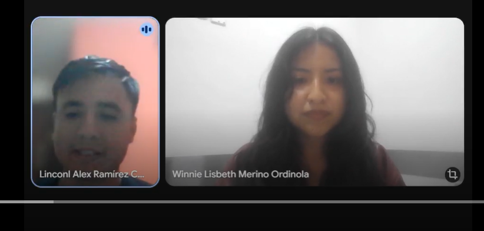
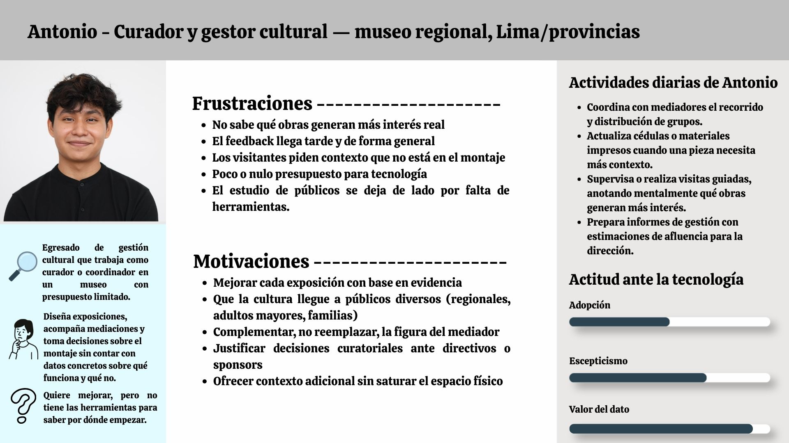
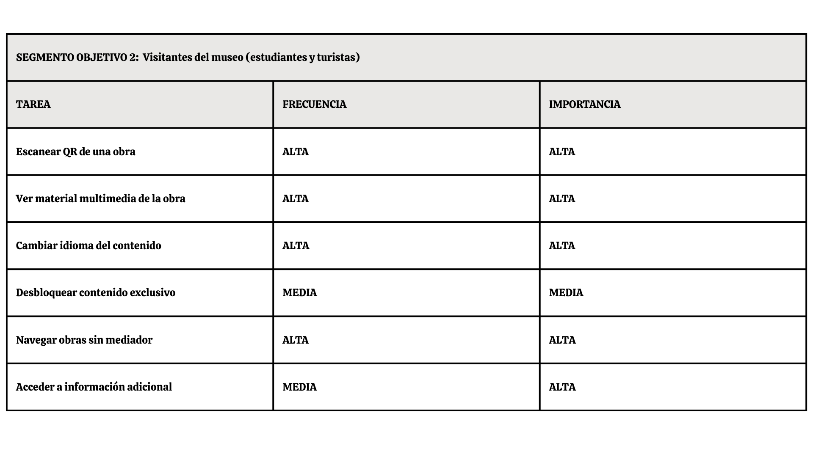
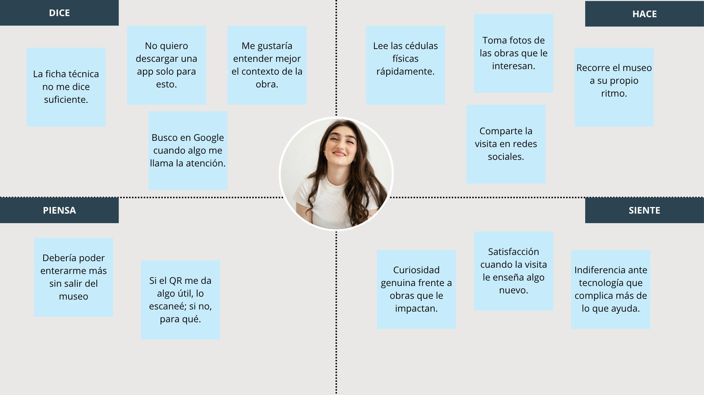
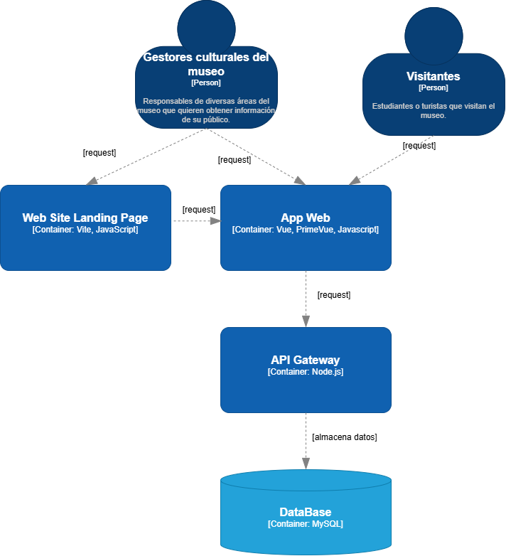
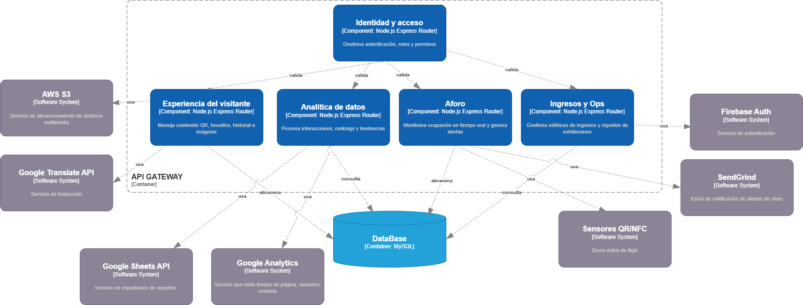

## UNIVERSIDAD PERUANA DE CIENCIAS APLICADA, INGENIERÍA DE SOFTWARE, 2026-01

## 1ASI0730 - Aplicaciones Web

## 12242

## Docente: Angel Augusto Velasquez Nuñez

### "Informe del AV1"

### **Nombre del Startup:** WebStone

### **Nombre del Producto:** KhipuTech

**Relación de Integrantes:**
|Nombres y Apellidos                |Código de estudiante |
|          :---:                    |        :---:        |
|Fabian Jesus Sandoval Cueto        |U20221a132           |
|Oscar Diego Checa Burga            |U20231E492           |
|Andrea Khristina Correa Rodriguez  |U202412041           |
|Winnie Lisbeth Merino Ordinola     |U20231E504           |
|Luis Alonso Huaco Oliva            |U202417743           |      

Abril, 2026

## Registro de Versiones del Informe

| Versión   | Fecha       | Autor/es      | Descripción                                                                                      | Estado    |
|-----------|-------------|------------|--------------------------------------------------------------------------------------------------|-----------|
| 1.0       | 11/04/2026 | X , X , X , X , X | Realizacion del documento |  EN PROCESO|

# Project Report Collaboration Insights

# Tabla de Contenidos

## [Capítulo I: Introducción](#capítulo-i-introducción)

- [1.1. Startup Profile](#11-startup-profile)
  - [1.1.1. Descripción de la Startup](#111-descripcion-del-startup)
  - [1.1.2. Perfiles de integrantes del equipo](#112-perfiles-de-integrantes-del-equipo)
- [1.2. Solution Profile](#12-solution-profile)
  - [1.2.1. Antecedentes y problemática](#121-antecedentes-y-problemática)
  - [1.2.2. Lean UX Process](#122-lean-ux-process)
    - [1.2.2.1. Lean UX Problem Statements](#1221-lean-ux-problem-statements)
    - [1.2.2.2. Lean UX Assumptions](#1222-lean-ux-assumptions)
    - [1.2.2.3. Lean UX Hypothesis Statements](#1223-lean-ux-hypothesis-statements)
    - [1.2.2.4. Lean UX Canvas](#1224-lean-ux-canvas)
- [1.3. Segmentos objetivo](#13-segmentos-objetivos)

---

## [Capítulo II: Requirements Elicitation & Analysis](#capítulo-ii-requirements-elicitation--analysis)

- [2.1. Competidores](#21-competidores)
  - [2.1.1. Análisis competitivo](#211-analisis-competitivo)
  - [2.1.2. Estrategias y tácticas frente a competidores](#212-estrategias-y-tácticas-frente-a-competidores)
- [2.2. Entrevistas](#22-entrevistas)
  - [2.2.1. Diseño de entrevistas](#221-diseño-de-entrevistas)
  - [2.2.2. Registro de entrevistas](#222-registro-de-entrevistas)
  - [2.2.3. Análisis de entrevistas](#223-análisis-de-entrevistas)
- [2.3. Needfinding](#23-needfinding)
  - [2.3.1. User Personas](#231-user-personas)
  - [2.3.2. User Task Matrix](#232-user-task-matrix)
  - [2.3.3. User Journey Mapping](#233-user-journey-mapping)
  - [2.3.4. Empathy Mapping](#234-empathy-mapping)
- [2.4. Big Picture Event Storming](#24-big-picture-EventStorming)
- [2.5. Ubiquitous Language](#25-ubiquitous-language)

---

## [Capítulo III: Requirements Specification](#capítulo-iii-requirements-specification)

- [3.1. User Stories](#31-user-stories)
- [3.2. Impact Mapping](#32-impact-mapping)
- [3.3. Product Backlog](#33-product-backlog)

---

## [Capítulo IV: Product Design](#capítulo-iv-product-design)

- [4.1. Style Guidelines](#41-style-guidelines)
  - [4.1.1. General Style Guidelines](#411-general-style-guidelines)
  - [4.1.2. Web Style Guidelines](#412-web-style-guidelines)
- [4.2. Information Architecture](#42-information-architecture)
  - [4.2.1. Organization Systems](#421-organization-systems)
  - [4.2.2. Labeling Systems](#422-labeling-systems)
  - [4.2.3. SEO Tags and Meta Tags](#423-seo-tags-and-meta-tags)
  - [4.2.4. Searching Systems](#424-searching-systems)
  - [4.2.5. Navigation Systems](#425-navigation-systems)
- [4.3. Landing Page UI Design](#43-landing-page-ui-design)
  - [4.3.1. Landing Page Wireframe](#431-landing-page-wireframe)
  - [4.3.2. Landing Page Mock-up](#432-landing-page-mock-up)
- [4.4. Web Applications UX/UI Design](#44-web-applications-uxui-design)
  - [4.4.1. Web Applications Wireframes](#441-web-applications-wireframes)
  - [4.4.2. Web Applications Wireflow Diagrams](#442-web-applications-wireflow-diagrams)
  - [4.4.3. Web Applications Mock-ups](#443-web-applications-mock-ups)
  - [4.4.4. Web Applications User Flow Diagrams](#444-web-applications-user-flow-diagrams)
- [4.5. Web Applications Prototyping](#45-web-applications-prototyping)
- [4.6. Domain-Driven Software Architecture](#46-domain-driven-software-architecture)
  - [4.6.1. Design-Level Event Storming.](#461-design-level-event-storming.)
  - [4.6.2. Software Architecture Context Diagram](#462-software-architecture-context-diagram)
  - [4.6.3. Software Architecture Container Diagrams](#463-software-architecture-container-diagrams)
  - [4.6.4. Software Architecture Components Diagrams](#464-software-architecture-components-diagrams)
- [4.7. Software Object-Oriented Design](#47-software-object-oriented-design)
  - [4.7.1. Class Diagrams](#471-class-diagrams)
- [4.8. Database Design](#48-database-design)
  - [4.8.1. Database Diagram](#481-database-diagram)

---

## [Capítulo V: Product Implementation, Validation & Deployment](#capítulo-v-product-implementation-validation--deployment)

- [5.1. Software Configuration Management](#51-software-configuration-management)
  - [5.1.1. Software Development Environment Configuration](#511-software-development-environment-configuration)
  - [5.1.2. Source Code Management](#512-source-code-management)
  - [5.1.3. Source Code Style Guide & Conventions](#513-source-code-style-guide--conventions)
  - [5.1.4. Software Deployment Configuration](#514-software-deployment-configuration)
- [5.2. Landing Page, Services & Applications Implementation](#52-landing-page-services--applications-implementation)
  - [5.2.1. Sprint 1](#521-sprint-1)
    - [5.2.1.1. Sprint Planning 1](#5211-sprint-planning-1)
    - [5.2.1.2. Aspect Leaders and Collaborators](#5212-aspect-leaders-and-collaborators)
    - [5.2.1.3. Sprint Backlog 1](#5213-sprint-backlog-1)
    - [5.2.1.4. Development Evidence for Sprint Review](#5214-development-evidence-for-sprint-review)
    - [5.2.1.5. Execution Evidence for Sprint Review](#5215-execution-evidence-for-sprint-review)
    - [5.2.1.6. Services Documentation Evidence for Sprint Review](#5216-services-documentation-evidence-for-sprint-review)
    - [5.2.1.7. Software Deployment Evidence for Sprint Review](#5217-software-deployment-evidence-for-sprint-review)
    - [5.2.1.8. Team Collaboration Insights during Sprint](#5218-team-collaboration-insights-during-sprint)
  - [5.2.2. Sprint 2](#522-sprint-2)
    - [5.2.2.1. Sprint Planning 2](#5221-sprint-planning-2)
    - [5.2.2.2. Aspect Leaders and Collaborators](#5222-aspect-leaders-and-collaborators)
    - [5.2.2.3. Sprint Backlog 2](#5223-sprint-backlog-2)
    - [5.2.2.4. Development Evidence for Sprint Review](#5224-development-evidence-for-sprint-review)
    - [5.2.2.5. Execution Evidence for Sprint Review](#5225-execution-evidence-for-sprint-review)
    - [5.2.2.6. Services Documentation Evidence for Sprint Review](#5226-services-documentation-evidence-for-sprint-review)
    - [5.2.2.7. Software Deployment Evidence for Sprint Review](#5227-software-deployment-evidence-for-sprint-review)
    - [5.2.2.8. Team Collaboration Insights during Sprint](#5228-team-collaboration-insights-during-sprint)
  - [5.2.3. Sprint 3](#523-sprint-3)
    - [5.2.3.1. Sprint Planning 3](#5231-sprint-planning-3)
    - [5.2.3.2. Aspect Leaders and Collaborators](#5232-aspect-leaders-and-collaborators)
    - [5.2.3.3. Sprint Backlog 3](#5233-sprint-backlog-3)
    - [5.2.3.4. Development Evidence for Sprint Review](#5234-development-evidence-for-sprint-review)
    - [5.2.3.5. Execution Evidence for Sprint Review](#5235-execution-evidence-for-sprint-review)
    - [5.2.3.6. Services Documentation Evidence for Sprint Review](#5236-services-documentation-evidence-for-sprint-review)
    - [5.2.3.7. Software Deployment Evidence for Sprint Review](#5237-software-deployment-evidence-for-sprint-review)
    - [5.2.3.8. Team Collaboration Insights during Sprint](#5238-team-collaboration-insights-during-sprint)
  - [5.2.4. Sprint 4](#524-sprint-4)
    - [5.2.4.1. Sprint Planning 4](#524-1-sprint-planning-4)
    - [5.2.4.2. Aspect Leaders and Collaborators](#5242-aspect-leaders-and-collaborators)
    - [5.2.4.3. Sprint Backlog 4](#5243-sprint-backlog-4)
    - [5.2.4.4. Development Evidence for Sprint Review](#5244-development-evidence-for-sprint-review)
    - [5.2.4.5. Execution Evidence for Sprint Review](#5245-execution-evidence-for-sprint-review)
    - [5.2.4.6. Services Documentation Evidence for Sprint Review](#5246-services-documentation-evidence-for-sprint-review)
    - [5.2.4.7. Software Deployment Evidence for Sprint Review](#5247-software-deployment-evidence-for-sprint-review)
    - [5.2.4.8. Team Collaboration Insights during Sprint](#5248-team-collaboration-insights-during-sprint)
- [5.3. Validation Interviews](#53-validation-interviews)
  - [5.3.1. Diseño de entrevistas](#531-diseño-de-entrevistas)
  - [5.3.2. Registro de entrevistas](#532-registro-de-entrevistas)
  - [5.3.3. Evaluaciones según heurísticas](#533-evaluaciones-según-heurísticas)
- [5.4. Video About-the-Product](#54-video-about-the-product)

---

## [Conclusiones](#bibliografia)

- [Conclusiones y recomendaciones](#conclusiones-y-recomendaciones)
- [Video About-the-Team](#video-about-team)

---

## [Bibliografía](#bibliografia)

---

## [Anexos](#anexos)

---

### Student Outcome

|Criterio Especifico|Acciones Realizadas|Conclusiones|
|-------------------|-------------------|------------|
|Trabaja en equipo para proporcionar liderazgo en forma conjunta| xx | xx |
|Crea un entorno colaborativo e inclusivo, establece metas, planifica tareas y cumple objetivos.| xx | xx |

---

## Capítulo I: Introducción

### 1.1. **Startup Profile.**

#### 1.1.1. Descripción del startup

KhipuTech es una startup tecnológica dedicada a la transformación digital de la experiencia museística y cultural. Se desarrolla soluciones híbridas que integran infraestructura IoT de bajo costo con plataformas web dinámicas, permitiendo a los gestores culturales obtener métricas precisas sobre el comportamiento del visitante en tiempo real.

El modelo de negocio de KhipuTech se basa en la optimización del flujo interno de los recintos a través de sensores automatizados, superando las limitaciones de los métodos tradicionales de conteo manual. Simultáneamente, la compañía facilita el acceso a experiencias de contenido exclusivas mediante tecnologías de interacción móvil inmediata como QR y NFC. Al convertir al visitante en un participante activo, KhipuTech no solo enriquece la visita cultural, sino que también dota a las instituciones de datos estratégicos de permanencia e interés, optimizando la gestión de recursos y mejorando el engagement entre las obras y su audiencia.

Con un enfoque en la viabilidad económica y la escalabilidad tecnológica, KhipuTech redefine la relación entre el patrimonio histórico y las herramientas digitales del siglo XXI.

#### Misión:

Empoderar a las instituciones culturales mediante tecnología accesible para transformar el flujo de visitantes en datos estratégicos, enriqueciendo la conexión entre las personas y el patrimonio a través de experiencias digitales exclusivas y seguras

#### Visión:

Convertirnos en el estándar tecnológico de gestión y analítica para museos en Latinoamérica, siendo reconocidos por democratizar el acceso a la inteligencia de datos y por revolucionar la narrativa interactiva en espacios culturales.

#### Pilares de KhipuTech:

- **Visibilidad Cultural:** Hacer visible lo que antes era invisible (el comportamiento del visitante).

- **Accesibilidad Radical:** Crear soluciones que funcionen con el hardware que el usuario ya posee (su smartphone) y con presupuestos realistas para el sector cultural.

- **Integridad de Datos:** Garantizar que la información del museo sea un activo privado y valioso para su crecimiento.

#### 1.1.2. Perfiles de los integrantes del equipo

| Nombre                                                            | Descripción                                                                                                                                                                                                                                                                                  |
| ----------------------------------------------------------------- | -------------------------------------------------------------------------------------------------------------------------------------------------------------------------------------------------------------------------------------------------------------------------------------------- |
| Luis Alonso Huaco Oliva (U202417743)  |                                                                                                                                                                                                                                                                                              |
| (Fabian Jesus Sandoval Cueto) [IMAGEN]                            | Especialista en automatización de procesos mediante n8n e integración de APIs (Meta, Shopify). Aporta experiencia en la configuración de infraestructura en la nube (GCP) y contenedores Docker, además de liderar la estrategia de captación de datos y marketing analítico de la solución. |
| (U) [IMAGEN]                                                      |                                                                                                                                                                                                                                                                                              |
| (U) [IMAGEN]                                                      |                                                                                                                                                                                                                                                                                              |
| (U) [IMAGEN]                                                      |                                                                                                                                                                                                                                                                                              |

### 1.2. **Solution Profile.**

KhipuInsight es la plataforma centralizada de KhipuTech diseñada para la visualización de analíticas en tiempo real y la gestión de contenidos interactivos en museos. Actúa como el puente entre el hardware de conteo (sensores IoT) y la experiencia digital del usuario final.

**Características clave:**

- **Monitoreo de Afluencia en Tiempo Real:** Visualización precisa del número de visitantes por habitación mediante sensores infrarrojos de bajo costo, permitiendo detectar saturación de salas al instante.

- **Gestión de Contenido Dinámico vía QR:** Sistema de administración de subdominios que permite actualizar la información de las esculturas y pinturas de forma remota sin cambiar los códigos físicos.

- **Autenticación Invisible por Geolocalización:** Restricción de acceso al contenido premium basada en la ubicación del usuario, garantizando que el material exclusivo solo sea consumido dentro del recinto.

- **Dashboard de Permanencia Curatorial:** Reportes detallados sobre qué obras generan mayor interacción, ayudando a los curadores a tomar decisiones basadas en datos reales de interés.

#### 1.2.1. Antecedentes y Problemática

En el ecosistema cultural actual, los museos enfrentan el reto de modernizar la experiencia del visitante sin perder la esencia de la contemplación artística. Actualmente, la mayoría de los museos medianos y pequeños operan con métodos de conteo manuales (libros de visitas o contadores de mano) y ofrecen información estática (fichas técnicas físicas) que no permite capturar datos sobre el comportamiento del usuario dentro de las salas.

**Los 5 'W' y 2 'H'**

- **1. What (Qué):**

  La falta de datos sobre el flujo de personas por sala y el bajo compromiso (engagement) con la información de las obras.

  - _¿Cuál es el problema?:_ La invisibilidad de los datos de comportamiento del visitante tras cruzar la taquilla. Los museos operan "a ciegas" dentro de sus propias salas, desconociendo qué piezas generan interés y cuáles pasan desapercibidas, sumado a una oferta informativa estática que no conecta con el público digital.
  - _¿Cuál es la relación con la persona en cuestión?:_ Para el administrador, es una pérdida de oportunidad estratégica y económica. Para el visitante, es una experiencia pasiva y limitada que no aprovecha la tecnología que ya lleva en su bolsillo (smartphone).

- **2. When (Cuándo):**

  Durante el horario de apertura al público, especialmente en horas pico donde la saturación de salas es un problema de seguridad y comodidad.

  - _¿Cuándo sucede el problema?:_ El problema de datos es constante, pero la crisis de gestión ocurre en las "horas pico" o durante exhibiciones temporales, donde la falta de métricas impide redistribuir al personal de seguridad o guías para evitar cuellos de botella.
  - _¿Cuándo utiliza el cliente el producto?:_ El museo utiliza el dashboard de analíticas de forma diaria para la toma de decisiones; el visitante interactúa con la solución durante todo el recorrido de la muestra, cada vez que desea profundizar en una obra.

- **3. Where (dónde):**

  Espacios cerrados de exhibición, galerías y museos con múltiples habitaciones.

  - _¿Dónde está el cliente cuando usa el producto?:_ El visitante se encuentra frente a las piezas de arte o circulando por los pasillos del museo. El administrador puede estar en la oficina técnica del museo o monitoreando de forma remota desde cualquier dispositivo con acceso a la red.
  - _¿A dónde se dirige?:_ El flujo del visitante es dinámico entre salas (Habitaciones 1, 2 y 3). El sistema busca guiarlo orgánicamente hacia las piezas menos concurridas o asegurar que complete el recorrido informativo diseñado por el curador.
  - _¿Dónde surge el problema?:_ En los puntos de transición (puertas y pasillos) donde el conteo manual falla, y en los puntos de contacto (fichas técnicas) donde el texto impreso es insuficiente o aburrido.

- **4. Who (quién):**

  Administradores de museos y centros culturales que carecen de analíticas precisas, y visitantes que buscan una experiencia interactiva sin fricciones tecnológicas

  - _¿Quiénes están involucrados?:_ Directores de museos, curadores de arte, personal de seguridad, encargados de marketing cultural y el público visitante (turistas y estudiantes).
  - _¿A quiénes le sucede el problema?:_ Principalmente a los gestores culturales que deben rendir cuentas sobre el éxito de una exposición y a los visitantes que se sienten abrumados en salas congestionadas.
  - _¿Quién lo utilizará?:_ Los visitantes escanearán los QR/NFC para el contenido exclusivo; los administradores y analistas de datos usarán la plataforma de KhipuTech para visualizar los reportes de tráfico.

- **5. Why (por qué):**

  Porque sin métricas de permanencia y flujo, el museo no puede optimizar sus recursos, mejorar sus curadurías ni justificar presupuestos basados en el impacto real de sus exhibiciones.

  - _¿Cuál es la causa del problema?:_ El alto costo de las soluciones tecnológicas tradicionales (cámaras con IA costosas) y la falta de infraestructura digital integrada que combine hardware de conteo con entrega de contenido en una sola plataforma económica.

- **6. How (cómo):**

  Implementando un sistema híbrido de sensores de hardware de bajo costo para el conteo de flujo y una capa de software accesible vía QR/NFC para la interacción con el contenido.

  - _¿En qué condiciones los clientes usan nuestro producto?:_ En un entorno de iluminación controlada (típico de museos) donde los sensores infrarrojos son altamente efectivos y donde se requiere un acceso rápido a la información sin necesidad de descargar aplicaciones pesadas (Web-based).
  - _¿Cómo nos conocieron los compradores?:_ A través de propuestas directas B2B (Business to Business), demostraciones de MVP en galerías locales o mediante la participación en ferias de innovación tecnológica aplicada a la cultura.
  - _¿Qué llevó a la persona a llegar a esta situación?:_ La necesidad de modernizar la institución bajo un presupuesto limitado y la presión por mejorar las métricas de satisfacción y seguridad del visitante tras la digitalización global.

- **7. How much (cuánto):**

  El proyecto debe ser viable con un presupuesto inicial de $500 USD para el desarrollo del MVP y escalable mediante suscripciones o licencias de bajo costo.

  - **Costo para el cliente:** Se plantea un modelo de implementación económica (pago único por hardware) + una suscripción mensual mínima (SaaS) por el mantenimiento del subdominio y el acceso al dashboard de datos.

#### 1.2.2. Lean UX Process

##### 1.2.2.1. Lean UX Problem Statements

El estado actual de la gestión en museos medianos y galerías presenta una desconexión crítica entre la presencia física del visitante y la recolección de datos analíticos.

- **Domain:** Tecnología aplicada al patrimonio cultural y analítica de espacios físicos (Smart Museums).

- **Customer Segments:** Directores de museos, curadores de arte y gestores de centros culturales que operan con presupuestos limitados.

- **Pain Points:**

  - Incapacidad de medir el tráfico interno por sala de forma automática.

  - Falta de métricas sobre qué obras específicas generan mayor interés o tiempo de permanencia.

  - Baja interacción del público joven con fichas técnicas estáticas y tradicionales.

- **Gap:** Existe una brecha entre el conteo masivo en taquilla y el comportamiento granular dentro de las exhibiciones, lo que impide una curaduría basada en datos.

- **Vision/Strategy:** Implementar una infraestructura de bajo costo ($500 MVP) que combine sensores IoT para el conteo de flujo y una plataforma web móvil para la entrega de contenido exclusivo, transformando la visita en un flujo de datos accionables.

- **Initial Segment:** Museos municipales y galerías de arte contemporáneo con al menos 3 salas de exhibición.

##### 1.2.2.2. Lean UX Assumptions

Para el desarrollo de KhipuTech, el equipo asume los siguientes puntos como verdaderos:

- **Usuarios:** Los visitantes están dispuestos a usar sus propios dispositivos (BYOD) para acceder a información si el proceso es instantáneo y el contenido es exclusivo.

- **Negocio:** Los administradores de museos valoran más los datos de flujo por sala que un simple conteo total de entradas para justificar sus presupuestos.

- **Tecnología**: Los sensores infrarrojos conectados a microcontroladores ESP32 son lo suficientemente precisos para el conteo de personas en interiores sin requerir cámaras costosas.

- **Conectividad:** El uso de una arquitectura basada en web (subdominios) es preferible a una aplicación nativa para reducir la fricción de descarga en el usuario.

- **Seguridad/Privacidad:** Los usuarios se sienten más cómodos con un sistema de conteo anónimo (sensores) que con uno basado en reconocimiento facial (cámaras).

##### 1.2.2.3. Lean UX Hypothesis Statements

Hemos definido las siguientes hipótesis para validar el modelo de negocio:

- **Hipótesis de Valor de Datos:** Creemos que proporcionarle al administrador un reporte semanal de "Mapas de Calor" y permanencia por sala, le permitirá optimizar la distribución de sus guías y personal de seguridad, ahorrando hasta un 15% en costos operativos mensuales.

- **Hipótesis de Interacción:** Creemos que si el contenido de la obra está bloqueado fuera del museo y se accede mediante un "autologeo" por QR, el 40% de los visitantes escaneará al menos 3 obras para completar la experiencia informativa.

- **Hipótesis de Costo:** Creemos que podemos implementar un sistema funcional en un museo de 3 salas con un presupuesto de hardware de $200 USD (parte de los $500 totales), demostrando que la tecnología de punta no es exclusiva de museos con presupuestos millonarios.

- **Hipótesis de Retención:** Creemos que al ofrecer una "colección digital" de stickers o insignias por cada QR escaneado, el visitante promedio pasará un 25% más de tiempo dentro del museo para completar el recorrido.

#### 1.2.2.4. Lean UX Canvas

<strong>Figura 1</strong>

Lean UX Canvas

### 1.3. Segmento Objetivo

KhipuTech enfoca su modelo de negocio en dos segmentos institucionales distintos dentro del sector cultural. Ambos comparten la necesidad de modernización, pero difieren en su gobernanza y objetivos estratégicos.

- **Segmento A - Museos Privados y Galerías de Arte Contemporáneo:**

  Este segmento agrupa a instituciones de gestión privada que dependen de la venta de entradas, patrocinios y la rotación constante de exhibiciones.

  - _Características:_
    - Perfil: Instituciones con alta agilidad en la toma de decisiones y un enfoque fuerte en la curaduría innovadora.
    - Necesidad: Requieren métricas exactas para demostrar el valor de sus exhibiciones a los artistas y patrocinadores (sponsors). Buscan exclusividad para fidelizar a su audiencia.
    - Información Estadística: Según informes de gestión cultural en Latinoamérica, las galerías privadas reportan que el 60% de sus ingresos por patrocinios dependen de la capacidad de demostrar el alcance y la interacción real del público con las obras.
  - _Valor de KhipuTech:_ Proporciona "Prueba de Impacto" para sus patrocinadores mediante el dashboard de analíticas.

- **Segmento B - Centros Culturales Municipales y Museos Públicos**

  Este segmento comprende espacios administrados por gobiernos locales o entidades del estado que buscan democratizar la cultura y gestionar grandes flujos de personas.

  - _Características:_
    - Perfil: Instituciones con presupuestos públicos anuales limitados, enfocadas en la educación y la seguridad del ciudadano.
    - Necesidad: Optimizar el gasto operativo. Necesitan sistemas de conteo automatizados para redistribuir a su personal de seguridad y guías de manera eficiente, especialmente en días de entrada gratuita.
    - Información Estadística: De acuerdo con el Ministerio de Cultura, los museos públicos reciben picos de afluencia que pueden superar el 300% de su capacidad normal en fechas festivas. La falta de sistemas de conteo en tiempo real genera riesgos de seguridad y deterioro del patrimonio.
  - _Valor de KhipuTech:_ Gestión de aforo y seguridad mediante sensores de flujo de bajo costo, facilitando el cumplimiento de normas de Defensa Civil.

- **Sustento de Selección del Segmento Inicial**

  Aunque ambos son viables, KhipuTech iniciará operaciones con el Segmento A (Galerías Privadas). La razón técnica es que su ciclo de venta es más rápido (no requiere licitaciones públicas complejas) y el presupuesto de $500 permite instalar una red completa en sus espacios, que suelen ser más compactos y controlados, ideales para validar las hipótesis de nuestro Lean UX Canvas.

---

## Capítulo II: Requirements Elicitation & Analysis

### 2.1. Competidores

#### 2.1.1. Análisis competitivo
- **Competitive Analysis Land Landscape**

  _¿Por qué llevar a cabo este análisis?_

    Este análisis no permite identificar las brechas de costo y funcionalidad en el mercado de tecnología museística, para validar el posicionamiento de KhipuTech como la opción líder en analítica de bajo costo y alta interacción. 

|  Categoría | Sub Categpría | KhipuTech | Competidor 1: T.M.A.S. (Storetraffic) | Competidor 2: FootfallCam | Competidor 3: Muse Software AI | Competidor 4: SenseMax | Competidor 5: Living Museum | Competidor 6: Counterest
| :--- | :--- | :--- | :--- | :--- | :--- | :--- | :--- | :--- |
| Perfil | Overview | Solución híbrida de IoT y Web App para analítica y engagement. | Líder en conteo de personas y KPIs de tráfico para retail/museos. | Especialistas en conteo 3D avanzado y mapas de calor. | ERP/CRM integral para operaciones completas de museos. | Sistema de sensores inalámbricos con transmisión Cloud. | Plataforma experimental de IA para guías virtuales. | Analítica de flujo mediante WiFi y sensores térmicos. |
| Perfil | Ventaja competitiva | Bajo costo operativo y hardware DIY con interacción QR/NFC. | Dashboard profesional y hardware inalámbrico de fácil instalación. | Alta precisión técnica en grandes flujos de personas. | Centralización de toda la administración del museo.| Simplicidad de uso y reportes automáticos. | Interacción conversacional inmersiva con IA. | Análisis de rutas y comportamiento del usuario. | 
| P. Marketing | Mercado Objetivo | Museos medianos, galerías de arte y centros culturales. | Retail, bibliotecas y museos pequeños/medianos. | Centros comerciales, aeropuertos y grandes museos. | Museos de gran escala y organizaciones sin fines de lucro. | Retail, museos y centros de exhibición. | Estudiantes y visitantes de museos virtuales/físicos.| Principalmente enfocado en operadoras de transporte público.|
| P. Marketing | Estrategias de Marketing | Venta directa B2B y demostraciones de pilotos locales.| Posicionamiento SEO global y partnerships con hardware. | Marketing basado en precisión técnica y casos de éxito corporativos.| Inbound marketing y demostraciones enterprise.| Canal de distribuidores globales. | Difusión en comunidades tech y educativas.| Ventas consultivas para proyectos a medida. | 
| P. Producto | Productos & Servicios | Sensores de flujo + Web App de contenido exclusivo. | Sensores infrarrojos (Pearl) + Plataforma SaaS. | Cámaras 3D con IA + Software de análisis de ruta.| CRM, Ticketing, POS y Fundraising. | Sensores infrarrojos y colectores de datos.| Chatbot Web basado en contenido de museos.| Sensores térmicos y rastreo de señales WiFi.|
| P. Producto | Precios & Costos | <$500 Setup Total (Sin suscripciones obligatorias). | $1,100+ Hardware + $19.95/mes de suscripción. | $500+ por unidad de hardware + costos de instalación. | Premium (Alto, basado en cotización). | €330+ Kit inicial + cuota mensual.| Gratuito (Proyecto experimental). | Alto (Costo por proyecto/licencia).| 
| P. Producto | Canales (Web & Movil) | Web App (Mobile-first) y Dashboard. | Cloud-based Dashboard y App móvil de monitoreo. | Software de escritorio y Dashboard. |Multiplataforma (SaaS).| Web Dashboard y escritorio.|Web App accesible desde cualquier navegador.| Dashboard Web de analítica avanzada.| 
| Análisis SWOT | Fortalezas | Costo disruptivo y flexibilidad de automatización. | Marca establecida y hardware muy confiable. | Tecnología de punta y gran precisión en 3D.| Solución definitiva para administración.| Instalación rápida sin cables.| Innovación tecnológica (Generative AI).| Análisis de comportamiento profundo.|
| Análisis SWOT | Debilidades | Percepción de marca nueva/tecnología DIY. | Costo elevado para instituciones públicas. | Instalación compleja y precio restrictivo. | Curva de aprendizaje y costo alto.| Dependencia de suscripciones SaaS.| No soluciona el flujo físico ni métricas.| Inversión técnica y económica alta.|

#### 2.1.2. Estrategias y tácticas frente a competidores

### 2.2. Entrevistas

#### 2.2.1. Diseño de entrevistas

##### Segmento objetivo 1: Gestores culturales o conocedores de administración de museos:
1. Al terminar el montaje de una exhibición, ¿Cómo evalúas si la distribución de las piezas fue efectiva para transmitir la narrativa que planeas? 

2. ¿Alguna vez tomaste una decisión de museografía o marketing basada en datos de comportamiento del visitante? ¿Cómo obtuviste los datos?

3.Si pudieras ver un reporte de qué piezas de la exposición fueron las preferidas o generaron más tiempo de permanencia, ¿Cómo influiría eso en tu próximo proyecto de museografía?

4. ¿Qué herramientas usas hoy para medir el éxito de una exposición? ¿Con qué frecuencia las usas?

5. ¿El museo tiene presupuesto asignado para tecnología o innovación? ¿Quién aprueba ese tipo de inversión?

6. ¿Qué preguntas te hace el público con más frecuencia durante las visitas guiadas que no están respondidas en ningún material físico?

7. ¿Has visto a visitantes buscar información de una pieza en Google en lugar de leer la ficha del museo? ¿Qué te dice eso?

8. Si pudieras darle al visitante una capa extra de información sobre una pieza, ¿qué sería lo primero que añadirías: contexto histórico, audio del artista, videos del proceso creativo, algo más?

9. ¿El museo ofrece contenido en otros idiomas o formatos accesibles para personas con discapacidad visual o auditiva? ¿Cómo lo resuelven hoy?

10. ¿Crees que una solución digital podría ayudarte a llegar a visitantes que normalmente no se sienten representados en el museo?

11. ¿Qué centros culturales consideras que están haciendo un buen trabajo tecnológico? 

##### Segmento objetivo 2: Visitantes a museos (estudiantes o turistas)

1. Nombre, edad, museo visitado recientemente. 

2. ¿Cómo decidiste qué salas visitar o cuánto tiempo quedarse en cada una?

3. ¿Hubo algún momento en que sentiste que una sala estaba demasiado llena o incómoda? ¿Qué hiciste?

4. ¿Hubo alguna pieza que te llamó la atención pero no encontraste suficiente información sobre ella?

5.  ¿Buscaste información adicional sobre alguna obra en tu teléfono durante la visita?

6. ¿Qué tipo de información te hubiera gustado tener que no estaba disponible?

7. ¿Usarías tu teléfono para escanear un código QR y ver contenido extra sobre una pieza, como un video del artista o contexto histórico?

8. ¿Preferirías una audioguía, leer en pantalla o ver un video corto?

9. ¿Qué te parecería acceder a contenido exclusivo que no está en ningún otro lado, solo disponible escaneando en el museo?

10. Si el museo ofreciera un recorrido temático guiado por tu teléfono (tipo "ruta del amor", "ruta política", "ruta técnica"), ¿lo seguirías?

#### 2.2.2. Registro de entrevistas

##### Registro de entrevistas del segmento objetivo 1:

| Entrevista 1 | Duración | Inicio | Imagen | URL |
|:-----------:|:-----------:|:-----------:|:-------:|:---:|
| Sergio Salgado   | 20m   | 0:50m   | | [Click aquí](https://upcedupe-my.sharepoint.com/personal/u20231e504_upc_edu_pe/_layouts/15/stream.aspx?id=%2Fpersonal%2Fu20231e504_upc_edu_pe%2FDocuments%2FAplicaciones+Web%2FEntrevista_SergioSalgado_GestorCultural.mp4&referrer=StreamWebApp.Web&referrerScenario=AddressBarCopied.view.3d210264-2355-468b-9d6d-fd33ab30ed2f)

**Resumen:**

* **Personalidad:** Reflexivo, crítico y humanista. Orientado al visitante, con una visión centrada en que "la cultura se debe a la ciudadanía."
* **Marcas e influencias:** [No mencionado en entrevista]
* **Tecnología:** Muestra preferencia por la realidad virtual y realidad aumentada como herramientas para enriquecer la experiencia museística.
* **Dispositivos:** [No mencionado en entrevista]
* **Browser:** [No mencionado en entrevista]
* **Canales de interacción:** Encuestas y entrevistas como métodos de estudio de público. Valora la observación no participante como canal de análisis del comportamiento del visitante.
* **Características objetivas:** Egresado de UDEP, carrera de Historia y Gestión Cultural. Tiene experiencia en museografía y ha referenciado un estudio de público realizado en un museo de Piura orientado a familias visitantes.
* **Características subjetivas:** Considera que evaluar si una exposición transmitió su narrativa es subjetivo. Cree que el estudio de público es fundamental pero paradójicamente dejado de lado. Valora profundamente la experiencia mediador-visitante como complemento para que el visitante se lleve la exposición como parte de sí mismo. Reconoce la brecha tecnológica entre museos privados de Lima y museos regionales.

---

| Entrevista 2| Duración | Inicio | Imagen | URL |
|:-----------:|:-----------:|:-----------:|:-------:|:----:|
| Linconl Ramírez   | 11m   | 0:30m   | |[Click aquí](https://upcedupe-my.sharepoint.com/personal/u20231e504_upc_edu_pe/_layouts/15/stream.aspx?id=%2Fpersonal%2Fu20231e504_upc_edu_pe%2FDocuments%2FAplicaciones+Web%2FEntrevista_LiconlRamirez_GestorCultural.mp4&referrer=StreamWebApp.Web&referrerScenario=AddressBarCopied.view.6f95e2ba-db5a-40f9-8852-81acc63fbf75)

**Resumen:**

* **Personalidad:** Cercano y con sentido del humor (contó entre risas anécdotas de su experiencia como mediador). Orientado a la accesibilidad e inclusión, con una visión práctica de la museografía.
* **Marcas e influencias:** Museo LUM (donde observó la metodología del cuaderno físico de opiniones). Museo de Narihualá de Piura (referenciado tanto en su trabajo universitario como en su reflexión sobre accesibilidad lingüística).
* **Tecnología:** Reconoce que el sector privado tiene mayor capacidad de inversión en tecnología e innovación gracias a diversas fuentes de financiamiento. [No mencionó preferencias tecnológicas personales]
* **Dispositivos:** [No mencionado en entrevista]
* **Browser:** [No mencionado en entrevista]
* **Canales de interacción:** Portal web del gobierno para datos de afluencia museística. Cuaderno físico de opiniones ofrecido por el mediador al final del recorrido (observado en el museo LUM).
* **Características objetivas:** Egresado de UDEP en Historia y Gestión Cultural. Tiene experiencia como mediador en museos y ha realizado trabajo de campo universitario consultando portales gubernamentales sobre afluencia al museo de Narihualá.
* **Características subjetivas:** Considera que el montaje es clave para transmitir la narrativa de una exposición, y debe estar en lugares estratégicos y en armonía con el entorno. Valora la accesibilidad para que todos puedan acercarse a la exposición. Cree que derribar barreras lingüísticas — como presentar información en español, inglés y quechua — es fundamental y justifica profundizar en el estudio de públicos. Coincide con Sergio en que existe muy poca investigación sobre los públicos de los museos.

---

| Entrevista 3| Duración | Inicio | Imagen | URL |
|:-----------:|:-----------:|:-----------:|:-------:|:----:|
| Jesus Hidalgo   | 24m   | 0:10m   |  | [Click Aquí](https://upcedupe-my.sharepoint.com/personal/u20231e504_upc_edu_pe/_layouts/15/stream.aspx?id=%2Fpersonal%2Fu20231e504%5Fupc%5Fedu%5Fpe%2FDocuments%2FAplicaciones%20Web%2FEntrevista%5FJesusHidalgo%5FGestorCultural%2Emp4&referrer=StreamWebApp%2EWeb&referrerScenario=AddressBarCopied%2Eview%2E6f0d7de8%2D4ef8%2D48ae%2D9f74%2D9ca448555fea)

**Resumen:**

* **Personalidad:** Pragmático y crítico. Prefiere soluciones tradicionales y accesibles sobre tecnología por el simple hecho de innovar. Muestra sensibilidad hacia la inclusión de personas con discapacidades.
* **Marcas e influencias:** Google Forms (mencionado como herramienta de recolección de datos). Repositorios digitales de centros culturales (los menciona como ejemplo positivo de tecnología aplicada en museos).
* **Tecnología:** Menciona Google Forms y cuadernos de visitantes como herramientas actuales de recolección de data. Propone material multimedia adicional para complementar exposiciones. Valora los repositorios digitales de centros culturales. Es escéptico respecto al uso de QRs, considerándolos inútiles en muchos casos para mejorar la experiencia inmersiva.
* **Dispositivos:** Menciona dispositivos de audio implementados en centros culturales para personas con discapacidad visual, y material en braille como herramientas de accesibilidad.
* **Browser:** [No mencionado en entrevista]
* **Canales de interacción:** Google Forms, cuadernos de visitantes, repositorios digitales, material multimedia, dispositivos de audio y braille.
* **Características objetivas:** Egresado de UDEP en Historia y Gestión Cultural. Tiene experiencia como mediador en museos y centros culturales. Conoce de primera mano la estructura administrativa de los museos en cuanto a gestión de presupuesto tecnológico.
* **Características subjetivas:** Considera que actualmente no existe un mecanismo específico para evaluar el rendimiento de piezas individuales, sino que se mide la exposición como un todo al final del recorrido. Cree que un análisis de preferencias permitiría mejorar futuras exposiciones, corregir errores y recibir feedback. Opina que los visitantes buscan profundizar en detalles que no siempre están disponibles en la exposición. Recalca la importancia de la presencia del mediador para guiar a visitantes con discapacidades y garantizarles una experiencia completa. Cree que se necesitan soluciones que respondan a las necesidades de la mayoría, no soluciones tecnológicas que excluyan a parte del público.

---

#### 2.2.3. Análisis de entrevistas

Los tres señalan que no existe un mecanismo preciso para medir qué partes de una exposición
funcionan mejor. Jesús lo dice explícitamente; Sergio lo describe como algo subjetivo; Lincoln
lo ejemplifica con el cuaderno físico del museo LUM como único registro disponible. Sergio y Lincoln lo afirman directamente: el estudio de públicos es "paradójicamente dejado de lado" a pesar de ser fundamental. Jesús lo refuerza al valorar el análisis de preferencias para corregir errores futuros. Los tres mencionan herramientas actuales (encuestas, entrevistas, cuadernos físicos, observación no participante) como insuficientes o subutilizadas.Los tres coinciden en la brecha privado/público. Jesús señala que la mayoría de museos no tiene
áreas de tecnología. Sergio describe los museos regionales como "desoladores" en ese aspecto (en el mejor caso, cámaras de seguridad). Lincoln confirma que el sector privado tiene más fuentes de financiamiento; el contexto estructural que condiciona cualquier propuesta tecnológica. Los tres valoran al mediador por encima de cualquier herramienta digital. Jesús lo señala como necesario para accesibilidad. Sergio lo describe como generador de experiencia profunda. Lincoln indica que la gente pregunta cosas "fuera del guión", evidenciando una demanda de contexto adicional que el montaje actual no cubre. En conclusión, Los tres entrevistados comparten el mismo diagnóstico de fondo: los museos peruanos, especialmente los regionales y públicos, operan sin sistemas de retroalimentación reales. Recopilan opiniones al final del recorrido (cuando ya no se puede hacer nada) y casi no investigan a sus públicos de manera sistemática. Eso no es un descuido aislado, es una carencia estructural.
Donde más valor tiene el análisis conjunto es en el tema del mediador: los tres lo mencionan espontáneamente como el elemento que más agrega valor a la experiencia. Lincoln incluso da el detalle más rico al decir que la gente pregunta cosas "fuera del guión", eso es evidencia directa de que la exposición no satisface la demanda de contexto del visitante. Esa brecha entre lo que el montaje ofrece y lo que el público necesita es el problema de diseño central que emerge de las tres voces.
La divergencia en tecnología es interesante porque no es superficial: Jesús habla desde la experiencia de mediador en contextos con poco presupuesto y un público heterogéneo, por lo que su escepticismo ante los QRs tiene base práctica. Sergio habla más desde una visión museográfica ideal. Lincoln resuelve la tensión sin decirlo explícitamente: el multilingüismo en Narihualá es la única "tecnología" que los tres coincidirían en validar, porque responde directamente a las características del público, no a una tendencia de innovación.

### 2.3. Needfinding

#### 2.3.1. User Personas
User Persona Segmento Objetivo 1: 

User Persona Segmento Objetivo 2: 

#### 2.3.2. User Task Matrix

User Task Matrix Segmento Objetivo 1: 

User Task Matrix Segmento Objetivo 2: 

#### 2.3.3. User Journey Mapping

User Journey Map - Segmento 1 y 2 respectivamente

#### 2.3.4. Empathy Mapping

Empathy Mapping Segmento Objetivo 1: 

Empathy Mapping Segmento Objetivo 2: 

### 2.4. Big Picture Event Storming

### 2.5. Ubiquitous Language

---

## Capítulo III: Requirements Specification

### 3.1. User Stories

### 3.2. Impact Mapping

### 3.3. Product Backlog

---

## Capítulo IV: Product Design

### 4.1. Style Guidelines

#### 4.1.1. General Style Guidelines

#### 4.1.2. Web Style Guidelines

#### 4.2. Information Architecture

#### 4.2.1. Organization Systems

#### 4.2.2. Labeling Systems

#### 4.2.3. SEO Tags and Meta Tags

#### 4.2.4. Searching Systems

#### 4.2.5. Navigation Systems

#### 4.3. Landing Page UI Design

#### 4.3.1. Landing Page Wireframe

#### 4.3.2. Landing Page Mock-up

### 4.4. Web Applications UX/UI Design

#### 4.4.1. Web Applications Wireframes

#### 4.4.2. Web Applications Wireflow Diagrams

#### 4.4.3. Web Applications Mock-ups

#### 4.4.4. Web Applications User Flow Diagrams

### 4.5. Web Applications Prototyping

### 4.6. Domain-Driven Software Architecture

#### 4.6.1. Design-Level Event Storming.

#### 4.6.2. Software Architecture Context Diagram

#### 4.6.3. Software Architecture Container Diagrams

#### 4.6.4. Software Architecture Components Diagrams

### 4.7. Software Object-Oriented Design

#### 4.7.1. Class Diagrams

### 4.8. Database Design

#### 4.8.1. Database Diagram

---

## Capítulo V: Product Implementation, Validation & Deployment

### 5.1. Software Configuration Management

#### 5.1.1. Software Development Environment Configuration

#### 5.1.2. Source Code Management

#### 5.1.3. Source Code Style Guide & Conventions

#### 5.1.4. Software Deployment Configuration

### 5.2. Landing Page, Services & Applications Implementation

#### 5.2.1. Sprint 1

##### 5.2.1.1. Sprint Planning 1

##### 5.2.1.2. Aspect Leaders and Collaborators

##### 5.2.1.3. Sprint Backlog 1

##### 5.2.1.4. Development Evidence for Sprint Review

##### 5.2.1.5. Execution Evidence for Sprint Review

##### 5.2.1.6. Services Documentation Evidence for Sprint Review

##### 5.2.1.7. Software Deployment Evidence for Sprint Review

##### 5.2.1.8. Team Collaboration Insights during Sprint

--- 

 #### 5.2.2. Sprint 2

##### 5.2.2.1. Sprint Planning 2

##### 5.2.2.2. Aspect Leaders and Collaborators

##### 5.2.2.3. Sprint Backlog 2

##### 5.2.2.4. Development Evidence for Sprint Review

##### 5.2.2.5. Execution Evidence for Sprint Review

##### 5.2.2.6. Services Documentation Evidence for Sprint Review

##### 5.2.2.7. Software Deployment Evidence for Sprint Review

##### 5.2.2.8. Team Collaboration Insights during Sprint

---

#### 5.2.3. Sprint 3

##### 5.2.3.1. Sprint Planning 3

##### 5.2.3.2. Aspect Leaders and Collaborators

##### 5.2.3.3. Sprint Backlog 3

##### 5.2.3.4. Development Evidence for Sprint Review

##### 5.2.3.5. Execution Evidence for Sprint Review

##### 5.2.3.6. Services Documentation Evidence for Sprint Review

##### 5.2.3.7. Software Deployment Evidence for Sprint Review

##### 5.2.3.8. Team Collaboration Insights during Sprint

---

#### 5.2.4. Sprint 4

##### 5.2.4.1. Sprint Planning 4

##### 5.2.4.2. Aspect Leaders and Collaborators

##### 5.2.4.3. Sprint Backlog 4

##### 5.2.4.4. Development Evidence for Sprint Review

##### 5.2.4.5. Execution Evidence for Sprint Review

##### 5.2.4.6. Services Documentation Evidence for Sprint Review

##### 5.2.4.7. Software Deployment Evidence for Sprint Review

##### 5.2.4.8. Team Collaboration Insights during Sprint

---

#### 5.3. Validation Interviews
##### 5.3.1. Diseño de entrevistas
##### 5.3.2. Registro de entrevistas
##### 5.3.3. Evaluaciones según heurísticas

### 5.4. Video About-the-Product

---

---

## Conclusiones

### Conclusiones y recomendaciones
### Video About-the-Team

## Bibliografía

---

## Anexos