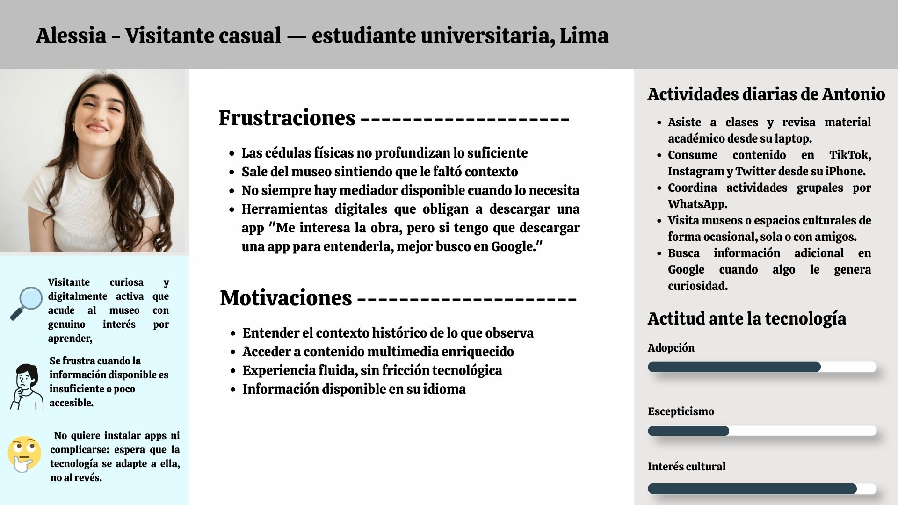
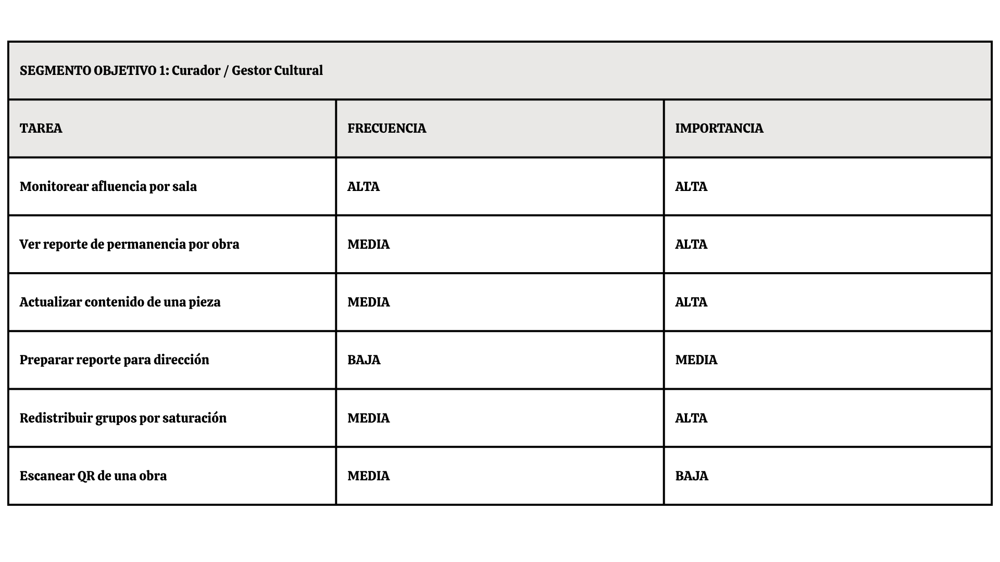
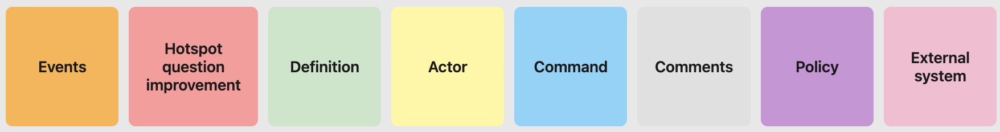
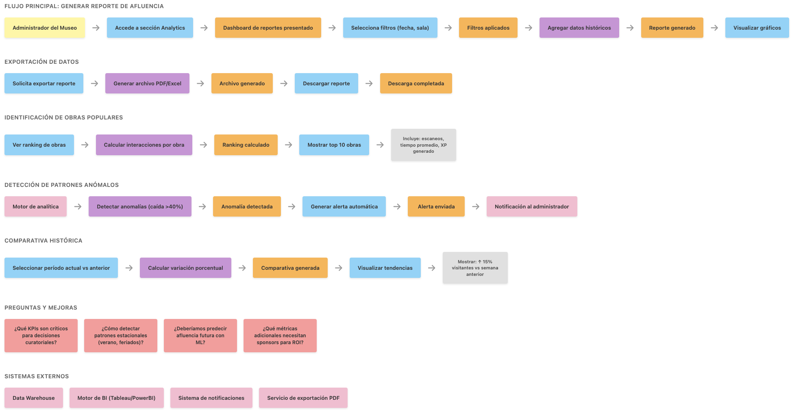
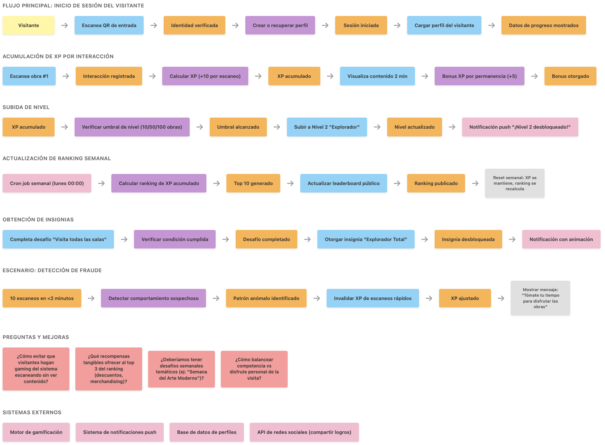

## Capítulo II: Requirements Elicitation & Analysis

### 2.1. Competidores

#### 2.1.1. Análisis competitivo

- **Competitive Analysis Land Landscape**

  _¿Por qué llevar a cabo este análisis?_

  Este análisis no permite identificar las brechas de costo y funcionalidad en el mercado de tecnología museística, para validar el posicionamiento de KhipuTech como la opción líder en analítica de bajo costo y alta interacción.

| Categoría     | Sub Categpría            | KhipuTech                                                      | Competidor 1: T.M.A.S. (Storetraffic)                              | Competidor 2: FootfallCam                                            | Competidor 3: Muse Software AI                             | Competidor 4: SenseMax                                  | Competidor 5: Living Museum                           | Competidor 6: Counterest                              |
| :------------ | :----------------------- | :------------------------------------------------------------- | :----------------------------------------------------------------- | :------------------------------------------------------------------- | :--------------------------------------------------------- | :------------------------------------------------------ | :---------------------------------------------------- | :---------------------------------------------------- |
| Perfil        | Overview                 | Solución híbrida de IoT y Web App para analítica y engagement. | Líder en conteo de personas y KPIs de tráfico para retail/museos.  | Especialistas en conteo 3D avanzado y mapas de calor.                | ERP/CRM integral para operaciones completas de museos.     | Sistema de sensores inalámbricos con transmisión Cloud. | Plataforma experimental de IA para guías virtuales.   | Analítica de flujo mediante WiFi y sensores térmicos. |
| Perfil        | Ventaja competitiva      | Bajo costo operativo y hardware DIY con interacción QR/NFC.    | Dashboard profesional y hardware inalámbrico de fácil instalación. | Alta precisión técnica en grandes flujos de personas.                | Centralización de toda la administración del museo.        | Simplicidad de uso y reportes automáticos.              | Interacción conversacional inmersiva con IA.          | Análisis de rutas y comportamiento del usuario.       |
| P. Marketing  | Mercado Objetivo         | Museos medianos, galerías de arte y centros culturales.        | Retail, bibliotecas y museos pequeños/medianos.                    | Centros comerciales, aeropuertos y grandes museos.                   | Museos de gran escala y organizaciones sin fines de lucro. | Retail, museos y centros de exhibición.                 | Estudiantes y visitantes de museos virtuales/físicos. | Espacios de eventos, museos y retail de lujo.         |
| P. Marketing  | Estrategias de Marketing | Venta directa B2B y demostraciones de pilotos locales.         | Posicionamiento SEO global y partnerships con hardware.            | Marketing basado en precisión técnica y casos de éxito corporativos. | marketing Inbound marketing y demostraciones enterprise.   | Canal de distribuidores globales.                       | Difusión en comunidades tech y educativas.            | Ventas consultivas para proyectos a medida.           |
| P. Producto   | Productos & Servicios    | Sensores de flujo + Web App de contenido exclusivo.            | Sensores infrarrojos (Pearl) + Plataforma SaaS.                    | Cámaras 3D con IA + Software de análisis de ruta.                    | CRM, Ticketing, POS y Fundraising.                         | Sensores infrarrojos y colectores de datos.             | Chatbot Web basado en contenido de museos.            | Sensores térmicos y rastreo de señales WiFi.          |
| P. Producto   | Precios & Costos         | <$500 Setup Total (Sin suscripciones obligatorias).            | $1,100+ Hardware + $19.95/mes de suscripción.                      | $500+ por unidad de hardware + costos de instalación.                | Premium (Alto, basado en cotización).                      | €330+ Kit inicial + cuota mensual.                      | Gratuito (Proyecto experimental).                     | Alto (Costo por proyecto/licencia).                   |
| P. Producto   | Canales (Web & Movil)    | Web App (Mobile-first) y Dashboard.                            | Cloud-based Dashboard y App móvil de monitoreo.                    | Software de escritorio y Dashboard.                                  | Multiplataforma (SaaS).                                    | Web Dashboard y escritorio.                             | Web App accesible desde cualquier navegador.          | Dashboard Web de analítica avanzada.                  |
| Análisis SWOT | Fortalezas               | Costo disruptivo y flexibilidad de automatización.             | Marca establecida y hardware muy confiable.                        | Tecnología de punta y gran precisión en 3D.                          | Solución definitiva para administración.                   | Instalación rápida sin cables.                          | Innovación tecnológica (Generative AI).               | Análisis de comportamiento profundo.                  |
| Análisis SWOT | Debilidades              | Percepción de marca nueva/tecnología DIY.                      | Costo elevado para instituciones públicas.                         | Instalación compleja y precio restrictivo.                           | Curva de aprendizaje y costo alto.                         | Dependencia de suscripciones SaaS.                      | No soluciona el flujo físico ni métricas.             | Inversión técnica y económica alta.                   |

#### 2.1.2. Estrategias y tácticas frente a competidores

Tras el análisis del panorama competitivo, KhipuTech ha definido las siguientes estrategias preliminares para posicionarse como la opción líder en el segmento de museos medianos y galerías.

- **Estrategias frente a Fortalezas de la Competencia**
  - _Enfoque en la Agilidad vs. Robustez:_ Mientras que los competidores ofrecen sistemas complejos que requieren meses de implementación, KhipuTech aplicará la estrategia de "Implementación Express", garantizando un sistema funcional en menos de 1 mes, atacando la lentitud burocrática de las grandes plataformas.
  - _Soporte Local y Personalización vs. Gigantes Globales:_ Frente a FootfallCam o SensMax (basados en el extranjero), nuestra táctica será el Acompañamiento Técnico Presencial. Al estar basados en Lima, podemos ofrecer mantenimiento físico y ajustes de red in situ, algo que la competencia internacional no puede igualar sin costos de viáticos prohibitivos.
- **Tácticas para aprovechar Debilidades de la Competencia**
  - _Modelo No-Subscription vs. Suscripciones Eternas:_ La mayor debilidad de T.M.A.S. y SensMax es la renta mensual. KhipuTech aplicará la táctica de Venta de Activo, donde el museo es dueño de su hardware y sus datos (almacenados en su propio Google Sheets o Baserow), eliminando el miedo al "gasto fijo" recurrente.
  - _Hardware DIY-Pro vs. Hardware Propietario Caro:_ Aprovechando que competidores como FootfallCam cobran más de $500 por sensor, KhipuTech utiliza microcontroladores ESP32 de bajo costo. Nuestra táctica es el "Diseño Modular": si un sensor falla, el costo de reposición es mínimo ($15), a diferencia de los cientos de dólares que costaría reparar un equipo de la competencia.
- **Contexto de Oportunidades y Amenazas**

  |     Factor      | Descripción                                                            | Acción                                                                           |
  | :-------------: | :--------------------------------------------------------------------- | :------------------------------------------------------------------------------- |
  | **Oportunidad** | Alta tasa de digitalización en museos post-pandemia en Latam.          | Lanzar campañas de "Digitalización de Guerrilla" para museos municipales.        |
  | **Oportunidad** | Preferencia del visitante por usar su propio smartphone (BYOD).        | Optimizar la Web App para que no requiera descargas (uso de subdominios).        |
  |   **Amenaza**   | Competidores globales lanzando versiones "Lite" de bajo costo.         | Blindar el mercado local mediante alianzas exclusivas con gestores culturales.   |
  |   **Amenaza**   | Falta de conectividad WiFi estable en edificios coloniales/históricos. | Implementar protocolos de comunicación LoRa o comunicación local entre sensores. |

### 2.2. Entrevistas

El objetivo de las entrevistas es comprender las experiencias y opiniones de dos segmentos clave: gestores de museos y visitantes. Esto permitirá identificar problemas en la gestión de exhibiciones y en la interacción del usuario.

La información obtenida ayudará a validar las hipótesis del proyecto y ajustar la propuesta de KhipuTech según necesidades reales.

#### 2.2.1. Diseño de entrevistas

Las entrevistas fueron diseñadas para obtener información cualitativa sobre prácticas actuales, necesidades y expectativas.

Se consideraron dos segmentos:

### Segmento objetivo 1: Gestores culturales o conocedores de administración de museos:

1. Al terminar el montaje de una exhibición, ¿Cómo evalúas si la distribución de las piezas fue efectiva para transmitir la narrativa que planeas?

2. ¿Alguna vez tomaste una decisión de museografía o marketing basada en datos de comportamiento del visitante? ¿Cómo obtuviste los datos?

3.Si pudieras ver un reporte de qué piezas de la exposición fueron las preferidas o generaron más tiempo de permanencia, ¿Cómo influiría eso en tu próximo proyecto de museografía?

4. ¿Qué herramientas usas hoy para medir el éxito de una exposición? ¿Con qué frecuencia las usas?

5. ¿El museo tiene presupuesto asignado para tecnología o innovación? ¿Quién aprueba ese tipo de inversión?

6. ¿Qué preguntas te hace el público con más frecuencia durante las visitas guiadas que no están respondidas en ningún material físico?

7. ¿Has visto a visitantes buscar información de una pieza en Google en lugar de leer la ficha del museo? ¿Qué te dice eso?

8. Si pudieras darle al visitante una capa extra de información sobre una pieza, ¿qué sería lo primero que añadirías: contexto histórico, audio del artista, videos del proceso creativo, algo más?

9. ¿El museo ofrece contenido en otros idiomas o formatos accesibles para personas con discapacidad visual o auditiva? ¿Cómo lo resuelven hoy?

10. ¿Crees que una solución digital podría ayudarte a llegar a visitantes que normalmente no se sienten representados en el museo?

11. ¿Qué centros culturales consideras que están haciendo un buen trabajo tecnológico?

### Segmento objetivo 2: Visitantes a museos (estudiantes o turistas)

1. Nombre, edad, museo visitado recientemente.

2. ¿Cómo decidiste qué salas visitar o cuánto tiempo quedarse en cada una?

3. ¿Hubo algún momento en que sentiste que una sala estaba demasiado llena o incómoda? ¿Qué hiciste?

4. ¿Hubo alguna pieza que te llamó la atención pero no encontraste suficiente información sobre ella?

5. ¿Buscaste información adicional sobre alguna obra en tu teléfono durante la visita?

6. ¿Qué tipo de información te hubiera gustado tener que no estaba disponible?

7. ¿Usarías tu teléfono para escanear un código QR y ver contenido extra sobre una pieza, como un video del artista o contexto histórico?

8. ¿Preferirías una audioguía, leer en pantalla o ver un video corto?

9. ¿Qué te parecería acceder a contenido exclusivo que no está en ningún otro lado, solo disponible escaneando en el museo?

10. Si el museo ofreciera un recorrido temático guiado por tu teléfono (tipo "ruta del amor", "ruta política", "ruta técnica"), ¿lo seguirías?

#### 2.2.2. Registro de entrevistas

##### Registro de entrevistas del segmento objetivo 1:

|  Entrevista 1  | Duración | Inicio |                                     Imagen                                     |                                                                                                                                                                URL                                                                                                                                                                |
| :------------: | :------: | :----: | :----------------------------------------------------------------------------: | :-------------------------------------------------------------------------------------------------------------------------------------------------------------------------------------------------------------------------------------------------------------------------------------------------------------------------------: |
| Sergio Salgado |   20m    | 0:50m  |  | [Click aquí](https://upcedupe-my.sharepoint.com/personal/u20231e504_upc_edu_pe/_layouts/15/stream.aspx?id=%2Fpersonal%2Fu20231e504_upc_edu_pe%2FDocuments%2FAplicaciones+Web%2FEntrevista_SergioSalgado_GestorCultural.mp4&referrer=StreamWebApp.Web&referrerScenario=AddressBarCopied.view.3d210264-2355-468b-9d6d-fd33ab30ed2f) |

**Resumen:**

Sergio es egresado de la UDEP en la carrera de Historia y Gestión Cultural. Afirma que en cuanto se trata de evaluar si una exposición cumplió en transmitir la narrativa esperada, es algo muy subjetivo porque cada persona que visita el museo es libre de impresionarse por la pieza de su elección. Asimismo, menciona que, en términos museográficos, es necesario identificar al público objetivo de la exposición y hacerla accesible acorde a sus necesidades. Considera que la “observación no participante” de los movimientos de un visitante es una de las muchas maneras en las que se puede evaluar las preferencias de un visitante. En sus palabras “la cultura se debe a la ciudadanía” por lo que considera fundamental investigar no solo como se comporta el público, sino también como piensa. Evocó un estudio de público realizado en un museo en Piura para conocer más a las familias que visitan museos. Ese estudio se realizó mediante encuestas y entrevistas. Considera que conocer cómo piensa el público corresponde a una parte importante para la museografía. Admite que el estudio de público es paradójicamente dejado de lado. En cuanto al presupuesto para las áreas de innovación y tecnología, la realidad es que los museos privados de lima cuentan con impulso suficiente para contar con dichas áreas, pero que la visión en museos regionales es desoladora en ese aspecto. En el mejor de los casos, se encuentran cámaras de seguridad. Por otro lado, cree que la experiencia mediador-visitante es muy valiosa y complementa con creces la experiencia en los museos/recorridos culturales para que las personas no se lleven una mirada rígida, sino que se lleven la exposición como una parte de sí mismos. Finalmente, cree que depende de que tan receptivo es un público en cuanto a capas adicionales de tecnología, pero que su preferencia es la realidad virtual y realidad aumentada. 

|  Entrevista 2   | Duración | Inicio |                                     Imagen                                      |                                                                                                                                                                URL                                                                                                                                                                |
| :-------------: | :------: | :----: | :-----------------------------------------------------------------------------: | :-------------------------------------------------------------------------------------------------------------------------------------------------------------------------------------------------------------------------------------------------------------------------------------------------------------------------------: |
| Linconl Ramírez |   11m    | 0:30m  |  | [Click aquí](https://upcedupe-my.sharepoint.com/personal/u20231e504_upc_edu_pe/_layouts/15/stream.aspx?id=%2Fpersonal%2Fu20231e504_upc_edu_pe%2FDocuments%2FAplicaciones+Web%2FEntrevista_LiconlRamirez_GestorCultural.mp4&referrer=StreamWebApp.Web&referrerScenario=AddressBarCopied.view.6f95e2ba-db5a-40f9-8852-81acc63fbf75) |

**Resumen:**

Lincoln es egresado de la UDEP en la carrera de Historia y Gestión Cultural.  Afirma que en cuanto se trata de evaluar si una exposición cumplió en transmitir la narrativa esperada, cree que el montaje es una parte de mucha importancia, ya que debe encontrarse en lugares estratégicos y en armonía con el entorno, la accesibilidad también es importante para que todos puedan acercarse a la exposición. Considera la pertinencia del reporte que contiene la información sobre las preferencias del visitante. Contó que para un trabajo de la universidad, tuvo que usar un portal del gobierno sobre la afluencia hacia el museo de Narihualá de Piura (el propio museo no contaba con esa información.) Además, contó que para medir el éxito de una exposición se cuenta con un cuaderno físico ofrecido por el mediador que reúne las opiniones de los visitantes al final de su recorrido, esta metodología la observó en el museo LUM. Por otro lado, en cuanto a las áreas de tecnología e innovación en los museos, cuenta que el sector privado cuenta con más libertades y tienen diferentes fuentes de financiamiento que les permite tener más capital de inversión. Sobre las preguntas que la gente le hace durante el recorrido, contó entre risas que la gente le pregunta cosas que no están en el guión, y que lo más recurrente es el contexto histórico (a veces existen objetos aislados sin un contexto en general) esa información extra les permitiría aprender. Al igual que Sergio, confirmó que existe muy poca investigación sobre los públicos de los museos. Dió el ejemplo de Narihualá, en el que se presenta la información en inglés, español y quechua. A su parecer, eso ayuda a derribar barreras, y por ello se debe profundizar en el estudio de públicos. 

| Entrevista 3  | Duración | Inicio |                                    Imagen                                     |                                                                                                                                                                             URL                                                                                                                                                                              |
| :-----------: | :------: | :----: | :---------------------------------------------------------------------------: | :----------------------------------------------------------------------------------------------------------------------------------------------------------------------------------------------------------------------------------------------------------------------------------------------------------------------------------------------------------: |
| Jesus Hidalgo |   24m    | 0:10m  |  | [Click Aquí](https://upcedupe-my.sharepoint.com/personal/u20231e504_upc_edu_pe/_layouts/15/stream.aspx?id=%2Fpersonal%2Fu20231e504%5Fupc%5Fedu%5Fpe%2FDocuments%2FAplicaciones%20Web%2FEntrevista%5FJesusHidalgo%5FGestorCultural%2Emp4&referrer=StreamWebApp%2EWeb&referrerScenario=AddressBarCopied%2Eview%2E6f0d7de8%2D4ef8%2D48ae%2D9f74%2D9ca448555fea) |

**Resumen:**

Jesús es egresado de la UDEP en la carrera de Historia y Gestión Cultural. Nos contó que no existe un mecanismo específico para evaluar si una pieza en específico tuvo una buena performance, sino que se mide como un todo al final del recorrido, y que no se suele medir qué partes tuvieron más éxito. Cree que contar con un análisis de preferencias permitiría mejorar las exposiciones para futuras oportunidades, corregir errores y recibir feedback. Mencionó que algunas de las herramientas utilizadas para obtener data de los visitantes son entrevistas en google forms y cuadernos de visitantes. Sobre el presupuesto para las áreas de tecnología e innovación, no existen áreas de ese tipo en la mayoría de museos, pero el área de administración suele encargarse de gestionar ese presupuesto. Más adelante, hablando sobre sus experiencias como mediador, comentó que la gente busca profundizar en ciertos detalles que a veces no se encuentran en la exposición, le parece que sería útil mostrar material multimedia adicional. En cuanto a accesibilidad a personas con discapacidades, mencionó dispositivos de audio implementados en algunos centros culturales así como el material en braille, pero no va más allá. También recalcó la importancia de la presencia de los mediadores para guiar a los visitantes con discapacidades durante el recorrido para que puedan disfrutar de una experiencia completa. Considera que los QRs resultan inútiles en muchos casos para mejorar la experiencia inmersiva en los museos, y que no cree que se deba depender mucho de ellos. Él cree que se necesitan soluciones tradicionales para problemas que una solución no respondería a las necesidades de varias personas. Cree que los repositorios digitales de algunos centros son buenas maneras de aplicar tecnología en museos. 

#### 2.2.3. Análisis de entrevistas

Los tres señalan que no existe un mecanismo preciso para medir qué partes de una exposición
funcionan mejor. Jesús lo dice explícitamente; Sergio lo describe como algo subjetivo; Lincoln
lo ejemplifica con el cuaderno físico del museo LUM como único registro disponible. Sergio y Lincoln lo afirman directamente: el estudio de públicos es "paradójicamente dejado de lado" a pesar de ser fundamental. Jesús lo refuerza al valorar el análisis de preferencias para corregir errores futuros. Los tres mencionan herramientas actuales (encuestas, entrevistas, cuadernos físicos, observación no participante) como insuficientes o subutilizadas.Los tres coinciden en la brecha privado/público. Jesús señala que la mayoría de museos no tiene
áreas de tecnología. Sergio describe los museos regionales como "desoladores" en ese aspecto (en el mejor caso, cámaras de seguridad). Lincoln confirma que el sector privado tiene más fuentes de financiamiento; el contexto estructural que condiciona cualquier propuesta tecnológica. Los tres valoran al mediador por encima de cualquier herramienta digital. Jesús lo señala como necesario para accesibilidad. Sergio lo describe como generador de experiencia profunda. Lincoln indica que la gente pregunta cosas "fuera del guión", evidenciando una demanda de contexto adicional que el montaje actual no cubre. En conclusión, Los tres entrevistados comparten el mismo diagnóstico de fondo: los museos peruanos, especialmente los regionales y públicos, operan sin sistemas de retroalimentación reales. Recopilan opiniones al final del recorrido (cuando ya no se puede hacer nada) y casi no investigan a sus públicos de manera sistemática. Eso no es un descuido aislado, es una carencia estructural.
Donde más valor tiene el análisis conjunto es en el tema del mediador: los tres lo mencionan espontáneamente como el elemento que más agrega valor a la experiencia. Lincoln incluso da el detalle más rico al decir que la gente pregunta cosas "fuera del guión", eso es evidencia directa de que la exposición no satisface la demanda de contexto del visitante. Esa brecha entre lo que el montaje ofrece y lo que el público necesita es el problema de diseño central que emerge de las tres voces.
La divergencia en tecnología es interesante porque no es superficial: Jesús habla desde la experiencia de mediador en contextos con poco presupuesto y un público heterogéneo, por lo que su escepticismo ante los QRs tiene base práctica. Sergio habla más desde una visión museográfica ideal. Lincoln resuelve la tensión sin decirlo explícitamente: el multilingüismo en Narihualá es la única "tecnología" que los tres coincidirían en validar, porque responde directamente a las características del público, no a una tendencia de innovación.

### 2.3. Needfinding

#### 2.3.1. User Personas

User Persona Segmento Objetivo 1:

En nuestro primer segmento tenemos a Antonio, un curador y gestor cultural que busca mejorar las exposiciones del museo apoyándose en datos, aunque enfrenta limitaciones tecnológicas y de presupuesto.

User Persona Segmento Objetivo 2:

En nuestro segundo segmento tenemos a Alessia, una estudiante universitaria que visita museos ocasionalmente y prefiere acceder a información clara y rápida sin depender de aplicaciones complejas.

#### 2.3.2. User Task Matrix

User Task Matrix Segmento Objetivo 1:

En nuestro primer segmento tenemos al curador/gestor cultural, donde el User Task Matrix muestra tareas como monitorear la afluencia por sala, analizar la permanencia de los visitantes, actualizar contenido y redistribuir grupos, siendo la mayoría de alta importancia para la toma de decisiones.

User Task Matrix Segmento Objetivo 2:

En nuestro segundo segmento tenemos a los visitantes del museo (estudiantes y turistas), donde el User Task Matrix muestra tareas como escanear QR, ver contenido multimedia, cambiar idioma y recorrer las obras de forma autónoma, todas con alta frecuencia e importancia para una experiencia más accesible y enriquecida.

#### 2.3.3. User Journey Mapping

User Journey Map - Segmento 1 y 2 respectivamente

En este gráfico del User Journey Map para ambos segmentos, se observa que el personal del museo busca optimizar tareas manuales como la gestión de contenidos y reportes mediante herramientas digitales que generen datos automáticos. Por otro lado, los visitantes inician su recorrido con entusiasmo, pero su satisfacción decae al tener que buscar información externa, lo que representa una oportunidad para ofrecer contenido multimedia inmediato mediante códigos QR. En conjunto, la imagen destaca la necesidad de digitalizar procesos para mejorar la eficiencia operativa del museo y enriquecer la experiencia informativa del público.

#### 2.3.4. Empathy Mapping

Empathy Mapping Segmento Objetivo 1:

En nuestro primer segmento tenemos al curador/gestor cultural, donde el mapa de empatía refleja que enfrenta limitaciones de recursos y falta de datos concretos, lo que lo lleva a tomar decisiones basadas en experiencia, aunque busca herramientas simples que le permitan medir mejor el impacto de sus exposiciones.

Empathy Mapping Segmento Objetivo 2:

En nuestro segundo segmento tenemos a los visitantes del museo, donde el mapa de empatía muestra que buscan entender mejor las obras de forma rápida y sencilla, evitando herramientas complejas, y valoran experiencias que despierten su curiosidad sin interrumpir su recorrido.

### 2.4. Big Picture Event Storming

Para el desarrollo del Big Picture Event Storming de KhipuTech, se utilizó la herramienta Miro, que facilitó la colaboración y visualización de los diferentes elementos del proceso. A continuación, se presenta un resumen de los principales componentes identificados durante la sesión de Event Storming:

Primero, se definieron las leyendas para los diferentes elementos que se van a usar en el Event Storming:

- **Domain Events:** Representa un hecho del negocio que ya ocurrió y no puede cambiarse.
- **Hotspot Question Improvement:** Señala un punto de incertidumbre, duda o posible conflicto en el proceso. Se utiliza para visibilizar preguntas que aún no tienen respuesta clara, de modo que el equipo pueda discutirlas y mejorarlas más adelante.
- **Definition:** Aporta una explicación breve y precisa de un concepto clave dentro del dominio.
- **Actor:** Es la persona, rol u organización que interactúa con el sistema o provoca eventos.
- **Command:** Expresa la intención de realizar una acción en el sistema.
- **Comment:** Sirve para añadir notas, aclaraciones o hipótesis que enriquecen el contexto. No alteran el flujo, pero ayudan a documentar observaciones útiles para futuras discusiones.
- **Policy:** Define una regla de negocio que conecta automáticamente un evento con un comando.
- **External System:** Representa servicios o plataformas externas que interactúan con tu sistema, aunque no las controles directamente.

El Event Storming permitió identificar de forma colaborativa los eventos clave que marcan el flujo del sistema, desde las interacciones principales de los usuarios hasta los procesos internos que sostienen la experiencia. El proceso se desarrolló siguiendo pasos como el reconocimiento de los domain events, la incorporación de los actores que desencadenan acciones, la definición de los comandos que impulsan dichos eventos y la identificación de las políticas o reglas que guían la dinámica del sistema. A partir de esto se generaron ideas que ayudaron a visualizar cómo se conectan las acciones, qué actores participan en cada etapa y qué resultados se esperan, lo que facilitó comprender mejor la dinámica general y detectar oportunidades de mejora o innovación.

---

#### Big Picture Event Storming 1: Gestión de Visitantes

Para el desarrollo del primer Event Storming se identifican los domain events relacionados con la experiencia del visitante en el museo, como el escaneo de códigos QR/NFC en obras, el acceso a contenido multimedia y la acumulación de puntos de gamificación. Luego se reconocen los pasos que ejecuta el actor principal (el visitante), como ingresar al museo, aproximarse a una obra, escanear el código QR y visualizar información adicional. También se muestran las validaciones del sistema, por ejemplo, cuando una obra no tiene contenido disponible, lo que genera una notificación. Finalmente, se plantean preguntas para mejorar el flujo, como cómo hacer más atractiva la gamificación o cómo personalizar recomendaciones de obras según el perfil del visitante.

---

#### Big Picture Event Storming 2: Control de Aforo en Tiempo Real

Para el desarrollo del segundo Event Storming se identifican los domain events relacionados con el monitoreo de aforo, como la detección de entrada/salida de visitantes mediante sensores IoT, el cálculo de ocupación en tiempo real y la generación de alertas cuando se superan umbrales. El actor principal (gestor cultural/administrador) realiza acciones como acceder al dashboard, visualizar métricas de aforo por sala y configurar umbrales de alerta. El sistema interviene validando los datos de sensores a través de algoritmos de conteo y actualizando el dashboard según el resultado. Además, se incluyen notificaciones push para informar al gestor y preguntas clave para manejar casos especiales, como qué sucede si los sensores fallan temporalmente o cómo ajustar umbrales dinámicamente según eventos especiales.

---

#### Big Picture Event Storming 3: Gestión de Contenido de Obras

Para el desarrollo del tercer Event Storming se identifican los domain events relacionados con la administración de contenido cultural en la plataforma. El actor principal (curador/gestor de contenido) inicia con la carga de información de una nueva obra: título, artista, descripción, imágenes de alta resolución y archivos de audio. Posteriormente, se asignan códigos QR/NFC únicos a cada obra y se valida que el contenido cumpla con estándares de calidad (resolución mínima, duración de audio, texto descriptivo). El sistema interviene en la generación automática de códigos, la compresión de imágenes para optimizar tiempos de carga y la sincronización con la base de datos central. Finalmente, se abordan preguntas como: ¿qué sucede si una obra tiene contenido multimedia en varios idiomas? ¿cómo gestionar versiones del contenido (por ejemplo, contenido infantil vs. adultos)?

---

#### Big Picture Event Storming 4: Analítica y Generación de Reportes

Para el desarrollo del cuarto Event Storming se identifican los domain events de análisis de datos y generación de insights, como la creación de reportes de afluencia semanal, la identificación de obras más populares y el envío de alertas por patrones anómalos. El actor principal (administrador del museo) realiza acciones como iniciar sesión en el dashboard, seleccionar filtros de fecha/sala, configurar parámetros de reporte y exportar datos a PDF/Excel. El sistema valida los datos históricos almacenados, procesa métricas mediante algoritmos de agregación y notifica automáticamente cuando se detectan tendencias relevantes (por ejemplo, caída drástica en interacciones con ciertas obras). Finalmente, surgen preguntas clave sobre métricas a considerar, detección de patrones estacionales y definición de KPIs críticos para la toma de decisiones.

---

#### Big Picture Event Storming 5: Gamificación y Ranking de Visitantes

Para el desarrollo del quinto Event Storming se identifican los domain events relacionados con el sistema de gamificación, como la acumulación de puntos XP por interacción con obras, el avance de nivel del visitante y la actualización del ranking semanal. El actor principal (visitante) inicia sesión mediante QR/NFC, escanea múltiples obras durante su recorrido y acumula experiencia según el tiempo de permanencia y la cantidad de contenido consumido. El sistema valida la acumulación de XP, verifica si el visitante alcanzó un nuevo nivel (umbrales: 10, 50, 100 obras) y actualiza su posición en el ranking público. Se notifica al visitante cuando obtiene una insignia o sube de nivel. Surgen preguntas clave sobre cómo evitar comportamientos fraudulentos (escaneos rápidos sin interacción real), qué recompensas ofrecer a los visitantes más activos y cómo incluir desafíos semanales para aumentar engagement.

---

El Event Storming colaborativo permitió al equipo de KhipuTech identificar los flujos críticos del sistema, desde la experiencia del visitante hasta la gestión administrativa y analítica. Este ejercicio facilitó la detección temprana de puntos de fricción, oportunidades de automatización y necesidades de integración con sistemas externos (sensores IoT, pasarelas de pago para sponsors, APIs de redes sociales para compartir logros). Los insights obtenidos fueron fundamentales para definir los Bounded Contexts del diseño DDD y priorizar las User Stories en el Product Backlog.

### 2.5. Ubiquitous Language

---
