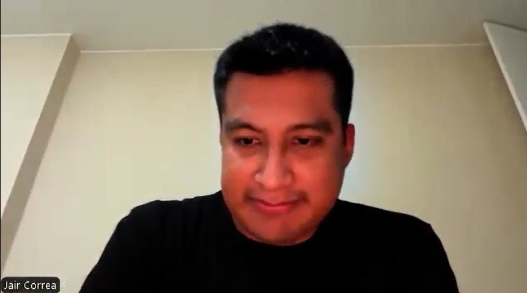
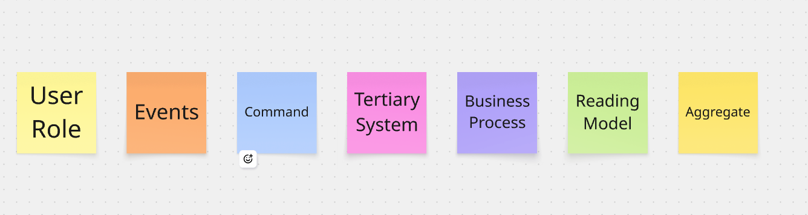
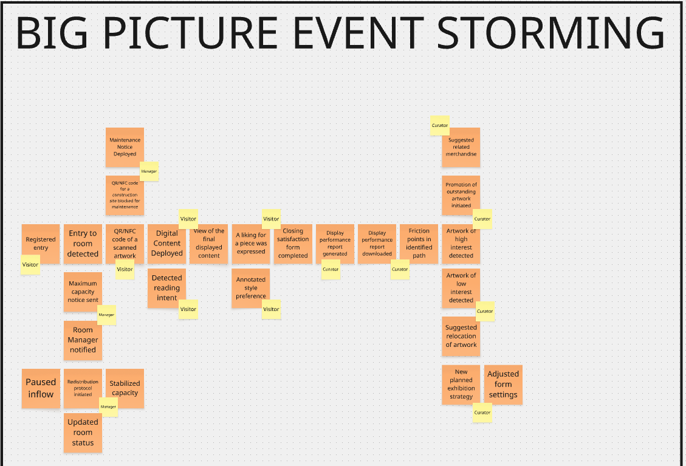

## Capítulo II: Requirements Elicitation & Analysis

### 2.1. Competidores

#### 2.1.1. Análisis competitivo

- **Competitive Analysis Land Landscape**

  _¿Por qué llevar a cabo este análisis?_

  Este análisis no permite identificar las brechas de costo y funcionalidad en el mercado de tecnología museística, para validar el posicionamiento de KhipuTech como la opción líder en analítica de bajo costo y alta interacción.

| Categoría     | Sub Categpría            | KhipuTech                                                      | Competidor 1: T.M.A.S. (Storetraffic)                              | Competidor 2: FootfallCam                                            | Competidor 3: Muse Software AI                             | Competidor 4: SenseMax                                  | Competidor 5: Living Museum                           | Competidor 6: Counterest                              |
| :------------ | :----------------------- | :------------------------------------------------------------- | :----------------------------------------------------------------- | :------------------------------------------------------------------- | :--------------------------------------------------------- | :------------------------------------------------------ | :---------------------------------------------------- | :---------------------------------------------------- |
| Perfil        | Overview                 | Solución híbrida de IoT y Web App para analítica y engagement. | Líder en conteo de personas y KPIs de tráfico para retail/museos.  | Especialistas en conteo 3D avanzado y mapas de calor.                | ERP/CRM integral para operaciones completas de museos.     | Sistema de sensores inalámbricos con transmisión Cloud. | Plataforma experimental de IA para guías virtuales.   | Analítica de flujo mediante WiFi y sensores térmicos. |
| Perfil        | Ventaja competitiva      | Bajo costo operativo y hardware DIY con interacción QR/NFC.    | Dashboard profesional y hardware inalámbrico de fácil instalación. | Alta precisión técnica en grandes flujos de personas.                | Centralización de toda la administración del museo.        | Simplicidad de uso y reportes automáticos.              | Interacción conversacional inmersiva con IA.          | Análisis de rutas y comportamiento del usuario.       |
| P. Marketing  | Mercado Objetivo         | Museos medianos, galerías de arte y centros culturales.        | Retail, bibliotecas y museos pequeños/medianos.                    | Centros comerciales, aeropuertos y grandes museos.                   | Museos de gran escala y organizaciones sin fines de lucro. | Retail, museos y centros de exhibición.                 | Estudiantes y visitantes de museos virtuales/físicos. | Espacios de eventos, museos y retail de lujo.         |
| P. Marketing  | Estrategias de Marketing | Venta directa B2B y demostraciones de pilotos locales.         | Posicionamiento SEO global y partnerships con hardware.            | Marketing basado en precisión técnica y casos de éxito corporativos. | marketing Inbound marketing y demostraciones enterprise.   | Canal de distribuidores globales.                       | Difusión en comunidades tech y educativas.            | Ventas consultivas para proyectos a medida.           |
| P. Producto   | Productos & Servicios    | Sensores de flujo + Web App de contenido exclusivo.            | Sensores infrarrojos (Pearl) + Plataforma SaaS.                    | Cámaras 3D con IA + Software de análisis de ruta.                    | CRM, Ticketing, POS y Fundraising.                         | Sensores infrarrojos y colectores de datos.             | Chatbot Web basado en contenido de museos.            | Sensores térmicos y rastreo de señales WiFi.          |
| P. Producto   | Precios & Costos         | <$500 Setup Total (Sin suscripciones obligatorias).            | $1,100+ Hardware + $19.95/mes de suscripción.                      | $500+ por unidad de hardware + costos de instalación.                | Premium (Alto, basado en cotización).                      | €330+ Kit inicial + cuota mensual.                      | Gratuito (Proyecto experimental).                     | Alto (Costo por proyecto/licencia).                   |
| P. Producto   | Canales (Web & Movil)    | Web App (Mobile-first) y Dashboard.                            | Cloud-based Dashboard y App móvil de monitoreo.                    | Software de escritorio y Dashboard.                                  | Multiplataforma (SaaS).                                    | Web Dashboard y escritorio.                             | Web App accesible desde cualquier navegador.          | Dashboard Web de analítica avanzada.                  |
| Análisis SWOT | Fortalezas               | Costo disruptivo y flexibilidad de automatización.             | Marca establecida y hardware muy confiable.                        | Tecnología de punta y gran precisión en 3D.                          | Solución definitiva para administración.                   | Instalación rápida sin cables.                          | Innovación tecnológica (Generative AI).               | Análisis de comportamiento profundo.                  |
| Análisis SWOT | Debilidades              | Percepción de marca nueva/tecnología DIY.                      | Costo elevado para instituciones públicas.                         | Instalación compleja y precio restrictivo.                           | Curva de aprendizaje y costo alto.                         | Dependencia de suscripciones SaaS.                      | No soluciona el flujo físico ni métricas.             | Inversión técnica y económica alta.                   |

#### 2.1.2. Estrategias y tácticas frente a competidores

Tras el análisis del panorama competitivo, KhipuTech ha definido las siguientes estrategias preliminares para posicionarse como la opción líder en el segmento de museos medianos y galerías.

- **Estrategias frente a Fortalezas de la Competencia**
  - _Enfoque en la Agilidad vs. Robustez:_ Mientras que los competidores ofrecen sistemas complejos que requieren meses de implementación, KhipuTech aplicará la estrategia de "Implementación Express", garantizando un sistema funcional en menos de 1 mes, atacando la lentitud burocrática de las grandes plataformas.
  - _Soporte Local y Personalización vs. Gigantes Globales:_ Frente a FootfallCam o SensMax (basados en el extranjero), nuestra táctica será el Acompañamiento Técnico Presencial. Al estar basados en Lima, podemos ofrecer mantenimiento físico y ajustes de red in situ, algo que la competencia internacional no puede igualar sin costos de viáticos prohibitivos.
- **Tácticas para aprovechar Debilidades de la Competencia**
  - _Modelo No-Subscription vs. Suscripciones Eternas:_ La mayor debilidad de T.M.A.S. y SensMax es la renta mensual. KhipuTech aplicará la táctica de Venta de Activo, donde el museo es dueño de su hardware y sus datos (almacenados en su propio Google Sheets o Baserow), eliminando el miedo al "gasto fijo" recurrente.
  - _Hardware DIY-Pro vs. Hardware Propietario Caro:_ Aprovechando que competidores como FootfallCam cobran más de $500 por sensor, KhipuTech utiliza microcontroladores ESP32 de bajo costo. Nuestra táctica es el "Diseño Modular": si un sensor falla, el costo de reposición es mínimo ($15), a diferencia de los cientos de dólares que costaría reparar un equipo de la competencia.
- **Contexto de Oportunidades y Amenazas**

  |     Factor      | Descripción                                                            | Acción                                                                           |
  | :-------------: | :--------------------------------------------------------------------- | :------------------------------------------------------------------------------- |
  | **Oportunidad** | Alta tasa de digitalización en museos post-pandemia en Latam.          | Lanzar campañas de "Digitalización de Guerrilla" para museos municipales.        |
  | **Oportunidad** | Preferencia del visitante por usar su propio smartphone (BYOD).        | Optimizar la Web App para que no requiera descargas (uso de subdominios).        |
  |   **Amenaza**   | Competidores globales lanzando versiones "Lite" de bajo costo.         | Blindar el mercado local mediante alianzas exclusivas con gestores culturales.   |
  |   **Amenaza**   | Falta de conectividad WiFi estable en edificios coloniales/históricos. | Implementar protocolos de comunicación LoRa o comunicación local entre sensores. |

### 2.2. Entrevistas

El objetivo de las entrevistas es comprender las experiencias y opiniones de dos segmentos clave: gestores de museos y visitantes. Esto permitirá identificar problemas en la gestión de exhibiciones y en la interacción del usuario.

La información obtenida ayudará a validar las hipótesis del proyecto y ajustar la propuesta de KhipuTech según necesidades reales.

#### 2.2.1. Diseño de entrevistas

Las entrevistas fueron diseñadas para obtener información cualitativa sobre prácticas actuales, necesidades y expectativas.

Se consideraron dos segmentos:

### Segmento objetivo 1: Gestores culturales o conocedores de administración de museos:

1. Al terminar el montaje de una exhibición, ¿Cómo evalúas si la distribución de las piezas fue efectiva para transmitir la narrativa que planeas?

2. ¿Alguna vez tomaste una decisión de museografía o marketing basada en datos de comportamiento del visitante? ¿Cómo obtuviste los datos?

3. Si pudieras ver un reporte de qué piezas de la exposición fueron las preferidas o generaron más tiempo de permanencia, ¿Cómo influiría eso en tu próximo proyecto de museografía?

4. ¿Qué herramientas usas hoy para medir el éxito de una exposición? ¿Con qué frecuencia las usas?

5. ¿El museo tiene presupuesto asignado para tecnología o innovación? ¿Quién aprueba ese tipo de inversión?

6. ¿Qué preguntas te hace el público con más frecuencia durante las visitas guiadas que no están respondidas en ningún material físico?

7. ¿Has visto a visitantes buscar información de una pieza en Google en lugar de leer la ficha del museo? ¿Qué te dice eso?

8. Si pudieras darle al visitante una capa extra de información sobre una pieza, ¿qué sería lo primero que añadirías: contexto histórico, audio del artista, videos del proceso creativo, algo más?

9. ¿El museo ofrece contenido en otros idiomas o formatos accesibles para personas con discapacidad visual o auditiva? ¿Cómo lo resuelven hoy?

10. ¿Crees que una solución digital podría ayudarte a llegar a visitantes que normalmente no se sienten representados en el museo?

11. ¿Qué centros culturales consideras que están haciendo un buen trabajo tecnológico?

### Segmento objetivo 2: Visitantes a museos (estudiantes o turistas)

1. Nombre, edad, museo visitado recientemente.

2. ¿Cómo decidiste qué salas visitar o cuánto tiempo quedarse en cada una?

3. ¿Hubo algún momento en que sentiste que una sala estaba demasiado llena o incómoda? ¿Qué hiciste?

4. ¿Hubo alguna pieza que te llamó la atención pero no encontraste suficiente información sobre ella?

5. ¿Buscaste información adicional sobre alguna obra en tu teléfono durante la visita?

6. ¿Qué tipo de información te hubiera gustado tener que no estaba disponible?

7. ¿Usarías tu teléfono para escanear un código QR y ver contenido extra sobre una pieza, como un video del artista o contexto histórico?

8. ¿Preferirías una audioguía, leer en pantalla o ver un video corto?

9. ¿Qué te parecería acceder a contenido exclusivo que no está en ningún otro lado, solo disponible escaneando en el museo?

10. Si el museo ofreciera un recorrido temático guiado por tu teléfono (tipo "ruta del amor", "ruta política", "ruta técnica"), ¿lo seguirías?

#### 2.2.2. Registro de entrevistas

##### Registro de entrevistas del segmento objetivo 1:

|  Entrevista 1  | Duración | Inicio |                                        Imagen                                        |                                                                                                                                                                URL                                                                                                                                                                |
| :------------: | :------: | :----: | :----------------------------------------------------------------------------------: | :-------------------------------------------------------------------------------------------------------------------------------------------------------------------------------------------------------------------------------------------------------------------------------------------------------------------------------: |
| Sergio Salgado |   20m    | 0:50m  |  | [Click Aqui](https://upcedupe-my.sharepoint.com/personal/u20231e504_upc_edu_pe/_layouts/15/stream.aspx?id=%2Fpersonal%2Fu20231e504_upc_edu_pe%2FDocuments%2FAplicaciones+Web%2FEntrevista_SergioSalgado_GestorCultural.mp4&referrer=StreamWebApp.Web&referrerScenario=AddressBarCopied.view.3d210264-2355-468b-9d6d-fd33ab30ed2f) |

**Resumen:**

- **Entrevistado:** Sergio
- **Formación:** Historia y Gestión Cultural – UDEP
- **Personalidad:** Reflexivo, crítico y humanista. Orientado al visitante, con una visión centrada en que "la cultura se debe a la ciudadanía."
- **Marcas e influencias:** [No mencionado en entrevista]
- **Tecnología:** Muestra preferencia por la realidad virtual y realidad aumentada como herramientas para enriquecer la experiencia museística.
- **Dispositivos:** [No mencionado en entrevista]
- **Browser:** [No mencionado en entrevista]
- **Canales de interacción:** Encuestas y entrevistas como métodos de estudio de público. Valora la observación no participante como canal de análisis del comportamiento del visitante.
- **Características objetivas:** Egresado de UDEP, carrera de Historia y Gestión Cultural. Tiene experiencia en museografía y ha referenciado un estudio de público realizado en un museo de Piura orientado a familias visitantes.
- **Características subjetivas:** Considera que evaluar si una exposición transmitió su narrativa es subjetivo. Cree que el estudio de público es fundamental pero paradójicamente dejado de lado. Valora profundamente la experiencia mediador-visitante como complemento para que el visitante se lleve la exposición como parte de sí mismo. Reconoce la brecha tecnológica entre museos privados de Lima y museos regionales.

---

|  Entrevista 2   | Duración | Inicio |                                        Imagen                                         |                                                                                                                                                                URL                                                                                                                                                                |
| :-------------: | :------: | :----: | :-----------------------------------------------------------------------------------: | :-------------------------------------------------------------------------------------------------------------------------------------------------------------------------------------------------------------------------------------------------------------------------------------------------------------------------------: |
| Linconl Ramírez |   11m    | 0:30m  |  | [Click Aqui](https://upcedupe-my.sharepoint.com/personal/u20231e504_upc_edu_pe/_layouts/15/stream.aspx?id=%2Fpersonal%2Fu20231e504_upc_edu_pe%2FDocuments%2FAplicaciones+Web%2FEntrevista_LiconlRamirez_GestorCultural.mp4&referrer=StreamWebApp.Web&referrerScenario=AddressBarCopied.view.6f95e2ba-db5a-40f9-8852-81acc63fbf75) |

**Resumen:**

- **Entrevistado:** Lincoln
- **Formación:** Historia y Gestión Cultural – UDEP
- **Personalidad:** Cercano y con sentido del humor (contó entre risas anécdotas de su experiencia como mediador). Orientado a la accesibilidad e inclusión, con una visión práctica de la museografía.
- **Marcas e influencias:** Museo LUM (donde observó la metodología del cuaderno físico de opiniones). Museo de Narihualá de Piura (referenciado tanto en su trabajo universitario como en su reflexión sobre accesibilidad lingüística).
- **Tecnología:** Reconoce que el sector privado tiene mayor capacidad de inversión en tecnología e innovación gracias a diversas fuentes de financiamiento. [No mencionó preferencias tecnológicas personales]
- **Dispositivos:** [No mencionado en entrevista]
- **Browser:** [No mencionado en entrevista]
- **Canales de interacción:** Portal web del gobierno para datos de afluencia museística. Cuaderno físico de opiniones ofrecido por el mediador al final del recorrido (observado en el museo LUM).
- **Características objetivas:** Egresado de UDEP en Historia y Gestión Cultural. Tiene experiencia como mediador en museos y ha realizado trabajo de campo universitario consultando portales gubernamentales sobre afluencia al museo de Narihualá.
- **Características subjetivas:** Considera que el montaje es clave para transmitir la narrativa de una exposición, y debe estar en lugares estratégicos y en armonía con el entorno. Valora la accesibilidad para que todos puedan acercarse a la exposición. Cree que derribar barreras lingüísticas — como presentar información en español, inglés y quechua — es fundamental y justifica profundizar en el estudio de públicos. Coincide con Sergio en que existe muy poca investigación sobre los públicos de los museos.

---

| Entrevista 3  | Duración | Inicio |                                       Imagen                                        |                                                                                                                                                                             URL                                                                                                                                                                              |
| :-----------: | :------: | :----: | :---------------------------------------------------------------------------------: | :----------------------------------------------------------------------------------------------------------------------------------------------------------------------------------------------------------------------------------------------------------------------------------------------------------------------------------------------------------: |
| Jesus Hidalgo |   24m    | 0:10m  |  | [Click Aqui](https://upcedupe-my.sharepoint.com/personal/u20231e504_upc_edu_pe/_layouts/15/stream.aspx?id=%2Fpersonal%2Fu20231e504%5Fupc%5Fedu%5Fpe%2FDocuments%2FAplicaciones%20Web%2FEntrevista%5FJesusHidalgo%5FGestorCultural%2Emp4&referrer=StreamWebApp%2EWeb&referrerScenario=AddressBarCopied%2Eview%2E6f0d7de8%2D4ef8%2D48ae%2D9f74%2D9ca448555fea) |

**Resumen:**

- **Entrevistado:** Jesús
- **Formación:** Historia y Gestión Cultural – UDEP
- **Personalidad:** Pragmático y crítico. Prefiere soluciones tradicionales y accesibles sobre tecnología por el simple hecho de innovar. Muestra sensibilidad hacia la inclusión de personas con discapacidades.
- **Marcas e influencias:** Google Forms (mencionado como herramienta de recolección de datos). Repositorios digitales de centros culturales (los menciona como ejemplo positivo de tecnología aplicada en museos).
- **Tecnología:** Menciona Google Forms y cuadernos de visitantes como herramientas actuales de recolección de data. Propone material multimedia adicional para complementar exposiciones. Valora los repositorios digitales de centros culturales. Es escéptico respecto al uso de QRs, considerándolos inútiles en muchos casos para mejorar la experiencia inmersiva.
- **Dispositivos:** Menciona dispositivos de audio implementados en centros culturales para personas con discapacidad visual, y material en braille como herramientas de accesibilidad.
- **Browser:** [No mencionado en entrevista]
- **Canales de interacción:** Google Forms, cuadernos de visitantes, repositorios digitales, material multimedia, dispositivos de audio y braille.
- **Características objetivas:** Egresado de UDEP en Historia y Gestión Cultural. Tiene experiencia como mediador en museos y centros culturales. Conoce de primera mano la estructura administrativa de los museos en cuanto a gestión de presupuesto tecnológico.
- **Características subjetivas:** Considera que actualmente no existe un mecanismo específico para evaluar el rendimiento de piezas individuales, sino que se mide la exposición como un todo al final del recorrido. Cree que un análisis de preferencias permitiría mejorar futuras exposiciones, corregir errores y recibir feedback. Opina que los visitantes buscan profundizar en detalles que no siempre están disponibles en la exposición. Recalca la importancia de la presencia del mediador para guiar a visitantes con discapacidades y garantizarles una experiencia completa. Cree que se necesitan soluciones que respondan a las necesidades de la mayoría, no soluciones tecnológicas que excluyan a parte del público.

##### Registro de entrevistas del segmento objetivo 2:

| Entrevista 4  | Duración | Inicio |                                     Imagen                                     |                                                                                                                                                                    URL                                                                                                                                                                     |
| :-----------: | :------: | :----: | :----------------------------------------------------------------------------: | :----------------------------------------------------------------------------------------------------------------------------------------------------------------------------------------------------------------------------------------------------------------------------------------------------------------------------------------: |
| Alessia Luque |  3:21m   | 0:13m  |  | [Click Aqui](https://upcedupe-my.sharepoint.com/:v:/g/personal/u20231e504_upc_edu_pe/IQDTSY8YUP-DT7YoqylJBb3jAWksMgbDf7lQ0mpIavfGdNI?nav=eyJyZWZlcnJhbEluZm8iOnsicmVmZXJyYWxBcHAiOiJPbmVEcml2ZUZvckJ1c2luZXNzIiwicmVmZXJyYWxBcHBQbGF0Zm9ybSI6IldlYiIsInJlZmVycmFsTW9kZSI6InZpZXciLCJyZWZlcnJhbFZpZXciOiJNeUZpbGVzTGlua0NvcHkifX0&e=ckg95p) |

Resumen:

- **Entrevistada:** Alessia Ximena Luque Carlos
- **Formación:** Estudiante de Administración – Universidad de Lima
- **Personalidad:** Curiosa y orientada al aprendizaje. Busca aprovechar al máximo su experiencia cultural. Valora la tecnología como herramienta para enriquecer la visita, siempre que sea accesible y sin fricción. Muestra interés por profundizar en obras que llaman su atención.
- **Marcas e influencias:** Facebook, WhatsApp Business, Instagram, TikTok, Twitter (mencionadas como herramientas de su día a día).
- **Tecnología:** Utiliza redes sociales y herramientas digitales de forma cotidiana. Propone el uso de códigos QR para acceder a información en tiempo real sobre obras. Valora soluciones que no requieran instalación de aplicaciones. Desea contenido multimedia, contexto histórico y material exclusivo accesible desde su dispositivo.
- **Dispositivos:** Celular con iOS (uso principal), laptop con Windows.
- **Browser:** [No mencionado en entrevista]
- **Canales de interacción:** Redes sociales (Facebook, Instagram, TikTok, Twitter), WhatsApp Business, códigos QR, contenido web sin apps.
- **Características objetivas:** Estudiante universitaria de Administración en la Universidad de Lima. Visitante frecuente de museos con experiencia limitada a descripciones físicas y guías generales. Usuario activo de dispositivos móviles y plataformas digitales.
- **Características subjetivas:** Su experiencia museística actual depende únicamente de descripciones físicas o guías generales, lo que le impide profundizar en las obras de su interés. Su principal frustración surge cuando encuentra obras interesantes pero no dispone de información suficiente para entender su significado o importancia, generando que no aproveche completamente la visita. Desea acceso inmediato a contenido enriquecido sin instalar aplicaciones, con disponibilidad en varios idiomas. Actualmente no conoce soluciones que integren experiencia interactiva dentro de los museos que visita. Busca herramientas tecnológicas que hagan la experiencia más dinámica, accesible y enriquecedora.

##### Registro de entrevistas del segmento objetivo 2:

|   Entrevista 5   | Duración | Inicio |                                      Imagen                                       |                                                                                                                                                                  URL                                                                                                                                                                  |
| :--------------: | :------: | :----: | :-------------------------------------------------------------------------------: | :-----------------------------------------------------------------------------------------------------------------------------------------------------------------------------------------------------------------------------------------------------------------------------------------------------------------------------------: |
| Gianmarco Correa |  8:00m   | 0:10m  |  | [Click Aqui](https://upcedupe-my.sharepoint.com/:v:/g/personal/u20231e504_upc_edu_pe/IQAmCXrnLqkgS73XjqgKV50vAWEm3DMw925zTRx9BXdNV18?nav=eyJyZWZlcnJhbEluZm8iOnsicmVmZXJyYWxBcHAiOiJTdHJlYW1XZWJBcHAiLCJyZWZlcnJhbFZpZXciOiJTaGFyZURpYWxvZy1MaW5rIiwicmVmZXJyYWxBcHBQbGF0Zm9ybSI6IldlYiIsInJlZmVycmFsTW9kZSI6InZpZXcifX0%3D&e=ljtZBd) |

Resumen:

- **Entrevistado:** Gianmarco Jair Correa
- **Formación:** Médico de profesión (35 años)
- **Personalidad:** Curioso, práctico y abierto al uso de tecnología que facilite el aprendizaje. Busca experiencias culturales completas, dinámicas e interesantes.
- **Marcas e influencias:** WhatsApp, Instagram, TikTok, plataformas de búsqueda rápida de información.
- **Tecnología:** Utiliza principalmente su teléfono celular. Propone el uso de códigos QR para acceder a contenido adicional sin necesidad de descargar aplicaciones. Desea contexto histórico, curiosidades, imágenes complementarias y contenido multimedia.
- **Dispositivos:** Celular (uso principal), laptop con Windows (ocasional).
- **Browser:** [No mencionado en entrevista]
- **Canales de interacción:** Códigos QR, redes sociales (WhatsApp, Instagram, TikTok), contenido web sin apps.
- **Características objetivas:** Médico de 35 años, residente cerca de Julio César Tello (Lima). Visita museos ocasionalmente como forma de relajación y aprendizaje cultural. Último museo visitado: MALI (Museo de Arte de Lima). Considera que en Perú no existe una costumbre muy marcada de visitar museos, por lo que generalmente no hay aglomeraciones.
- **Características subjetivas:** Su experiencia actual en museos se ve limitada porque la información disponible junto a las obras es insuficiente para comprender su contexto, significado o importancia histórica. Su principal frustración es que obras interesantes no logran transmitir toda la historia detrás de ellas. Desea una solución digital mediante códigos QR que permita ampliar la información de manera rápida, accesible e intuitiva durante el recorrido. Nunca se ha sentido aglomerado en museos. Valora que la herramienta haga la experiencia más completa, dinámica e interesante, sin requerir instalación de aplicaciones adicionales.

#### 2.2.3. Análisis de entrevistas

Los tres señalan que no existe un mecanismo preciso para medir qué partes de una exposición
funcionan mejor. Jesús lo dice explícitamente; Sergio lo describe como algo subjetivo; Lincoln
lo ejemplifica con el cuaderno físico del museo LUM como único registro disponible. Sergio y Lincoln lo afirman directamente: el estudio de públicos es "paradójicamente dejado de lado" a pesar de ser fundamental. Jesús lo refuerza al valorar el análisis de preferencias para corregir errores futuros. Los tres mencionan herramientas actuales (encuestas, entrevistas, cuadernos físicos, observación no participante) como insuficientes o subutilizadas.Los tres coinciden en la brecha privado/público. Jesús señala que la mayoría de museos no tiene
áreas de tecnología. Sergio describe los museos regionales como "desoladores" en ese aspecto (en el mejor caso, cámaras de seguridad). Lincoln confirma que el sector privado tiene más fuentes de financiamiento; el contexto estructural que condiciona cualquier propuesta tecnológica. Los tres valoran al mediador por encima de cualquier herramienta digital. Jesús lo señala como necesario para accesibilidad. Sergio lo describe como generador de experiencia profunda. Lincoln indica que la gente pregunta cosas "fuera del guión", evidenciando una demanda de contexto adicional que el montaje actual no cubre. En conclusión, Los tres entrevistados comparten el mismo diagnóstico de fondo: los museos peruanos, especialmente los regionales y públicos, operan sin sistemas de retroalimentación reales. Recopilan opiniones al final del recorrido (cuando ya no se puede hacer nada) y casi no investigan a sus públicos de manera sistemática. Eso no es un descuido aislado, es una carencia estructural.
Donde más valor tiene el análisis conjunto es en el tema del mediador: los tres lo mencionan espontáneamente como el elemento que más agrega valor a la experiencia. Lincoln incluso da el detalle más rico al decir que la gente pregunta cosas "fuera del guión", eso es evidencia directa de que la exposición no satisface la demanda de contexto del visitante. Esa brecha entre lo que el montaje ofrece y lo que el público necesita es el problema de diseño central que emerge de las tres voces.
La divergencia en tecnología es interesante porque no es superficial: Jesús habla desde la experiencia de mediador en contextos con poco presupuesto y un público heterogéneo, por lo que su escepticismo ante los QRs tiene base práctica. Sergio habla más desde una visión museográfica ideal. Lincoln resuelve la tensión sin decirlo explícitamente: el multilingüismo en Narihualá es la única "tecnología" que los tres coincidirían en validar, porque responde directamente a las características del público, no a una tendencia de innovación.

El análisis de las experiencias de Alessia y Gianmarco revela una desconexión crítica entre el interés visual del visitante y la profundidad de la información disponible en sala. Ambos perfiles, a pesar de sus distintas ocupaciones y edades, presentan patrones de comportamiento y frustraciones casi idénticos durante su recorrido museístico.

Existe una "frustración del descubrimiento" compartida; los visitantes encuentran piezas que captan su atención pero se sienten limitados por descripciones físicas que consideran insuficientes para comprender el contexto o la historia real detrás de la obra. Esta carencia informativa provoca que la visita no se aproveche completamente, dejando una sensación de curiosidad insatisfecha.

En cuanto a la interacción tecnológica, hay un rechazo absoluto hacia la fricción operativa. Ambos entrevistados manifiestan una clara preferencia por el uso de sus propios dispositivos (BYOD) para evitar depender de guías físicos o descripciones estáticas, pero bajo la condición estricta de no tener que instalar aplicaciones adicionales. El uso de códigos QR se identifica como la solución ideal para acceder de forma rápida y autónoma a una "capa extra" de contenido, que debería incluir material multimedia, curiosidades y contexto histórico.

Finalmente, se observa que para el visitante peruano la aglomeración no es actualmente una preocupación primordial, lo que desplaza el valor percibido de la tecnología desde el control de aforo hacia la mejora sustancial de la experiencia informativa y dinámica. La demanda no es de innovación por el simple hecho de innovar, sino de herramientas que actúen como un mediador digital capaz de responder preguntas que el montaje físico deja abiertas.

### 2.3. Needfinding

#### 2.3.1. User Personas

User Persona Segmento Objetivo 1:

Note: En nuestro primer segmento tenemos a Antonio, un curador y gestor cultural que busca mejorar las exposiciones del museo apoyándose en datos, aunque enfrenta limitaciones tecnológicas y de presupuesto.

Note: En nuestro primer segmento tenemos a Antonio, un curador y gestor cultural que busca mejorar las exposiciones del museo apoyándose en datos, aunque enfrenta limitaciones tecnológicas y de presupuesto.

User Persona Segmento Objetivo 2:

Note: En nuestro segundo segmento tenemos a Alessia, una estudiante universitaria que visita museos ocasionalmente y prefiere acceder a información clara y rápida sin depender de aplicaciones complejas.

Note: En nuestro segundo segmento tenemos a Alessia, una estudiante universitaria que visita museos ocasionalmente y prefiere acceder a información clara y rápida sin depender de aplicaciones complejas.

#### 2.3.2. User Task Matrix

User Task Matrix Segmento Objetivo 1:

Note: En nuestro primer segmento tenemos al curador/gestor cultural, donde el User Task Matrix muestra tareas como monitorear la afluencia por sala, analizar la permanencia de los visitantes, actualizar contenido y redistribuir grupos, siendo la mayoría de alta importancia para la toma de decisiones.

Note: En nuestro primer segmento tenemos al curador/gestor cultural, donde el User Task Matrix muestra tareas como monitorear la afluencia por sala, analizar la permanencia de los visitantes, actualizar contenido y redistribuir grupos, siendo la mayoría de alta importancia para la toma de decisiones.

User Task Matrix Segmento Objetivo 2:

Note: En nuestro segundo segmento tenemos a los visitantes del museo (estudiantes y turistas), donde el User Task Matrix muestra tareas como escanear QR, ver contenido multimedia, cambiar idioma y recorrer las obras de forma autónoma, todas con alta frecuencia e importancia para una experiencia más accesible y enriquecida.

Note: En nuestro segundo segmento tenemos a los visitantes del museo (estudiantes y turistas), donde el User Task Matrix muestra tareas como escanear QR, ver contenido multimedia, cambiar idioma y recorrer las obras de forma autónoma, todas con alta frecuencia e importancia para una experiencia más accesible y enriquecida.

#### 2.3.3. User Journey Mapping

User Journey Map - Segmento 1 y 2 respectivamente

Note: En este gráfico del User Journey Map para ambos segmentos, se observa que el personal del museo busca optimizar tareas manuales como la gestión de contenidos y reportes mediante herramientas digitales que generen datos automáticos. Por otro lado, los visitantes inician su recorrido con entusiasmo, pero su satisfacción decae al tener que buscar información externa, lo que representa una oportunidad para ofrecer contenido multimedia inmediato mediante códigos QR. En conjunto, la imagen destaca la necesidad de digitalizar procesos para mejorar la eficiencia operativa del museo y enriquecer la experiencia informativa del público.

#### 2.3.4. Empathy Mapping

Empathy Mapping Segmento Objetivo 1:

Note: En nuestro primer segmento tenemos al curador/gestor cultural, donde el mapa de empatía refleja que enfrenta limitaciones de recursos y falta de datos concretos, lo que lo lleva a tomar decisiones basadas en experiencia, aunque busca herramientas simples que le permitan medir mejor el impacto de sus exposiciones.

Empathy Mapping Segmento Objetivo 2:

Note: En nuestro segundo segmento tenemos a los visitantes del museo, donde el mapa de empatía muestra que buscan entender mejor las obras de forma rápida y sencilla, evitando herramientas complejas, y valoran experiencias que despierten su curiosidad sin interrumpir su recorrido.

### 2.4. Big Picture Event Storming

Para el desarrollo del Big Picture Event Storming de KhipuTech, se utilizó la herramienta Miro, que facilitó la colaboración y visualización de los diferentes elementos del proceso. A continuación, se presenta un resumen de los principales componentes identificados durante la sesión de Event Storming:

Primero, se definieron las leyendas para los diferentes elementos que se van a usar en el Event Storming:

- **User Role / Actor (Amarillo pastel):** Es la persona, rol u organización que interactúa con el sistema o provoca eventos dentro del flujo.
- **Command (Azul):** Expresa la intención de realizar una acción en el sistema. Es el "disparador" de un cambio de estado.

- **Domain Event (Naranja):** Representa un hecho del negocio que ya ocurrió y no puede cambiarse. Siempre se escribe en tiempo pasado (Sustantivo + Verbo en pasado).

- **Aggregate (Amarillo):** Representa la entidad o el conjunto de objetos de negocio (como el Art Catalog o Room) que recibe el comando y emite el evento, manteniendo la integridad de los datos.

- **Business Process / Policy (Morado):** Define una regla de negocio que conecta automáticamente un evento con un comando ("Siempre que ocurre X, entonces hacer Y").

- **Tertiary / External System (Rosa):** Representa servicios o plataformas externas (como GTM, Trello o WhatsApp API) que interactúan con tu sistema, aunque no las controles directamente.

- **Reading Model (Verde):** Aporta una explicación breve o representación visual (como un Dashboard o Reporte) de un concepto clave o datos para que un actor pueda tomar una decisión.

El Event Storming permitió identificar de forma colaborativa los eventos clave que marcan el flujo del sistema, desde las interacciones principales de los usuarios hasta los procesos internos que sostienen la experiencia. El proceso se desarrolló siguiendo pasos como el reconocimiento de los domain events, la incorporación de los actores que desencadenan acciones, la definición de los comandos que impulsan dichos eventos y la identificación de las políticas o reglas que guían la dinámica del sistema. A partir de esto se generaron ideas que ayudaron a visualizar cómo se conectan las acciones, qué actores participan en cada etapa y qué resultados se esperan, lo que facilitó comprender mejor la dinámica general y detectar oportunidades de mejora o innovación.

 Leyenda de componentes para el Event Storming del ecosistema museístico 

Nota. La figura presenta la codificación cromática y funcional de los elementos utilizados en el modelado del dominio: los roles de usuario (amarillo), eventos de dominio (naranja), comandos (azul), sistemas externos (rosa), procesos de negocio (morado), modelos de lectura (verde) y agregados (amarillo grande). Elaboración propia.

### 2.5. Ubiquitous Language

## Ubiquitous Language

En esta sección se detalla el glosario de términos y conceptos derivados directamente del **Big Picture Event Storming** (ver Figura de referencia). Este lenguaje común permite eliminar ambigüedades entre los miembros del equipo y los stakeholders del proyecto.

### 1. Visitor Interactions (Interacciones del Visitante)

Conceptos relacionados con el flujo de experiencia y acciones realizadas por el público.

- **Registered Entry (Entrada Registrada):** Acto inicial donde se valida el acceso de un visitante al recinto.
- **Reading Intent (Intención de Lectura):** Evento disparado cuando el sistema detecta que un visitante desea obtener información de una obra mediante el escaneo de su código.
- **Digital Content (Contenido Digital):** Información multimedia desplegada en el dispositivo del visitante tras la interacción exitosa con una obra.
- **Annotated Style Preference (Preferencia de Estilo Anotada):** Captura de los gustos estéticos o temáticos del visitante durante su recorrido.
- **Satisfaction Form (Formulario de Satisfacción):** Encuesta completada al finalizar la visita para medir la experiencia del usuario.

### 2. Operational Management (Gestión Operativa)

Términos que definen el control del entorno físico y la infraestructura por parte del personal.

- **Room Capacity (Capacidad de Sala):** Nivel de ocupación que, al llegar al máximo, genera una notificación y la pausa del flujo de entrada.
- **Redistribution Protocol (Protocolo de Redistribución):** Acción iniciada por el Manager para equilibrar la densidad de visitantes en las salas y alcanzar una capacidad estabilizada.
- **Maintenance Notice (Aviso de Mantenimiento):** Comunicación visual desplegada cuando una obra o sitio específico se encuentra bloqueado por reparaciones.
- **Work Prepared (Obra Preparada):** Estado de una obra que ha finalizado su mantenimiento y está lista para ser reintegrada a la exhibición.

### 3. Strategic Curation (Curaduría Estratégica)

Definiciones sobre el análisis de datos y decisiones tácticas sobre la colección.

- **Display Performance Report (Reporte de Rendimiento de Exhibición):** Documento generado y descargado por el Curador que resume el éxito de las obras expuestas.
- **Friction Points (Puntos de Fricción):** Identificación de problemas o interrupciones en el recorrido del visitante detectados mediante analítica.
- **Artwork Interest Level (Nivel de Interés de la Obra):** Categorización de piezas como de "Alto" o "Bajo" interés basada en la interacción recolectada.
- **Exhibition Strategy (Estrategia de Exhibición):** Planificación de nuevas ubicaciones, promociones de obras destacadas o cambios en la configuración de formularios basada en hallazgos.

### 4. Stakeholders / Actors (Actores del Dominio)

Roles clave que provocan o gestionan los eventos dentro del sistema.

- **Visitor (Visitante):** Usuario final que recorre el museo e interactúa con las obras.
- **Manager (Gestor):** Responsable de la respuesta inmediata ante aforos, estados de sala y coordinación de mantenimientos.
- **Curator (Curador):** Encargado de analizar los reportes de rendimiento y definir la estrategia comercial y de exhibición de la galería.

---
