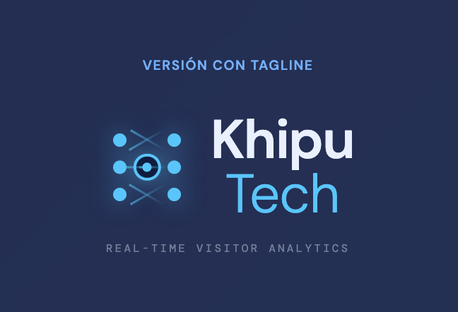
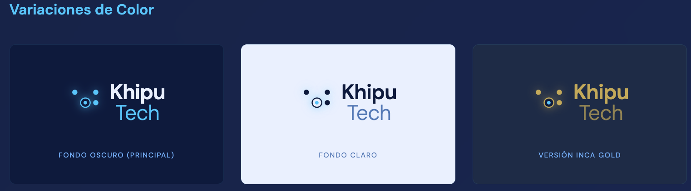
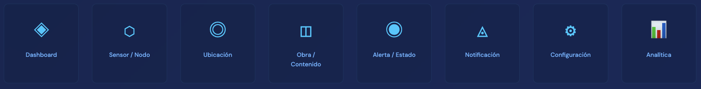
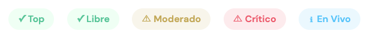
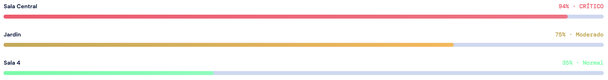
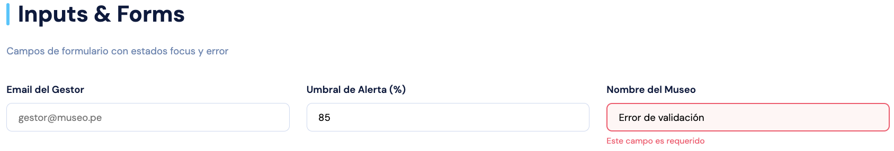
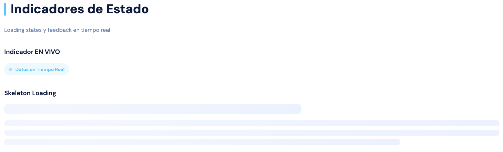

## Capítulo IV: Product Design

### 4.1. Style Guidelines

#### 4.1.1. General Style Guidelines

---

##### Branding

**Concepto de Marca:**

El nombre **"KhipuTech"** une el _Khipu_ (sistema de registro incaico basado en nudos) con la tecnología moderna. Visualmente, buscamos transmitir **conexión**, **datos** y **herencia cultural**.

El logotipo utiliza líneas minimalistas que emulen las cuerdas de un khipu, formando una **red o nodo** que simboliza los puntos de datos (sensores). Esta geometría representa la precisión del monitoreo en tiempo real y la herencia intelectual de sistemas de información ancestrales reencuadrados con tecnología contemporánea.

**Logotipo Principal:**


_Logotipo principal: Nodo central con ramificaciones conectadas, wordmark "Khipu" (peso 600) + "Tech" (peso 300)_

**Versión con Tagline:**



_Versión completa con tagline "REAL-TIME VISITOR ANALYTICS" en DM Mono, caps espaciado_

**Variaciones de Color:**



_De izquierda a derecha: Versión fondo oscuro (principal), fondo claro (navy), versión Inca Gold_

---

##### Typography

KhipuTech utiliza un sistema tipográfico dual que separa contenido editorial de datos técnicos.

**Familia Tipográfica Principal:**

- **DM Sans** — Títulos, navegación, cuerpo de texto general
  - Weights disponibles: 300 (Light), 400 (Regular), 500 (Medium), 600 (SemiBold), 700 (Bold)
    **Familia Tipográfica Técnica:**
- **DM Mono** — Datos numéricos, timestamps, códigos de sala, métricas de sensores
  - Weights disponibles: 400 (Regular), 500 (Medium)
    **Especificaciones:**


| Uso            | Familia | Weight  | Tamaño | Line Height | Letter Spacing | Aplicación                                    |
| -------------- | ------- | ------- | ------ | ----------- | -------------- | --------------------------------------------- |
| **Display**    | DM Sans | 700     | 48px   | 56px        | -1px           | Hero sections, títulos principales de landing |
| **H1**         | DM Sans | 700     | 32px   | 40px        | -0.5px         | Encabezados de página, títulos de dashboard   |
| **H2**         | DM Sans | 700     | 24px   | 32px        | -0.5px         | Secciones principales, títulos de cards       |
| **H3**         | DM Sans | 600     | 20px   | 28px        | 0px            | Subsecciones, títulos de componentes          |
| **H4**         | DM Sans | 600     | 18px   | 24px        | 0px            | Títulos de módulos pequeños                   |
| **Body Large** | DM Sans | 400     | 16px   | 24px (1.5)  | 0px            | Texto principal de landing page               |
| **Body**       | DM Sans | 400     | 14px   | 20px        | 0px            | Texto general de aplicación                   |
| **Body Small** | DM Sans | 400     | 12px   | 18px        | 0px            | Texto secundario, descripciones               |
| **Caption**    | DM Sans | 500     | 10px   | 14px        | 0.5px          | Labels, metadatos, badges                     |
| **Data/Code**  | DM Mono | 400-500 | 12px   | 18px        | 0px            | Valores numéricos, timestamps, IDs de sala    |

**Uso de DM Mono:**

La tipografía monoespaciada se reserva exclusivamente para:

- Valores de aforo (ej: "1,248 visitantes")
- Timestamps (ej: "14:32:08")
- IDs de sala (ej: "S3", "Sala-042")
- Métricas de sensores
- Códigos de color (ej: "#0B1A3E")
  Esto mantiene legibilidad óptima en tablas densas de datos y dashboards con información técnica.

---

##### Iconography

**Sistema de Iconos:**



_Sistema de iconos: Dashboard, Sensor/Nodo, Ubicación, Obra, Alerta, Notificación, Configuración, Analítica_

**Especificaciones Técnicas:**

Los iconos del sistema utilizan **Lucide Icons** con las siguientes características:

- **Stroke:** 2px (coherente con la geometría limpia del logo)
- **Estilo:** Outline sin relleno sólido
- **Tamaños:** 16px, 20px, 24px, 32px (según contexto)
- **Color:** Hereda del elemento padre o usa Electric Blue (#00C8FF) para estados activos
  **Iconos de Sensores y Zonas:**

Los iconos que representen sensores, zonas o puntos de conteo siguen la **estética de nodos conectados**, alineada al concepto del Khipu:

- Nodo central con ramificaciones
- Sin relleno sólido, solo trazo
- Geometría que sugiere precisión y monitoreo
  **Ejemplo de aplicación:**

```
Dashboard: ◈ (nodo con crosshair central)
Sensor: ⬡ (hexágono outline)
Ubicación: ◎ (círculo con punto central)
Alerta: ◉ (círculo con indicador)
```

Esta iconografía refuerza visualmente el mensaje de "red de datos" inherente a la marca KhipuTech.

---

##### Color Palette

**Paleta Principal:**


| Color             | HEX     | RGB           | CMYK           | Uso Principal                                             |
| ----------------- | ------- | ------------- | -------------- | --------------------------------------------------------- |
| **Dark Navy**     | #0B1A3E | 11, 26, 62    | 91, 80, 42, 45 | Texto principal, fondos oscuros, headers                  |
| **Electric Blue** | #00C8FF | 0, 200, 255   | 65, 5, 0, 0    | Acentos, CTAs, enlaces activos, indicadores en vivo       |
| **Ice Blue**      | #E8F0FF | 232, 240, 255 | 8, 4, 0, 0     | Fondos claros, texto sobre fondos oscuros                 |
| **Sky Blue**      | #62B1FF | 98, 177, 255  | 54, 24, 0, 0   | Hover states, elementos secundarios                       |
| **Steel Blue**    | #4A7ABA | 74, 122, 186  | 74, 49, 11, 1  | Elementos terciarios, bordes, texto muted                 |
| **Inca Gold**     | #C8A84B | 200, 168, 75  | 22, 31, 62, 21 | Estados de advertencia (moderado), logo en fondos oscuros |

**Colores Semánticos (uso en aplicación web):**

| Color       | HEX     | Aplicación                                        |
| ----------- | ------- | ------------------------------------------------- |
| **Success** | #2DFFA0 | Confirmaciones, estado libre/normal (<50% aforo)  |
| **Warning** | #FFB547 | Alertas moderadas, estado moderado (50-85% aforo) |
| **Danger**  | #FF4D6A | Errores, estado crítico (>85% aforo)              |
| **Info**    | #62B1FF | Información neutral, tooltips                     |

**Justificación Cromática:**

La paleta combina:

- **Navy profundo:** Autoridad técnica, confianza institucional
- **Cyan eléctrico:** Tecnología, datos en tiempo real, precisión digital
- **Inca Gold:** Herencia cultural peruana, calidez controlada en contextos de alerta
  Esta combinación evita el corporativismo genérico mientras mantiene seriedad técnica requerida por tomadores de decisión en instituciones culturales.

---

##### Logo Communication Tone

**Sustento de Decisiones de Diseño:**

|              Decisión de Diseño               | Señal de Tono                                                                             |
| :-------------------------------------------: | :---------------------------------------------------------------------------------------- |
|     **Paleta dark navy + cyan eléctrico**     | Entorno tecnológico, dashboards, datos. Evita lo corporativo genérico                     |
| **Geometría de nodos con crosshair central**  | Precisión, monitoreo, tracking. No decorativo sino funcional                              |
|       **Peso 600 / 300 en el logotipo**       | Autoridad sin rigidez. La palabra fuerte ("Khipu") ancla, la palabra ligera ("Tech") abre |
|         **Tagline en caps espaciado**         | Claridad directa, sin adornos. Habla de lo que hace, no de lo que aspira                  |
| **Referencia al khipu como sistema de datos** | Herencia intelectual + innovación. No es nostalgia, es reencuadre                         |

**Filosofía de Marca:**

> _"El tono no es entusiasta ni cercano porque KhipuTech vende a tomadores de decisión (museos, espacios públicos, gestores) que necesitan confiar en la exactitud del dato antes que en la calidez de la marca. La emoción viene después, cuando el dashboard funciona."_

La marca comunica:

- **Precisión técnica** sobre calidez emocional
- **Funcionalidad** sobre aspiración
- **Innovación cultural** sobre nostalgia decorativa
- **Datos confiables** sobre promesas de marketing
  Este enfoque resuena con directores de museos, curadores y administradores culturales que priorizan efectividad operativa sobre imagen corporativa convencional.

---

##### Logo Usage

**Reglas de Aplicación:**

**Área de Reserva:**

Se debe mantener un espacio mínimo de seguridad equivalente al **20% del ancho del logo** en todos sus lados para evitar interferencias visuales con otros elementos gráficos.

Esta área de reserva:

- Garantiza legibilidad en aplicaciones reducidas
- Previene saturación visual en composiciones densas
- Mantiene jerarquía visual del logotipo
  **Uso en Fondos:**

| Tipo de Fondo                                                | Versión de Logo           | Color             |
| ------------------------------------------------------------ | ------------------------- | ----------------- |
| **Fondos oscuros** (Navy #0B1A3E, azules profundos, negros)  | Inca Gold o Blanco        | #C8A84B o #FFFFFF |
| **Fondos claros** (Ice Blue #E8F0FF, blancos, grises claros) | Dark Navy                 | #0B1A3E           |
| **Fondos intermedios** (Blues #1A2B48)                       | Electric Blue o Inca Gold | #00C8FF o #C8A84B |

**Prohibiciones:**

**No se permite:**

- ❌ Deformar la relación de aspecto (estirar o comprimir)
- ❌ Cambiar los colores fuera de la paleta oficial
- ❌ Aplicar sombras paralelas internas
- ❌ Rotar el logo en ángulos no ortogonales
- ❌ Aplicar gradientes no autorizados
- ❌ Modificar el espaciado entre wordmark e icono
- ❌ Usar versiones de baja resolución en impresión
  **Tamaño Mínimo:**

Para garantizar legibilidad óptima:

- **Digital (pantallas):** 120px de ancho mínimo
- **Impreso:** 25mm de ancho mínimo
- **Favicon/App Icon:** Usar solo el icono del nodo (sin wordmark)
  **Versiones del Logo:**

1. **Principal:** Icono + Wordmark completo (uso general)
2. **Con Tagline:** Logo principal + "REAL-TIME VISITOR ANALYTICS" (landing page, presentaciones)
3. **Solo Icono:** Nodo de khipu aislado (favicon, app icons, redes sociales)
4. **Horizontal:** Wordmark a la derecha del icono (headers estrechos)
5. **Vertical:** Wordmark debajo del icono (formatos cuadrados)
   Cada versión tiene su archivo correspondiente en formatos SVG (web), PNG (presentaciones) y AI/EPS (impresión profesional).

---

**Referencia Visual Completa:**

Consultar el archivo interactivo [General Style Guide](../assets/deliverables/khiputech-general-style-guide.html) para visualización de todas las aplicaciones de marca y especificaciones técnicas detalladas.

#### 4.1.2. Web Style Guidelines

#### 4.1.2. Web Style Guidelines

Define los estándares visuales y de interacción para las interfaces web de KhipuTech, asegurando una experiencia óptima tanto en el Dashboard administrativo como en la Web App del visitante. Este diseño corresponde a una plataforma que revoluciona la gestión de espacios culturales mediante analítica en tiempo real e interacción digital con visitantes.

---

##### Descripción General

La interfaz de KhipuTech busca brindar a gestores de museos, administradores culturales y visitantes una experiencia clara, funcional y sin fricción. El dashboard administrativo optimiza la toma de decisiones mediante visualización de datos en tiempo real, mientras que la Web App del visitante facilita el acceso inmediato a contenido cultural mediante QR/NFC, sin necesidad de instalación o registro previo.

La plataforma se divide en tres experiencias principales:

1. **Landing Page** — Presentación institucional del producto para potenciales clientes
2. **Dashboard Administrativo** — Panel de control con analítica en tiempo real para gestores
3. **Web App del Visitante** — Experiencia móvil para acceso a contenido de obras durante el recorrido

---

##### 1. Pantalla Principal — Landing Page

**Header:**

- Logo de KhipuTech (esquina superior izquierda) — Nodo central con ramificaciones tipo khipu
- Menú de navegación con las opciones: **Características**, **Cómo Funciona**, **Casos de Uso**, **Precios**, **Contacto**
- Selector de idioma (español e inglés)
- Botón "Solicitar Demo" con color Electric Blue (#00C8FF)
  **Hero Section:**

Mostramos nuestra propuesta de valor con el mensaje central: **"Transforma la experiencia de tu museo con analítica en tiempo real"**

Contamos con dos botones claros para guiar al usuario (CTAs):

- **"Solicitar Demo"**: Llamado a la acción primario y directo (Electric Blue #00C8FF)
- **"Ver Características"**: Opción secundaria para usuarios que necesitan más información (Ghost button con borde Steel Blue)
  **Características Clave:**

Esta sección presenta las funcionalidades principales de KhipuTech y tiene como objetivo convencer al usuario de por qué debe elegir nuestra plataforma.

Beneficios clave presentados en tarjetas (cards), cada uno explicando una característica específica:

- **Analítica en Tiempo Real** — Visualiza el flujo de visitantes al instante
- **Interacción QR/NFC** — Contenido digital sin apps ni registros
- **Alertas Inteligentes** — Notificaciones automáticas por saturación de salas
- **Control de Aforo** — Gestión de capacidad según normativas
- **Dashboards Personalizables** — Métricas adaptadas a tu museo
- **Soporte Especializado** — Acompañamiento técnico continuo
  El botón **"Conocer Más"** es el paso clave que se quiere que el usuario realice.

**Cómo Funciona:**

En esta sección presentamos el flujo de uso de KhipuTech, dirigido específicamente a gestores culturales:

1. **Instalación de Sensores IoT** — Hardware de bajo costo en cada sala
2. **Dashboard en Tiempo Real** — Visualización instantánea de métricas
3. **Códigos QR en Obras** — Acceso inmediato a contenido para visitantes
4. **Analítica Histórica** — Reportes y tendencias para planificación
   **Casos de Uso:**

Presentamos ejemplos reales de instituciones que han transformado su gestión con KhipuTech:

- **Museo de Arte Contemporáneo** — Reducción de 40% en congestión de salas
- **Galería Nacional** — Incremento de 60% en interacción con obras
- **Centro Cultural Municipal** — Optimización de recursos en horarios pico
  Cada caso de uso incluye un botón **"Ver Caso Completo"** que redirige a un estudio detallado.

**Planes Diseñados para tu Escala:**

Se presentan tres planes escalonados con diferentes niveles de funcionalidad y precio:

- **Museo Pequeño** ($299/mes): Hasta 5 salas, 2000 visitantes/mes, soporte email
- **Museo Mediano** ($599/mes): Hasta 15 salas, 10,000 visitantes/mes, soporte prioritario — Etiquetado como **"Más Popular"**
- **Museo Grande** ($1,299/mes): Salas ilimitadas, visitantes ilimitados, API personalizada, soporte dedicado
  Cada plan incluye un botón **"Empezar Ahora"** para conversión inmediata.

**Call to Action Final:**

Esta sección actúa como el cierre final de la presentación, diseñado para convertir al visitante en cliente:

- **"Solicitar Demo Gratuita"**: Para usuarios decididos
- **"Hablar con Ventas"**: Para quienes necesitan consultoría antes de comprometerse
  **Footer:**

Proporciona navegación adicional e información institucional.

Estructura organizada en cuatro columnas temáticas:

- **Producto**: Características, Precios, Documentación Técnica, API
- **Empresa**: Sobre Nosotros, Equipo, Blog, Prensa
- **Soporte**: FAQ, Contacto, Centro de Ayuda, Estado del Sistema
- **Legal**: Términos de Servicio, Política de Privacidad, Cumplimiento GDPR
  Incluye enlaces a redes sociales y sello de certificaciones de seguridad (ISO 27001).

---

##### 2. Dashboard Administrativo

**Pantalla Principal — Métricas en Tiempo Real:**

El dashboard presenta KPIs clave en cards destacadas en la parte superior:

- **Visitantes Hoy** — Número total con comparativa vs. ayer (↑ 12%)
- **Interacciones QR/NFC** — Total de escaneos realizados
- **Permanencia Media** — Tiempo promedio por visitante (47 min)
- **Alertas Activas** — Número de salas en estado crítico (badge rojo si >0)
  Cada card usa **iconos de Lucide** con stroke 2px y colores semánticos:
- Verde (#2DFFA0) para métricas positivas
- Rojo (#FF4D6A) para alertas
- Cyan (#00C8FF) para datos neutrales
  **Gráficos de Afluencia:**

Visualización de datos mediante:

- **Gráfico de Barras** — Visitantes por hora del día (uso de gradientes Electric Blue)
- **Gráfico de Líneas** — Tendencia semanal de visitantes
- **Mapa de Calor** — Distribución de visitantes por sala con estados:
  - Verde: Ocupación normal (<50%)
  - Amarillo/Gold: Ocupación moderada (50-85%)
  - Rojo: Ocupación crítica (>85%)
    **Tabla de Obras Más Populares:**

Presenta un ranking de obras con mayor interacción:

| Obra            | Sala | Escaneos | Permanencia | Estado  |
| --------------- | ---- | -------- | ----------- | ------- |
| Sin título #042 | S3   | 892      | 4:30 min    | 🔥 Top  |
| Composición VII | S3   | 678      | 3:15 min    | ⬆ Alto  |
| Horizonte K     | S2   | 412      | 2:40 min    | — Medio |

La tabla usa **DM Mono** para valores numéricos y badges de estado con colores semánticos.

**Panel de Alertas:**

Muestra notificaciones en tiempo real:

```
🔴 Sala Central — CRÍTICO
188 / 200 visitantes · 94% capacidad · Hace 5 min
[Gestionar Alerta]

🟡 Jardín — MODERADO
376 / 500 visitantes · 75% capacidad · Hace 12 min
[Monitorear]
```

Cada alerta incluye:

- Icono de estado (círculo con color semántico)
- Título descriptivo (Bold DM Sans 14px)
- Detalles en DM Mono 12px
- Timestamp relativo
- Botón de acción contextual
  **Sidebar de Navegación:**

Menú lateral fijo (240px desktop, colapsable a 64px en tablet):

- **Dashboard** (icono ◈)
- **Afluencia** (icono ⬡)
- **Mapa de Salas** (icono ◎)
- **Obras** (icono ◫)
- **Ranking** (icono ◉)
- **Reportes** (icono ◬)
- **Configuración** (icono ⚙)
  El ítem activo se resalta con:
- Fondo cyan con opacidad 8%
- Borde izquierdo cyan 3px
- Texto Electric Blue (#00C8FF)

---

##### 3. Web App del Visitante

**Pantalla de Entrada — Escaneo QR/NFC:**

Pantalla inicial minimalista tras escanear código:

```
┌──────────────────────┐
│   Logo KhipuTech     │
│                      │
│   📸 Escaneando...   │
│   ▓▓▓▓░░░░░░        │
│   Cargando obra      │
└──────────────────────┘
```

**Tiempo de carga objetivo:** <3 segundos desde escaneo hasta visualización

**Detalle de Obra:**

Presentación del contenido multimedia de la obra:

- **Imagen principal** — Hero image de la obra (aspect ratio 4:3)
- **Título de la obra** — DM Sans Bold 24px, Dark Navy
- **Artista y fecha** — DM Sans Regular 14px, Steel Blue
- **Descripción** — DM Sans Regular 16px, line-height 1.6
- **Audio explicativo** — Player con controles simples (play/pause, progress bar)
- **Galería adicional** — Carousel horizontal con thumbnails
  **Obras Relacionadas:**

Cards deslizables (swipe horizontal) con:

```
┌─────────┐ ┌─────────┐ ┌─────────┐
│ [img]   │ │ [img]   │ │ [img]   │
│ Título  │ │ Título  │ │ Título  │
│ Sala S2 │ │ Sala S3 │ │ Sala S1 │
└─────────┘ └─────────┘ └─────────┘
```

Cada card tiene:

- Imagen thumbnail (180×180px)
- Título de la obra (DM Sans SemiBold 14px)
- Ubicación de sala (DM Mono 12px)
- Tap para navegar al detalle
  **Mapa del Museo:**

Vista simplificada de planta con:

- **Indicador "Estás aquí"** — Pin cyan con pulso animado
- **Salas con código de color:**
  - Verde: Baja ocupación
  - Amarillo: Ocupación moderada
  - Rojo: Alta ocupación (evitar)
- **Tap en sala** — Navega a lista de obras de esa sala
  **Gamificación — Sistema de Logros:**

Panel de progreso del visitante:

```
┌───────────────────────────┐
│ 🏆 Explorador Nivel 3     │
│ ▓▓▓▓▓▓▓▓░░ 850 / 1000 XP │
│                           │
│ 📊 Ranking Semanal        │
│ 1. Ana Torres    1,240 XP │
│ 2. Carlos Ruiz   1,180 XP │
│ 3. Tú            850 XP   │
└───────────────────────────┘
```

**Bottom Navigation (Mobile):**

Barra fija inferior con 4 iconos:

- **QR** — Escanear nueva obra
- **Obra** — Detalle actual
- **Mapa** — Plano del museo
- **Logros** — Gamificación
  Cada ícono tiene:
- Tamaño touch target: 44×44px
- Spacing: 8px entre íconos
- Color activo: Electric Blue (#00C8FF)
- Color inactivo: Steel Blue (#4A7ABA)

---

##### Grid & Spacing


**Sistema de Grid:**

- **Desktop (1025px+):** Grid de 12 columnas, ancho máximo contenedor 1440px
- **Tablet (481px - 1024px):** Grid de 8 columnas
- **Mobile (320px - 480px):** Grid de 4 columnas
  **Unidad Base de Espaciado:**

- Unidad base: **8px**
- Espaciados estándar: 8px, 16px, 24px, 32px, 40px, 48px, 64px
- Todos los márgenes y paddings son múltiplos de 8
  **Aplicación:**

```css
/* Ejemplo de espaciado modular */
.card {
  padding: 24px; /* 3 × 8px */
  margin-bottom: 32px; /* 4 × 8px */
  gap: 16px; /* 2 × 8px */
}
```

**Márgenes de contenedor:**

- Desktop: 40px laterales
- Tablet: 32px laterales
- Mobile: 16px laterales

---

##### UI Components


**Botones:**

| Variante      | Background  | Text    | Border      | Hover      | Uso                                     |
| ------------- | ----------- | ------- | ----------- | ---------- | --------------------------------------- |
| **Primary**   | #00C8FF     | #0B1A3E | None        | #62B1FF    | Solicitar Demo, CTAs principales        |
| **Secondary** | Transparent | #00C8FF | 1px #00C8FF | bg #E8F0FF | Ver Características                     |
| **Ghost**     | Transparent | #4A7ABA | None        | bg #E8F0FF | Navegación terciaria                    |
| **Danger**    | #FF4D6A     | #FFFFFF | None        | #FF6B82    | Gestionar Alerta, acciones destructivas |
| **Disabled**  | #CBD8F0     | #6B89B4 | None        | —          | Estado deshabilitado                    |

**Tamaños de botones:**

- **Large:** Height 48px, Padding 24px horizontal, Font 16px
- **Medium:** Height 40px, Padding 20px horizontal, Font 14px
- **Small:** Height 32px, Padding 16px horizontal, Font 12px

  

**Cards:**

| Tipo           | Background | Border      | Shadow                        | Padding | Uso                            |
| -------------- | ---------- | ----------- | ----------------------------- | ------- | ------------------------------ |
| **KPI Card**   | #FFFFFF    | 1px #CBD8F0 | 0 2px 8px rgba(11,26,62,0.08) | 24px    | Métricas principales dashboard |
| **Alert Card** | #FFF5F5    | 1px #FF4D6A | None                          | 16px    | Notificaciones críticas        |
| **Info Card**  | #F2F6FF    | None        | None                          | 20px    | Información contextual         |
| **Obra Card**  | #F2F6FF    | 1px #E8F0FF | 0 2px 4px rgba(11,26,62,0.04) | 16px    | Cards de obras relacionadas    |



**Badges de Estado:**

| Estado       | Background            | Text    | Uso                          |
| ------------ | --------------------- | ------- | ---------------------------- |
| **Top**      | rgba(45,255,160,0.12) | #00C896 | Obra más popular, completado |
| **Crítico**  | rgba(255,77,106,0.12) | #FF4D6A | Aforo >85%, alertas          |
| **Moderado** | rgba(200,168,75,0.12) | #C8A84B | Aforo 50-85%, pendiente      |
| **Normal**   | rgba(0,200,255,0.12)  | #00C8FF | Aforo <50%, información      |



**Barras de Progreso (Aforo):**

```css
/* Estado Crítico (>85%) */
.progress-critical {
  background: linear-gradient(90deg, #ff4d6a 0%, #ff6b82 100%);
}

/* Estado Moderado (50-85%) */
.progress-warning {
  background: linear-gradient(90deg, #c8a84b 0%, #ffb547 100%);
}

/* Estado Normal (<50%) */
.progress-normal {
  background: linear-gradient(90deg, #2dffa0 0%, #62ffb8 100%);
}
```


**Room-Cards (Mapa de Salas):**

Componente específico para visualización de distribución de visitantes:

```
┌───────────────┐
│ Sala Central  │
│   188 / 200   │
│   94% • 🔴   │
└───────────────┘
```

Estados visuales:

- **Crítico:** Border rojo 2px, background rgba(255,77,106,0.08)
- **Moderado:** Border amarillo 2px, background rgba(200,168,75,0.08)
- **Seguro:** Border verde 2px, background rgba(45,255,160,0.08)
  

**Inputs y Campos de Formulario:**

Estados de campos:

| Estado       | Border      | Background | Text    | Icon    |
| ------------ | ----------- | ---------- | ------- | ------- |
| **Default**  | 1px #CBD8F0 | #FFFFFF    | #0B1A3E | #6B89B4 |
| **Hover**    | 1px #4A7ABA | #FFFFFF    | #0B1A3E | #4A7ABA |
| **Focus**    | 2px #00C8FF | #FFFFFF    | #0B1A3E | #00C8FF |
| **Error**    | 2px #FF4D6A | #FFF5F5    | #0B1A3E | #FF4D6A |
| **Disabled** | 1px #CBD8F0 | #F2F6FF    | #6B89B4 | #CBD8F0 |


**Tablas de Datos:**

| Elemento        | Estilo                                                            |
| --------------- | ----------------------------------------------------------------- |
| **Header**      | Background `#0B1A3E`, Text `#E8F0FF`, Font DM Mono 10px uppercase |
| **Row (par)**   | Background `#F5F8FF`                                              |
| **Row (impar)** | Background `#EBF1FB`                                              |
| **Border**      | `1px #CBD8F0`                                                     |
| **Hover**       | Background `#E8F0FF`, Cursor pointer                              |

---

##### Responsive Breakpoints

**Breakpoints del Sistema:**

| Dispositivo | Rango          | Columnas Grid | Gutter | Margins |
| ----------- | -------------- | ------------- | ------ | ------- |
| **Mobile**  | 320px - 480px  | 4             | 16px   | 16px    |
| **Tablet**  | 481px - 1024px | 8             | 24px   | 32px    |
| **Desktop** | 1025px+        | 12            | 32px   | 40px    |

**Adaptaciones por Dispositivo:**

**Mobile (320-480px):**

- Navegación: Bottom navigation bar (4 items)
- Cards: Stack vertical, width 100%
- Typography: Reducir H1 a 24px, Body a 14px
- Spacing: Reducir a 12px/16px/24px
- Sidebar: Oculto, accesible via hamburger menu
  **Tablet (481-1024px):**
- Navegación: Sidebar colapsada a iconos (64px)
- Cards: Grid 2 columnas
- Typography: Mantener escala base
- Spacing: Escala estándar
- Touch targets: Mínimo 44px
  **Desktop (1025px+):**
- Navegación: Sidebar completa (240px)
- Cards: Grid 3-4 columnas
- Typography: Escala completa
- Hover states: Activados
- Max width: 1440px centrado

---

##### Interacción & Feedback


**Animaciones y Transiciones:**

| Elemento               | Propiedad               | Duration | Easing                         | Uso                     |
| ---------------------- | ----------------------- | -------- | ------------------------------ | ----------------------- |
| **Button Hover**       | `background, color`     | 200ms    | `ease-out`                     | Feedback inmediato      |
| **Card Hover**         | `transform, box-shadow` | 300ms    | `ease-in-out`                  | Elevación sutil         |
| **Page Transition**    | `opacity, transform`    | 400ms    | `cubic-bezier(0.4, 0, 0.2, 1)` | Cambio de vista         |
| **Toast Notification** | `slide-in, opacity`     | 300ms    | `ease-out`                     | Entrada de notificación |
| **Skeleton Loading**   | `shimmer`               | 1500ms   | `linear infinite`              | Estado de carga         |



**Loading States:**

```css
/* Skeleton Screen */
.skeleton {
  background: linear-gradient(90deg, #e8f0ff 0%, #f2f6ff 50%, #e8f0ff 100%);
  background-size: 200% 100%;
  animation: shimmer 1.5s ease-in-out infinite;
}

@keyframes shimmer {
  0% {
    background-position: -200% 0;
  }
  100% {
    background-position: 200% 0;
  }
}
```

**Indicadores de Estado:**

| Indicador        | Animación                   | Uso                  |
| ---------------- | --------------------------- | -------------------- |
| **EN VIVO**      | Pulso cyan 1.5s infinite    | Datos en tiempo real |
| **Spinner**      | Rotación 1s linear infinite | Carga general        |
| **Progress Bar** | Indeterminate slide 2s      | Proceso en curso     |
| **Skeleton**     | Shimmer 1.5s                | Carga de contenido   |


**Toast Notifications:**

| Tipo        | Icon | Background | Duration |
| ----------- | ---- | ---------- | -------- |
| **Success** | ✓    | #2DFFA0    | 3s       |
| **Error**   | ✗    | #FF4D6A    | 5s       |
| **Warning** | ⚠    | #FFB547    | 4s       |
| **Info**    | ℹ    | #00C8FF    | 3s       |

**Tooltips:**

```css
.tooltip {
  background: #0b1a3e;
  color: #e8f0ff;
  font-size: 12px;
  padding: 8px 12px;
  border-radius: 4px;
  box-shadow: 0 4px 12px rgba(11, 26, 62, 0.2);
  max-width: 200px;
}
```

---

##### Accessibility Standards

**Contraste WCAG AA/AAA:**

Todos los pares de color cumplen con WCAG AA (mínimo 4.5:1 para texto normal, 3:1 para texto grande).

| Par de Colores       | Ratio  | Nivel WCAG |
| -------------------- | ------ | ---------- |
| Navy + Ice Blue      | 14.8:1 | AAA ✅     |
| Navy + Electric Blue | 8.5:1  | AAA ✅     |
| Navy + White         | 15.2:1 | AAA ✅     |
| Steel Blue + White   | 4.9:1  | AA ✅      |

**Justificación del contraste Navy+Cyan (8.5:1):**  
Ideal para salas con luz tenue, garantiza legibilidad en ambientes de museo con iluminación controlada donde los visitantes interactúan con dispositivos móviles.

**Touch Targets:**

- Mínimo: **44px × 44px** (WCAG 2.1 Level AAA)
- Spacing entre targets: Mínimo **8px**
  **Focus States:**
- Outline visible en todos los elementos interactivos
- Color: `#00C8FF` (Electric Blue)
- Width: `2px`
- Offset: `2px`
  **Keyboard Navigation:**
- Tab order lógico siguiendo flujo visual
- Skip links para navegación rápida a contenido principal
- Focus trap en modales y overlays
- Escape key cierra overlays y modales

---

##### Design Tokens

**Tokens CSS Variables:**

```css
:root {
  /* Colors */
  --color-primary: #00c8ff;
  --color-navy: #0b1a3e;
  --color-ice: #e8f0ff;
  --color-sky: #62b1ff;
  --color-steel: #4a7aba;
  --color-gold: #c8a84b;

  /* Semantic */
  --color-success: #2dffa0;
  --color-warning: #ffb547;
  --color-danger: #ff4d6a;
  --color-info: #62b1ff;

  /* Spacing */
  --spacing-xs: 8px;
  --spacing-sm: 16px;
  --spacing-md: 24px;
  --spacing-lg: 32px;
  --spacing-xl: 48px;
  --spacing-2xl: 64px;

  /* Typography */
  --font-sans: "DM Sans", sans-serif;
  --font-mono: "DM Mono", monospace;

  /* Border Radius */
  --radius-sm: 4px;
  --radius-md: 8px;
  --radius-lg: 12px;

  /* Shadows */
  --shadow-sm: 0 2px 4px rgba(11, 26, 62, 0.08);
  --shadow-md: 0 4px 12px rgba(11, 26, 62, 0.12);
  --shadow-lg: 0 8px 24px rgba(11, 26, 62, 0.16);

  /* Transitions */
  --transition-fast: 200ms ease-out;
  --transition-base: 300ms ease-in-out;
  --transition-slow: 400ms cubic-bezier(0.4, 0, 0.2, 1);
}
```

---

**Referencia Visual Completa:**  
Consultar el archivo interactivo [Web Style Guide](../assets/deliverables/khiputech-web-style-guide.html) para visualización de todos los componentes en acción con hover states y animaciones funcionales.

#### 4.2. Information Architecture
Esta sección describe la estructura de la información, estilos y sistemas que se utilizarán en la plataforma web de KhipuTech. Se consideran los sistemas de organización, etiquetado, búsqueda, navegación y SEO, con el fin de garantizar una experiencia clara y enfocada en la visualización de datos.

#### 4.2.1. Organization Systems

Tópico | Definición  
---|---  
Home | La página de inicio muestra una vista general del sistema, destacando métricas clave y accesos rápidos al dashboard.  
Dashboard | La página principal de análisis donde se visualizan datos en tiempo real del flujo de visitantes.  
Sensores | La página donde se visualizan y gestionan los dispositivos IoT instalados en el recinto.  
Zonas | La página que representa las áreas monitoreadas mediante mapas o nodos conectados.  
Reportes | La página que permite visualizar análisis históricos y exportar datos.  
Contact | La página que permite a los usuarios comunicarse con soporte técnico.  
Log In | La página donde el usuario puede iniciar sesión o registrarse para acceder al sistema.  


### Página de Dashboard  

Tópico | Definición  
---|---  
Métricas en tiempo real | Muestra datos actualizados sobre flujo y permanencia de visitantes.  
Visualización gráfica | Presenta gráficos y diagramas para facilitar la interpretación de datos.  


### Página de Sensores  

Tópico | Definición  
---|---  
Lista de sensores | Muestra todos los dispositivos IoT activos en el sistema.  
Estado de sensores | Indica el funcionamiento y estado de cada sensor.  


### Página de Reportes  

Tópico | Definición  
---|---  
Lista de reportes | Muestra los reportes generados por el sistema.  
Detalles de reportes | Permite visualizar análisis detallados y exportar información.  


### Página de Contact  

Proporciona información de contacto y soporte técnico para consultas.  

Tópico | Definición  
---|---  
Formulario de contacto | Permite enviar consultas directamente al equipo de soporte.  
Información de contacto | Muestra canales como correo o asistencia técnica.  


### Registro y autenticación  

La página permite a los usuarios acceder al sistema mediante credenciales seguras o registrarse como nuevos usuarios.  


### Otras páginas y funciones  

Tópico | Definición  
---|---  
Perfil de usuario | Permite gestionar la información personal y accesos del usuario.  
Configuraciones | Permite ajustar preferencias del sistema y parámetros de visualización.  
Página acerca de nosotros | Información sobre KhipuTech y su propuesta tecnológica.  
Ayuda y soporte | Recursos de ayuda, preguntas frecuentes y asistencia técnica.  


Barra de navegación:  
Una barra de navegación clara y consistente en la parte superior permite acceder a las secciones principales del sistema.  

Responsive design:  
La plataforma se adapta a dispositivos de escritorio y móviles, manteniendo la claridad en la visualización de datos.  


#### 4.2.2. Labeling Systems

Para los sistemas de etiquetado, se organiza el contenido mediante encabezados claros que agrupan las secciones disponibles dentro de la plataforma. Esto permite al usuario identificar fácilmente dónde acceder.  

Tópico | Definición  
---|---  
Home | Sección principal donde el usuario visualiza el resumen general del sistema.  
Dashboard | Sección donde se muestran métricas en tiempo real.  
Sensores | Sección donde se gestionan los dispositivos IoT.  
Zonas | Sección donde se visualizan las áreas monitoreadas.  
Reportes | Sección donde se consultan análisis e información histórica.  
Contacto | Sección donde el usuario puede comunicarse con soporte técnico.  

#### 4.2.3. SEO Tags and Meta Tags

- **Landing Page**
  Esta página está optimizada para que los directores, gestores y curadores de museos encuentren la solución en Google.

  - _Título:_ KhipuTech | Analítica de Bajo Costo para Museos y Galerías

  - _Descripción:_ Transforma tu museo con analítica de visitantes en tiempo real. Sensores IoT de bajo costo y experiencias interactivas mediante QR sin suscripciones mensuales.
  - _Intenciones de Búsqueda:_ analítica de museos, conteo de personas, sensores IoT perú, gestión cultural digital, métricas de exhibición.

  - _Autor:_ KhipuTech Team.

```html
<title>KhipuTech | Analítica de Bajo Costo para Museos y Galerías</title>
<meta
  name="description"
  content="Transforma tu museo con analítica de visitantes en tiempo real. Sensores IoT de bajo costo y experiencias interactivas sin suscripciones mensuales."
/>
<meta
  name="keywords"
  content="analítica de museos, conteo de personas, sensores IoT perú, gestión cultural digital, métricas de exhibición"
/>
<meta name="author" content="KhipuTech Team" />

<meta property="og:title" content="KhipuTech | Digitalización Cultural" />
<meta
  property="og:description"
  content="Mide el flujo de visitantes y mejora el engagement en tu galería."
/>
<meta property="og:image" content="https://khiputech.com/assets/og-image.png" />
<meta property="og:url" content="https://khiputech.com" />
```

- **Web Application**
  Esta página está optimizada para la funcionalidad y la carga rápida en dispositivos móviles.

  - _Título:_ KhipuTech | Analítica de Bajo Costo para Museos y Galerías
  - _Descripción 1:_ Descubre cómo KhipuTech ayuda a museos medianos a medir el flujo de visitantes con hardware de bajo costo.
  - _Descripción 2:_ Mejora el engagement de tu galería con contenido interactivo mediante QR y analítica de datos precisa.
  - _Descripción 3:_ Optimiza el aforo y la seguridad de tu centro cultural con nuestra solución de analítica de guerrilla.

  - _Intenciones de Búsqueda:_ dashboard interactivo, flujo de visitantes, métricas en tiempo real, gestión de sala.
  - _Autor:_ KhipuTech Software Division.

```html
<title id="dynamic-title">KhipuTech App | Dashboard</title>
<meta
  name="description"
  id="dynamic-desc"
  content="Panel de control de sensores y gestión de contenido interactivo."
/>
<meta name="author" content="KhipuTech Software Division" />
<meta name="robots" content="noindex, nofollow" />
```

#### 4.2.4. Searching Systems

KhipuTech maneja dos tipos de usuarios con necesidades de búsqueda distintas: el gestor/administrador que busca entre grandes volúmenes de datos analíticos, y el visitante que busca contenido de obras dentro del museo. Cada contexto tiene su propio sistema de búsqueda.

- **Búsqueda Global (Dashboard Administrativo):**

  Ubicada en la topbar, accesible desde cualquier vista del dashboard. Permite al administrador localizar salas, obras, reportes o métricas sin navegar por el menú.

  **Comportamiento**

  - Se activa con clic
  - Muestra resultados en tiempo real
  - Agrupa resultados por categoría: Salas, Obras, Reportes, Alertas

- **Filtros del Dashboard (Analítica y Afluencia)**

  Visibles en la topbar del boceto como selector de rango de fechas. Permiten acotar los datos mostrados en tablas, gráficos y rankings.
  | Filtro | Opciones | Ubicación en Mockups|
  | :--- | :--- | :---: |
  |**Rango de fechas**|Hoy / Esta semana / Este mes / Rango personalizado|Topbar|
  |**Sala / Zona**|Todas las salas / Sala Inca / Sala Virreinal / Sala Republicana / Sala Contemporánea|Header de sección|
  |**Tipo de contenido**|Todos / QR / NFC / Audio / Video / Imagen|Panel analítica|
  |**Estado de aforo**|Todos / Normal / Atención / Crítico|Panel afluencia|
  |**Exportación**|CSV / Excel · aplica los filtros activos|Botón topbar|

- **Ordenamiento en Tablas**

  La tabla de Top obras por interacción visible en el boceto permite al gestor reordenar segun distintos criterios. El criterio activo se indica con una fecha direccional junto al encabezado de columna.

  |         Criterio          |          Orden Default           |     Indicador Visual     |
  | :-----------------------: | :------------------------------: | :----------------------: |
  |    **Número de scans**    |   Descendente (mayor a menor)    |  Flecha abajo activa ⬇️  |
  | **Tiempo de permanencia** | Descendente (mas tiempo primero) |  Flecha abajo activa ⬇️  |
  |         **Sala**          |         Alfabético A - Z         | Flecha arriba activa ⬆️  |
  | **Estado de interacción** |         Alta>Media>Baja          | Badget de color ordenado |

- **Búsqueda de Obras**

  En la interfaz del visitante, accesible tras escanear un QR, la búsqueda se simplifica al mínimo para no interrumpir el recorrido:

  - _Barra de búsqueda:_ Por nombre de obra en la parte superior del interfaz.
  - _Filtro por sala:_ Mediante chips horizontales deslizables.
  - _Filtro por tipo:_ Chips contenido Audio, Video, Texto, Multimedia.

- **Límites del Sistema de Búsqueda**

  Para evitar sobrecarga cognitiva, KhipuTech no expone búsqueda de texto libre sobre datos crudos de sensores. Los sensores solo son consultables a través de los filtros estructurados de sala y fecha. Esto mantiene la interfaz orientada a decisiones, no a exploración técnica.

- **Resumen de Sistemas de Búsqueda**

  | Sistema                |   Usuario    |           Tipo           |     Filtros Principales     |
  | :--------------------- | :----------: | :----------------------: | :-------------------------: |
  | **Búsqueda Global**    | Gestor/Admin | Texto Libre + Categorias |    Salas, Obras, Alertas    |
  | **Filtros Dashboard**  | Gestor/Admin |  Filtros Estructurados   |  Fecha, Sala, Tipo, Estado  |
  | **Ordenamiento Tabla** | Gestor/Admin |   Click en Encabezado    | Scans, Tiempo, Sala, Estado |
  | **Búsqueda de Obras**  |  Visitante   |      Texto + Chips       |   Sala, Tipo de Contenido   |

#### 4.2.5. Navigation Systems

Explica las acciones y técnicas que guiarán a los Usuarios a traves del Landing Page y las aplicaciones, permitiendoles cumplir sus metas e interactuar de forma satisfactoria con el producto digital.

- **Superficies y Patrones de Navegación**

  | Superficie            |           Usuario            |          Patron Inicial          |        Patron Secundario        |
  | :-------------------- | :--------------------------: | :------------------------------: | :-----------------------------: |
  | **Landing Page**      | Visitante Potencial / Gestor |    Scroll lineal descendente     | Anclar (Anchor links) en navbar |
  | **Dashboard Admin**   |    Gestor / Administrador    | Sidebar fija + contenido central |        Breadcrumb + tabs        |
  | **Web App Visitante** |     Visitante del museo      |        Bottom nav mobile         |     Chips de filtro + Cards     |

  - _Landing Page — Navegacion Publica:_ La Landing Page usa scroll lineal descendente como tecnica principal. El usuario recorre las secciones de arriba hacia abajo sin necesidad de conocer la arquitectura del sitio. Una navbar fija con anchor links permite saltar directamente a cualquier seccion desde cualquier punto del scroll.

    - Navbar fija (sticky): Visible en todo momento. Contiene logo, anchor links a cada seccion y boton CTA primario 'Solicitar demo'. En mobile se colapsa en menu hamburguesa.

    - Scroll lineal: Las secciones se presentan en orden narrativo: problema -> solucion -> caracteristicas -> prueba social -> precio -> llamada a la accion.

    - Anchor links: Cada item del navbar hace scroll suave (smooth scroll) hacia la seccion correspondiente. La seccion activa se resalta en el navbar con subrayado cyan #00C8FF.

    - CTA flotante: Boton 'Solicitar demo' fijo en esquina inferior derecha en desktop. Aparece despues de que el usuario scrollea mas del 30% de la pagina.

    - Footer de navegacion: Repite los enlaces principales y agrega links secundarios (Politica de privacidad, Terminos, Contacto).

  - _Dashboard Administrativo — Navegacion por Sidebar:_ El Dashboard usa una sidebar fija de navegacion vertical como patron principal, visible en el boceto. Permite al gestor acceder a cualquier modulo sin perder el contexto de donde se encuentra. El patron secundario es el breadcrumb en la topbar, que indica la ruta exacta dentro del sistema.

        | Elemento      | Descripcion | Comportamiento de interaccion |
        | :------------ | :---------- | :---------------------------- |
        | Sidebar fija  | 240px de ancho. Agrupa items en secciones: Principal, Analitica, Contenido, Sistema. | |
        | **Breadcrumb** | En la topbar. Muestra ruta completa: KhipuTech > Analítica > Interacciones. | Cada nivel es clickeable y regresa al nivel superior. Separador chevron icon 12px. |
        | **Tabs internos** | Dentro de vistas con sub-secciones (ej: Hoy / Semana / Mes en gráficos). | Tab activo: pill con fondo cyan 15% y texto cyan. Transición instantánea de contenido. |

  - _Web App del Visitante — Navegacion Mobile-First:_ La Web App está diseñada para ser usada en movilidad dentro del museo. El patrón principal es la **navegación por cards** tras escanear un QR o NFC. Sidebar con 4 items: Escanear QR/NFC, Detalle de obra, Mapa de recorrido, Logros y XP.

    | Elemento               | Descripción                                                                  | Comportamiento                                                                     |
    | :--------------------- | :--------------------------------------------------------------------------- | :--------------------------------------------------------------------------------- |
    | **Entrada por QR/NFC** | El punto de entrada principal. No requiere navegación previa ni login.       | Carga el contenido de la obra en menos de 3 segundos directamente en el navegador. |
    | **Panel de obra**      | Detalle multimedia (imagen, audio, video) + obras relacionadas.              | Cards deslizables con filtro por sala. Historial de obras recientes.               |
    | **Mapa del museo**     | Vista de planta simplificada. Indica sala actual del visitante y congestión. | Tap en sala navega a las obras. Zonas en rojo indican alta ocupación.              |
    | **Gamificación**       | Ranking semanal de visitantes con sistema de XP y niveles.                   | Visualización de logros desbloqueados y progreso hacia siguiente nivel.            |

  - _Principios de Navegación KhipuTech:_
    - Máximo 3 clics: Cualquier acción o dato desde el Dashboard.
    - Máximo 2 taps (visitante): Nunca más de 2 taps para contenido de obra.
    - Contexto siempre visible: Breadcrumb en dashboard, indicador de panel activo en sidebar.
    - Sin login obligatorio: Web App del visitante accesible de forma inmediata.
    - Estado activo siempre señalado: Item activo resaltado con color cyan #00C8FF.

#### 4.3. Landing Page UI Design

#### 4.3.1. Landing Page Wireframe

#### 4.3.2. Landing Page Mock-up

### 4.4. Web Applications UX/UI Design

#### 4.4.1. Web Applications Wireframes

#### 4.4.2. Web Applications Wireflow Diagrams

#### 4.4.3. Web Applications Mock-ups

##### Descripción general

El mock-up presentado corresponde al Dashboard de monitoreo general del sistema, diseñado para administradores del museo. Su objetivo principal es ofrecer una visión centralizada, en tiempo real, del comportamiento de los visitantes, el uso de las exhibiciones y el estado operativo del museo.

Este diseño responde a las épicas relacionadas con:

- Analítica (EP02, EP06)
- Operación (EP03, EP04)
- Alertas inteligentes (US51)

#### Principios de diseño aplicados

#### 1. Jerarquía visual

Se prioriza la información más relevante en la parte superior:

- KPIs principales (visitantes, interacciones, permanencia, alertas)
- Luego gráficos y análisis
- Finalmente detalles (tablas y alertas)

#### 2. Consistencia

- Uso uniforme de colores (azules oscuros + acentos)
- Tipografía homogénea
- Componentes reutilizables (cards, tablas, alertas)

#### 3. Feedback visual

- Indicadores de crecimiento (+12%, +7%)
- Colores de estado:
  - 🔴 Saturación
  - 🟡 Atención
  - 🟢 Normal

#### 4. Minimalismo funcional

Se evita saturar la interfaz:

- Solo métricas clave visibles
- Espacios amplios
- Separación clara por secciones

#### Elementos de diseño

#### Cards de métricas (KPIs)

Ubicadas en la parte superior:

- Visitantes
- Interacciones QR/NFC
- Tiempo de permanencia
- Alertas activas

#### Gráfico de afluencia por hora

- Visualiza entradas y salidas
- Permite detectar picos de tráfico

####  Ocupación por sala

Panel lateral con:

- Capacidad vs ocupación
- Estado visual (color + etiqueta)

#### Alertas recientes

Lista de eventos relevantes:

- Aforo crítico
- Umbrales superados
- Baja interacción


#### Diseño inclusivo

El sistema considera accesibilidad mediante:

- Contraste alto (modo oscuro)
- Tipografía legible
- Uso de colores + texto (no solo color)
- Información jerárquica clara

Mejora la experiencia para:

- usuarios con fatiga visual
- entornos con poca iluminación
- distintos perfiles de usuarios

#### Arquitectura de la información

La navegación lateral está organizada en:

#### 1. Principal

- Dashboard
- Afluencia en vivo
- Mapa de salas

#### 2. Analítica

- Interacciones
- Permanencia
- Tendencias
- Exportar reportes

#### 3. Contenido

- QR / NFC
- Obras

#### 4. Sistema

- Acceso y roles
- Configuración

#### Relación con el Design System

El mock-up evidencia un sistema de diseño consistente:

#### Paleta:

  - Azul oscuro (base)
  - Verde (positivo)
  - Amarillo (advertencia)
  - Rojo (crítico)

#### Componentes reutilizables:

  - Cards
  - Tabs (Hoy / Semana / Mes)
  - Listas
  - Indicadores de estado
  - Espaciado uniforme
  - Bordes redondeados (modern UI)
#### Valor del diseño

Este dashboard permite:

- Monitoreo en tiempo real
- Toma de decisiones basada en datos
- Detección de problemas (aforo, interacción)
- Optimización de la experiencia del visitante

#### 4.4.4. Web Applications User Flow Diagrams

#### USER FLOW 1 — Visitante accede a contenido

#### User Persona

Visitante del museo

#### User Goal

Acceder al contenido digital de una obra de forma rápida y sin fricción.

#### 🟢 Happy Path

1. Escanea QR
2. Se abre contenido en navegador
3. Visualiza contenido multimedia
4. Navega a otra obra (opcional)

#### 🔴 Unhappy Paths

- QR inválido → “Contenido no disponible”
- Sin internet → mensaje de error
- Dispositivo no compatible → fallback

#### Pantallas involucradas

- Vista QR
- Vista contenido

#### Explicación

El flujo inicia cuando el visitante escanea un código QR ubicado en la obra. El sistema redirige automáticamente a una vista web donde se presenta contenido multimedia. El usuario puede explorar información adicional o navegar a otras obras. En caso de errores, el sistema muestra mensajes claros para mantener la experiencia.

#### 🟣 USER FLOW 2 — Administrador monitorea el museo

#### User Persona

Administrador del museo

#### User Goal

Supervisar en tiempo real el estado del museo para tomar decisiones rápidas.

#### 🟢 Happy Path

1. Accede al sistema
2. Ingresa al dashboard
3. Visualiza métricas principales
4. Revisa ocupación por sala
5. Identifica alertas
6. Toma decisión

#### 🔴 Unhappy Paths

- Datos no cargan → mensaje de error
- Sin datos → estado vacío
- Error en sensores → alerta técnica

#### Pantallas involucradas

- Dashboard

#### Explicación

El flujo comienza cuando el administrador accede al sistema y visualiza el dashboard principal. Este presenta métricas clave como afluencia, interacción y alertas. El usuario puede identificar rápidamente situaciones críticas y tomar decisiones operativas. En caso de fallos en los datos, el sistema informa el problema sin afectar la navegación.

#### 🟡 USER FLOW 3 — Acceso con suscripción

#### User Persona

Visitante recurrente

#### User Goal

Acceder a contenido premium sin restricciones mediante suscripción.

#### 🟢 Happy Path

1. Usuario accede al contenido
2. Sistema valida suscripción
3. Acceso permitido
4. Navega libremente

#### 🔴 Unhappy Paths

- Suscripción vencida → pedir renovación
- No suscrito → acceso limitado
- Error de validación → mensaje

#### Pantallas involucradas

- Vista contenido
- Pantalla de acceso/restricción

#### Explicación

El flujo inicia cuando el visitante intenta acceder a contenido digital. El sistema valida si cuenta con una suscripción activa. Si es válida, el acceso es ilimitado; de lo contrario, se restringe y se invita a renovar. Esto permite implementar un modelo de acceso controlado y monetización del contenido.

### 4.5. Web Applications Prototyping

#### 4.6. Domain-Driven Software Architecture

### 4.6.1. Design-Level Event Storming.

#### 4.6.2. Software Architecture Context Diagram

#### 4.6.3. Software Architecture Container Diagrams

#### 4.6.4. Software Architecture Components Diagrams

### 4.7. Software Object-Oriented Design

#### 4.7.1. Class Diagrams

### 4.8. Database Design

#### 4.8.1. Database Diagram

---
