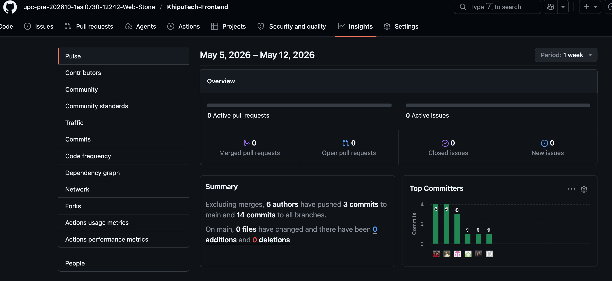
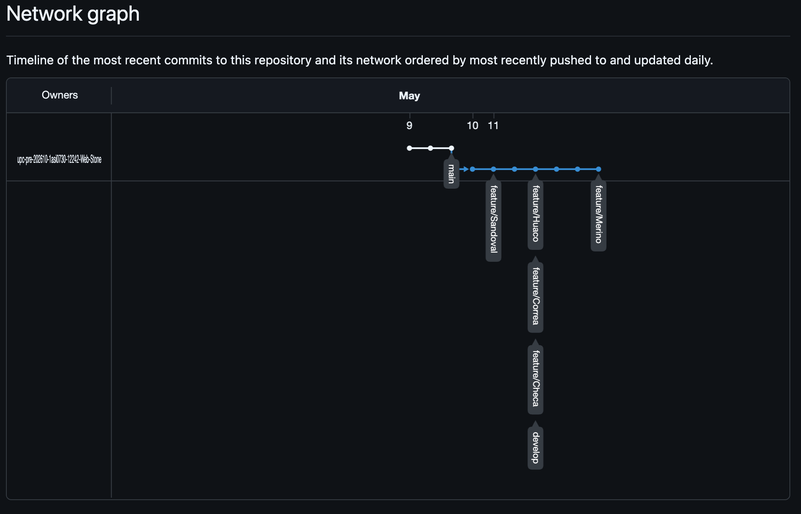

## Capítulo V: Product Implementation, Validation & Deployment

### 5.1. Software Configuration Management

#### 5.1.1. Software Development Environment Configuration

| Producto           | Propósito en el proyecto                                 | Categoría                       | Ruta de descarga / acceso                       | Descripción                                                                                                   |
| ------------------ | -------------------------------------------------------- | ------------------------------- | ----------------------------------------------- | ------------------------------------------------------------------------------------------------------------- |
| HTML5              | Estructura base de las páginas web del sistema.          | Frontend Development            | https://developer.mozilla.org/es/docs/Web/HTML  | Lenguaje de marcado utilizado para definir la estructura y contenido de las páginas web.                      |
| CSS3               | Diseño visual y estilos de la interfaz de usuario.       | Frontend Development            | https://developer.mozilla.org/es/docs/Web/CSS   | Lenguaje utilizado para definir la presentación visual, incluyendo colores, layouts y diseño responsivo.      |
| Vue.js             | Desarrollo de interfaces dinámicas e interactivas.       | Frontend Development            | https://vuejs.org/guide/introduction.html       | Framework progresivo de JavaScript para construir interfaces de usuario de forma eficiente.                   |
| JetBrains WebStorm | Desarrollo y edición del código del frontend.            | Software Development            | https://www.jetbrains.com/webstorm/             | IDE especializado en desarrollo web con soporte para JavaScript, TypeScript y frameworks modernos.            |
| Git CLI (Git)      | Control de versiones y gestión de cambios en el código.  | Version Control                 | https://git-scm.com/                            | Sistema de control de versiones distribuido que permite trabajar con ramas y mantener historial del proyecto. |
| GitHub             | Almacenamiento y trabajo colaborativo del código fuente. | Collaboration & Version Control | https://github.com/                             | Plataforma para alojar repositorios, gestionar versiones y colaborar en equipo.                               |
| MySQL Workbench    | Diseño y gestión de la base de datos del sistema.        | Database Management             | https://dev.mysql.com/downloads/workbench/      | Herramienta visual para modelar bases de datos, ejecutar consultas SQL y administrar servidores MySQL.        |
| Docker Desktop     | Contenerización del sistema para facilitar despliegues.  | DevOps / Containerization       | https://www.docker.com/products/docker-desktop/ | Plataforma que permite crear y ejecutar contenedores, asegurando entornos consistentes.                       |
| Swagger UI         | Documentación y prueba de la API del sistema.            | API Documentation               | https://swagger.io/tools/swagger-ui/            | Herramienta que permite visualizar y probar endpoints de APIs REST de forma interactiva.                      |
| Structurizr        | Modelado de arquitectura basado en C4.                   | Software Architecture           | https://structurizr.com/                        | Herramienta para documentar y visualizar la arquitectura del sistema mediante el modelo C4.                   |
| UXPressia          | Diseño de experiencia de usuario (journeys y personas).  | UX/UI Design                    | https://uxpressia.com/                          | Plataforma para crear mapas de experiencia del usuario y analizar interacciones.                              |

#### 5.1.2. Source Code Management

El proyecto KhipuTech, desarrollado por el startup WebStone, consiste en una plataforma SaaS orientada a la analítica de flujo de visitantes y la gestión de contenido interactivo en museos y centros culturales. Este sistema se construye bajo un enfoque profesional que prioriza buenas prácticas de desarrollo, trabajo colaborativo y una arquitectura escalable, permitiendo integrar componentes de software con dispositivos IoT de bajo costo.

La configuración del entorno de desarrollo se basa en principios de separación de responsabilidades y modularidad, tomando como referencia el modelo C4 (Context, Container, Component, Code). Esto permite estructurar el sistema en diferentes capas, facilitando su mantenimiento, evolución y comprensión por parte del equipo. Asimismo, se busca garantizar la escalabilidad del proyecto, considerando futuras integraciones con sensores y servicios en tiempo real.

Para el desarrollo frontend, el equipo utiliza WebStorm como entorno principal, lo que permite mantener una configuración homogénea entre los integrantes. Este IDE ofrece soporte completo para tecnologías web modernas y facilita tareas como la navegación del código, depuración, refactorización y gestión de dependencias. Además, se integra de manera eficiente con Vue.js, framework seleccionado para la construcción de la interfaz de usuario.

El uso de Vue.js permite desarrollar una interfaz dinámica basada en componentes reutilizables, favoreciendo una arquitectura modular. Gracias a su enfoque reactivo, se logra una mejor gestión del estado de la aplicación y una experiencia de usuario más fluida. Esta estructura también facilita el trabajo paralelo del equipo, permitiendo dividir responsabilidades sin afectar la coherencia del sistema.

En cuanto al control de versiones y colaboración, el equipo utiliza Git junto con GitHub, lo que permite gestionar cambios, trabajar con ramas y mantener un historial organizado del desarrollo. El repositorio principal del proyecto se encuentra disponible en el siguiente enlace:
https://github.com/upc-pre-202610-1asi0730-12242-Web-Stone/TF_Aplicaciones_Web.git

Este repositorio funciona como el núcleo del desarrollo colaborativo, donde se integran los avances del equipo y se gestionan las diferentes versiones del sistema. A través de este enfoque, KhipuTech asegura un flujo de trabajo ordenado, controlado y alineado con las necesidades del proyecto, permitiendo validar funcionalidades antes de su implementación final.

#### 5.1.3. Source Code Style Guide & Conventions

El uso de un estilo de código unificado y una arquitectura bien definida es clave para asegurar la escalabilidad, la mantenibilidad y la colaboración efectiva en el desarrollo de KhipuTech. Para ello, el proyecto incorpora prácticas de programación y convenciones estructurales que promueven la calidad técnica, la claridad y la consistencia en cada módulo del sistema, tomando como referencia estándares reconocidos de la industria.

En cuanto a la arquitectura, KhipuTech adopta el modelo C4, lo que permite visualizar el sistema en distintos niveles de abstracción, facilitando la comprensión de su estructura y funcionamiento. Asimismo, se basa en principios de Clean Architecture y Domain-Driven Design, lo que permite mantener una separación clara entre las distintas capas del sistema, reduciendo el acoplamiento y mejorando la mantenibilidad del código.

Para el desarrollo del frontend, se emplea Vue.js como framework principal, permitiendo la construcción de interfaces dinámicas basadas en componentes reutilizables. La estructura del proyecto se organiza en directorios como components, views y store, lo que facilita la modularidad del sistema. Además, se siguen convenciones de nomenclatura como el uso de PascalCase para componentes y kebab-case para archivos, en línea con las buenas prácticas recomendadas por la comunidad.

En relación con el control de versiones, el proyecto utiliza Git y GitHub para gestionar los cambios en el código fuente, permitiendo trabajar de manera colaborativa mediante el uso de ramas y manteniendo un historial organizado del desarrollo.

Finalmente, se emplean herramientas como WebStorm para el desarrollo del frontend, Docker para la contenerización del sistema, MySQL Workbench para la gestión de la base de datos y Swagger UI para la documentación de APIs. Estas herramientas contribuyen a mantener un flujo de trabajo ordenado, eficiente y alineado con prácticas profesionales de desarrollo de software.

#### 5.1.4. Software Deployment Configuration

Para gestionar el desarrollo de KhipuTech de manera colaborativa, el equipo utilizó la funcionalidad de forks en GitHub. Cada integrante creó una copia del repositorio principal en su cuenta personal, lo que permitió trabajar de forma independiente en nuevas funcionalidades o pruebas sin afectar el código base.

Este enfoque permitió mantener la estabilidad del repositorio principal, al mismo tiempo que facilitó la organización del trabajo en equipo y la validación de cambios antes de su integración final.

### 5.2. Landing Page, Services & Applications Implementation

#### 5.2.1. Sprint 1

##### 5.2.1.1. Sprint Planning 1

##### 5.2.1.2. Aspect Leaders and Collaborators

##### 5.2.1.3. Sprint Backlog 1

##### 5.2.1.4. Development Evidence for Sprint Review

##### 5.2.1.5. Execution Evidence for Sprint Review

##### 5.2.1.6. Services Documentation Evidence for Sprint Review

##### 5.2.1.7. Software Deployment Evidence for Sprint Review

##### 5.2.1.8. Team Collaboration Insights during Sprint

---

#### 5.2.2. Sprint 2

##### 5.2.2.1. Sprint Planning 2

### **Sprint Planning Background**

| Campo           | Detalle                                                                                                                                   |
| :-------------- | :---------------------------------------------------------------------------------------------------------------------------------------- |
| **Sprint #**    | Sprint 2                                                                                                                                  |
| **Date**        | 2026-05-11                                                                                                                                |
| **Time**        | 23:00                                                                                                                                     |
| **Location**    | Google Meet (Virtual)                                                                                                                     |
| **Prepared By** | Sandoval Cueto, Fabian                                                                                                                    |
| **Attendees**   | Sandoval Cueto, Fabian / Huaco Oliva, Luis Alonso / Checa Burga, Oscar Diego / Correa Rodriguez, Andrea Khristina / Winnie Lisbeth Merino |

---

### **Sprint Review & Retrospective Summary**

| Campo                              | Detalle                                                                                                                                                                                        |
| :--------------------------------- | :--------------------------------------------------------------------------------------------------------------------------------------------------------------------------------------------- |
| **Sprint 1 Review Summary**        | Se finalizaron con éxito los entregables de diseño y validación: Landing Page (WO), Event Storming (FS), Mockups y User Flows (OB), e Inteligencia de Usuario con Entrevistas (LH).            |
| **Sprint 1 Retrospective Summary** | El equipo logró consolidar el Event Storming y establecer los Bounded Contexts. Se detectó la necesidad de refactorizar la lógica de negocio para distinguir entre Museos Privados y Públicos. |

---

### **Sprint Goal & User Stories**

| Campo                   | Detalle                                                                                                                           |
| :---------------------- | :-------------------------------------------------------------------------------------------------------------------------------- |
| **Sprint 2 Goal**       | Desarrollar las capacidades de análisis de engagement (US13), implementación de I18N (US04) y el monitoreo de interacción (US21). |
| **Sprint 2 Velocity**   | 25 Story Points                                                                                                                   |
| **Sum of Story Points** | 20 Story Points                                                                                                                   |

#### **User Stories Incluidas:**

- **US04 (WO):** Selección de idioma del contenido (I18N).
- **US13 (Admin):** Detección de obras con poco interés para toma de decisiones (Ranking de engagement).
- **US21 (Gestor):** Monitoreo de interacción con contenido digital.
- **US37 (AR):** Sugerencias de recorrido personalizadas para visitantes.

##### 5.2.2.2. Aspect Leaders and Collaborators

##### 5.2.2.3. Sprint Backlog 2

## **Sprint Backlog 2**

El objetivo principal de este Sprint es consolidar la arquitectura de software mediante la implementación de los **Bounded Contexts** y el desarrollo de funcionalidades críticas de personalización. Esto incluye la gestión multi-idioma (I18N), el sistema de ranking de engagement para la toma de decisiones administrativas y el monitoreo de la interacción digital de los visitantes.

d
| User Story | | Work-Item / Task | | | | | |
| :--------- | :------------------------------ | :--------------- | :--------------------------- | :------------------------------------------------------------------------- | :--------------------- | :------------------- | :----------- |
| **Id** | **Title** | **Id** | **Title** | **Description** | **Estimation (Hours)** | **Assigned To** | **Status** |
| US04 | Idioma del contenido | T3 | I18N implementation | Implementación técnica de librerías para soporte multi-idioma. | 6 | Winnie Merino (WO) | Doing |
| US13 | Detectar obras con poco interés | T1 | Implement engagement ranking | Desarrollar la lógica de backend para clasificar obras por interacción. | 8 | Oscar Checa (OB) | Stories Task |
| US13 | Detectar obras con poco interés | T2 | Apply filter button | Crear interfaz de filtrado en el dashboard administrativo para el ranking. | 4 | Oscar Checa (OB) | Stories Task |
| US37 | Sugerencias de recorrido | T1 | Routing logic | Definir algoritmos de sugerencia basados en la ubicación y flujo. | 8 | Andrea Correa (AR) | Stories Task |
| N/A | Refactor General | T1 | Refactor Private/Public | Reestructuración de la lógica de negocio para diferenciar tipos de museo. | 10 | Fabian Sandoval (FS) | To-do |
| N/A | Infraestructura | T2 | Firebase Routing | Configuración de rutas y navegación dentro de la plataforma Firebase. | 4 | Oscar Checa (OB) | To-do |

##### 5.2.2.4. Development Evidence for Sprint Review

##### 5.2.2.5. Execution Evidence for Sprint Review

Durante este Sprint, el equipo logró consolidar la arquitectura del sistema mediante la definición técnica de los **Bounded Contexts** y la evolución del **Event Storming** hacia un nivel de diseño funcional. En términos de desarrollo, se implementaron las bases para la personalización y análisis de datos, logrando los siguientes hitos:

- **Gestión Multi-idioma (I18N):** Se inició la implementación técnica para permitir al usuario elegir el idioma del contenido de forma variada (US04).
- **Análisis de Engagement:** Se desarrolló la lógica de backend y el filtrado para el ranking de obras basado en la interacción, permitiendo detectar piezas de poco interés para decisiones administrativas (US13).
- **Monitoreo de Interacción:** Se trabajó en la capacidad de supervisar cómo los visitantes interactúan con el contenido digital para mejorar la experiencia de usuario (US21).
- **Infraestructura y Navegación:** Se configuró el enrutamiento mediante Firebase y se realizó una refactorización de la lógica para diferenciar entre museos públicos y privados.
- **Validación y Diseño:** Se finalizaron los mockups, flujos de usuario y las entrevistas al segundo segmento objetivo para refinar las sugerencias de recorrido (US37).

##### 5.2.2.6. Services Documentation Evidence for Sprint Review

##### 5.2.2.7. Software Deployment Evidence for Sprint Review

##### 5.2.2.8. Team Collaboration Insights during Sprint

---

#### 5.2.3. Sprint 3

##### 5.2.3.1. Sprint Planning 3

| Campo           | Detalle                                                                                                                                   |
| :-------------- | :---------------------------------------------------------------------------------------------------------------------------------------- |
| **Sprint #**    | Sprint 2                                                                                                                                  |
| **Date**        | 2026-06-17                                                                                                                                |
| **Time**        | 23:00                                                                                                                                     |
| **Location**    | Google Meet (Virtual)                                                                                                                     |
| **Prepared By** | Sandoval Cueto, Fabian                                                                                                                    |
| **Attendees**   | Sandoval Cueto, Fabian / Huaco Oliva, Luis Alonso / Checa Burga, Oscar Diego / Correa Rodriguez, Andrea Khristina / Winnie Lisbeth Merino |

##### 5.2.3.2. Aspect Leaders and Collaborators

| Team Member (Last Name, First Name) | GitHub Username | Operation | Maintenance | Visiting | Capacity | Analytics |
| :--- | :--- | :---: | :---: | :---: | :---: | :---: |
| Sandoval Cueto, Fabian | JFabianSandoval | **L** | C | C | | |
| Huaco Oliva, Luis Alonso  | perghormaru-pixel | C | **L** | | C | C |
| Checa Burga, Oscar Diego | OscarCheca| | C | **L** | | C |
| Correa Rodriguez, Andrea Khristina | Daiko-07 | C | | | **L** | C |
| Winnie Lisbeth Merino | winniemerino  | | | C | C | **L** |

##### 5.2.3.3. Sprint Backlog 3

El objetivo principal de este Sprint es consolidar la arquitectura de software mediante la implementación de los **Bounded Contexts** y el desarrollo de funcionalidades críticas de personalización. Esto incluye la gestión multi-idioma (I18N), el sistema de ranking de engagement para la toma de decisiones administrativas y el monitoreo de la interacción digital de los visitantes.

| User Story | | Work-Item / Task | | | | | |
| :--------- | :------------------------------------- | :--------------- | :------------------------------------------- | :------------------------------------------------------------------------- | :--------------------- | :------------------- | :----------- |
| **Id** | **Title** | **Id** | **Title** | **Description** | **Estimation (Hours)** | **Assigned To** | **Status** |
| TS-VIS-US01 | Gestión de Obras e Integración | SCRUM-258 | Artwork model in database | Creación y migración del modelo de base de datos para las obras de arte. | 6 | Andrea Correa | Stories Task |
| TS-VIS-US01 | Gestión de Obras e Integración | SCRUM-259 | endpoint GET /artifacts/{qr_id} | Desarrollo del endpoint para retornar el contenido de una obra mediante QR. | 8 | Andrea Correa | Stories Task |
| TS-VIS-US01 | Gestión de Obras e Integración | SCRUM-260 | Unit and integration testing | Ejecución de pruebas unitarias y de integración para el endpoint de obras. | 6 | Andrea Correa  | Stories Task |
| TS-VIS-US01 | Gestión de Obras e Integración | SCRUM-261 | Documenting an endpoint in Swagger | Documentación técnica del endpoint de obras de arte utilizando Swagger. | 4 | Andrea Correa | Stories Task |
| TS-VIS-US02 | Compatibilidad con SPA | SCRUM-262 | JSON response compatible with SPA | Configuración de la respuesta JSON para interactuar correctamente con la SPA. | 6 | Andrea Correa | Stories Task |
| TS-VIS-US02 | Compatibilidad con SPA | SCRUM-263 | JSON response compatible with SPA (Dupl) | Ajustes complementarios de estructura JSON orientada al frontend SPA. | 4 | Andrea Correa  | Stories Task |
| TS-CAP-US22 | Modelo y Control de Capacidad de Salas | SCRUM-264 | RoomCapacity model | Definición del modelo RoomCapacity con sala, capacidad máxima y contador. | 8 | Winnie Merino | Stories Task |
| TS-CAP-US22 | Modelo y Control de Capacidad de Salas | SCRUM-265 | RoomCapacity model (Refinement) | Ajustes de integridad en base de datos para el modelo de capacidad. | 4 | Winnie Merino | Stories Task |
| TS-CAP-US22 | Modelo y Control de Capacidad de Salas | SCRUM-266 | GET /rooms/capacity | Implementación del endpoint para consultar el estado de capacidad de salas. | 6 | Winnie Merino | Stories Task |
| TS-CAP-US22 | Modelo y Control de Capacidad de Salas | SCRUM-267 | Current-time counter update test | Pruebas funcionales de la actualización del contador de personas en tiempo real. | 4 | Winnie Merino | Stories Task |
| TS-CAP-US22 | Modelo y Control de Capacidad de Salas | SCRUM-268 | Documenting endpoints with Swagger | Documentación formal de los endpoints de capacidad de salas en Swagger. | 4 | Winnie Merino | Stories Task |
| TS-CAP-US23 | Lógica de Alertas por Exceso de Aforo | SCRUM-269 | Alert trigger logic | Desarrollo de la lógica de negocio: disparar alerta si contador >= max. | 8 | Winnie Merino (WO) | Stories Task |
| TS-CAP-US23 | Lógica de Alertas por Exceso de Aforo | SCRUM-270 | Alert trigger logic (Validation) | Validación y control de excepciones en el disparador automático de alertas. | 4 | Winnie Merino | Stories Task |
| TS-CAP-US23 | Lógica de Alertas por Exceso de Aforo | SCRUM-271 | GET /alerts - Active alerts list | Creación del endpoint para listar las alertas activas para el administrador. | 6 | Winnie Merino | Stories Task |
| TS-CAP-US23 | Lógica de Alertas por Exceso de Aforo | SCRUM-272 | Alert test upon exceeding threshold | Pruebas de integración simulando el exceso del límite de aforo permitido. | 6 | Winnie Merino | Stories Task |
| TS-CAP-US30 | Seguridad y Autenticación de Rutas | SCRUM-273 | Security test on role-protected routes | Implementación de pruebas de seguridad para la restricción de rutas por roles. | 8 | Winnie Merino | Stories Task |
| TS-CAP-US30 | Seguridad y Autenticación de Rutas | SCRUM-274 | Documenting authentication flow | Documentación inicial del flujo completo de autenticación dentro de Swagger. | 4 | Winnie Merino | Stories Task |
| TS-CAP-US30 | Seguridad y Autenticación de Rutas | SCRUM-275 | Documenting authentication flow (Rev) | Revisión y publicación final del flujo de autenticación en Swagger. | 4 | Winnie Merino| Stories Task |

##### 5.2.3.4. Development Evidence for Sprint Review

##### 5.2.3.5. Execution Evidence for Sprint Review

##### 5.2.3.6. Services Documentation Evidence for Sprint Review

##### 5.2.3.7. Software Deployment Evidence for Sprint Review

##### 5.2.3.8. Team Collaboration Insights during Sprint

---

#### 5.2.4. Sprint 4

##### 5.2.4.1. Sprint Planning 4

##### 5.2.4.2. Aspect Leaders and Collaborators

##### 5.2.4.3. Sprint Backlog 4

##### 5.2.4.4. Development Evidence for Sprint Review

##### 5.2.4.5. Execution Evidence for Sprint Review

##### 5.2.4.6. Services Documentation Evidence for Sprint Review

##### 5.2.4.7. Software Deployment Evidence for Sprint Review

##### 5.2.4.8. Team Collaboration Insights during Sprint

---

#### 5.3. Validation Interviews

##### 5.3.1. Diseño de entrevistas

##### 5.3.2. Registro de entrevistas

##### 5.3.3. Evaluaciones según heurísticas

### 5.4. Video About-the-Product

---

---
