### Universidad Peruana de Ciencias Aplicadas|Ingeniería de Software|2026-01

### 1ASI0730 | Aplicaciones Web

### NRC: 12242

### Docente: Angel Augusto Velasquez Nuñez

### "Informe de TB1"

### Startup: WebStone

### Producto: KhipuTech

|   Código   |       Apellidos y Nombres        |
| :--------: |  :----------------------------:  |
| U20221a132 |   Sandoval Cueto, Fabian Jesus   |
| U20231E492 |   Checa Burga, Oscar Diego       |
| U202412041 |Correa Rodriguez, Andrea Khristina|
| U20231E504 |  Merino Ordinola, Winnie Lisbeth |
| U202417743 |    Huaco Oliva, Luis Alonso      |

### Mayo, 2026

### Registro de Versiones del Informe

Este documento mantiene un historial de todas las versiones del informe.

---

#### Tabla de Versiones


<table style="width: 100%; border-collapse: collapse;">
  <!-- BARRA DE ARRIBA -->
    <tr>
    <th style="text-align: center;">Versión</th>
    <th style="text-align: center;">Fecha</th>
    <th style="text-align: center;">Autor</th>
    <th style="text-align: center;">Descripción de Modificación</th>
    </tr>
    <tr>
    <td style="text-align: center;">0.0.1</td>
    <td style="text-align: center;">11/04/2026</td>
    <td style="text-align: center;">Fabian Sandoval</td>
    <td style="text-align: center;">- Avance del Capitulo I<br></td>
    </tr>
    <tr>
    <td style="text-align: center;">0.0.1</td>
    <td style="text-align: center;">11/04/2026</td>
    <td style="text-align: center;">Oscar Checa</td>
    <td style="text-align: center;">- Avance del Capitulo II<br></td>
    </tr>
    <tr>
    <td style="text-align: center;">0.0.1</td>
    <td style="text-align: center;">11/04/2026</td>
    <td style="text-align: center;">Winnie Merino</td>
    <td style="text-align: center;">- Avance del Capitulo I<br></td>
    </tr>
    <tr>
    <td style="text-align: center;">0.0.1</td>
    <td style="text-align: center;">11/04/2026</td>
    <td style="text-align: center;">Luis Huaco</td>
    <td style="text-align: center;">- Avance del Capitulo III<br></td>
    </tr>
    <tr>
    <td style="text-align: center;">0.0.1</td>
    <td style="text-align: center;">11/04/2026</td>
    <td style="text-align: center;">Andrea Correa</td>
    <td style="text-align: center;">- Avance del Capitulo II<br></td>
    <tr>
    <td style="text-align: center;">0.0.2</td>
    <td style="text-align: center;">11/04/2026</td>
    <td style="text-align: center;">Fabian Sandoval</td>
    <td style="text-align: center;">- Avance del Capitulo I<br></td>
    </tr>
    <tr>
    <td style="text-align: center;">0.0.2</td>
    <td style="text-align: center;">11/04/2026</td>
    <td style="text-align: center;">Oscar Checa</td>
    <td style="text-align: center;">- Entrevista 1<br></td>
    </tr>
    <tr>
    <td style="text-align: center;">0.0.2</td>
    <td style="text-align: center;">11/04/2026</td>
    <td style="text-align: center;">Winnie Merino</td>
    <td style="text-align: center;">- Entrevista 2<br></td>
    </tr>
    <tr>
    <td style="text-align: center;">0.0.2</td>
    <td style="text-align: center;">11/04/2026</td>
    <td style="text-align: center;">Luis Huaco</td>
    <td style="text-align: center;">- Correcion del Capitulo III<br></td>
    </tr>
    <tr>
    <td style="text-align: center;">0.0.2</td>
    <td style="text-align: center;">11/04/2026</td>
    <td style="text-align: center;">Andrea Correa</td>
    <td style="text-align: center;">- Entrevista 3<br></td>
    <tr>
    <td style="text-align: center;">0.0.2</td>
    <td style="text-align: center;">11/04/2026</td>
    <td style="text-align: center;">Winnie Merino</td>
    <td style="text-align: center;">- Entrevista 4<br></td>
    </tr>
    <tr>
    <td style="text-align: center;">0.0.2</td>
    <td style="text-align: center;">11/04/2026</td>
    <td style="text-align: center;">Winnie Merino</td>
    <td style="text-align: center;">- Entrevista 5<br></td>
    </tr>
    <tr>
    <td style="text-align: center;">0.0.2</td>
    <td style="text-align: center;">11/04/2026</td>
    <td style="text-align: center;">Winnie Merino</td>
    <td style="text-align: center;">- Entrevista 6<br></td>
    </tr>
    <tr>
    <td style="text-align: center;">0.0.3</td>
    <td style="text-align: center;">11/04/2026</td>
    <td style="text-align: center;">Luis Huaco</td>
    <td style="text-align: center;">- Correcion del Capitulo III<br></td>
    </tr>
    <tr>
    <td style="text-align: center;">0.0.3</td>
    <td style="text-align: center;">11/04/2026</td>
    <td style="text-align: center;">Oscar Checa</td>
    <td style="text-align: center;">- Agregación del Capitulo III<br></td>
    </tr>
    <tr>
    <td style="text-align: center;">0.0.3</td>
    <td style="text-align: center;">11/04/2026</td>
    <td style="text-align: center;">Andrea Correa</td>
    <td style="text-align: center;">- Agregación del Capitulo III<br></td>
    </tr>
    <tr>
    <td style="text-align: center;">0.0.4</td>
    <td style="text-align: center;">11/04/2026</td>
    <td style="text-align: center;">Fabian Sandoval</td>
    <td style="text-align: center;">- Avance del Capitulo IV<br></td>
    </tr>
    <tr>
    <td style="text-align: center;">0.0.4</td>
    <td style="text-align: center;">11/04/2026</td>
    <td style="text-align: center;">Winnie Merino</td>
    <td style="text-align: center;">- Avance del Capitulo IV<br></td>
    </tr>
    <tr>
    <td style="text-align: center;">0.0.4</td>
    <td style="text-align: center;">11/04/2026</td>
    <td style="text-align: center;">Oscar Checa</td>
    <td style="text-align: center;">- Avance del Capitulo IV<br></td>
    </tr>
    <tr>
    <td style="text-align: center;">1.0.0</td>
    <td style="text-align: center;">11/04/2026</td>
    <td style="text-align: center;">Fabian Sandoval</td>
    <td style="text-align: center;">- Avance del Capitulo IV<br></td>
    </tr>
</table>

### Project Report Collaboration Insights

A continuación se presenta el análisis de contribuciones del equipo durante la elaboración del informe TB1, reflejando el trabajo colaborativo mediante Git y GitHub.

URL GITHUB : https://github.com/upc-pre-202610-1asi0730-12242-Web-Stone/TF_Aplicaciones_Web

---

# AV1

### Commits durante el marzo 23 - abril 23


_Gráfico que muestra la frecuencia de commits por semana durante el desarrollo del TB1._

### Graphicos de Networking y Colaboración


_Visualización de ramas y merges durante el desarrollo colaborativo._

#### Frecuencia de Código


_Evolución de adiciones y eliminaciones de líneas a lo largo del proyecto._


#### Graficos de Actividad

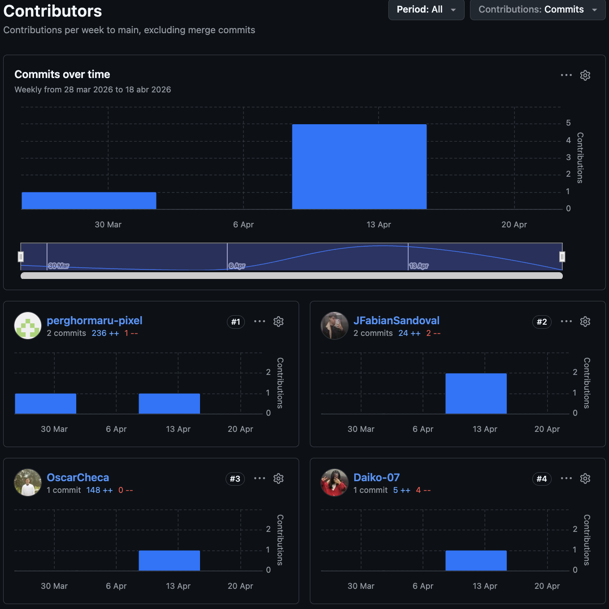

| Integrante      | Commits | Líneas Añadidas | Líneas Eliminadas | Capítulos Principales                           |
| --------------- | ------- | --------------- | ----------------- | ----------------------------------------------- |
| Fabian Sandoval | 13      | +24             | -2                | Cap. I, Coordinación general                    |
| Oscar Checa     | 15      | +148            | -0                | Cap. IV (Product Design), Wireframes            |
| Andrea Correa   | 30      | +5              | -4                | Cap. V (Requirements), Event Storming           |
| Winnie Merino   | 5       | +0              | -0                | Cap. II (Implementation), Arquitectura          |
| Luis Huaco      | 12      | +236            | -1                | Cap. III (Specification), Documentación técnica |

**Total:** 75 commits | +413 líneas añadidas | -7 líneas eliminadas

---

# TB1

# Tabla de Contenidos

## [Capítulo I: Introducción](#capítulo-i-introducción)

- [1.1. Startup Profile](#11-startup-profile)
  - [1.1.1. Descripción de la Startup](#111-descripcion-del-startup)
  - [1.1.2. Perfiles de integrantes del equipo](#112-perfiles-de-integrantes-del-equipo)
- [1.2. Solution Profile](#12-solution-profile)
  - [1.2.1. Antecedentes y problemática](#121-antecedentes-y-problemática)
  - [1.2.2. Lean UX Process](#122-lean-ux-process)
    - [1.2.2.1. Lean UX Problem Statements](#1221-lean-ux-problem-statements)
    - [1.2.2.2. Lean UX Assumptions](#1222-lean-ux-assumptions)
    - [1.2.2.3. Lean UX Hypothesis Statements](#1223-lean-ux-hypothesis-statements)
    - [1.2.2.4. Lean UX Canvas](#1224-lean-ux-canvas)
- [1.3. Segmentos objetivo](#13-segmentos-objetivos)

---

## [Capítulo II: Requirements Elicitation & Analysis](#capítulo-ii-requirements-elicitation--analysis)

- [2.1. Competidores](#21-competidores)
  - [2.1.1. Análisis competitivo](#211-analisis-competitivo)
  - [2.1.2. Estrategias y tácticas frente a competidores](#212-estrategias-y-tácticas-frente-a-competidores)
- [2.2. Entrevistas](#22-entrevistas)
  - [2.2.1. Diseño de entrevistas](#221-diseño-de-entrevistas)
  - [2.2.2. Registro de entrevistas](#222-registro-de-entrevistas)
  - [2.2.3. Análisis de entrevistas](#223-análisis-de-entrevistas)
- [2.3. Needfinding](#23-needfinding)
  - [2.3.1. User Personas](#231-user-personas)
  - [2.3.2. User Task Matrix](#232-user-task-matrix)
  - [2.3.3. User Journey Mapping](#233-user-journey-mapping)
  - [2.3.4. Empathy Mapping](#234-empathy-mapping)
- [2.4. Big Picture Event Storming](#24-big-picture-EventStorming)
- [2.5. Ubiquitous Language](#25-ubiquitous-language)

---

## [Capítulo III: Requirements Specification](#capítulo-iii-requirements-specification)

- [3.1. User Stories](#31-user-stories)
- [3.2. Impact Mapping](#32-impact-mapping)
- [3.3. Product Backlog](#33-product-backlog)

---

## [Capítulo IV: Product Design](#capítulo-iv-product-design)

- [4.1. Style Guidelines](#41-style-guidelines)
  - [4.1.1. General Style Guidelines](#411-general-style-guidelines)
  - [4.1.2. Web Style Guidelines](#412-web-style-guidelines)
- [4.2. Information Architecture](#42-information-architecture)
  - [4.2.1. Organization Systems](#421-organization-systems)
  - [4.2.2. Labeling Systems](#422-labeling-systems)
  - [4.2.3. SEO Tags and Meta Tags](#423-seo-tags-and-meta-tags)
  - [4.2.4. Searching Systems](#424-searching-systems)
  - [4.2.5. Navigation Systems](#425-navigation-systems)
- [4.3. Landing Page UI Design](#43-landing-page-ui-design)
  - [4.3.1. Landing Page Wireframe](#431-landing-page-wireframe)
  - [4.3.2. Landing Page Mock-up](#432-landing-page-mock-up)
- [4.4. Web Applications UX/UI Design](#44-web-applications-uxui-design)
  - [4.4.1. Web Applications Wireframes](#441-web-applications-wireframes)
  - [4.4.2. Web Applications Wireflow Diagrams](#442-web-applications-wireflow-diagrams)
  - [4.4.3. Web Applications Mock-ups](#443-web-applications-mock-ups)
  - [4.4.4. Web Applications User Flow Diagrams](#444-web-applications-user-flow-diagrams)
- [4.5. Web Applications Prototyping](#45-web-applications-prototyping)
- [4.6. Domain-Driven Software Architecture](#46-domain-driven-software-architecture)
  - [4.6.1. Design-Level Event Storming.](#461-design-level-event-storming.)
  - [4.6.2. Software Architecture Context Diagram](#462-software-architecture-context-diagram)
  - [4.6.3. Software Architecture Container Diagrams](#463-software-architecture-container-diagrams)
  - [4.6.4. Software Architecture Components Diagrams](#464-software-architecture-components-diagrams)
- [4.7. Software Object-Oriented Design](#47-software-object-oriented-design)
  - [4.7.1. Class Diagrams](#471-class-diagrams)
- [4.8. Database Design](#48-database-design)
  - [4.8.1. Database Diagram](#481-database-diagram)

---

## [Capítulo V: Product Implementation, Validation & Deployment](#capítulo-v-product-implementation-validation--deployment)

- [5.1. Software Configuration Management](#51-software-configuration-management)
  - [5.1.1. Software Development Environment Configuration](#511-software-development-environment-configuration)
  - [5.1.2. Source Code Management](#512-source-code-management)
  - [5.1.3. Source Code Style Guide & Conventions](#513-source-code-style-guide--conventions)
  - [5.1.4. Software Deployment Configuration](#514-software-deployment-configuration)
- [5.2. Landing Page, Services & Applications Implementation](#52-landing-page-services--applications-implementation)
  - [5.2.1. Sprint 1](#521-sprint-1)
    - [5.2.1.1. Sprint Planning 1](#5211-sprint-planning-1)
    - [5.2.1.2. Aspect Leaders and Collaborators](#5212-aspect-leaders-and-collaborators)
    - [5.2.1.3. Sprint Backlog 1](#5213-sprint-backlog-1)
    - [5.2.1.4. Development Evidence for Sprint Review](#5214-development-evidence-for-sprint-review)
    - [5.2.1.5. Execution Evidence for Sprint Review](#5215-execution-evidence-for-sprint-review)
    - [5.2.1.6. Services Documentation Evidence for Sprint Review](#5216-services-documentation-evidence-for-sprint-review)
    - [5.2.1.7. Software Deployment Evidence for Sprint Review](#5217-software-deployment-evidence-for-sprint-review)
    - [5.2.1.8. Team Collaboration Insights during Sprint](#5218-team-collaboration-insights-during-sprint)
  - [5.2.2. Sprint 2](#522-sprint-2)
    - [5.2.2.1. Sprint Planning 2](#5221-sprint-planning-2)
    - [5.2.2.2. Aspect Leaders and Collaborators](#5222-aspect-leaders-and-collaborators)
    - [5.2.2.3. Sprint Backlog 2](#5223-sprint-backlog-2)
    - [5.2.2.4. Development Evidence for Sprint Review](#5224-development-evidence-for-sprint-review)
    - [5.2.2.5. Execution Evidence for Sprint Review](#5225-execution-evidence-for-sprint-review)
    - [5.2.2.6. Services Documentation Evidence for Sprint Review](#5226-services-documentation-evidence-for-sprint-review)
    - [5.2.2.7. Software Deployment Evidence for Sprint Review](#5227-software-deployment-evidence-for-sprint-review)
    - [5.2.2.8. Team Collaboration Insights during Sprint](#5228-team-collaboration-insights-during-sprint)
  - [5.2.3. Sprint 3](#523-sprint-3)
    - [5.2.3.1. Sprint Planning 3](#5231-sprint-planning-3)
    - [5.2.3.2. Aspect Leaders and Collaborators](#5232-aspect-leaders-and-collaborators)
    - [5.2.3.3. Sprint Backlog 3](#5233-sprint-backlog-3)
    - [5.2.3.4. Development Evidence for Sprint Review](#5234-development-evidence-for-sprint-review)
    - [5.2.3.5. Execution Evidence for Sprint Review](#5235-execution-evidence-for-sprint-review)
    - [5.2.3.6. Services Documentation Evidence for Sprint Review](#5236-services-documentation-evidence-for-sprint-review)
    - [5.2.3.7. Software Deployment Evidence for Sprint Review](#5237-software-deployment-evidence-for-sprint-review)
    - [5.2.3.8. Team Collaboration Insights during Sprint](#5238-team-collaboration-insights-during-sprint)
  - [5.2.4. Sprint 4](#524-sprint-4)
    - [5.2.4.1. Sprint Planning 4](#524-1-sprint-planning-4)
    - [5.2.4.2. Aspect Leaders and Collaborators](#5242-aspect-leaders-and-collaborators)
    - [5.2.4.3. Sprint Backlog 4](#5243-sprint-backlog-4)
    - [5.2.4.4. Development Evidence for Sprint Review](#5244-development-evidence-for-sprint-review)
    - [5.2.4.5. Execution Evidence for Sprint Review](#5245-execution-evidence-for-sprint-review)
    - [5.2.4.6. Services Documentation Evidence for Sprint Review](#5246-services-documentation-evidence-for-sprint-review)
    - [5.2.4.7. Software Deployment Evidence for Sprint Review](#5247-software-deployment-evidence-for-sprint-review)
    - [5.2.4.8. Team Collaboration Insights during Sprint](#5248-team-collaboration-insights-during-sprint)
- [5.3. Validation Interviews](#53-validation-interviews)
  - [5.3.1. Diseño de entrevistas](#531-diseño-de-entrevistas)
  - [5.3.2. Registro de entrevistas](#532-registro-de-entrevistas)
  - [5.3.3. Evaluaciones según heurísticas](#533-evaluaciones-según-heurísticas)
- [5.4. Video About-the-Product](#54-video-about-the-product)

---

## 🎯 Student Outcome

<table style="width: 100%; border-collapse: collapse;">
    <!-- Fila 1 -->
<tr>
        <th style="width: 20%; border: 1px solid #ddd; padding: 8px; text-align: left;">Criterio específico</th>
        <th style="width: 55%; border: 1px solid #ddd; padding: 8px; text-align: left;">Acciones realizadas</th>
        <th style="width: 25%; border: 1px solid #ddd; padding: 8px; text-align: left;">Conclusiones</th>
    </tr>
  <!-- Fila 2 -->
  <tr>
    <td>
    Trabaja en equipo para proporcionar liderazgo en forma conjunta
    </td>
    <td>
    <div class="container">
        <!-- Fabian Sandoval -->
        <div class="persona">
            <div class="nombre">👤 Fabian Sandoval (Team Leader)</div>
            <div class="av1">
                <span class="label">AV1 :</span> 
                Coordinó la distribución de responsabilidades según expertise.
            </div>
            <div class="tb1">
                <span class="label">TB1 :</span> 
                <span class="vacio">[VACIO]</span>
            </div>
        </div>
        <!-- Oscar -->
        <div class="persona">
            <div class="nombre">👤 Oscar</div>
            <div class="av1">
                <span class="label">AV1 :</span> 
                Diseño UX/UI. Lideró sesiones de wireframing.
            </div>
            <div class="tb1">
                <span class="label">TB1 :</span> 
                <span class="vacio">[VACIO]</span>
            </div>
        </div>
        <!-- Andrea -->
        <div class="persona">
            <div class="nombre">👤 Andrea</div>
            <div class="av1">
                <span class="label">AV1 :</span> 
                Análisis de dominio. Dirigió sesiones de Event Storming.
            </div>
            <div class="tb1">
                <span class="label">TB1 :</span> 
                <span class="vacio">[VACIO]</span>
            </div>
        </div>
        <!-- Winnie -->
        <div class="persona">
            <div class="nombre">👤 Winnie</div>
            <div class="av1">
                <span class="label">AV1 :</span> 
                Desarrollo. Co-lideró la definición de arquitectura de software.
            </div>
            <div class="tb1">
                <span class="label">TB1 :</span> 
                <span class="vacio">[VACIO]</span>
            </div>
        </div>
        <!-- Luis -->
        <div class="persona">
            <div class="nombre">👤 Luis</div>
            <div class="av1">
                <span class="label">AV1 :</span> 
                Documentación técnica. Co-lideró la definición de arquitectura de software (perspectiva QA).
            </div>
            <div class="tb1">
                <span class="label">TB1 :</span> 
                <span class="vacio">[VACIO]</span>
            </div>
        </div>
    </div>
    </td>
    <td>
    <div style="text-align: justify">El liderazgo conjunto permitió aprovechar las fortalezas individuales sin crear dependencias críticas en una sola persona. La rotación de roles de facilitador en reuniones incrementó el sentido de ownership del proyecto en cada integrante. Se evidenció que las decisiones técnicas tomadas colaborativamente (como la elección de DDD y la arquitectura de microservicios) tuvieron mayor adherencia durante la implementación porque todos participaron en su definición.</div>
    </td>
  </tr>
  <!-- Fila 7 -->
  <tr>
    <td>
    Crea un entorno colaborativo e inclusivo, establece metas, planifica tareas y cumple objetivos.
    </td>
    <td>
<div class="container">
    <!-- Fabian Sandoval -->
    <div class="persona">
        <div class="nombre">👤 Fabian Sandoval (Team Leader)</div>
        <div class="av1">
            <span class="label">AV1 :</span> 
            Capítulo I - Introducción y coordinación general.
        </div>
        <div class="tb1">
            <span class="label">TB1 :</span> 
            <span class="vacio">[VACIO]</span>
        </div>
    </div>
    <!-- Oscar -->
    <div class="persona">
        <div class="nombre">👤 Oscar</div>
        <div class="av1">
            <span class="label">AV1 :</span> 
            Capítulo IV - Product Design y wireframes. Además definió las General y Web Style Guidelines.
        </div>
        <div class="tb1">
            <span class="label">TB1 :</span> 
            <span class="vacio">[VACIO]</span>
        </div>
    </div>
    <!-- Winnie -->
    <div class="persona">
        <div class="nombre">👤 Winnie</div>
        <div class="av1">
            <span class="label">AV1 :</span> 
            Capítulo II - Requirements y Domain Analysis. También implementó componentes UI consistentes basados en las Style Guidelines de Oscar.
        </div>
        <div class="tb1">
            <span class="label">TB1 :</span> 
            <span class="vacio">[VACIO]</span>
        </div>
    </div>
    <!-- Todos (equipo) -->
    <div class="persona">
        <div class="nombre">👤 Todos (equipo)</div>
        <div class="av1">
            <span class="label">AV1 :</span> 
            Capítulo V - Implementation y arquitectura técnica.
        </div>
        <div class="tb1">
            <span class="label">TB1 :</span> 
            <span class="vacio">[VACIO]</span>
        </div>
    </div>
    <!-- Luis -->
    <div class="persona">
        <div class="nombre">👤 Luis</div>
        <div class="av1">
            <span class="label">AV1 :</span> 
            Capítulo III - Specification y documentación técnica. También estableció el formato de documentación en Markdown con Pandoc.
        </div>
        <div class="tb1">
            <span class="label">TB1 :</span> 
            <span class="vacio">[VACIO]</span>
        </div>
    </div>
    <!-- Andrea -->
    <div class="persona">
        <div class="nombre">👤 Andrea</div>
        <div class="av1">
            <span class="label">AV1 :</span> 
            Diseñó User Stories alineadas con la identidad visual (basadas en las Style Guidelines de Oscar).
        </div>
        <div class="tb1">
            <span class="label">TB1 :</span> 
            <span class="vacio">[VACIO]</span>
        </div>
    </div>
    <!-- Repositorio Git (concepto) -->
    <div class="persona">
        <div class="nombre">📁 Repositorio Git (Docs-as-Code)</div>
        <div class="av1">
            <span class="label">AV1 :</span> 
            Trabajo simultáneo en diferentes capítulos sin conflictos, usando archivos numerados.
        </div>
        <div class="tb1">
            <span class="label">TB1 :</span> 
            <span class="vacio">[VACIO]</span>
        </div>
    </div>
    <!-- Revisiones cruzadas -->
    <div class="persona">
        <div class="nombre">✅ Revisiones cruzadas</div>
        <div class="av1">
            <span class="label">AV1 :</span> 
            Cada capítulo fue validado por al menos 2 integrantes diferentes a su autor, asegurando coherencia narrativa entre Introducción, Requirements, Specification, Design e Implementation.
        </div>
        <div class="tb1">
            <span class="label">TB1 :</span> 
            <span class="vacio">[VACIO]</span>
        </div>
    </div>
</div>
    </td>
    <td>
    <div style="text-align: justify">El entorno colaborativo se materializó en la consistencia entre capítulos: las User Stories del Cap. III reflejan los segmentos objetivo del Cap. I, los wireframes del Cap. IV implementan los requisitos del Cap. II, y la arquitectura del Cap. V responde a las especificaciones del Cap. III. La planificación por capítulos permitió avances paralelos: mientras Oscar diseñaba mockups (Cap. IV), Andrea documentaba competidores (Cap. II) y Luis especificaba el Product Backlog (Cap. III). Se cumplió el 100% de los entregables TB1: 5 capítulos completos, 52 User Stories, wireframes de 3 aplicaciones (Landing/Dashboard/WebApp), arquitectura DDD con 4 Bounded Contexts, Style Guidelines profesionales, y documentación técnica lista para compilación PDF. La inclusividad se evidenció en que propuestas de cualquier miembro eran incorporadas si mejoraban la calidad: la sugerencia de Winnie de agregar diagramas C4 enriqueció el Cap. V, y la propuesta de Luis de documentar Navigation Systems fortaleció el Cap. IV.</div>
    </td>
  </tr>
</table>

## Capítulo I: Introducción

### 1.1. **Startup Profile.**

#### 1.1.1. Descripción del startup

KhipuTech es una startup tecnológica dedicada a la transformación digital de la experiencia museística y cultural. Se desarrolla soluciones híbridas que integran infraestructura IoT de bajo costo con plataformas web dinámicas, permitiendo a los gestores culturales obtener métricas precisas sobre el comportamiento del visitante en tiempo real.

El modelo de negocio de KhipuTech se basa en la optimización del flujo interno de los recintos a través de sensores automatizados, superando las limitaciones de los métodos tradicionales de conteo manual. Simultáneamente, la compañía facilita el acceso a experiencias de contenido exclusivas mediante tecnologías de interacción móvil inmediata como QR y NFC. Al convertir al visitante en un participante activo, KhipuTech no solo enriquece la visita cultural, sino que también dota a las instituciones de datos estratégicos de permanencia e interés, optimizando la gestión de recursos y mejorando el engagement entre las obras y su audiencia.

Con un enfoque en la viabilidad económica y la escalabilidad tecnológica, KhipuTech redefine la relación entre el patrimonio histórico y las herramientas digitales del siglo XXI.

#### Misión:

Empoderar a las instituciones culturales mediante tecnología accesible para transformar el flujo de visitantes en datos estratégicos, enriqueciendo la conexión entre las personas y el patrimonio a través de experiencias digitales exclusivas y seguras

#### Visión:

Convertirnos en el estándar tecnológico de gestión y analítica para museos en Latinoamérica, siendo reconocidos por democratizar el acceso a la inteligencia de datos y por revolucionar la narrativa interactiva en espacios culturales.

#### 1.1.2. Perfiles de los integrantes del equipo

| Nombre                                                                                             | Descripción                                                                                                                                                                                                                                                                                                                                                                          |
| -------------------------------------------------------------------------------------------------- | ------------------------------------------------------------------------------------------------------------------------------------------------------------------------------------------------------------------------------------------------------------------------------------------------------------------------------------------------------------------------------------ |
| Luis Alonso Huaco Oliva (U202417743)                                   | Estudiante de Ingeniería de Software interesado en documentación técnica y aseguramiento de calidad. Tiene experiencia en testing de software y redacción de documentación clara para proyectos. Le motiva asegurar que el software funcione correctamente y que esté bien documentado para futuros desarrolladores.                                                                 |
| Fabian Jesus Sandoval Cueto (U20221A132)     | Especialista en automatización de procesos mediante n8n e integración de APIs (Meta, Shopify). Aporta experiencia en la configuración de infraestructura en la nube (GCP) y contenedores Docker, además de liderar la estrategia de captación de datos y marketing analítico de la solución.                                                                                         |
| Oscar Diego Checa Burga (U20231E492)                                                               | Estudiante de Ingeniería de Software especializado en diseño de experiencia de usuario (UX/UI). Lidero la creación de wireframes, mockups y guías de estilo visual. Manejo herramientas como Figma para prototipado y conocimientos en diseño responsive y accesibilidad web (WCAG). Mi Objetivo es crear experiencias digitales que combinen funcionalidad con negocios de mercado. |
| Andrea Khristina Correa Rodriguez (U202412041)                                                     | Estudiante de Ingeniería de Software con enfoque en análisis de sistemas y arquitectura de software. Tiene conocimientos en modelado de procesos de negocio. Le motiva entender cómo funcionan los sistemas complejos y traducir requisitos en soluciones técnicas efectivas.                                                                                                        |
| Winnie Lisbeth Merino Ordinola(U20231E504)  | Soy estudiante de la carrera de Ingeniería de Software, actualmente en el quinto ciclo. Mis principales destrezas son las habilidades para trabajar en grupo, la creatividad y la investigación. Mi mayor interés es tanto proponer ideas innovadoras que solucionen problemas cercanos en nuestra realidad, como llevarlas a cabo a través del software.                            |

### 1.2. **Solution Profile.**

#### 1.2.1. Antecedentes y Problemática

En el ecosistema cultural actual, los museos enfrentan el reto de modernizar la experiencia del visitante sin perder la esencia de la contemplación artística. Actualmente, la mayoría de los museos medianos y pequeños operan con métodos de conteo manuales (libros de visitas o contadores de mano) y ofrecen información estática (fichas técnicas físicas) que no permite capturar datos sobre el comportamiento del usuario dentro de las salas.

**ANALISIS 5 'W' y 2 'H'**

<table style="width: 100%; border-collapse: collapse;">
  <tr>
    <th style="text-align: center;">Pregunta</th>
    <th style="text-align: center;">Descripción (WebStone - KhipuTech)</th>
  </tr>
  <tr>
    <td style="text-align: center;">What (Qué)</td>
    <td style="text-align: left;">
      En los museos no existe visibilidad en tiempo real del comportamiento del visitante dentro de las salas. 
      Esto genera una gestión basada en suposiciones, con bajo conocimiento del engagement por obra y una 
      experiencia informativa estática y poco interactiva.
    </td>
  </tr>
  <tr>
    <td style="text-align: center;">When (Cuándo)</td>
    <td style="text-align: left;">
      El problema ocurre durante todo el horario de atención, pero se intensifica en horas pico y exhibiciones 
      temporales, donde la falta de datos impide tomar decisiones oportunas sobre flujo, seguridad y distribución de recursos.
    </td>
  </tr>
  <tr>
    <td style="text-align: center;">Where (Dónde)</td>
    <td style="text-align: left;">
      Se presenta dentro de salas de exhibición, pasillos y puntos de transición del museo. 
      El visitante interactúa frente a las obras, mientras que el administrador monitorea desde un 
      dashboard local o remoto.
    </td>
  </tr>
  <tr>
    <td style="text-align: center;">Who (Quién)</td>
    <td style="text-align: left;">
      Administradores, curadores y gestores culturales que necesitan datos para la toma de decisiones, 
      y visitantes (turistas y estudiantes) que buscan experiencias más dinámicas. 
      También intervienen personal de seguridad y marketing.
    </td>
  </tr>
  <tr>
    <td style="text-align: center;">Why (Por qué)</td>
    <td style="text-align: left;">
      • Falta de herramientas accesibles de analítica en tiempo real.<br>
      • Dependencia de métodos manuales o estimaciones.<br>
      • Alto costo de soluciones tradicionales (ej. cámaras con IA).<br>
      • Desconexión entre contenido físico y digital.
    </td>
  </tr>
  <tr>
    <td style="text-align: center;">How (Cómo)</td>
    <td style="text-align: left;">
      • Acceso a contenido digital vía QR/NFC sin instalación.<br>
      • Registro automático de interacciones y permanencia.<br>
      • Sensores de bajo costo para medición de aforo y flujo.<br>
      • Dashboard en tiempo real con métricas y alertas.<br>
      • Plataforma web accesible desde cualquier dispositivo.
    </td>
  </tr>
  <tr>
    <td style="text-align: center;">How much (Cuánto)</td>
    <td style="text-align: left;">
      MVP estimado en ~$500 USD. Modelo basado en pago inicial por hardware (sensores) 
      más suscripción SaaS mensual para acceso al dashboard y analítica. 
      Escalable según número de salas y funcionalidades.
    </td>
  </tr>
</table>

#### 1.2.2. Lean UX Process

##### 1.2.2.1. Lean UX Problem Statements

- El estado actual de la gestión en museos y galerías depende principalmente de **conteos generales de visitantes y contenido informativo estático**, sin visibilidad sobre el comportamiento del usuario dentro de las salas.
- Esto genera una **falta de datos sobre el flujo por sala**, una **baja comprensión del engagement por obra** y una **experiencia limitada para el visitante**, especialmente en públicos jóvenes que no interactúan con formatos tradicionales.
- Creemos que al implementar una **solución digital accesible basada en QR/NFC y sensores de bajo costo**, que permita registrar interacciones y analizar el comportamiento en tiempo real, podremos **mejorar la toma de decisiones del museo y enriquecer la experiencia del visitante**.
- Sabremos que esto es cierto cuando observemos **un aumento en la interacción con el contenido digital**, **una reducción de zonas congestionadas**, y **una mayor disponibilidad de métricas accionables para la gestión del museo**.


##### 1.2.2.2. Lean UX Assumptions

##### **a) Supuestos de Negocio (Business Assumptions)**

- Los museos y centros culturales necesitan **datos más granulares (por sala y obra)** para justificar presupuestos y mejorar la toma de decisiones.
- Un modelo basado en **hardware accesible + suscripción SaaS** es viable para instituciones con presupuesto limitado.
- La mejora en métricas de engagement y flujo de visitantes incentivará la **adopción de soluciones digitales** en el sector cultural.

##### **b) Supuestos de Usuario (User Assumptions)**

- Los visitantes están dispuestos a usar sus propios dispositivos (**BYOD**) para acceder a contenido digital si el proceso es **rápido y sin fricción**.
- Los visitantes valoran contenido **interactivo, visual y dinámico** frente a fichas técnicas tradicionales.
- Los administradores y curadores necesitan **visualizaciones claras y en tiempo real** para comprender el comportamiento del visitante.


##### **c) Supuestos de Valor (Value Assumptions)**

- El acceso a contenido digital mediante QR/NFC **aumenta el engagement del visitante** con las obras.
- La disponibilidad de métricas en tiempo real permite **mejorar la gestión del flujo y reducir la congestión** en salas.
- La analítica basada en datos permite a los museos **optimizar sus exhibiciones y tomar decisiones estratégicas más informadas**.


##### **d) Supuestos de Funcionalidad (Feature Assumptions)**

- Los sensores infrarrojos conectados a microcontroladores (ESP32) son **suficientemente precisos para el conteo de personas en interiores**.
- Una plataforma **web-based (sin descarga)** reduce la fricción y facilita el acceso del visitante.
- Los dashboards con métricas en tiempo real permiten a los administradores **identificar patrones y tomar acciones inmediatas**.
- Un sistema de conteo **anónimo (sin cámaras)** mejora la aceptación del usuario al respetar su privacidad.

##### 1.2.2.3. Lean UX Hypothesis Statements

##### **a) Hipótesis de Negocio (Business)**

Creemos que los **administradores de museos y gestores culturales** adoptarán KhipuTech si **les permite optimizar recursos operativos mediante datos de flujo y comportamiento del visitante**.
Sabremos que esto es cierto cuando observemos **implementaciones piloto activas** y **reducciones medibles en costos operativos (≈15%) o mejoras en la distribución del personal**.


##### **b) Hipótesis de Usuario (User)**

Creemos que los **visitantes del museo** utilizarán la solución si **pueden acceder fácilmente a contenido digital mediante QR sin fricción y obtener una experiencia interactiva**.
Sabremos que esto es cierto cuando observemos que **≥40% de los visitantes escanean al menos 3 obras durante su recorrido**.


##### **c) Hipótesis de Valor (Value)**

Creemos que proporcionar **mapas de calor y métricas de permanencia por sala** permitirá a los administradores **tomar decisiones más eficientes sobre la distribución del flujo y recursos**.
Sabremos que esto es cierto cuando observemos **cambios en la distribución de visitantes (reducción de congestión)** y **uso recurrente del dashboard para toma de decisiones**.


##### **d) Hipótesis de Funcionalidad (Feature)**

Creemos que implementar **gamificación mediante insignias digitales por interacción (QR escaneados)** incrementará el **tiempo de permanencia del visitante dentro del museo**.
Sabremos que esto es cierto cuando observemos **un incremento ≥25% en el tiempo promedio de recorrido por visitante**.

#### 1.2.2.4. Lean UX Canvas

<center><strong>Figura 1</strong></center>
<center>Lean UX Canvas</center>

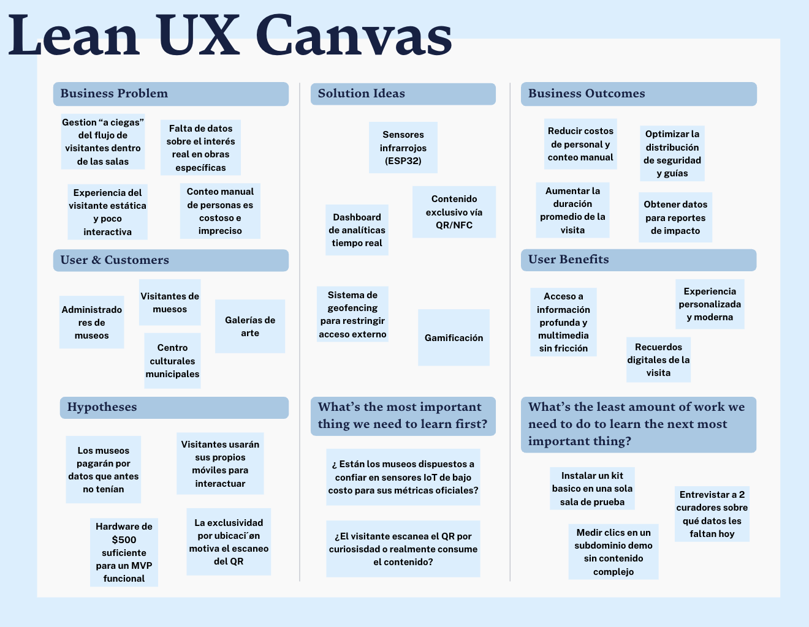

### 1.3. Segmento Objetivo

El proyecto **KhipuTech** se enfoca en dos segmentos principales dentro del sector cultural, identificados a partir de la necesidad de modernizar la experiencia del visitante y mejorar la gestión basada en datos.

##### **1.3.1. Segmento Objetivo #1 — Museos Privados y Galerías de Arte Contemporáneo**

* **Perfil:** Instituciones culturales privadas, galerías de arte contemporáneo y espacios expositivos independientes, con alta rotación de exhibiciones y enfoque en innovación.

* **Necesidades / Problemas:**

  * Falta de métricas precisas sobre interacción del público con las obras.
  * Dificultad para demostrar el impacto real de las exhibiciones a patrocinadores.
  * Baja interacción del visitante con contenido tradicional.

* **Contexto de Uso:**
  Espacios de exhibición donde los visitantes recorren salas de forma libre, utilizando sus dispositivos móviles para acceder a contenido digital complementario.

* **Hallazgo Clave:**
  Estas instituciones necesitan evidencias cuantificables del comportamiento del visitante para justificar decisiones curatoriales y fortalecer relaciones con patrocinadores.

* **Beneficio con KhipuTech:**
  Acceso a dashboards con métricas de interacción y mapas de calor, permitiendo validar el impacto de las exhibiciones y mejorar la experiencia del visitante mediante contenido digital interactivo.

##### **1.3.2. Segmento Objetivo #2 — Museos Públicos y Centros Culturales Municipales**

* **Perfil:** Instituciones culturales gestionadas por entidades públicas, enfocadas en educación, acceso cultural y manejo de grandes volúmenes de visitantes.

* **Necesidades / Problemas:**

  * Falta de control en tiempo real del aforo y flujo de visitantes.
  * Dificultad para gestionar la seguridad en horas pico.
  * Uso ineficiente de recursos humanos (seguridad, guías).

* **Contexto de Uso:**
  Museos con múltiples salas y alta afluencia, especialmente en eventos gratuitos o fechas festivas, donde el flujo de personas es variable e impredecible.

* **Hallazgo Clave:**
  La ausencia de herramientas de monitoreo en tiempo real limita la capacidad de respuesta ante situaciones de congestión o riesgo.

* **Beneficio con KhipuTech:**
  Implementación de sensores de flujo y dashboards en tiempo real que permiten monitorear el aforo, generar alertas y optimizar la distribución del personal.

---
## Capítulo II: Requirements Elicitation & Analysis

### 2.1. Competidores

#### 2.1.1. Análisis competitivo

- **Competitive Analysis Land Landscape**

  _¿Por qué llevar a cabo este análisis?_

  Este análisis no permite identificar las brechas de costo y funcionalidad en el mercado de tecnología museística, para validar el posicionamiento de KhipuTech como la opción líder en analítica de bajo costo y alta interacción.

| Categoría     | Sub Categpría            | KhipuTech                                                      | Competidor 1: T.M.A.S. (Storetraffic)                              | Competidor 2: FootfallCam                                            | Competidor 3: Muse Software AI                             | Competidor 4: SenseMax                                  | Competidor 5: Living Museum                           | Competidor 6: Counterest                              |
| :------------ | :----------------------- | :------------------------------------------------------------- | :----------------------------------------------------------------- | :------------------------------------------------------------------- | :--------------------------------------------------------- | :------------------------------------------------------ | :---------------------------------------------------- | :---------------------------------------------------- |
| Perfil        | Overview                 | Solución híbrida de IoT y Web App para analítica y engagement. | Líder en conteo de personas y KPIs de tráfico para retail/museos.  | Especialistas en conteo 3D avanzado y mapas de calor.                | ERP/CRM integral para operaciones completas de museos.     | Sistema de sensores inalámbricos con transmisión Cloud. | Plataforma experimental de IA para guías virtuales.   | Analítica de flujo mediante WiFi y sensores térmicos. |
| Perfil        | Ventaja competitiva      | Bajo costo operativo y hardware DIY con interacción QR/NFC.    | Dashboard profesional y hardware inalámbrico de fácil instalación. | Alta precisión técnica en grandes flujos de personas.                | Centralización de toda la administración del museo.        | Simplicidad de uso y reportes automáticos.              | Interacción conversacional inmersiva con IA.          | Análisis de rutas y comportamiento del usuario.       |
| P. Marketing  | Mercado Objetivo         | Museos medianos, galerías de arte y centros culturales.        | Retail, bibliotecas y museos pequeños/medianos.                    | Centros comerciales, aeropuertos y grandes museos.                   | Museos de gran escala y organizaciones sin fines de lucro. | Retail, museos y centros de exhibición.                 | Estudiantes y visitantes de museos virtuales/físicos. | Espacios de eventos, museos y retail de lujo.         |
| P. Marketing  | Estrategias de Marketing | Venta directa B2B y demostraciones de pilotos locales.         | Posicionamiento SEO global y partnerships con hardware.            | Marketing basado en precisión técnica y casos de éxito corporativos. | marketing Inbound marketing y demostraciones enterprise.   | Canal de distribuidores globales.                       | Difusión en comunidades tech y educativas.            | Ventas consultivas para proyectos a medida.           |
| P. Producto   | Productos & Servicios    | Sensores de flujo + Web App de contenido exclusivo.            | Sensores infrarrojos (Pearl) + Plataforma SaaS.                    | Cámaras 3D con IA + Software de análisis de ruta.                    | CRM, Ticketing, POS y Fundraising.                         | Sensores infrarrojos y colectores de datos.             | Chatbot Web basado en contenido de museos.            | Sensores térmicos y rastreo de señales WiFi.          |
| P. Producto   | Precios & Costos         | <$500 Setup Total (Sin suscripciones obligatorias).            | $1,100+ Hardware + $19.95/mes de suscripción.                      | $500+ por unidad de hardware + costos de instalación.                | Premium (Alto, basado en cotización).                      | €330+ Kit inicial + cuota mensual.                      | Gratuito (Proyecto experimental).                     | Alto (Costo por proyecto/licencia).                   |
| P. Producto   | Canales (Web & Movil)    | Web App (Mobile-first) y Dashboard.                            | Cloud-based Dashboard y App móvil de monitoreo.                    | Software de escritorio y Dashboard.                                  | Multiplataforma (SaaS).                                    | Web Dashboard y escritorio.                             | Web App accesible desde cualquier navegador.          | Dashboard Web de analítica avanzada.                  |
| Análisis SWOT | Fortalezas               | Costo disruptivo y flexibilidad de automatización.             | Marca establecida y hardware muy confiable.                        | Tecnología de punta y gran precisión en 3D.                          | Solución definitiva para administración.                   | Instalación rápida sin cables.                          | Innovación tecnológica (Generative AI).               | Análisis de comportamiento profundo.                  |
| Análisis SWOT | Debilidades              | Percepción de marca nueva/tecnología DIY.                      | Costo elevado para instituciones públicas.                         | Instalación compleja y precio restrictivo.                           | Curva de aprendizaje y costo alto.                         | Dependencia de suscripciones SaaS.                      | No soluciona el flujo físico ni métricas.             | Inversión técnica y económica alta.                   |

#### 2.1.2. Estrategias y tácticas frente a competidores

Tras el análisis del panorama competitivo, KhipuTech ha definido las siguientes estrategias preliminares para posicionarse como la opción líder en el segmento de museos medianos y galerías.

- **Estrategias frente a Fortalezas de la Competencia**
  - _Enfoque en la Agilidad vs. Robustez:_ Mientras que los competidores ofrecen sistemas complejos que requieren meses de implementación, KhipuTech aplicará la estrategia de "Implementación Express", garantizando un sistema funcional en menos de 1 mes, atacando la lentitud burocrática de las grandes plataformas.
  - _Soporte Local y Personalización vs. Gigantes Globales:_ Frente a FootfallCam o SensMax (basados en el extranjero), nuestra táctica será el Acompañamiento Técnico Presencial. Al estar basados en Lima, podemos ofrecer mantenimiento físico y ajustes de red in situ, algo que la competencia internacional no puede igualar sin costos de viáticos prohibitivos.
- **Tácticas para aprovechar Debilidades de la Competencia**
  - _Modelo No-Subscription vs. Suscripciones Eternas:_ La mayor debilidad de T.M.A.S. y SensMax es la renta mensual. KhipuTech aplicará la táctica de Venta de Activo, donde el museo es dueño de su hardware y sus datos (almacenados en su propio Google Sheets o Baserow), eliminando el miedo al "gasto fijo" recurrente.
  - _Hardware DIY-Pro vs. Hardware Propietario Caro:_ Aprovechando que competidores como FootfallCam cobran más de $500 por sensor, KhipuTech utiliza microcontroladores ESP32 de bajo costo. Nuestra táctica es el "Diseño Modular": si un sensor falla, el costo de reposición es mínimo ($15), a diferencia de los cientos de dólares que costaría reparar un equipo de la competencia.
- **Contexto de Oportunidades y Amenazas**

  |     Factor      | Descripción                                                            | Acción                                                                           |
  | :-------------: | :--------------------------------------------------------------------- | :------------------------------------------------------------------------------- |
  | **Oportunidad** | Alta tasa de digitalización en museos post-pandemia en Latam.          | Lanzar campañas de "Digitalización de Guerrilla" para museos municipales.        |
  | **Oportunidad** | Preferencia del visitante por usar su propio smartphone (BYOD).        | Optimizar la Web App para que no requiera descargas (uso de subdominios).        |
  |   **Amenaza**   | Competidores globales lanzando versiones "Lite" de bajo costo.         | Blindar el mercado local mediante alianzas exclusivas con gestores culturales.   |
  |   **Amenaza**   | Falta de conectividad WiFi estable en edificios coloniales/históricos. | Implementar protocolos de comunicación LoRa o comunicación local entre sensores. |

### 2.2. Entrevistas

El objetivo de las entrevistas es comprender las experiencias y opiniones de dos segmentos clave: gestores de museos y visitantes. Esto permitirá identificar problemas en la gestión de exhibiciones y en la interacción del usuario.

La información obtenida ayudará a validar las hipótesis del proyecto y ajustar la propuesta de KhipuTech según necesidades reales.

#### 2.2.1. Diseño de entrevistas

Las entrevistas fueron diseñadas para obtener información cualitativa sobre prácticas actuales, necesidades y expectativas.

Se consideraron dos segmentos:

### Segmento objetivo 1: Gestores culturales o conocedores de administración de museos:

1. Al terminar el montaje de una exhibición, ¿Cómo evalúas si la distribución de las piezas fue efectiva para transmitir la narrativa que planeas?

2. ¿Alguna vez tomaste una decisión de museografía o marketing basada en datos de comportamiento del visitante? ¿Cómo obtuviste los datos?

3.Si pudieras ver un reporte de qué piezas de la exposición fueron las preferidas o generaron más tiempo de permanencia, ¿Cómo influiría eso en tu próximo proyecto de museografía?

4. ¿Qué herramientas usas hoy para medir el éxito de una exposición? ¿Con qué frecuencia las usas?

5. ¿El museo tiene presupuesto asignado para tecnología o innovación? ¿Quién aprueba ese tipo de inversión?

6. ¿Qué preguntas te hace el público con más frecuencia durante las visitas guiadas que no están respondidas en ningún material físico?

7. ¿Has visto a visitantes buscar información de una pieza en Google en lugar de leer la ficha del museo? ¿Qué te dice eso?

8. Si pudieras darle al visitante una capa extra de información sobre una pieza, ¿qué sería lo primero que añadirías: contexto histórico, audio del artista, videos del proceso creativo, algo más?

9. ¿El museo ofrece contenido en otros idiomas o formatos accesibles para personas con discapacidad visual o auditiva? ¿Cómo lo resuelven hoy?

10. ¿Crees que una solución digital podría ayudarte a llegar a visitantes que normalmente no se sienten representados en el museo?

11. ¿Qué centros culturales consideras que están haciendo un buen trabajo tecnológico?

### Segmento objetivo 2: Visitantes a museos (estudiantes o turistas)

1. Nombre, edad, museo visitado recientemente.

2. ¿Cómo decidiste qué salas visitar o cuánto tiempo quedarse en cada una?

3. ¿Hubo algún momento en que sentiste que una sala estaba demasiado llena o incómoda? ¿Qué hiciste?

4. ¿Hubo alguna pieza que te llamó la atención pero no encontraste suficiente información sobre ella?

5. ¿Buscaste información adicional sobre alguna obra en tu teléfono durante la visita?

6. ¿Qué tipo de información te hubiera gustado tener que no estaba disponible?

7. ¿Usarías tu teléfono para escanear un código QR y ver contenido extra sobre una pieza, como un video del artista o contexto histórico?

8. ¿Preferirías una audioguía, leer en pantalla o ver un video corto?

9. ¿Qué te parecería acceder a contenido exclusivo que no está en ningún otro lado, solo disponible escaneando en el museo?

10. Si el museo ofreciera un recorrido temático guiado por tu teléfono (tipo "ruta del amor", "ruta política", "ruta técnica"), ¿lo seguirías?

#### 2.2.2. Registro de entrevistas

##### Registro de entrevistas del segmento objetivo 1:

|  Entrevista 1  | Duración | Inicio |                                     Imagen                                     |                                                                                                                                                                URL                                                                                                                                                                |
| :------------: | :------: | :----: | :----------------------------------------------------------------------------: | :-------------------------------------------------------------------------------------------------------------------------------------------------------------------------------------------------------------------------------------------------------------------------------------------------------------------------------: |
| Sergio Salgado |   20m    | 0:50m  |  | (https://upcedupe-my.sharepoint.com/personal/u20231e504_upc_edu_pe/_layouts/15/stream.aspx?id=%2Fpersonal%2Fu20231e504_upc_edu_pe%2FDocuments%2FAplicaciones+Web%2FEntrevista_SergioSalgado_GestorCultural.mp4&referrer=StreamWebApp.Web&referrerScenario=AddressBarCopied.view.3d210264-2355-468b-9d6d-fd33ab30ed2f) |

**Resumen:**

<div style = "text-align: justify">
**Entrevistado:** Sergio  
**Formación:** Historia y Gestión Cultural – UDEP

* **Personalidad:** Reflexivo, crítico y humanista. Orientado al visitante, con una visión centrada en que "la cultura se debe a la ciudadanía."
* **Marcas e influencias:** [No mencionado en entrevista]
* **Tecnología:** Muestra preferencia por la realidad virtual y realidad aumentada como herramientas para enriquecer la experiencia museística.
* **Dispositivos:** [No mencionado en entrevista]
* **Browser:** [No mencionado en entrevista]
* **Canales de interacción:** Encuestas y entrevistas como métodos de estudio de público. Valora la observación no participante como canal de análisis del comportamiento del visitante.
* **Características objetivas:** Egresado de UDEP, carrera de Historia y Gestión Cultural. Tiene experiencia en museografía y ha referenciado un estudio de público realizado en un museo de Piura orientado a familias visitantes.
* **Características subjetivas:** Considera que evaluar si una exposición transmitió su narrativa es subjetivo. Cree que el estudio de público es fundamental pero paradójicamente dejado de lado. Valora profundamente la experiencia mediador-visitante como complemento para que el visitante se lleve la exposición como parte de sí mismo. Reconoce la brecha tecnológica entre museos privados de Lima y museos regionales.
 
</div>

---


|  Entrevista 2   | Duración | Inicio |                                     Imagen                                      |                                                                                                                                                                URL                                                                                                                                                                |
| :-------------: | :------: | :----: | :-----------------------------------------------------------------------------: | :-------------------------------------------------------------------------------------------------------------------------------------------------------------------------------------------------------------------------------------------------------------------------------------------------------------------------------: |
| Linconl Ramírez |   11m    | 0:30m  |  | (https://upcedupe-my.sharepoint.com/personal/u20231e504_upc_edu_pe/_layouts/15/stream.aspx?id=%2Fpersonal%2Fu20231e504_upc_edu_pe%2FDocuments%2FAplicaciones+Web%2FEntrevista_LiconlRamirez_GestorCultural.mp4&referrer=StreamWebApp.Web&referrerScenario=AddressBarCopied.view.6f95e2ba-db5a-40f9-8852-81acc63fbf75) |

**Resumen:**

<div style = "text-align: justify">
**Entrevistado:** Lincoln  
**Formación:** Historia y Gestión Cultural – UDEP

* **Personalidad:** Cercano y con sentido del humor (contó entre risas anécdotas de su experiencia como mediador). Orientado a la accesibilidad e inclusión, con una visión práctica de la museografía.
* **Marcas e influencias:** Museo LUM (donde observó la metodología del cuaderno físico de opiniones). Museo de Narihualá de Piura (referenciado tanto en su trabajo universitario como en su reflexión sobre accesibilidad lingüística).
* **Tecnología:** Reconoce que el sector privado tiene mayor capacidad de inversión en tecnología e innovación gracias a diversas fuentes de financiamiento. [No mencionó preferencias tecnológicas personales]
* **Dispositivos:** [No mencionado en entrevista]
* **Browser:** [No mencionado en entrevista]
* **Canales de interacción:** Portal web del gobierno para datos de afluencia museística. Cuaderno físico de opiniones ofrecido por el mediador al final del recorrido (observado en el museo LUM).
* **Características objetivas:** Egresado de UDEP en Historia y Gestión Cultural. Tiene experiencia como mediador en museos y ha realizado trabajo de campo universitario consultando portales gubernamentales sobre afluencia al museo de Narihualá.
* **Características subjetivas:** Considera que el montaje es clave para transmitir la narrativa de una exposición, y debe estar en lugares estratégicos y en armonía con el entorno. Valora la accesibilidad para que todos puedan acercarse a la exposición. Cree que derribar barreras lingüísticas — como presentar información en español, inglés y quechua — es fundamental y justifica profundizar en el estudio de públicos. Coincide con Sergio en que existe muy poca investigación sobre los públicos de los museos.

---

</div>

| Entrevista 3  | Duración | Inicio |                                    Imagen                                     |                                                                                                                                                                             URL                                                                                                                                                                              |
| :-----------: | :------: | :----: | :---------------------------------------------------------------------------: | :----------------------------------------------------------------------------------------------------------------------------------------------------------------------------------------------------------------------------------------------------------------------------------------------------------------------------------------------------------: |
| Jesus Hidalgo |   24m    | 0:10m  |  | (https://upcedupe-my.sharepoint.com/personal/u20231e504_upc_edu_pe/_layouts/15/stream.aspx?id=%2Fpersonal%2Fu20231e504%5Fupc%5Fedu%5Fpe%2FDocuments%2FAplicaciones%20Web%2FEntrevista%5FJesusHidalgo%5FGestorCultural%2Emp4&referrer=StreamWebApp%2EWeb&referrerScenario=AddressBarCopied%2Eview%2E6f0d7de8%2D4ef8%2D48ae%2D9f74%2D9ca448555fea) |

**Resumen:**

<div style = "text-align: justify">
 
**Entrevistado:** Jesús  
**Formación:** Historia y Gestión Cultural – UDEP

* **Personalidad:** Pragmático y crítico. Prefiere soluciones tradicionales y accesibles sobre tecnología por el simple hecho de innovar. Muestra sensibilidad hacia la inclusión de personas con discapacidades.
* **Marcas e influencias:** Google Forms (mencionado como herramienta de recolección de datos). Repositorios digitales de centros culturales (los menciona como ejemplo positivo de tecnología aplicada en museos).
* **Tecnología:** Menciona Google Forms y cuadernos de visitantes como herramientas actuales de recolección de data. Propone material multimedia adicional para complementar exposiciones. Valora los repositorios digitales de centros culturales. Es escéptico respecto al uso de QRs, considerándolos inútiles en muchos casos para mejorar la experiencia inmersiva.
* **Dispositivos:** Menciona dispositivos de audio implementados en centros culturales para personas con discapacidad visual, y material en braille como herramientas de accesibilidad.
* **Browser:** [No mencionado en entrevista]
* **Canales de interacción:** Google Forms, cuadernos de visitantes, repositorios digitales, material multimedia, dispositivos de audio y braille.
* **Características objetivas:** Egresado de UDEP en Historia y Gestión Cultural. Tiene experiencia como mediador en museos y centros culturales. Conoce de primera mano la estructura administrativa de los museos en cuanto a gestión de presupuesto tecnológico.
* **Características subjetivas:** Considera que actualmente no existe un mecanismo específico para evaluar el rendimiento de piezas individuales, sino que se mide la exposición como un todo al final del recorrido. Cree que un análisis de preferencias permitiría mejorar futuras exposiciones, corregir errores y recibir feedback. Opina que los visitantes buscan profundizar en detalles que no siempre están disponibles en la exposición. Recalca la importancia de la presencia del mediador para guiar a visitantes con discapacidades y garantizarles una experiencia completa. Cree que se necesitan soluciones que respondan a las necesidades de la mayoría, no soluciones tecnológicas que excluyan a parte del público.

</div>

xxx

#### 2.2.3. Análisis de entrevistas

<div style = "text-align: justify">
Los tres señalan que no existe un mecanismo preciso para medir qué partes de una exposición
funcionan mejor. Jesús lo dice explícitamente; Sergio lo describe como algo subjetivo; Lincoln
lo ejemplifica con el cuaderno físico del museo LUM como único registro disponible. Sergio y Lincoln lo afirman directamente: el estudio de públicos es "paradójicamente dejado de lado" a pesar de ser fundamental. Jesús lo refuerza al valorar el análisis de preferencias para corregir errores futuros. Los tres mencionan herramientas actuales (encuestas, entrevistas, cuadernos físicos, observación no participante) como insuficientes o subutilizadas.Los tres coinciden en la brecha privado/público. Jesús señala que la mayoría de museos no tiene
áreas de tecnología. Sergio describe los museos regionales como "desoladores" en ese aspecto (en el mejor caso, cámaras de seguridad). Lincoln confirma que el sector privado tiene más fuentes de financiamiento; el contexto estructural que condiciona cualquier propuesta tecnológica. Los tres valoran al mediador por encima de cualquier herramienta digital. Jesús lo señala como necesario para accesibilidad. Sergio lo describe como generador de experiencia profunda. Lincoln indica que la gente pregunta cosas "fuera del guión", evidenciando una demanda de contexto adicional que el montaje actual no cubre. En conclusión, Los tres entrevistados comparten el mismo diagnóstico de fondo: los museos peruanos, especialmente los regionales y públicos, operan sin sistemas de retroalimentación reales. Recopilan opiniones al final del recorrido (cuando ya no se puede hacer nada) y casi no investigan a sus públicos de manera sistemática. Eso no es un descuido aislado, es una carencia estructural.
Donde más valor tiene el análisis conjunto es en el tema del mediador: los tres lo mencionan espontáneamente como el elemento que más agrega valor a la experiencia. Lincoln incluso da el detalle más rico al decir que la gente pregunta cosas "fuera del guión", eso es evidencia directa de que la exposición no satisface la demanda de contexto del visitante. Esa brecha entre lo que el montaje ofrece y lo que el público necesita es el problema de diseño central que emerge de las tres voces.
La divergencia en tecnología es interesante porque no es superficial: Jesús habla desde la experiencia de mediador en contextos con poco presupuesto y un público heterogéneo, por lo que su escepticismo ante los QRs tiene base práctica. Sergio habla más desde una visión museográfica ideal. Lincoln resuelve la tensión sin decirlo explícitamente: el multilingüismo en Narihualá es la única "tecnología" que los tres coincidirían en validar, porque responde directamente a las características del público, no a una tendencia de innovación.
</div>

<strong>Visitantes al museo (estudiantes, turistas): </strong>

<strong>Entrevista 1: Alessia Ximena Luque Carlos</strong>

Captura:

</img>

Duración: 3:21 minutos

Línea de Tiempo: 0:00 - 3:21

Enlace a la entrevista: https://upcedupe-my.sharepoint.com/:v:/g/personal/u20231e504_upc_edu_pe/IQDTSY8YUP-DT7YoqylJBb3jAWksMgbDf7lQ0mpIavfGdNI?nav=eyJyZWZlcnJhbEluZm8iOnsicmVmZXJyYWxBcHAiOiJPbmVEcml2ZUZvckJ1c2luZXNzIiwicmVmZXJyYWxBcHBQbGF0Zm9ybSI6IldlYiIsInJlZmVycmFsTW9kZSI6InZpZXciLCJyZWZlcnJhbFZpZXciOiJNeUZpbGVzTGlua0NvcHkifX0&e=ckg95p

Resumen:

Alessia Ximena Luque Carlos, una joven de 23 años que reside en Pueblo Libre, es estudiante de Administración en la Universidad de Lima.

Gestión y Desafíos: Actualmente, su experiencia dentro del museo es limitada, ya que depende únicamente de las descripciones físicas o guías generales, lo que dificulta profundizar en las obras que más le llaman la atención. Esto genera que, en ocasiones, no aproveche completamente la visita ni comprenda el contexto de ciertas piezas. Su principal frustración surge cuando encuentra obras interesantes pero no dispone de suficiente información para entender su significado o importancia. Por ello, valora positivamente una solución digital que le permita acceder de manera rápida, interactiva y sin fricción a contenido enriquecido, mejorando así su experiencia cultural dentro del museo.

Tecnología y Habilidades: En su día a día utiliza herramientas digitales como Facebook, WhatsApp Business, Instagram, Tiktok y Twitter. Utiliza principalmente su celular con sistema operativo IOS y su laptop con sistema operativo Windows.

Expectativas y Necesidades: Alessia desearía contar con una solución digital que le permita acceder a información en tiempo real sobre las obras que está observando dentro del museo. Le gustaría que, al escanear un código QR, pueda obtener detalles precisos como el contexto histórico, el significado de la obra, contenido multimedia y material exclusivo que enriquezca su experiencia. Entre las funcionalidades que le gustaría encontrar, destacan: acceso inmediato al contenido sin necesidad de instalar aplicaciones, disponibilidad de información en varios idiomas. Actualmente, no conoce soluciones específicas que integren este tipo de experiencia interactiva dentro de los museos que visita. Sus respuestas reflejan una personalidad curiosa, interesada en el aprendizaje y orientada a aprovechar al máximo su visita cultural, valorando especialmente herramientas tecnológicas que hagan la experiencia más dinámica, accesible y enriquecedora.


### 2.3. Needfinding

#### 2.3.1. User Personas

User Persona Segmento Objetivo 1:


Note: En nuestro primer segmento tenemos a Antonio, un curador y gestor cultural que busca mejorar las exposiciones del museo apoyándose en datos, aunque enfrenta limitaciones tecnológicas y de presupuesto.

User Persona Segmento Objetivo 2:


Note: En nuestro segundo segmento tenemos a Alessia, una estudiante universitaria que visita museos ocasionalmente y prefiere acceder a información clara y rápida sin depender de aplicaciones complejas.

#### 2.3.2. User Task Matrix

User Task Matrix Segmento Objetivo 1:


Note: En nuestro primer segmento tenemos al curador/gestor cultural, donde el User Task Matrix muestra tareas como monitorear la afluencia por sala, analizar la permanencia de los visitantes, actualizar contenido y redistribuir grupos, siendo la mayoría de alta importancia para la toma de decisiones.

User Task Matrix Segmento Objetivo 2:


Note: En nuestro segundo segmento tenemos a los visitantes del museo (estudiantes y turistas), donde el User Task Matrix muestra tareas como escanear QR, ver contenido multimedia, cambiar idioma y recorrer las obras de forma autónoma, todas con alta frecuencia e importancia para una experiencia más accesible y enriquecida.

#### 2.3.3. User Journey Mapping

User Journey Map - Segmento 1 y 2 respectivamente

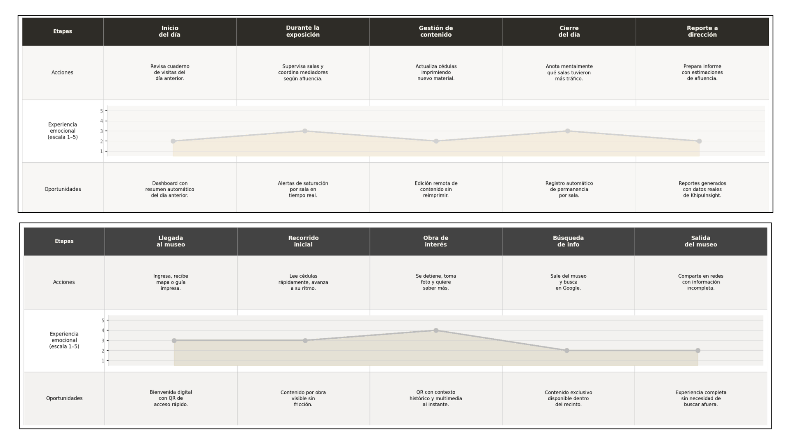

Note: En este gráfico del User Journey Map para ambos segmentos, se observa que el personal del museo busca optimizar tareas manuales como la gestión de contenidos y reportes mediante herramientas digitales que generen datos automáticos. Por otro lado, los visitantes inician su recorrido con entusiasmo, pero su satisfacción decae al tener que buscar información externa, lo que representa una oportunidad para ofrecer contenido multimedia inmediato mediante códigos QR. En conjunto, la imagen destaca la necesidad de digitalizar procesos para mejorar la eficiencia operativa del museo y enriquecer la experiencia informativa del público.

#### 2.3.4. Empathy Mapping

Empathy Mapping Segmento Objetivo 1:

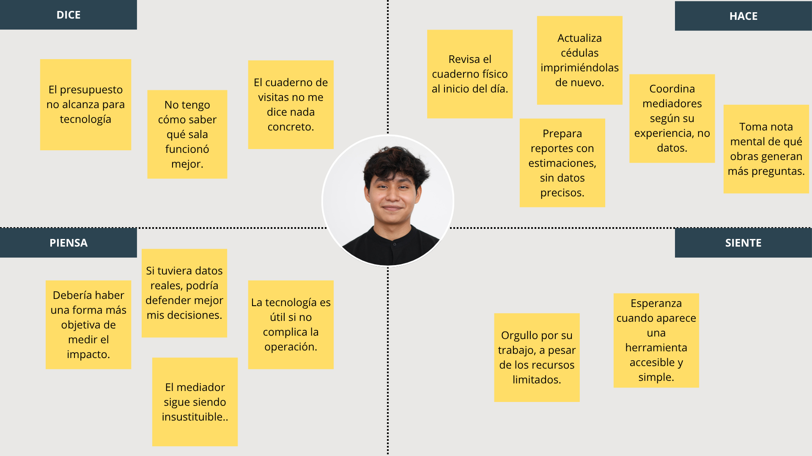

Note: En nuestro primer segmento tenemos al curador/gestor cultural, donde el mapa de empatía refleja que enfrenta limitaciones de recursos y falta de datos concretos, lo que lo lleva a tomar decisiones basadas en experiencia, aunque busca herramientas simples que le permitan medir mejor el impacto de sus exposiciones.

Empathy Mapping Segmento Objetivo 2:


Note: En nuestro segundo segmento tenemos a los visitantes del museo, donde el mapa de empatía muestra que buscan entender mejor las obras de forma rápida y sencilla, evitando herramientas complejas, y valoran experiencias que despierten su curiosidad sin interrumpir su recorrido.

### 2.4. Big Picture Event Storming

Para el desarrollo del Big Picture Event Storming de KhipuTech, se utilizó la herramienta Miro, que facilitó la colaboración y visualización de los diferentes elementos del proceso. A continuación, se presenta un resumen de los principales componentes identificados durante la sesión de Event Storming:

Primero, se definieron las leyendas para los diferentes elementos que se van a usar en el Event Storming:


- **Domain Events:** Representa un hecho del negocio que ya ocurrió y no puede cambiarse.
- **Hotspot Question Improvement:** Señala un punto de incertidumbre, duda o posible conflicto en el proceso. Se utiliza para visibilizar preguntas que aún no tienen respuesta clara, de modo que el equipo pueda discutirlas y mejorarlas más adelante.
- **Definition:** Aporta una explicación breve y precisa de un concepto clave dentro del dominio.
- **Actor:** Es la persona, rol u organización que interactúa con el sistema o provoca eventos.
- **Command:** Expresa la intención de realizar una acción en el sistema.
- **Comment:** Sirve para añadir notas, aclaraciones o hipótesis que enriquecen el contexto. No alteran el flujo, pero ayudan a documentar observaciones útiles para futuras discusiones.
- **Policy:** Define una regla de negocio que conecta automáticamente un evento con un comando.
- **External System:** Representa servicios o plataformas externas que interactúan con tu sistema, aunque no las controles directamente.

El Event Storming permitió identificar de forma colaborativa los eventos clave que marcan el flujo del sistema, desde las interacciones principales de los usuarios hasta los procesos internos que sostienen la experiencia. El proceso se desarrolló siguiendo pasos como el reconocimiento de los domain events, la incorporación de los actores que desencadenan acciones, la definición de los comandos que impulsan dichos eventos y la identificación de las políticas o reglas que guían la dinámica del sistema. A partir de esto se generaron ideas que ayudaron a visualizar cómo se conectan las acciones, qué actores participan en cada etapa y qué resultados se esperan, lo que facilitó comprender mejor la dinámica general y detectar oportunidades de mejora o innovación.

---

#### Big Picture Event Storming 1: Gestión de Visitantes

Para el desarrollo del primer Event Storming se identifican los domain events relacionados con la experiencia del visitante en el museo, como el escaneo de códigos QR/NFC en obras, el acceso a contenido multimedia y la acumulación de puntos de gamificación. Luego se reconocen los pasos que ejecuta el actor principal (el visitante), como ingresar al museo, aproximarse a una obra, escanear el código QR y visualizar información adicional. También se muestran las validaciones del sistema, por ejemplo, cuando una obra no tiene contenido disponible, lo que genera una notificación. Finalmente, se plantean preguntas para mejorar el flujo, como cómo hacer más atractiva la gamificación o cómo personalizar recomendaciones de obras según el perfil del visitante.

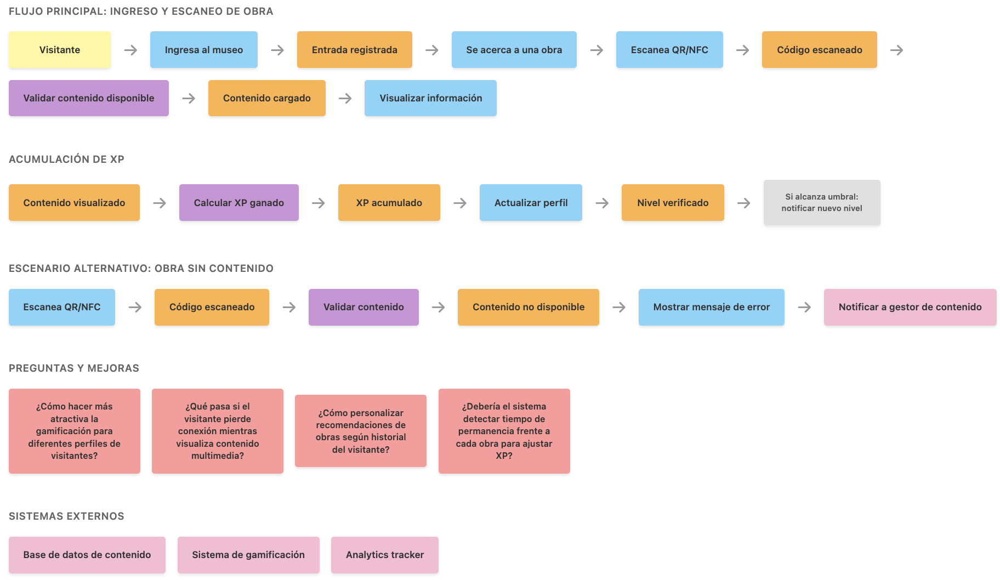

---

#### Big Picture Event Storming 2: Control de Aforo en Tiempo Real

Para el desarrollo del segundo Event Storming se identifican los domain events relacionados con el monitoreo de aforo, como la detección de entrada/salida de visitantes mediante sensores IoT, el cálculo de ocupación en tiempo real y la generación de alertas cuando se superan umbrales. El actor principal (gestor cultural/administrador) realiza acciones como acceder al dashboard, visualizar métricas de aforo por sala y configurar umbrales de alerta. El sistema interviene validando los datos de sensores a través de algoritmos de conteo y actualizando el dashboard según el resultado. Además, se incluyen notificaciones push para informar al gestor y preguntas clave para manejar casos especiales, como qué sucede si los sensores fallan temporalmente o cómo ajustar umbrales dinámicamente según eventos especiales.

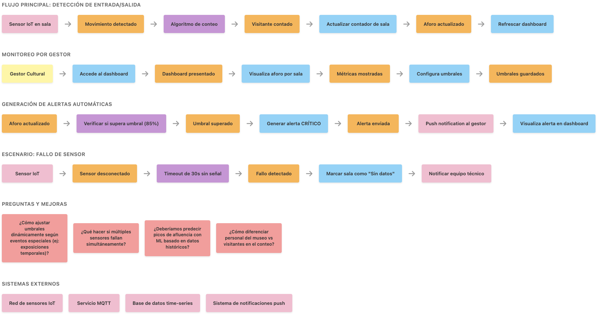

---

#### Big Picture Event Storming 3: Gestión de Contenido de Obras

Para el desarrollo del tercer Event Storming se identifican los domain events relacionados con la administración de contenido cultural en la plataforma. El actor principal (curador/gestor de contenido) inicia con la carga de información de una nueva obra: título, artista, descripción, imágenes de alta resolución y archivos de audio. Posteriormente, se asignan códigos QR/NFC únicos a cada obra y se valida que el contenido cumpla con estándares de calidad (resolución mínima, duración de audio, texto descriptivo). El sistema interviene en la generación automática de códigos, la compresión de imágenes para optimizar tiempos de carga y la sincronización con la base de datos central. Finalmente, se abordan preguntas como: ¿qué sucede si una obra tiene contenido multimedia en varios idiomas? ¿cómo gestionar versiones del contenido (por ejemplo, contenido infantil vs. adultos)?

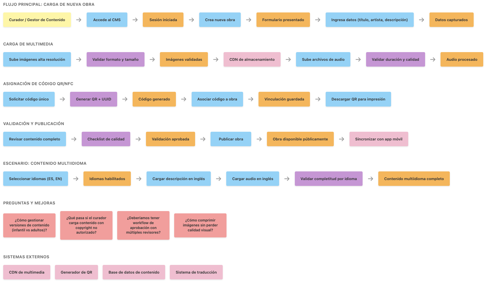

---

#### Big Picture Event Storming 4: Analítica y Generación de Reportes

Para el desarrollo del cuarto Event Storming se identifican los domain events de análisis de datos y generación de insights, como la creación de reportes de afluencia semanal, la identificación de obras más populares y el envío de alertas por patrones anómalos. El actor principal (administrador del museo) realiza acciones como iniciar sesión en el dashboard, seleccionar filtros de fecha/sala, configurar parámetros de reporte y exportar datos a PDF/Excel. El sistema valida los datos históricos almacenados, procesa métricas mediante algoritmos de agregación y notifica automáticamente cuando se detectan tendencias relevantes (por ejemplo, caída drástica en interacciones con ciertas obras). Finalmente, surgen preguntas clave sobre métricas a considerar, detección de patrones estacionales y definición de KPIs críticos para la toma de decisiones.


---

#### Big Picture Event Storming 5: Gamificación y Ranking de Visitantes

Para el desarrollo del quinto Event Storming se identifican los domain events relacionados con el sistema de gamificación, como la acumulación de puntos XP por interacción con obras, el avance de nivel del visitante y la actualización del ranking semanal. El actor principal (visitante) inicia sesión mediante QR/NFC, escanea múltiples obras durante su recorrido y acumula experiencia según el tiempo de permanencia y la cantidad de contenido consumido. El sistema valida la acumulación de XP, verifica si el visitante alcanzó un nuevo nivel (umbrales: 10, 50, 100 obras) y actualiza su posición en el ranking público. Se notifica al visitante cuando obtiene una insignia o sube de nivel. Surgen preguntas clave sobre cómo evitar comportamientos fraudulentos (escaneos rápidos sin interacción real), qué recompensas ofrecer a los visitantes más activos y cómo incluir desafíos semanales para aumentar engagement.


---

El Event Storming colaborativo permitió al equipo de KhipuTech identificar los flujos críticos del sistema, desde la experiencia del visitante hasta la gestión administrativa y analítica. Este ejercicio facilitó la detección temprana de puntos de fricción, oportunidades de automatización y necesidades de integración con sistemas externos (sensores IoT, pasarelas de pago para sponsors, APIs de redes sociales para compartir logros). Los insights obtenidos fueron fundamentales para definir los Bounded Contexts del diseño DDD y priorizar las User Stories en el Product Backlog.

### 2.5. Ubiquitous Language

---
### 3.1. User Stories

<table style="width: 100%; border-collapse: collapse;">
  
  <tr>
    <th style="text-align: center;">Epic/Story ID</th>
    <th style="text-align: center;">Título</th>
    <th style="text-align: center;">Descripción</th>
    <th style="text-align: center;">Criterios de Aceptación</th>
    <th style="text-align: center;">Relacionado con (Epic ID)</th>
  </tr>
  <!-- EPIC 1 -->
  <tr>
    <td style="text-align: center;">
    EP01
    </td>
    <td style="text-align: center;">
    Experiencia personalizada e interactiva
    </td>
    <td style="text-align: center;">
    Como museo privado, quiero acceder a contenido digital mediante códigos QR/NFC para enriquecer el recorrido y que sea una experiencia más atractiva y moderna.
    </td>
    <td style="text-align: center;">
    </td>
    <td style="text-align: center;">
    </td>
  </tr>
  <!-- EPIC 2 -->
  <tr>
    <td style="text-align: center;">
    EP02
    </td>
    <td style="text-align: center;">
    Inteligencia de negocio basada en comportamiento
    </td>
    <td style="text-align: center;">
    Como museo privado, quiero analizar cuáles exposiciones generan más interés y engagement para tomar decisiones estratégicas de marketing y curaduría.
    </td>
    <td style="text-align: center;">
    </td>
    <td style="text-align: center;">
    </td>
  </tr>
  <!-- EPIC 3 -->
  <tr>
    <td style="text-align: center;">
    EP03
    </td>
    <td style="text-align: center;">
    Optimización de ingresos y operación del museo
    </td>
    <td style="text-align: center;">
   Como gestor de museo privado, deseo gestionar y analizar el comportamiento de los visitantes y el uso de los recursos operativos, para maximizar los ingresos y mejorar la eficiencia de la operación del museo. 
    </td>
    <td style="text-align: center;">
    </td>
    <td style="text-align: center;">
    </td>
  </tr>
  <!-- EPIC 4 -->
  <tr>
    <td style="text-align: center;">
    EP04
    </td>
    <td style="text-align: center;">
    Control de aforo y cumplimiento de normativas
    </td>
    <td style="text-align: center;">
     Como administrador de un museo público, deseo monitorear y controlar el flujo de visitantes en tiempo real, para asegurar el cumplimiento de las normativas de aforo y garantizar la seguridad dentro del museo.
    </td>
    <td style="text-align: center;">
    </td>
    <td style="text-align: center;">
    </td>
  </tr>
  <!-- EPIC 5 -->
  <tr>
    <td style="text-align: center;">
    EP05
    </td>
    <td style="text-align: center;">
    Optimización de la experiencia del visitante
    </td>
    <td style="text-align: center;">
    Museo Público
    </td>
    <td style="text-align: center;">
    </td>
    <td style="text-align: center;">
    </td>
  </tr>
  <!-- EPIC 6 -->
  <tr>
    <td style="text-align: center;">
    EP06
    </td>
    <td style="text-align: center;">
    Toma de decisiones basada en datos
    </td>
    <td style="text-align: center;">
    Museo Público
    </td>
    <td style="text-align: center;">
    </td>
    <td style="text-align: center;">
    </td>
  </tr>
  <!-- EPIC 7 -->
  <tr>
    <td style="text-align: center;">
    EP07
    </td>
    <td style="text-align: center;">
    Usuarios dentro buscar información
    </td>
    <td style="text-align: center;">
    Como Museo, quiero que controlar quienes acceden a mis datos de mis exposiciones para no congestionar mi red
    </td>
    <td style="text-align: center;">
    </td>
    <td style="text-align: center;">
    </td>
  </tr>
 <!-- US01 -->
 <tr>
 <td style="text-align: center;">US01</td>
 <td style="text-align: center;">Acceso a contenido mediante QR</td>
 <td style="text-align: center;">Como museo privado, quiero que los visitantes escaneen un código QR para acceder al contenido digital de una obra.</td>
 <td style="text-align: center;">
 <br><br>Scenario 1: Acceso exitoso
 <br>Given un código QR válido
 <br>When el usuario lo escanea
 <br>Then el sistema muestra el contenido asociado
 <br><br>Scenario 2: QR inválido
 <br>Given un código QR inválido
 <br>When el usuario intenta acceder
 <br>Then el sistema muestra un error
 <br><br>Scenario 3: Rendimiento
 <br>Given una solicitud válida
 <br>When el sistema responde
 <br>Then el contenido carga en menos de 3 segundos
 </td>
 <td style="text-align: center;">EP01</td>
 </tr>
 <!-- US02 -->
 <tr>
 <td style="text-align: center;">US02</td>
 <td style="text-align: center;">Acceso mediante NFC</td>
 <td style="text-align: center;">Como museo privado, quiero que los visitantes accedan al contenido acercando su dispositivo a un punto NFC.</td>
 <td style="text-align: center;">
 <br><br>Scenario 1: Acceso válido
 <br>Given un dispositivo compatible
 <br>When el usuario acerca el dispositivo
 <br>Then el sistema muestra el contenido
 <br><br>Scenario 2: Dispositivo no compatible
 <br>Given un dispositivo no compatible
 <br>When intenta acceder
 <br>Then el sistema informa incompatibilidad
 <br><br>Scenario 3: Error de lectura
 <br>Given fallo en NFC
 <br>When se intenta acceder
 <br>Then el sistema no muestra contenido
 </td>
 <td style="text-align: center;">EP01</td>
 </tr>
 <!-- US03 -->
 <tr>
 <td style="text-align: center;">US03</td>
 <td style="text-align: center;">Visualización multimedia</td>
 <td style="text-align: center;">Como museo privado, quiero mostrar contenido multimedia para mejorar la comprensión.</td>
 <td style="text-align: center;">
 <br><br>Scenario 1: Visualización básica
 <br>Given contenido disponible
 <br>When el usuario accede
 <br>Then el sistema muestra texto e imágenes
 <br><br>Scenario 2: Reproducción
 <br>Given contenido multimedia
 <br>When el usuario reproduce
 <br>Then funciona correctamente
 <br><br>Scenario 3: Control
 <br>Given reproducción activa
 <br>When el usuario interactúa
 <br>Then puede pausar o reanudar
 </td>
 <td style="text-align: center;">EP01</td>
 </tr>
 <!-- US04 -->
 <tr>
 <td style="text-align: center;">US04</td>
 <td style="text-align: center;">Selección de idioma</td>
 <td style="text-align: center;"> Como Museo privado, quiero dar a escoger el idioma del contenido para ser más variado.</td>
 <td style="text-align: center;">
 <br><br>Scenario 1: Selección
 <br>Given múltiples idiomas
 <br>When el usuario selecciona uno
 <br>Then el sistema muestra el contenido en ese idioma
 <br><br>Scenario 2: Persistencia
 <br>Given una sesión activa
 <br>When el usuario navega
 <br>Then el idioma se mantiene
 </td>
 <td style="text-align: center;">EP01</td>
 </tr>
 <!-- US05 -->
 <tr>
 <td style="text-align: center;">US05</td>
 <td style="text-align: center;">Contenido por sala</td>
 <td style="text-align: center;"> Como Museo Privado, quiero dar contenido específico según la sala para así hacerlo más interactivo.</td>
 <td style="text-align: center;">
 <br><br>Scenario 1: Contenido correcto
 <br>Given una sala identificada
 <br>When el usuario accede
 <br>Then el sistema muestra contenido correspondiente
 <br><br>Scenario 2: Diferenciación
 <br>Given múltiples salas
 <br>When se accede
 <br>Then el contenido es distinto
 </td>
 <td style="text-align: center;">EP01</td>
 </tr>
 <!-- US06 -->
 <tr>
 <td style="text-align: center;">US06</td>
 <td style="text-align: center;">Historial de obras visitadas</td>
 <td style="text-align: center;"> Como Museo Privado, quiero dar contenido específico según la sala para así hacerlo más interactivo.</td>
 <td style="text-align: center;">
 <br><br>Scenario 1: Registro
 <br>Given interacción
 <br>When el usuario accede
 <br>Then el sistema guarda historial
 <br><br>Scenario 2: Consulta
 <br>Given historial existente
 <br>When el usuario consulta
 <br>Then el sistema lo muestra
 </td>
 <td style="text-align: center;">EP01</td>
 </tr>
 <!-- US07 -->
 <tr>
 <td style="text-align: center;">US07</td>
 <td style="text-align: center;">Recomendaciones de obras</td>
 <td style="text-align: center;"> Como museo privado, quiero dar sugerencias de obras relacionadas para intentar mejorarlas. </td>
 <td style="text-align: center;">
 <br><br>Scenario 1: Generación
 <br>Given historial
 <br>When el sistema analiza
 <br>Then genera recomendaciones
 <br><br>Scenario 2: Acceso
 <br>Given recomendaciones
 <br>When el usuario accede
 <br>Then puede navegar
 </td>
 <td style="text-align: center;">EP01</td>
 </tr>
 <!-- US08 -->
 <tr>
 <td style="text-align: center;">US08</td>
 <td style="text-align: center;">Interacción</td>
 <td style="text-align: center;"> Como museo privado, quiero que se marquen las obras favoritas para que se guarden.</td>
 <td style="text-align: center;">
 <br><br>Scenario 1: Marcar
 <br>Given una obra
 <br>When se marca
 <br>Then el sistema la guarda
 <br><br>Scenario 2: Desmarcar
 <br>Given una obra marcada
 <br>When se desmarca
 <br>Then se elimina
 </td>
 <td style="text-align: center;">EP01</td>
 </tr>
 <!-- US09 -->
 <tr>
 <td style="text-align: center;">US09</td>
 <td style="text-align: center;">Conteo</td>
 <td style="text-align: center;"> Como museo privado, quiero ver cuántas veces se accede a cada obra para tener información.</td>
 <td style="text-align: center;">
 <br><br>Scenario 1
 <br>Given acceso
 <br>When ocurre
 <br>Then se registra
 <br><br>Scenario 2
 <br>Given datos
 <br>When se consultan
 <br>Then se muestran
 </td>
 <td>EP02</td>
 </tr>
 <!-- US10 -->
 <tr>
 <td style="text-align: center;">US10</td>
 <td style="text-align: center;">Tiempo de interacción</td>
 <td style="text-align: center;"> Como museo privado, quiero medir cuánto tiempo pasan los usuarios en cada contenido para el feedback de la experiencia. </td>
 <td style="text-align: center;">
 <br><br>Scenario 1: Registro de tiempo
 <br>Given una sesión activa
 <br>When el usuario interactúa con el contenido
 <br>Then el sistema registra la duración
 <br><br>Scenario 2: Cálculo promedio
 <br>Given múltiples sesiones
 <br>When se procesan los datos
 <br>Then el sistema calcula el promedio
 <br><br>Scenario 3: Filtrado
 <br>Given sesiones atípicas
 <br>When se analizan
 <br>Then el sistema las excluye
 </td>
 <td style="text-align: center;">EP02</td>
 </tr>
 <!-- US11 -->
 <tr>
 <td style="text-align: center;">US11</td>
 <td style="text-align: center;">Ranking de obras</td>
 <td style="text-align: center;"> Como museo privado, quiero ver un ranking de obras más visitadas para mejorar la experiencia. </td>
 <td style="text-align: center;">
 <br><br>Scenario 1: Generación de ranking
 <br>Given datos de visitas
 <br>When se procesan
 <br>Then el sistema ordena las obras
 <br><br>Scenario 2: Actualización
 <br>Given nuevos datos
 <br>When se registran
 <br>Then el ranking se actualiza
 </td>
 <td style="text-align: center;">EP02</td>
 </tr>
 <!-- US12 -->
 <tr>
 <td style="text-align: center;">US12</td>
 <td style="text-align: center;">Análisis por horario</td>
 <td style="text-align: center;"> Como museo privado, quiero ver en qué horas hay más interacción para mejorar la gestión. </td>
 <td style="text-align: center;">
 <br><br>Scenario 1: Agrupación
 <br>Given datos registrados
 <br>When se agrupan
 <br>Then el sistema los organiza por hora
 <br><br>Scenario 2: Consulta
 <br>Given datos agrupados
 <br>When se consultan
 <br>Then se muestran correctamente
 </td>
 <td style="text-align: center;">EP02</td>
 </tr>
 <!-- US13 -->
 <tr>
 <td style="text-align: center;">US13</td>
 <td style="text-align: center;">Baja interacción</td>
 <td style="text-align: center;"> Como museo privado, quiero detectar obras con poco interés para decisiones administrativas.</td>
 <td style="text-align: center;">
 <br><br>Scenario 1: Identificación
 <br>Given un umbral definido
 <br>When una obra no lo alcanza
 <br>Then el sistema la identifica
 <br><br>Scenario 2: Consulta
 <br>Given obras identificadas
 <br>When se consultan
 <br>Then se muestran
 </td>
 <td style="text-align: center;">EP02</td>
 </tr>
 <!-- US14 -->
 <tr>
 <td style="text-align: center;">US14</td>
 <td style="text-align: center;">Dashboard en tiempo real</td>
 <td style="text-align: center;"> Como museo privado, quiero visualizar métricas en tiempo real para acciones a tiempo real. </td>
 <td style="text-align: center;">
 <br><br>Scenario 1: Actualización
 <br>Given datos en flujo
 <br>When cambian
 <br>Then el sistema se actualiza automáticamente
 <br><br>Scenario 2: Consulta
 <br>Given métricas
 <br>When se accede
 <br>Then se muestran actualizadas
 </td>
 <td style="text-align: center;">EP02</td>
 </tr>
 <!-- US15 -->
 <tr>
 <td style="text-align: center;">US15</td>
 <td style="text-align: center;">Exportación de reportes</td>
 <td style="text-align: center;"> Como museo privado, quiero exportar datos para análisis externo.</td>
  <td style="text-align: center;">
 <br><br>Scenario 1: Exportación válida
 <br>Given datos disponibles
 <br>When se solicita exportación
 <br>Then el sistema genera un archivo
 <br><br>Scenario 2: Contenido
 <br>Given un archivo generado
 <br>When se revisa
 <br>Then contiene información correcta
 </td>
 <td style="text-align: center;">EP02</td>
 </tr>
 <!-- US16 -->
 <tr>
 <td style="text-align: center;">US16</td>
 <td style="text-align: center;">Segmentación por tipo de contenido</td>
 <td style="text-align: center;"> Como museo privado, quiero saber qué tipo de contenido genera más engagement para darle más cuidados.</td>
 <td style="text-align: center;">
 <br><br>Scenario 1: Clasificación
 <br>Given diferentes tipos
 <br>When se analizan
 <br>Then el sistema los clasifica
 <br><br>Scenario 2: Comparación
 <br>Given datos segmentados
 <br>When se consultan
 <br>Then se muestran diferencias
 </td>
 <td style="text-align: center;">EP02</td>
 </tr>
 <!-- US17 -->
 <tr>
 <td style="text-align: center;">US17</td>
 <td style="text-align: center;">Visualizar metricas de ingresos</td>
 <td style="text-align: center;"> Como gestor de museo privado, quiero visualizar métricas de ingresos generados por las exhibiciones, para identificar cuáles generan mayor rentabilidad.</td>
 <td style="text-align: center;">
 <br><br>Scenario 1: Visualización
 <br>Given datos financieros
 <br>When se consultan
 <br>Then el sistema muestra ingresos
 <br><br>Scenario 2: Detalle
 <br>Given datos disponibles
 <br>When se revisan
 <br>Then se diferencian por exhibición
 </td>
 <td style="text-align: center;">EP03</td>
 </tr>
 <!-- US18 -->
 <tr>
 <td style="text-align: center;">US18</td>
 <td style="text-align: center;">Identificar obras mas rentables</td>
 <td style="text-align: center;"> Como gestor, quiero identificar qué obras generan mayor interacción pagada, para optimizar futuras exhibiciones.</td>
 <td style="text-align: center;">
 <br><br>Scenario 1: Ranking
 <br>Given datos de ingresos
 <br>When se analizan
 <br>Then el sistema genera ranking
 <br><br>Scenario 2: Actualización
 <br>Given nuevos datos
 <br>When se registran
 <br>Then se actualiza ranking
 </td>
 <td style="text-align: center;">EP03</td>
 </tr>
 <!-- US19 -->
 <tr>
 <td style="text-align: center;">US19</td>
 <td style="text-align: center;">Recursos</td>
 <td style="text-align: center;"> Como gestor, quiero analizar el flujo de visitantes, para redistribuir personal y recursos de manera eficiente.</td>
 <td style="text-align: center;">
 <br><br>Scenario 1: Análisis
 <br>Given datos de flujo
 <br>When se analizan
 <br>Then el sistema genera recomendaciones
 <br><br>Scenario 2: Consulta
 <br>Given recomendaciones
 <br>When se revisan
 <br>Then se muestran
 </td>
 <td style="text-align: center;">EP03</td>
 </tr>
 <!-- US20 -->
 <tr>
 <td style="text-align: center;">US20</td>
 <td style="text-align: center;">Reportes</td>
 <td style="text-align: center;"> Como gestor, quiero generar reportes de desempeño de las exhibiciones, para evaluar resultados y tomar decisiones estratégicas.</td>
 <td style="text-align: center;">
 <br><br>Scenario 1: Generación
 <br>Given datos disponibles
 <br>When se solicita reporte
 <br>Then el sistema genera documento
 <br><br>Scenario 2: Contenido
 <br>Given un reporte
 <br>When se revisa
 <br>Then contiene datos correctos
 </td>
 <td style="text-align: center;">EP03</td>
 </tr>
 <!-- US21 -->
 <tr>
 <td style="text-align: center;">US21</td>
 <td style="text-align: center;">Monitoreo de interacción</td>
 <td style="text-align: center;"> Como gestor, quiero monitorear la interacción de los visitantes con el contenido digital, para mejorar la experiencia.</td>
 <td style="text-align: center;">
 <br><br>Scenario 1: Registro de interacción
 <br>Given un visitante accede al contenido
 <br>When interactúa con la obra
 <br>Then el sistema registra la interacción
 <br><br>Scenario 2: Consulta de datos
 <br>Given datos registrados
 <br>When el gestor consulta
 <br>Then el sistema muestra la información
 </td>
 <td style="text-align: center;">EP03</td>
 </tr>
 <!-- US22 -->
 <tr>
 <td style="text-align: center;">US22</td>
 <td style="text-align: center;">Comparación rendimiento de exhibiciones</td>
 <td style="text-align: center;"> Como gestor, quiero comparar el rendimiento entre exhibiciones, para identificar oportunidades de mejora. </td>
 <td style="text-align: center;">
 <br><br>Scenario 1: Comparación
 <br>Given dos o más exhibiciones
 <br>When se analizan datos
 <br>Then el sistema muestra diferencias
 <br><br>Scenario 2: Visualización
 <br>Given resultados comparados
 <br>When se consultan
 <br>Then se muestran gráficos claros
 </td>
 <td style="text-align: center;">EP03</td>
 </tr>
 <!-- US23 -->
 <tr>
 <td style="text-align: center;">US23</td>
 <td style="text-align: center;"> Visualizar tendencias de visitantes. </td>
 <td style="text-align: center;"> Como administrador, quiero visualizar tendencias de visitas, para anticipar picos de demanda. </td>
 <td style="text-align: center;">
 <br><br>Scenario 1: Identificación de patrones
 <br>Given datos históricos
 <br>When se analizan
 <br>Then el sistema muestra tendencias
 <br><br>Scenario 2: Actualización
 <br>Given nuevos datos
 <br>When se registran
 <br>Then las tendencias se actualizan
 </td>
 <td style="text-align: center;">EP03</td>
 </tr>
 <!-- US24 -->
 <tr>
 <td style="text-align: center;">US24</td>
 <td style="text-align: center;"> Optimizar contenido premium </td>
 <td style="text-align: center;"> Como gestor, quiero ajustar el contenido premium según el interés del visitante, para aumentar su valor percibido. </td>
 <td style="text-align: center;">
 <br><br>Scenario 1: Edición
 <br>Given contenido premium
 <br>When el gestor lo modifica
 <br>Then el sistema actualiza el contenido
 <br><br>Scenario 2: Acceso
 <br>Given contenido actualizado
 <br>When el usuario accede
 <br>Then se muestra correctamente
 </td>
 <td style="text-align: center;">EP03</td>
 </tr>
 <!-- US25 -->
 <tr>
 <td style="text-align: center;">US25</td>
 <td style="text-align: center;"> Monitorear aforo en tiempo real </td>
 <td style="text-align: center;"> Como gestor de museo público, quiero monitorear el número de visitantes en tiempo real, para controlar el aforo permitido. </td>
 <td style="text-align: center;">
 <br><br>Scenario 1: Conteo en tiempo real
 <br>Given visitantes ingresan o salen
 <br>When el sistema registra movimientos
 <br>Then calcula el aforo actual
 <br><br>Scenario 2: Consulta
 <br>Given datos de aforo
 <br>When se consultan
 <br>Then se muestran actualizados
 </td>
 <td style="text-align: center;">EP04</td>
 </tr>
 <!-- US26 -->
 <tr>
 <td style="text-align: center;">US26</td>
 <td style="text-align: center;">Alertas de aforo</td>
 <td style="text-align: center;"> Como gestor, quiero recibir alertas cuando se supere el aforo permitido, para tomar acciones inmediatas. </td>
 <td style="text-align: center;">
 <br><br>Scenario 1: Alerta automática
 <br>Given un límite definido
 <br>When se supera el aforo
 <br>Then el sistema envía una alerta
 <br><br>Scenario 2: Configuración
 <br>Given límites configurados
 <br>When se actualizan
 <br>Then el sistema los aplica
 </td>
 <td style="text-align: center;">EP04</td>
 </tr>
 <!-- US27 -->
 <tr>
 <td style="text-align: center;">US27</td>
 <td style="text-align: center;">Flujo entre salas</td>
 <td style="text-align: center;"> Como gestor, quiero controlar el flujo de visitantes entre salas, para evitar congestión. </td>
 <td style="text-align: center;">
 <br><br>Scenario 1: Registro de movimiento
 <br>Given un visitante cambia de sala
 <br>When el sistema registra el evento
 <br>Then se actualiza el flujo
 <br><br>Scenario 2: Consulta
 <br>Given datos de flujo
 <br>When se consultan
 <br>Then se muestran por sala
 </td>
 <td style="text-align: center;">EP04</td>
 </tr>
 <!-- US28 -->
 <tr>
 <td style="text-align: center;">US28</td>
 <td style="text-align: center;">Historial de aforo</td>
 <td style="text-align: center;"> Como gestor, quiero acceder al historial de aforo, para evaluar el cumplimiento de normativas.</td>
 <td style="text-align: center;">
 <br><br>Scenario 1: Registro histórico
 <br>Given datos de aforo
 <br>When se almacenan
 <br>Then quedan registrados
 <br><br>Scenario 2: Consulta
 <br>Given historial disponible
 <br>When se consulta
 <br>Then el sistema muestra datos
 </td>
 <td style="text-align: center;">EP04</td>
 </tr>
 <!-- US29 -->
 <tr>
 <td style="text-align: center;">US29</td>
 <td style="text-align: center;">Zonas congestionadas</td>
 <td style="text-align: center;"> Como administrador, quiero identificar zonas con alta concentración de visitantes, para mejorar la distribución. </td>
 <td style="text-align: center;">
 <br><br>Scenario 1: Identificación
 <br>Given datos de ubicación
 <br>When se analizan
 <br>Then el sistema detecta congestión
 <br><br>Scenario 2: Visualización
 <br>Given zonas identificadas
 <br>When se consultan
 <br>Then se muestran claramente
 </td>
 <td style="text-align: center;">EP04</td>
 </tr>
 <!-- US30 -->
 <tr>
 <td style="text-align: center;">US30</td>
 <td style="text-align: center;">Cumplimiento normativo</td>
 <td style="text-align: center;"> Como administrador, quiero asegurar el cumplimiento de normativas de seguridad, para evitar sanciones y garantizar la seguridad..</td>
 <td style="text-align: center;">
 <br><br>Scenario 1: Validación de reglas
 <br>Given normas definidas
 <br>When se monitorea el sistema
 <br>Then se valida cumplimiento
 <br><br>Scenario 2: Registro
 <br>Given eventos del sistema
 <br>When ocurren
 <br>Then se registran
 </td>
 <td style="text-align: center;">EP04</td>
 </tr>
 <!-- US31 -->
 <tr>
 <td style="text-align: center;">US31</td>
 <td style="text-align: center;">Acceso remoto al monitoreo</td>
 <td style="text-align: center;"> Como administrador, quiero acceder al sistema de monitoreo desde cualquier dispositivo, para supervisar el museo de forma remota.</td>
 <td style="text-align: center;">
 <br><br>Scenario 1: Acceso válido
 <br>Given credenciales válidas
 <br>When el administrador inicia sesión
 <br>Then el sistema permite acceso remoto
 <br><br>Scenario 2: Acceso desde dispositivo móvil
 <br>Given un dispositivo móvil
 <br>When el administrador accede
 <br>Then el sistema se adapta correctamente
 </td>
 <td style="text-align: center;">EP04</td>
 </tr>
 <!-- US32 -->
 <tr>
 <td style="text-align: center;">US32</td>
 <td style="text-align: center;">Seguridad del visitante</td>
 <td style="text-align: center;"> Como administrador, quiero garantizar una distribución segura de visitantes, para mejorar la experiencia y prevenir riesgos.</td>
 <td style="text-align: center;">
 <br><br>Scenario 1: Control de flujo activo
 <br>Given visitantes en el museo
 <br>When el sistema analiza el flujo
 <br>Then se reduce la congestión
 <br><br>Scenario 2: Prevención de riesgo
 <br>Given alta concentración
 <br>When se detecta saturación
 <br>Then el sistema ajusta el flujo
 </td>
 <td style="text-align: center;">EP04</td>
 </tr>
 <!-- US33 -->
 <tr>
 <td style="text-align: center;">US33</td>
 <td style="text-align: center;">Acceso QR visitante</td>
 <td style="text-align: center;">Como visitante, quiero escanear códigos QR para acceder al contenido de las obras.</td>
 <td style="text-align: center;">
 <br><br>Scenario 1: Acceso exitoso
 <br>Given un QR válido
 <br>When el visitante lo escanea
 <br>Then el sistema muestra el contenido
 <br><br>Scenario 2: Error de acceso
 <br>Given un QR inválido
 <br>When el visitante lo escanea
 <br>Then el sistema muestra un mensaje de error
 </td>
 <td style="text-align: center;">EP05</td>
 </tr>
 <!-- US34 -->
 <tr>
 <td style="text-align: center;">US34</td>
 <td style="text-align: center;">Acceso sin descarga</td>
 <td style="text-align: center;"> Como visitante, quiero acceder al contenido sin descargar aplicaciones para una experiencia rápida. </td>
 <td style="text-align: center;">
 <br><br>Scenario 1: Acceso web
 <br>Given un enlace de contenido
 <br>When el usuario accede
 <br>Then el sistema muestra contenido sin instalación
 <br><br>Scenario 2: Compatibilidad de dispositivos
 <br>Given un dispositivo móvil o desktop
 <br>When el usuario abre el enlace
 <br>Then el sistema adapta la interfaz automáticamente
 </td>
 <td style="text-align: center;">EP05</td>
 </tr>
 <!-- US35 -->
 <tr>
 <td style="text-align: center;">US35</td>
 <td style="text-align: center;">Visualización multimedia</td>
 <td style="text-align: center;">Como visitante, quiero visualizar contenido multimedia para enriqueder la experiencia.</td>
 <td style="text-align: center;">
 <br><br>Scenario 1: Reproducción
 <br>Given contenido multimedia
 <br>When el usuario lo abre
 <br>Then el sistema lo reproduce correctamente
 <br><br>Scenario 2: Control de reproducción
 <br>Given un video o audio en reproducción
 <br>When el usuario pausa o ajusta volumen
 <br>Then el sistema responde inmediatamente a los controles
 </td>
 <td style="text-align: center;">EP05</td>
 </tr>
 <td style="text-align: center;">EP05</td>
 </tr>
 <!-- US36 -->
 <tr>
 <td style="text-align: center;">US36</td>
 <td style="text-align: center;">Navegación entre obras</td>
 <td style="text-align: center;"> Como visitante, quiero navegar entre contenidos para mejorar mi recorrido. </td>
 <td style="text-align: center;">
 <br><br>Scenario 1: Cambio de obra
 <br>Given varias obras disponibles
 <br>When el usuario selecciona otra
 <br>Then el sistema carga el nuevo contenido
 <br><br>Scenario 2: Historial de navegación
 <br>Given múltiples obras visitadas
 <br>When el usuario retrocede
 <br>Then el sistema muestra la obra anterior visitada
 </td>
 <td style="text-align: center;">EP05</td>
 </tr>
 <!-- US37 -->
 <tr>
 <td style="text-align: center;">US37</td>
 <td style="text-align: center;">Recomendaciones de recorrido</td>
 <td style="text-align: center;"> Como visitante, quiero recibir sugerencias de recorrido para optimizar mi visita. </td>
 <td style="text-align: center;">
 <br><br>Scenario 1: Generación de sugerencias
 <br>Given datos de visitas
 <br>When el sistema analiza patrones
 <br>Then genera recomendaciones de recorrido
 <br><br>Scenario 2: Personalización de recomendaciones
 <br>Given el historial del usuario
 <br>When el sistema identifica preferencias
 <br>Then ajusta las recomendaciones según intereses
 </td>
 <td style="text-align: center;">EP05</td>
 </tr>
 <!-- US38 -->
 <tr>
 <td style="text-align: center;">US38</td>
 <td style="text-align: center;">Contenido exclusivo</td>
 <td style="text-align: center;"> Como visitante, quiero acceder a contenido exclusivo dentro del museo para enriquecer la experiencia. </td>
 <td style="text-align: center;">
 <br><br>Scenario 1: Acceso permitido
 <br>Given el usuario está dentro del museo
 <br>When solicita contenido exclusivo
 <br>Then el sistema lo habilita
 <br><br>Scenario 2: Acceso restringido
 <br>Given el usuario está fuera del museo
 <br>When solicita contenido exclusivo
 <br>Then el sistema lo bloquea
 </td>
 <td style="text-align: center;">EP05</td>
 </tr>
 <!-- US39 -->
 <tr>
 <td style="text-align: center;">US39</td>
 <td style="text-align: center;">Sistema de recompensas</td>
 <td style="text-align: center;"> Como visitante, quiero obtener insignias digitales al interactuar con obras para motivar mi recorrido.</td>
 <td style="text-align: center;">
 <br><br>Scenario 1: Otorgamiento de recompensa
 <br>Given interacción completada
 <br>When el usuario cumple condiciones
 <br>Then el sistema otorga una insignia
 <br><br>Scenario 2: Visualización de insignias
 <br>Given insignias otorgadas al usuario
 <br>When el usuario accede a su perfil
 <br>Then el sistema muestra todas las insignias obtenidas
 </td>
 <td style="text-align: center;">EP05</td>
 </tr>
 <!-- US40 -->
 <tr>
 <td style="text-align: center;">US40</td>
 <td style="text-align: center;">Carga rápida de contenido</td>
 <td style="text-align: center;"> Como visitante, quiero que el contenido se cargue rápido para no perder tiempo. </td>
 <td style="text-align: center;">
 <br><br>Scenario 1: Rendimiento
 <br>Given una solicitud de contenido
 <br>When el sistema responde
 <br>Then la carga es menor a 3 segundos
 <br><br>Scenario 2: Optimización de recursos
 <br>Given múltiples usuarios accediendo simultáneamente
 <br>When el sistema distribuye la carga
 <br>Then mantiene tiempos de respuesta óptimos
 </td>
 <td style="text-align: center;">EP05</td>
 </tr>
 <!-- US41 -->
 <tr>
 <td style="text-align: center;">US41</td>
 <td style="text-align: center;">Dashboard de afluencia</td>
 <td style="text-align: center;"> Como administrador, quiero visualizar la afluencia por sala para tomar decisiones rápidas. </td>
 <td style="text-align: center;">
 <br><br>Scenario 1: Visualización en tiempo real
 <br>Given sensores activos en el museo
 <br>When el sistema recibe datos
 <br>Then el dashboard muestra la afluencia por sala
 <br><br>Scenario 2: Actualización de datos
 <br>Given cambios en la afluencia
 <br>When ocurren movimientos de visitantes
 <br>Then la información se actualiza automáticamente
 </td>
 <td style="text-align: center;">EP06</td>
 </tr>
 <!-- US42 -->
 <tr>
 <td style="text-align: center;">US42</td>
 <td style="text-align: center;">Permanencia en obras</td>
 <td style="text-align: center;"> Como administrador, quiero conocer el tiempo de permanencia por obra para medir el engagement.</td>
 <td style="text-align: center;">
 <br><br>Scenario 1: Registro de permanencia
 <br>Given interacción del usuario con una obra
 <br>When el usuario permanece en la obra
 <br>Then el sistema registra el tiempo
 <br><br>Scenario 2: Cálculo promedio
 <br>Given múltiples interacciones
 <br>When se analizan los datos
 <br>Then se calcula el tiempo promedio
 </td>
 <td style="text-align: center;">EP06</td>
 </tr>
 <!-- US43 -->
 <tr>
 <td style="text-align: center;">US43</td>
 <td style="text-align: center;">Ranking de obras</td>
 <td style="text-align: center;"> Como curador, quiero identificar las obras más visitadas para optimizar las exhibiciones. </td>
 <td style="text-align: center;">
 <br><br>Scenario 1: Generación de ranking
 <br>Given datos de visitas
 <br>When el sistema los procesa
 <br>Then genera un ranking ordenado
 <br><br>Scenario 2: Actualización del ranking
 <br>Given nuevas visitas registradas
 <br>When el sistema actualiza los datos
 <br>Then el ranking se recalcula automáticamente
 </td>
 <td style="text-align: center;">EP06</td>
 </tr>
 <!-- US44 -->
 <tr>
 <td style="text-align: center;">US44</td>
 <td style="text-align: center;">Detección de baja interacción</td>
 <td style="text-align: center;"> Como curador, quiero detectar obras con baja interacción para replantear su presentación.</td>
 <td style="text-align: center;">
 <br><br>Scenario 1: Identificación automática
 <br>Given un umbral de interacción definido
 <br>When una obra no lo cumple
 <br>Then el sistema la marca como baja interacción
 <br><br>Scenario 2: Notificación al curador
 <br>Given una obra detectada con baja interacción
 <br>When el sistema valida la condición
 <br>Then envía una alerta al curador responsable
 </td>
 <td style="text-align: center;">EP06</td>
 </tr>
 <!-- US45 -->
 <tr>
 <td style="text-align: center;">US45</td>
 <td style="text-align: center;">Exportación de reportes</td>
 <td style="text-align: center;"> Como administrador, quiero exportar reportes para presentarlos a patrocinadores. </td>
 <td style="text-align: center;">
 <br><br>Scenario 1: Exportación exitosa
 <br>Given datos disponibles
 <br>When el usuario solicita exportación
 <br>Then el sistema genera archivo PDF o Excel
 <br><br>Scenario 2: Selección de formato
 <br>Given múltiples formatos disponibles
 <br>When el usuario elige un formato específico
 <br>Then el sistema exporta el reporte en el formato seleccionado
 </td>
 <td style="text-align: center;">EP06</td>
 </tr>
 <!-- US46 -->
 <tr>
 <td style="text-align: center;">US46</td>
 <td style="text-align: center;">Alertas de saturación</td>
 <td style="text-align: center;"> Como administrador, quiero recibir alertas cuando una sala esté saturada para actuar rápidamente. </td>
 <td style="text-align: center;">
 <br><br>Scenario 1: Alerta automática
 <br>Given una sala supera el límite de capacidad
 <br>When el sistema detecta la saturación
 <br>Then envía una notificación inmediata
 <br><br>Scenario 2: Resolución de saturación
 <br>Given una alerta de saturación activa
 <br>When el personal reduce el flujo de visitantes
 <br>Then la alerta se desactiva automáticamente
 </td>
 <td style="text-align: center;">EP06</td>
 </tr>
 <!-- US47 -->
 <tr>
 <td style="text-align: center;">US47</td>
 <td style="text-align: center;">Análisis histórico</td>
 <td style="text-align: center;"> Como administrador quiero comparar los datos históricos para mejorar la planificación. </td>
 <td style="text-align: center;">
 <br><br>Scenario 1: Comparación de periodos
 <br>Given datos históricos almacenados
 <br>When el usuario selecciona fechas
 <br>Then el sistema muestra métricas comparativas
 <br><br>Scenario 2: Filtrado de datos históricos
 <br>Given múltiples variables disponibles
 <br>When el usuario aplica filtros
 <br>Then el sistema muestra resultados segmentados
 </td>
 <td style="text-align: center;">EP06</td>
 </tr>
 <!-- US48 -->
 <tr>
 <td style="text-align: center;">US48</td>
 <td style="text-align: center;">Distribución de visitantes</td>
 <td style="text-align: center;"> Como administrador, quiero visualizar la distribución de visitantes en las diferentes salas del museo, para entender el flujo y tomar decisiones informadas. </td>
 <td style="text-align: center;">
 <br><br>Scenario 1: Visualización de distribución
 <br>Given datos de visitantes
 <br>When el sistema procesa la información
 <br>Then muestra la distribución por sala
 <br><br>Scenario 2: Actualización en tiempo real
 <br>Given sensores activos en salas
 <br>When entran nuevos visitantes
 <br>Then el sistema actualiza la distribución automáticamente
 </td>
 <td style="text-align: center;">EP06</td>
 </tr>
 <!-- US49 -->
 <tr>
 <td style="text-align: center;">US49</td>
 <td style="text-align: center;">Acceso sin registro</td>
 <td style="text-align: center;"> Como museo privado, quiero que el acceso al contenido sin registro obligatorio para que todos puedan entrar rapidamente. </td>
 <td style="text-align: center;">
 <br><br>Scenario 1: Acceso libre
 <br>Given un usuario nuevo
 <br>When accede al sistema
 <br>Then puede visualizar contenido sin autenticación
 <br><br>Scenario 2: Restricción de funciones avanzadas
 <br>Given un usuario sin registro
 <br>When intenta acceder a funciones administrativas
 <br>Then el sistema restringe el acceso y solicita autenticación
 </td>
 <td style="text-align: center;">EP01</td>
 </tr>
 <!-- US50 -->
 <tr>
 <td style="text-align: center;">US50</td>
 <td style="text-align: center;">Accesibilidad del contenido</td>
 <td style="text-align: center;"> Como visitante, quiero que el contenido sea accesible para que sea más atractivo al público en general. </td>
 <td style="text-align: center;">
 <br><br>Scenario 1: Legibilidad
 <br>Given contenido disponible
 <br>When el usuario accede
 <br>Then el texto es legible y claro
 <br><br>Scenario 2: Compatibilidad
 <br>Given diferentes dispositivos
 <br>When se accede al sistema
 <br>Then el contenido es adaptable
 </td>
 <td style="text-align: center;">EP07</td>
 </tr>
 <!-- US51 -->
 <tr>
 <td style="text-align: center;">US51</td>
 <td style="text-align: center;">Alertas de comportamiento</td>
 <td style="text-align: center;"> Como administrador, quiero recibir alertas cuando una obra tenga alta o baja interacción para acciones más precisas. </td>
 <td style="text-align: center;">
 <br><br>Scenario 1: Activación de alerta
 <br>Given umbrales definidos
 <br>When se detecta comportamiento anómalo
 <br>Then el sistema genera una alerta
 <br><br>Scenario 2: Desactivación de alertas
 <br>Given una alerta activa
 <br>When el administrador ajusta o desactiva los umbrales
 <br>Then el sistema deja de generar alertas para ese caso
 </td>
 <td style="text-align: center;">EP02</td>
 </tr>
 <!-- US52 -->
 <tr>
 <td style="text-align: center;">US52</td>
 <td style="text-align: center;">Tendencias históricas</td>
 <td style="text-align: center;"> Como administrador, quiero ver la evolución del interés en el tiempo para reportes más precisos. </td>
 <td style="text-align: center;">
 <br><br>Scenario 1: Análisis histórico
 <br>Given datos almacenados en el tiempo
 <br>When el usuario selecciona un periodo
 <br>Then el sistema muestra tendencias de comportamiento
 <br><br>Scenario 2: Comparación de periodos
 <br>Given dos rangos de fechas seleccionados
 <br>When el usuario solicita comparación
 <br>Then el sistema muestra diferencias de tendencia entre ambos periodos
 </td>
 <td style="text-align: center;">EP02</td>
 </tr>
 </table>

### 3.2. Impact Mapping


### 3.3. Product Backlog

| **# Orden** | **User Story Id** | **Título** | **Descripción** | **Story Points (1/2/3/5/8)** |
|-------------|-------------------|------------|-----------------|------------------------------|
| 1 | US01 | Acceso a contenido mediante QR | Como visitante quiero escanear un código QR para acceder al contenido digital de una obra para obtener información inmediata durante el recorrido. | 3 |
| 2 | US02 | Acceso sin instalación | Como visitante quiero acceder al contenido desde mi navegador sin instalar aplicaciones para tener una experiencia rápida y sin fricción. | 2 |
| 3 | US03 | Visualización multimedia | Como visitante quiero visualizar contenido multimedia de las obras para comprender mejor su contexto y enriquecer mi experiencia. | 3 |
| 4 | US04 | Contenido exclusivo | Como visitante quiero acceder a contenido exclusivo dentro del museo para vivir una experiencia diferenciada. | 3 |
| 5 | US05 | Selección de idioma | Como visitante quiero seleccionar el idioma del contenido para entender la información en mi idioma preferido. | 2 |
| 6 | US06 | Navegación entre obras | Como visitante quiero navegar entre contenidos de distintas obras para explorar el museo de forma continua. | 3 |
| 7 | US07 | Acceso sin registro | Como visitante quiero acceder al contenido sin necesidad de registrarme para ingresar rápidamente al sistema. | 2 |
| 8 | US08 | Carga rápida | Como visitante quiero que el contenido cargue en menos de 3 segundos para no perder tiempo durante mi recorrido. | 3 |
| 9 | US09 | Historial de obras | Como visitante quiero ver las obras que ya visité para revisarlas nuevamente durante mi recorrido. | 3 |
| 10 | US10 | Obras favoritas | Como visitante quiero marcar obras como favoritas para acceder fácilmente a ellas después. | 2 |
| 11 | US11 | Recomendaciones de obras | Como visitante quiero recibir recomendaciones basadas en mis interacciones para descubrir nuevas obras relevantes. | 5 |
| 12 | US12 | Rutas sugeridas | Como visitante quiero recibir sugerencias de recorrido para optimizar mi visita dentro del museo. | 5 |
| 13 | US13 | Accesibilidad del contenido | Como visitante quiero que el contenido sea accesible (audio, texto claro) para mejorar mi experiencia. | 3 |
| 14 | US14 | Registro de interacciones | Como gestor quiero registrar las interacciones de los visitantes para analizar su comportamiento. | 5 |
| 15 | US15 | Dashboard en tiempo real | Como gestor quiero visualizar métricas en tiempo real para monitorear el comportamiento de los visitantes. | 5 |
| 16 | US16 | Ranking de obras | Como gestor quiero visualizar las obras más visitadas para identificar cuáles generan mayor interés. | 3 |
| 17 | US17 | Tiempo de interacción | Como gestor quiero medir el tiempo de permanencia en cada obra para evaluar el nivel de engagement. | 5 |
| 18 | US18 | Baja interacción | Como gestor quiero detectar obras con bajo interés para tomar decisiones de mejora. | 3 |
| 19 | US19 | Exportación de reportes | Como gestor quiero exportar reportes para analizarlos y compartirlos con stakeholders. | 3 |
| 20 | US20 | Análisis por horarios | Como gestor quiero analizar visitas por franjas horarias para identificar horas pico. | 5 |
| 21 | US21 | Tendencias históricas | Como gestor quiero analizar tendencias en el tiempo para mejorar la planificación. | 5 |
| 22 | US22 | Control de aforo | Como gestor quiero monitorear la cantidad de visitantes en tiempo real para garantizar la seguridad. | 5 |
| 23 | US23 | Alertas de aforo | Como gestor quiero recibir alertas cuando se supere el límite de visitantes para actuar rápidamente. | 3 |
| 24 | US24 | Flujo por salas | Como gestor quiero visualizar el flujo de visitantes por sala para evitar congestión. | 5 |
| 25 | US25 | Zonas congestionadas | Como gestor quiero identificar zonas con alta concentración para mejorar la distribución de visitantes. | 5 |
| 26 | US26 | Recomendaciones operativas | Como gestor quiero recibir recomendaciones para optimizar recursos y flujo del museo. | 5 |
| 27 | US27 | Reportes de desempeño | Como gestor quiero generar reportes integrales para evaluar resultados del museo. | 5 |
| 28 | US28 | Comparación de exhibiciones | Como gestor quiero comparar exhibiciones para identificar oportunidades de mejora. | 5 |
| 29 | US29 | Métricas de ingresos | Como gestor quiero visualizar ingresos por exhibición para optimizar la rentabilidad. | 5 |
| 30 | US30 | Control de acceso | Como administrador quiero gestionar accesos y roles para proteger la información del sistema. | 3 |
| 31 | US31 | Acceso remoto | Como gestor quiero acceder al sistema desde cualquier dispositivo para monitorear el museo en tiempo real. | 3 |
| 32 | US32 | Redirección de flujo | Como gestor quiero redirigir visitantes en caso de congestión para mejorar la circulación. | 5 |
| 33 | US33 | Acceso alternativo QR | Como visitante quiero acceder al contenido mediante QR de forma confiable para evitar errores. | 2 |
| 34 | US34 | Compatibilidad dispositivos | Como visitante quiero que el sistema funcione en cualquier dispositivo para acceder sin problemas. | 2 |
| 35 | US35 | Multimedia adaptable | Como visitante quiero que el contenido multimedia se adapte a mi pantalla para mejorar la visualización. | 3 |
| 36 | US36 | Navegación fluida | Como visitante quiero cambiar entre obras sin recargar la página para una mejor experiencia. | 3 |
| 37 | US37 | Recomendaciones inteligentes | Como visitante quiero recomendaciones según afluencia para evitar zonas congestionadas. | 5 |
| 38 | US38 | Validación de contenido exclusivo | Como visitante quiero que el contenido exclusivo solo funcione dentro del museo para mantener su valor. | 3 |
| 39 | US39 | Insignias digitales | Como visitante quiero obtener logros por interactuar con obras para motivar mi recorrido. | 3 |
| 40 | US40 | Rendimiento del sistema | Como visitante quiero que el sistema responda rápido para no afectar mi experiencia. | 3 |
| 41 | US41 | Dashboard de afluencia | Como administrador quiero ver la afluencia por sala para tomar decisiones rápidas. | 5 |
| 42 | US42 | Permanencia en obras | Como administrador quiero conocer el tiempo de permanencia para medir engagement. | 5 |
| 43 | US43 | Ranking curatorial | Como curador quiero identificar obras populares para optimizar exhibiciones. | 3 |
| 44 | US44 | Detección de baja interacción | Como curador quiero detectar obras con bajo interés para mejorarlas. | 3 |
| 45 | US45 | Exportación avanzada | Como administrador quiero exportar reportes en varios formatos para presentaciones. | 3 |
| 46 | US46 | Alertas de saturación | Como administrador quiero recibir alertas de saturación para actuar rápidamente. | 3 |
| 47 | US47 | Análisis histórico | Como administrador quiero comparar datos históricos para mejorar decisiones. | 5 |
| 48 | US48 | Distribución de visitantes | Como administrador quiero visualizar la distribución para entender el flujo del museo. | 5 |
| 49 | US49 | Acceso sin fricción | Como museo quiero permitir acceso rápido sin login para mejorar la adopción. | 2 |
| 50 | US50 | Accesibilidad | Como visitante quiero contenido accesible para mejorar la experiencia general. | 3 |
| 51 | US51 | Alertas de comportamiento | Como administrador quiero recibir alertas de interacción para tomar decisiones. | 3 |
| 52 | US52 | Tendencias de comportamiento | Como administrador quiero analizar tendencias para mejorar la planificación. | 5 |

## Capítulo IV: Product Design


### 4.1. Style Guidelines

#### 4.1.1. General Style Guidelines

---

##### Branding

**Concepto de Marca:**

El nombre **"KhipuTech"** une el _Khipu_ (sistema de registro incaico basado en nudos) con la tecnología moderna. Visualmente, buscamos transmitir **conexión**, **datos** y **herencia cultural**.

El logotipo utiliza líneas minimalistas que emulen las cuerdas de un khipu, formando una **red o nodo** que simboliza los puntos de datos (sensores). Esta geometría representa la precisión del monitoreo en tiempo real y la herencia intelectual de sistemas de información ancestrales reencuadrados con tecnología contemporánea.

**Logotipo Principal:**


_Logotipo principal: Nodo central con ramificaciones conectadas, wordmark "Khipu" (peso 600) + "Tech" (peso 300)_

**Versión con Tagline:**


_Versión completa con tagline "REAL-TIME VISITOR ANALYTICS" en DM Mono, caps espaciado_

**Variaciones de Color:**


_De izquierda a derecha: Versión fondo oscuro (principal), fondo claro (navy), versión Inca Gold_

---

##### Typography

KhipuTech utiliza un sistema tipográfico dual que separa contenido editorial de datos técnicos.

**Familia Tipográfica Principal:**

- **DM Sans** — Títulos, navegación, cuerpo de texto general
  - Weights disponibles: 300 (Light), 400 (Regular), 500 (Medium), 600 (SemiBold), 700 (Bold)
    **Familia Tipográfica Técnica:**
- **DM Mono** — Datos numéricos, timestamps, códigos de sala, métricas de sensores
  - Weights disponibles: 400 (Regular), 500 (Medium)
    **Especificaciones:**

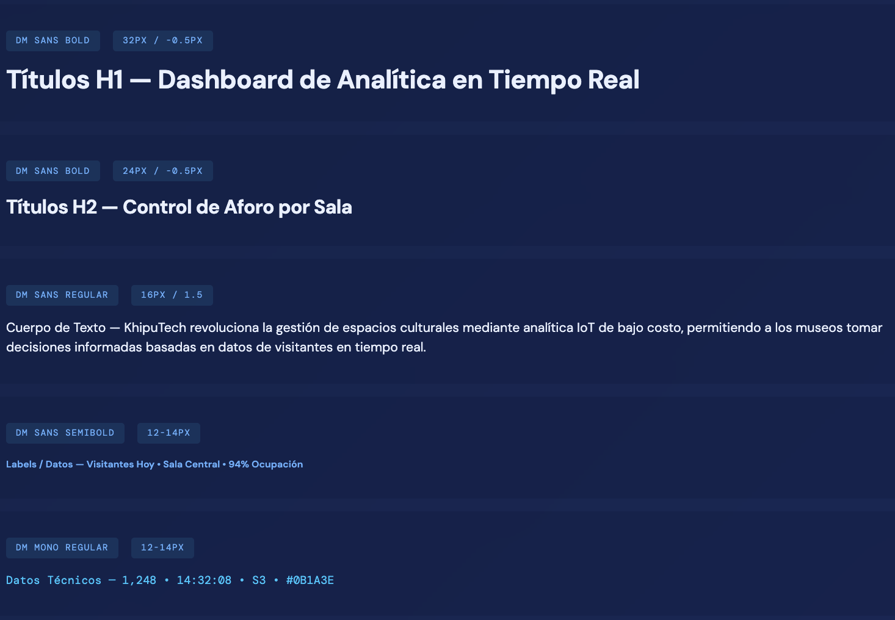

| Uso            | Familia | Weight  | Tamaño | Line Height | Letter Spacing | Aplicación                                    |
| -------------- | ------- | ------- | ------ | ----------- | -------------- | --------------------------------------------- |
| **Display**    | DM Sans | 700     | 48px   | 56px        | -1px           | Hero sections, títulos principales de landing |
| **H1**         | DM Sans | 700     | 32px   | 40px        | -0.5px         | Encabezados de página, títulos de dashboard   |
| **H2**         | DM Sans | 700     | 24px   | 32px        | -0.5px         | Secciones principales, títulos de cards       |
| **H3**         | DM Sans | 600     | 20px   | 28px        | 0px            | Subsecciones, títulos de componentes          |
| **H4**         | DM Sans | 600     | 18px   | 24px        | 0px            | Títulos de módulos pequeños                   |
| **Body Large** | DM Sans | 400     | 16px   | 24px (1.5)  | 0px            | Texto principal de landing page               |
| **Body**       | DM Sans | 400     | 14px   | 20px        | 0px            | Texto general de aplicación                   |
| **Body Small** | DM Sans | 400     | 12px   | 18px        | 0px            | Texto secundario, descripciones               |
| **Caption**    | DM Sans | 500     | 10px   | 14px        | 0.5px          | Labels, metadatos, badges                     |
| **Data/Code**  | DM Mono | 400-500 | 12px   | 18px        | 0px            | Valores numéricos, timestamps, IDs de sala    |

**Uso de DM Mono:**

La tipografía monoespaciada se reserva exclusivamente para:

- Valores de aforo (ej: "1,248 visitantes")
- Timestamps (ej: "14:32:08")
- IDs de sala (ej: "S3", "Sala-042")
- Métricas de sensores
- Códigos de color (ej: "#0B1A3E")
  Esto mantiene legibilidad óptima en tablas densas de datos y dashboards con información técnica.

---

##### Iconography

**Sistema de Iconos:**


_Sistema de iconos: Dashboard, Sensor/Nodo, Ubicación, Obra, Alerta, Notificación, Configuración, Analítica_

**Especificaciones Técnicas:**

Los iconos del sistema utilizan **Lucide Icons** con las siguientes características:

- **Stroke:** 2px (coherente con la geometría limpia del logo)
- **Estilo:** Outline sin relleno sólido
- **Tamaños:** 16px, 20px, 24px, 32px (según contexto)
- **Color:** Hereda del elemento padre o usa Electric Blue (#00C8FF) para estados activos
  **Iconos de Sensores y Zonas:**

Los iconos que representen sensores, zonas o puntos de conteo siguen la **estética de nodos conectados**, alineada al concepto del Khipu:

- Nodo central con ramificaciones
- Sin relleno sólido, solo trazo
- Geometría que sugiere precisión y monitoreo
  **Ejemplo de aplicación:**

```
Dashboard: ◈ (nodo con crosshair central)
Sensor: ⬡ (hexágono outline)
Ubicación: ◎ (círculo con punto central)
Alerta: ◉ (círculo con indicador)
```

Esta iconografía refuerza visualmente el mensaje de "red de datos" inherente a la marca KhipuTech.

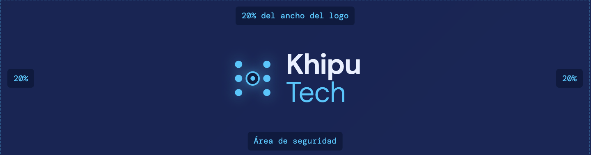

---

##### Color Palette

**Paleta Principal:**

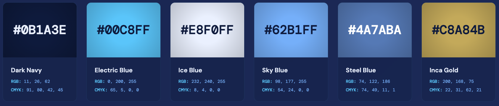

| Color             | HEX     | RGB           | CMYK           | Uso Principal                                             |
| ----------------- | ------- | ------------- | -------------- | --------------------------------------------------------- |
| **Dark Navy**     | #0B1A3E | 11, 26, 62    | 91, 80, 42, 45 | Texto principal, fondos oscuros, headers                  |
| **Electric Blue** | #00C8FF | 0, 200, 255   | 65, 5, 0, 0    | Acentos, CTAs, enlaces activos, indicadores en vivo       |
| **Ice Blue**      | #E8F0FF | 232, 240, 255 | 8, 4, 0, 0     | Fondos claros, texto sobre fondos oscuros                 |
| **Sky Blue**      | #62B1FF | 98, 177, 255  | 54, 24, 0, 0   | Hover states, elementos secundarios                       |
| **Steel Blue**    | #4A7ABA | 74, 122, 186  | 74, 49, 11, 1  | Elementos terciarios, bordes, texto muted                 |
| **Inca Gold**     | #C8A84B | 200, 168, 75  | 22, 31, 62, 21 | Estados de advertencia (moderado), logo en fondos oscuros |

**Colores Semánticos (uso en aplicación web):**

| Color       | HEX     | Aplicación                                        |
| ----------- | ------- | ------------------------------------------------- |
| **Success** | #2DFFA0 | Confirmaciones, estado libre/normal (<50% aforo)  |
| **Warning** | #FFB547 | Alertas moderadas, estado moderado (50-85% aforo) |
| **Danger**  | #FF4D6A | Errores, estado crítico (>85% aforo)              |
| **Info**    | #62B1FF | Información neutral, tooltips                     |

**Justificación Cromática:**

La paleta combina:

- **Navy profundo:** Autoridad técnica, confianza institucional
- **Cyan eléctrico:** Tecnología, datos en tiempo real, precisión digital
- **Inca Gold:** Herencia cultural peruana, calidez controlada en contextos de alerta
  Esta combinación evita el corporativismo genérico mientras mantiene seriedad técnica requerida por tomadores de decisión en instituciones culturales.

---

##### Logo Communication Tone

**Sustento de Decisiones de Diseño:**

|              Decisión de Diseño               | Señal de Tono                                                                             |
| :-------------------------------------------: | :---------------------------------------------------------------------------------------- |
|     **Paleta dark navy + cyan eléctrico**     | Entorno tecnológico, dashboards, datos. Evita lo corporativo genérico                     |
| **Geometría de nodos con crosshair central**  | Precisión, monitoreo, tracking. No decorativo sino funcional                              |
|       **Peso 600 / 300 en el logotipo**       | Autoridad sin rigidez. La palabra fuerte ("Khipu") ancla, la palabra ligera ("Tech") abre |
|         **Tagline en caps espaciado**         | Claridad directa, sin adornos. Habla de lo que hace, no de lo que aspira                  |
| **Referencia al khipu como sistema de datos** | Herencia intelectual + innovación. No es nostalgia, es reencuadre                         |

**Filosofía de Marca:**

> _"El tono no es entusiasta ni cercano porque KhipuTech vende a tomadores de decisión (museos, espacios públicos, gestores) que necesitan confiar en la exactitud del dato antes que en la calidez de la marca. La emoción viene después, cuando el dashboard funciona."_

La marca comunica:

- **Precisión técnica** sobre calidez emocional
- **Funcionalidad** sobre aspiración
- **Innovación cultural** sobre nostalgia decorativa
- **Datos confiables** sobre promesas de marketing
  Este enfoque resuena con directores de museos, curadores y administradores culturales que priorizan efectividad operativa sobre imagen corporativa convencional.

---

##### Logo Usage

**Reglas de Aplicación:**

**Área de Reserva:**

Se debe mantener un espacio mínimo de seguridad equivalente al **20% del ancho del logo** en todos sus lados para evitar interferencias visuales con otros elementos gráficos.

Esta área de reserva:

- Garantiza legibilidad en aplicaciones reducidas
- Previene saturación visual en composiciones densas
- Mantiene jerarquía visual del logotipo
  **Uso en Fondos:**

| Tipo de Fondo                                                | Versión de Logo           | Color             |
| ------------------------------------------------------------ | ------------------------- | ----------------- |
| **Fondos oscuros** (Navy #0B1A3E, azules profundos, negros)  | Inca Gold o Blanco        | #C8A84B o #FFFFFF |
| **Fondos claros** (Ice Blue #E8F0FF, blancos, grises claros) | Dark Navy                 | #0B1A3E           |
| **Fondos intermedios** (Blues #1A2B48)                       | Electric Blue o Inca Gold | #00C8FF o #C8A84B |

**Prohibiciones:**

**No se permite:**

- ❌ Deformar la relación de aspecto (estirar o comprimir)
- ❌ Cambiar los colores fuera de la paleta oficial
- ❌ Aplicar sombras paralelas internas
- ❌ Rotar el logo en ángulos no ortogonales
- ❌ Aplicar gradientes no autorizados
- ❌ Modificar el espaciado entre wordmark e icono
- ❌ Usar versiones de baja resolución en impresión
  **Tamaño Mínimo:**

Para garantizar legibilidad óptima:

- **Digital (pantallas):** 120px de ancho mínimo
- **Impreso:** 25mm de ancho mínimo
- **Favicon/App Icon:** Usar solo el icono del nodo (sin wordmark)
  **Versiones del Logo:**

1. **Principal:** Icono + Wordmark completo (uso general)
2. **Con Tagline:** Logo principal + "REAL-TIME VISITOR ANALYTICS" (landing page, presentaciones)
3. **Solo Icono:** Nodo de khipu aislado (favicon, app icons, redes sociales)
4. **Horizontal:** Wordmark a la derecha del icono (headers estrechos)
5. **Vertical:** Wordmark debajo del icono (formatos cuadrados)
   Cada versión tiene su archivo correspondiente en formatos SVG (web), PNG (presentaciones) y AI/EPS (impresión profesional).

---

**Referencia Visual Completa:**

Consultar el archivo interactivo [General Style Guide](../assets/deliverables/khiputech-general-style-guide.html) para visualización de todas las aplicaciones de marca y especificaciones técnicas detalladas.

#### 4.1.2. Web Style Guidelines

Define los estándares visuales y de interacción para las interfaces web de KhipuTech, asegurando una experiencia óptima tanto en el Dashboard administrativo como en la Web App del visitante. Este diseño corresponde a una plataforma que revoluciona la gestión de espacios culturales mediante analítica en tiempo real e interacción digital con visitantes.

---

##### Descripción General

La interfaz de KhipuTech busca brindar a gestores de museos, administradores culturales y visitantes una experiencia clara, funcional y sin fricción. El dashboard administrativo optimiza la toma de decisiones mediante visualización de datos en tiempo real, mientras que la Web App del visitante facilita el acceso inmediato a contenido cultural mediante QR/NFC, sin necesidad de instalación o registro previo.

La plataforma se divide en tres experiencias principales:

1. **Landing Page** — Presentación institucional del producto para potenciales clientes
2. **Dashboard Administrativo** — Panel de control con analítica en tiempo real para gestores
3. **Web App del Visitante** — Experiencia móvil para acceso a contenido de obras durante el recorrido

---

##### 1. Pantalla Principal — Landing Page

**Header:**

- Logo de KhipuTech (esquina superior izquierda) — Nodo central con ramificaciones tipo khipu
- Menú de navegación con las opciones: **Características**, **Cómo Funciona**, **Casos de Uso**, **Precios**, **Contacto**
- Selector de idioma (español e inglés)
- Botón "Solicitar Demo" con color Electric Blue (#00C8FF)
  **Hero Section:**

Mostramos nuestra propuesta de valor con el mensaje central: **"Transforma la experiencia de tu museo con analítica en tiempo real"**

Contamos con dos botones claros para guiar al usuario (CTAs):

- **"Solicitar Demo"**: Llamado a la acción primario y directo (Electric Blue #00C8FF)
- **"Ver Características"**: Opción secundaria para usuarios que necesitan más información (Ghost button con borde Steel Blue)
  **Características Clave:**

Esta sección presenta las funcionalidades principales de KhipuTech y tiene como objetivo convencer al usuario de por qué debe elegir nuestra plataforma.

Beneficios clave presentados en tarjetas (cards), cada uno explicando una característica específica:

- **Analítica en Tiempo Real** — Visualiza el flujo de visitantes al instante
- **Interacción QR/NFC** — Contenido digital sin apps ni registros
- **Alertas Inteligentes** — Notificaciones automáticas por saturación de salas
- **Control de Aforo** — Gestión de capacidad según normativas
- **Dashboards Personalizables** — Métricas adaptadas a tu museo
- **Soporte Especializado** — Acompañamiento técnico continuo
  El botón **"Conocer Más"** es el paso clave que se quiere que el usuario realice.

**Cómo Funciona:**

En esta sección presentamos el flujo de uso de KhipuTech, dirigido específicamente a gestores culturales:

1. **Instalación de Sensores IoT** — Hardware de bajo costo en cada sala
2. **Dashboard en Tiempo Real** — Visualización instantánea de métricas
3. **Códigos QR en Obras** — Acceso inmediato a contenido para visitantes
4. **Analítica Histórica** — Reportes y tendencias para planificación
   **Casos de Uso:**

Presentamos ejemplos reales de instituciones que han transformado su gestión con KhipuTech:

- **Museo de Arte Contemporáneo** — Reducción de 40% en congestión de salas
- **Galería Nacional** — Incremento de 60% en interacción con obras
- **Centro Cultural Municipal** — Optimización de recursos en horarios pico
  Cada caso de uso incluye un botón **"Ver Caso Completo"** que redirige a un estudio detallado.

**Planes Diseñados para tu Escala:**

Se presentan tres planes escalonados con diferentes niveles de funcionalidad y precio:

- **Museo Pequeño** ($299/mes): Hasta 5 salas, 2000 visitantes/mes, soporte email
- **Museo Mediano** ($599/mes): Hasta 15 salas, 10,000 visitantes/mes, soporte prioritario — Etiquetado como **"Más Popular"**
- **Museo Grande** ($1,299/mes): Salas ilimitadas, visitantes ilimitados, API personalizada, soporte dedicado
  Cada plan incluye un botón **"Empezar Ahora"** para conversión inmediata.

**Call to Action Final:**

Esta sección actúa como el cierre final de la presentación, diseñado para convertir al visitante en cliente:

- **"Solicitar Demo Gratuita"**: Para usuarios decididos
- **"Hablar con Ventas"**: Para quienes necesitan consultoría antes de comprometerse
  **Footer:**

Proporciona navegación adicional e información institucional.

Estructura organizada en cuatro columnas temáticas:

- **Producto**: Características, Precios, Documentación Técnica, API
- **Empresa**: Sobre Nosotros, Equipo, Blog, Prensa
- **Soporte**: FAQ, Contacto, Centro de Ayuda, Estado del Sistema
- **Legal**: Términos de Servicio, Política de Privacidad, Cumplimiento GDPR
  Incluye enlaces a redes sociales y sello de certificaciones de seguridad (ISO 27001).

---

##### 2. Dashboard Administrativo

**Pantalla Principal — Métricas en Tiempo Real:**

El dashboard presenta KPIs clave en cards destacadas en la parte superior:

- **Visitantes Hoy** — Número total con comparativa vs. ayer (↑ 12%)
- **Interacciones QR/NFC** — Total de escaneos realizados
- **Permanencia Media** — Tiempo promedio por visitante (47 min)
- **Alertas Activas** — Número de salas en estado crítico (badge rojo si >0)
  Cada card usa **iconos de Lucide** con stroke 2px y colores semánticos:
- Verde (#2DFFA0) para métricas positivas
- Rojo (#FF4D6A) para alertas
- Cyan (#00C8FF) para datos neutrales
  **Gráficos de Afluencia:**

Visualización de datos mediante:

- **Gráfico de Barras** — Visitantes por hora del día (uso de gradientes Electric Blue)
- **Gráfico de Líneas** — Tendencia semanal de visitantes
- **Mapa de Calor** — Distribución de visitantes por sala con estados:
  - Verde: Ocupación normal (<50%)
  - Amarillo/Gold: Ocupación moderada (50-85%)
  - Rojo: Ocupación crítica (>85%)
    **Tabla de Obras Más Populares:**

Presenta un ranking de obras con mayor interacción:

| Obra            | Sala | Escaneos | Permanencia | Estado  |
| --------------- | ---- | -------- | ----------- | ------- |
| Sin título #042 | S3   | 892      | 4:30 min    | 🔥 Top  |
| Composición VII | S3   | 678      | 3:15 min    | ⬆ Alto  |
| Horizonte K     | S2   | 412      | 2:40 min    | — Medio |

La tabla usa **DM Mono** para valores numéricos y badges de estado con colores semánticos.

**Panel de Alertas:**

Muestra notificaciones en tiempo real:

```
🔴 Sala Central — CRÍTICO
188 / 200 visitantes · 94% capacidad · Hace 5 min
[Gestionar Alerta]

🟡 Jardín — MODERADO
376 / 500 visitantes · 75% capacidad · Hace 12 min
[Monitorear]
```

Cada alerta incluye:

- Icono de estado (círculo con color semántico)
- Título descriptivo (Bold DM Sans 14px)
- Detalles en DM Mono 12px
- Timestamp relativo
- Botón de acción contextual
  **Sidebar de Navegación:**

Menú lateral fijo (240px desktop, colapsable a 64px en tablet):

- **Dashboard** (icono ◈)
- **Afluencia** (icono ⬡)
- **Mapa de Salas** (icono ◎)
- **Obras** (icono ◫)
- **Ranking** (icono ◉)
- **Reportes** (icono ◬)
- **Configuración** (icono ⚙)
  El ítem activo se resalta con:
- Fondo cyan con opacidad 8%
- Borde izquierdo cyan 3px
- Texto Electric Blue (#00C8FF)

---

##### 3. Web App del Visitante

**Pantalla de Entrada — Escaneo QR/NFC:**

Pantalla inicial minimalista tras escanear código:

```
┌──────────────────────┐
│   Logo KhipuTech     │
│                      │
│   📸 Escaneando...   │
│   ▓▓▓▓░░░░░░        │
│   Cargando obra      │
└──────────────────────┘
```

**Tiempo de carga objetivo:** <3 segundos desde escaneo hasta visualización

**Detalle de Obra:**

Presentación del contenido multimedia de la obra:

- **Imagen principal** — Hero image de la obra (aspect ratio 4:3)
- **Título de la obra** — DM Sans Bold 24px, Dark Navy
- **Artista y fecha** — DM Sans Regular 14px, Steel Blue
- **Descripción** — DM Sans Regular 16px, line-height 1.6
- **Audio explicativo** — Player con controles simples (play/pause, progress bar)
- **Galería adicional** — Carousel horizontal con thumbnails
  **Obras Relacionadas:**

Cards deslizables (swipe horizontal) con:

```
┌─────────┐ ┌─────────┐ ┌─────────┐
│ [img]   │ │ [img]   │ │ [img]   │
│ Título  │ │ Título  │ │ Título  │
│ Sala S2 │ │ Sala S3 │ │ Sala S1 │
└─────────┘ └─────────┘ └─────────┘
```

Cada card tiene:

- Imagen thumbnail (180×180px)
- Título de la obra (DM Sans SemiBold 14px)
- Ubicación de sala (DM Mono 12px)
- Tap para navegar al detalle
  **Mapa del Museo:**

Vista simplificada de planta con:

- **Indicador "Estás aquí"** — Pin cyan con pulso animado
- **Salas con código de color:**
  - Verde: Baja ocupación
  - Amarillo: Ocupación moderada
  - Rojo: Alta ocupación (evitar)
- **Tap en sala** — Navega a lista de obras de esa sala
  **Gamificación — Sistema de Logros:**

Panel de progreso del visitante:

```
┌───────────────────────────┐
│ 🏆 Explorador Nivel 3     │
│ ▓▓▓▓▓▓▓▓░░ 850 / 1000 XP │
│                           │
│ 📊 Ranking Semanal        │
│ 1. Ana Torres    1,240 XP │
│ 2. Carlos Ruiz   1,180 XP │
│ 3. Tú            850 XP   │
└───────────────────────────┘
```

**Bottom Navigation (Mobile):**

Barra fija inferior con 4 iconos:

- **QR** — Escanear nueva obra
- **Obra** — Detalle actual
- **Mapa** — Plano del museo
- **Logros** — Gamificación
  Cada ícono tiene:
- Tamaño touch target: 44×44px
- Spacing: 8px entre íconos
- Color activo: Electric Blue (#00C8FF)
- Color inactivo: Steel Blue (#4A7ABA)

---

##### Grid & Spacing


**Sistema de Grid:**

- **Desktop (1025px+):** Grid de 12 columnas, ancho máximo contenedor 1440px
- **Tablet (481px - 1024px):** Grid de 8 columnas
- **Mobile (320px - 480px):** Grid de 4 columnas
  **Unidad Base de Espaciado:**

- Unidad base: **8px**
- Espaciados estándar: 8px, 16px, 24px, 32px, 40px, 48px, 64px
- Todos los márgenes y paddings son múltiplos de 8
  **Aplicación:**

```css
/* Ejemplo de espaciado modular */
.card {
  padding: 24px; /* 3 × 8px */
  margin-bottom: 32px; /* 4 × 8px */
  gap: 16px; /* 2 × 8px */
}
```

**Márgenes de contenedor:**

- Desktop: 40px laterales
- Tablet: 32px laterales
- Mobile: 16px laterales

---

##### UI Components

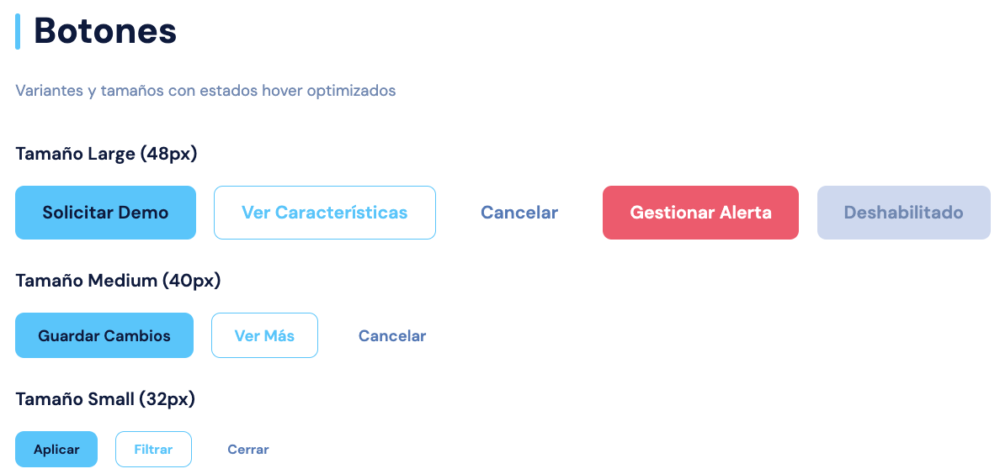

**Botones:**

| Variante      | Background  | Text    | Border      | Hover      | Uso                                     |
| ------------- | ----------- | ------- | ----------- | ---------- | --------------------------------------- |
| **Primary**   | #00C8FF     | #0B1A3E | None        | #62B1FF    | Solicitar Demo, CTAs principales        |
| **Secondary** | Transparent | #00C8FF | 1px #00C8FF | bg #E8F0FF | Ver Características                     |
| **Ghost**     | Transparent | #4A7ABA | None        | bg #E8F0FF | Navegación terciaria                    |
| **Danger**    | #FF4D6A     | #FFFFFF | None        | #FF6B82    | Gestionar Alerta, acciones destructivas |
| **Disabled**  | #CBD8F0     | #6B89B4 | None        | —          | Estado deshabilitado                    |

**Tamaños de botones:**

- **Large:** Height 48px, Padding 24px horizontal, Font 16px
- **Medium:** Height 40px, Padding 20px horizontal, Font 14px
- **Small:** Height 32px, Padding 16px horizontal, Font 12px

  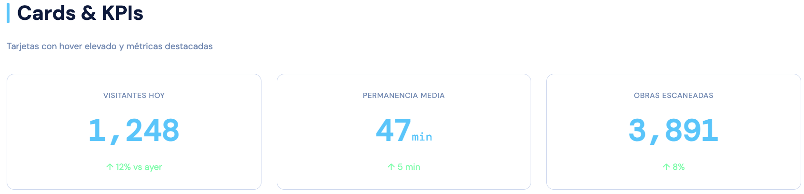

**Cards:**

| Tipo           | Background | Border      | Shadow                        | Padding | Uso                            |
| -------------- | ---------- | ----------- | ----------------------------- | ------- | ------------------------------ |
| **KPI Card**   | #FFFFFF    | 1px #CBD8F0 | 0 2px 8px rgba(11,26,62,0.08) | 24px    | Métricas principales dashboard |
| **Alert Card** | #FFF5F5    | 1px #FF4D6A | None                          | 16px    | Notificaciones críticas        |
| **Info Card**  | #F2F6FF    | None        | None                          | 20px    | Información contextual         |
| **Obra Card**  | #F2F6FF    | 1px #E8F0FF | 0 2px 4px rgba(11,26,62,0.04) | 16px    | Cards de obras relacionadas    |


**Badges de Estado:**

| Estado       | Background            | Text    | Uso                          |
| ------------ | --------------------- | ------- | ---------------------------- |
| **Top**      | rgba(45,255,160,0.12) | #00C896 | Obra más popular, completado |
| **Crítico**  | rgba(255,77,106,0.12) | #FF4D6A | Aforo >85%, alertas          |
| **Moderado** | rgba(200,168,75,0.12) | #C8A84B | Aforo 50-85%, pendiente      |
| **Normal**   | rgba(0,200,255,0.12)  | #00C8FF | Aforo <50%, información      |


**Barras de Progreso (Aforo):**

```css
/* Estado Crítico (>85%) */
.progress-critical {
  background: linear-gradient(90deg, #ff4d6a 0%, #ff6b82 100%);
}

/* Estado Moderado (50-85%) */
.progress-warning {
  background: linear-gradient(90deg, #c8a84b 0%, #ffb547 100%);
}

/* Estado Normal (<50%) */
.progress-normal {
  background: linear-gradient(90deg, #2dffa0 0%, #62ffb8 100%);
}
```

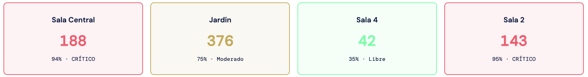

**Room-Cards (Mapa de Salas):**

Componente específico para visualización de distribución de visitantes:

```
┌───────────────┐
│ Sala Central  │
│   188 / 200   │
│   94% • 🔴   │
└───────────────┘
```

Estados visuales:

- **Crítico:** Border rojo 2px, background rgba(255,77,106,0.08)
- **Moderado:** Border amarillo 2px, background rgba(200,168,75,0.08)
- **Seguro:** Border verde 2px, background rgba(45,255,160,0.08)
  

**Inputs y Campos de Formulario:**

Estados de campos:

| Estado       | Border      | Background | Text    | Icon    |
| ------------ | ----------- | ---------- | ------- | ------- |
| **Default**  | 1px #CBD8F0 | #FFFFFF    | #0B1A3E | #6B89B4 |
| **Hover**    | 1px #4A7ABA | #FFFFFF    | #0B1A3E | #4A7ABA |
| **Focus**    | 2px #00C8FF | #FFFFFF    | #0B1A3E | #00C8FF |
| **Error**    | 2px #FF4D6A | #FFF5F5    | #0B1A3E | #FF4D6A |
| **Disabled** | 1px #CBD8F0 | #F2F6FF    | #6B89B4 | #CBD8F0 |

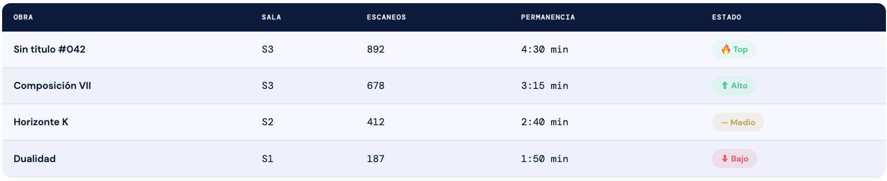

**Tablas de Datos:**

| Elemento        | Estilo                                                            |
| --------------- | ----------------------------------------------------------------- |
| **Header**      | Background `#0B1A3E`, Text `#E8F0FF`, Font DM Mono 10px uppercase |
| **Row (par)**   | Background `#F5F8FF`                                              |
| **Row (impar)** | Background `#EBF1FB`                                              |
| **Border**      | `1px #CBD8F0`                                                     |
| **Hover**       | Background `#E8F0FF`, Cursor pointer                              |

---

##### Responsive Breakpoints

**Breakpoints del Sistema:**

| Dispositivo | Rango          | Columnas Grid | Gutter | Margins |
| ----------- | -------------- | ------------- | ------ | ------- |
| **Mobile**  | 320px - 480px  | 4             | 16px   | 16px    |
| **Tablet**  | 481px - 1024px | 8             | 24px   | 32px    |
| **Desktop** | 1025px+        | 12            | 32px   | 40px    |

**Adaptaciones por Dispositivo:**

**Mobile (320-480px):**

- Navegación: Bottom navigation bar (4 items)
- Cards: Stack vertical, width 100%
- Typography: Reducir H1 a 24px, Body a 14px
- Spacing: Reducir a 12px/16px/24px
- Sidebar: Oculto, accesible via hamburger menu
  **Tablet (481-1024px):**
- Navegación: Sidebar colapsada a iconos (64px)
- Cards: Grid 2 columnas
- Typography: Mantener escala base
- Spacing: Escala estándar
- Touch targets: Mínimo 44px
  **Desktop (1025px+):**
- Navegación: Sidebar completa (240px)
- Cards: Grid 3-4 columnas
- Typography: Escala completa
- Hover states: Activados
- Max width: 1440px centrado

---

**Toast Notifications:**

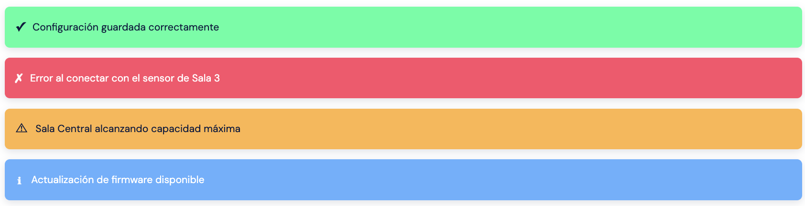

| Tipo        | Icon | Background | Duration |
| ----------- | ---- | ---------- | -------- |
| **Success** | ✓    | #2DFFA0    | 3s       |
| **Error**   | ✗    | #FF4D6A    | 5s       |
| **Warning** | ⚠    | #FFB547    | 4s       |
| **Info**    | ℹ    | #00C8FF    | 3s       |

**Tooltips:**

```css
.tooltip {
  background: #0b1a3e;
  color: #e8f0ff;
  font-size: 12px;
  padding: 8px 12px;
  border-radius: 4px;
  box-shadow: 0 4px 12px rgba(11, 26, 62, 0.2);
  max-width: 200px;
}
```

---

##### Accessibility Standards

**Contraste WCAG AA/AAA:**

Todos los pares de color cumplen con WCAG AA (mínimo 4.5:1 para texto normal, 3:1 para texto grande).

| Par de Colores       | Ratio  | Nivel WCAG |
| -------------------- | ------ | ---------- |
| Navy + Ice Blue      | 14.8:1 | AAA ✅     |
| Navy + Electric Blue | 8.5:1  | AAA ✅     |
| Navy + White         | 15.2:1 | AAA ✅     |
| Steel Blue + White   | 4.9:1  | AA ✅      |

**Justificación del contraste Navy+Cyan (8.5:1):**  
Ideal para salas con luz tenue, garantiza legibilidad en ambientes de museo con iluminación controlada donde los visitantes interactúan con dispositivos móviles.

**Touch Targets:**

- Mínimo: **44px × 44px** (WCAG 2.1 Level AAA)
- Spacing entre targets: Mínimo **8px**
  **Focus States:**
- Outline visible en todos los elementos interactivos
- Color: `#00C8FF` (Electric Blue)
- Width: `2px`
- Offset: `2px`
  **Keyboard Navigation:**
- Tab order lógico siguiendo flujo visual
- Skip links para navegación rápida a contenido principal
- Focus trap en modales y overlays
- Escape key cierra overlays y modales

---

##### Design Tokens

**Tokens CSS Variables:**

```css
:root {
  /* Colors */
  --color-primary: #00c8ff;
  --color-navy: #0b1a3e;
  --color-ice: #e8f0ff;
  --color-sky: #62b1ff;
  --color-steel: #4a7aba;
  --color-gold: #c8a84b;

  /* Semantic */
  --color-success: #2dffa0;
  --color-warning: #ffb547;
  --color-danger: #ff4d6a;
  --color-info: #62b1ff;

  /* Spacing */
  --spacing-xs: 8px;
  --spacing-sm: 16px;
  --spacing-md: 24px;
  --spacing-lg: 32px;
  --spacing-xl: 48px;
  --spacing-2xl: 64px;

  /* Typography */
  --font-sans: "DM Sans", sans-serif;
  --font-mono: "DM Mono", monospace;

  /* Border Radius */
  --radius-sm: 4px;
  --radius-md: 8px;
  --radius-lg: 12px;

  /* Shadows */
  --shadow-sm: 0 2px 4px rgba(11, 26, 62, 0.08);
  --shadow-md: 0 4px 12px rgba(11, 26, 62, 0.12);
  --shadow-lg: 0 8px 24px rgba(11, 26, 62, 0.16);

  /* Transitions */
  --transition-fast: 200ms ease-out;
  --transition-base: 300ms ease-in-out;
  --transition-slow: 400ms cubic-bezier(0.4, 0, 0.2, 1);
}
```

---

**Referencia Visual Completa:**  
Consultar el archivo interactivo [Web Style Guide](../assets/deliverables/khiputech-web-style-guide.html) para visualización de todos los componentes en acción con hover states y animaciones funcionales.

#### 4.2. Information Architecture

Esta sección describe la estructura de la información, estilos y sistemas que se utilizarán en la plataforma web de KhipuTech. Se consideran los sistemas de organización, etiquetado, búsqueda, navegación y SEO, con el fin de garantizar una experiencia clara y enfocada en la visualización de datos.

#### 4.2.1. Organization Systems

| Tópico    | Definición                                                                                                           |
| --------- | -------------------------------------------------------------------------------------------------------------------- |
| Home      | La página de inicio muestra una vista general del sistema, destacando métricas clave y accesos rápidos al dashboard. |
| Dashboard | La página principal de análisis donde se visualizan datos en tiempo real del flujo de visitantes.                    |
| Sensores  | La página donde se visualizan y gestionan los dispositivos IoT instalados en el recinto.                             |
| Zonas     | La página que representa las áreas monitoreadas mediante mapas o nodos conectados.                                   |
| Reportes  | La página que permite visualizar análisis históricos y exportar datos.                                               |
| Contact   | La página que permite a los usuarios comunicarse con soporte técnico.                                                |
| Log In    | La página donde el usuario puede iniciar sesión o registrarse para acceder al sistema.                               |

### Página de Dashboard

| Tópico                  | Definición                                                               |
| ----------------------- | ------------------------------------------------------------------------ |
| Métricas en tiempo real | Muestra datos actualizados sobre flujo y permanencia de visitantes.      |
| Visualización gráfica   | Presenta gráficos y diagramas para facilitar la interpretación de datos. |

### Página de Sensores

| Tópico             | Definición                                                |
| ------------------ | --------------------------------------------------------- |
| Lista de sensores  | Muestra todos los dispositivos IoT activos en el sistema. |
| Estado de sensores | Indica el funcionamiento y estado de cada sensor.         |

### Página de Reportes

| Tópico               | Definición                                                     |
| -------------------- | -------------------------------------------------------------- |
| Lista de reportes    | Muestra los reportes generados por el sistema.                 |
| Detalles de reportes | Permite visualizar análisis detallados y exportar información. |

### Página de Contact

Proporciona información de contacto y soporte técnico para consultas.

| Tópico                  | Definición                                                  |
| ----------------------- | ----------------------------------------------------------- |
| Formulario de contacto  | Permite enviar consultas directamente al equipo de soporte. |
| Información de contacto | Muestra canales como correo o asistencia técnica.           |

### Registro y autenticación

La página permite a los usuarios acceder al sistema mediante credenciales seguras o registrarse como nuevos usuarios.

### Otras páginas y funciones

| Tópico                    | Definición                                                              |
| ------------------------- | ----------------------------------------------------------------------- |
| Perfil de usuario         | Permite gestionar la información personal y accesos del usuario.        |
| Configuraciones           | Permite ajustar preferencias del sistema y parámetros de visualización. |
| Página acerca de nosotros | Información sobre KhipuTech y su propuesta tecnológica.                 |
| Ayuda y soporte           | Recursos de ayuda, preguntas frecuentes y asistencia técnica.           |

Barra de navegación:  
Una barra de navegación clara y consistente en la parte superior permite acceder a las secciones principales del sistema.

Responsive design:  
La plataforma se adapta a dispositivos de escritorio y móviles, manteniendo la claridad en la visualización de datos.

#### 4.2.2. Labeling Systems

Para los sistemas de etiquetado, se organiza el contenido mediante encabezados claros que agrupan las secciones disponibles dentro de la plataforma. Esto permite al usuario identificar fácilmente dónde acceder.

| Tópico    | Definición                                                                   |
| --------- | ---------------------------------------------------------------------------- |
| Home      | Sección principal donde el usuario visualiza el resumen general del sistema. |
| Dashboard | Sección donde se muestran métricas en tiempo real.                           |
| Sensores  | Sección donde se gestionan los dispositivos IoT.                             |
| Zonas     | Sección donde se visualizan las áreas monitoreadas.                          |
| Reportes  | Sección donde se consultan análisis e información histórica.                 |
| Contacto  | Sección donde el usuario puede comunicarse con soporte técnico.              |

#### 4.2.3. SEO Tags and Meta Tags

- **Landing Page**
  Esta página está optimizada para que los directores, gestores y curadores de museos encuentren la solución en Google.

  - _Título:_ KhipuTech | Analítica de Bajo Costo para Museos y Galerías

  - _Descripción:_ Transforma tu museo con analítica de visitantes en tiempo real. Sensores IoT de bajo costo y experiencias interactivas mediante QR sin suscripciones mensuales.
  - _Intenciones de Búsqueda:_ analítica de museos, conteo de personas, sensores IoT perú, gestión cultural digital, métricas de exhibición.

  - _Autor:_ KhipuTech Team.

```html
<title>KhipuTech | Analítica de Bajo Costo para Museos y Galerías</title>
<meta
  name="description"
  content="Transforma tu museo con analítica de visitantes en tiempo real. Sensores IoT de bajo costo y experiencias interactivas sin suscripciones mensuales."
/>
<meta
  name="keywords"
  content="analítica de museos, conteo de personas, sensores IoT perú, gestión cultural digital, métricas de exhibición"
/>
<meta name="author" content="KhipuTech Team" />

<meta property="og:title" content="KhipuTech | Digitalización Cultural" />
<meta
  property="og:description"
  content="Mide el flujo de visitantes y mejora el engagement en tu galería."
/>
<meta property="og:image" content="https://khiputech.com/assets/og-image.png" />
<meta property="og:url" content="https://khiputech.com" />
```

- **Web Application**
  Esta página está optimizada para la funcionalidad y la carga rápida en dispositivos móviles.

  - _Título:_ KhipuTech | Analítica de Bajo Costo para Museos y Galerías
  - _Descripción 1:_ Descubre cómo KhipuTech ayuda a museos medianos a medir el flujo de visitantes con hardware de bajo costo.
  - _Descripción 2:_ Mejora el engagement de tu galería con contenido interactivo mediante QR y analítica de datos precisa.
  - _Descripción 3:_ Optimiza el aforo y la seguridad de tu centro cultural con nuestra solución de analítica de guerrilla.

  - _Intenciones de Búsqueda:_ dashboard interactivo, flujo de visitantes, métricas en tiempo real, gestión de sala.
  - _Autor:_ KhipuTech Software Division.

```html
<title id="dynamic-title">KhipuTech App | Dashboard</title>
<meta
  name="description"
  id="dynamic-desc"
  content="Panel de control de sensores y gestión de contenido interactivo."
/>
<meta name="author" content="KhipuTech Software Division" />
<meta name="robots" content="noindex, nofollow" />
```

#### 4.2.4. Searching Systems

KhipuTech maneja dos tipos de usuarios con necesidades de búsqueda distintas: el gestor/administrador que busca entre grandes volúmenes de datos analíticos, y el visitante que busca contenido de obras dentro del museo. Cada contexto tiene su propio sistema de búsqueda.

- **Búsqueda Global (Dashboard Administrativo):**

  Ubicada en la topbar, accesible desde cualquier vista del dashboard. Permite al administrador localizar salas, obras, reportes o métricas sin navegar por el menú.

  **Comportamiento**

  - Se activa con clic
  - Muestra resultados en tiempo real
  - Agrupa resultados por categoría: Salas, Obras, Reportes, Alertas

- **Filtros del Dashboard (Analítica y Afluencia)**

  Visibles en la topbar del boceto como selector de rango de fechas. Permiten acotar los datos mostrados en tablas, gráficos y rankings.
  | Filtro | Opciones | Ubicación en Mockups|
  | :--- | :--- | :---: |
  |**Rango de fechas**|Hoy / Esta semana / Este mes / Rango personalizado|Topbar|
  |**Sala / Zona**|Todas las salas / Sala Inca / Sala Virreinal / Sala Republicana / Sala Contemporánea|Header de sección|
  |**Tipo de contenido**|Todos / QR / NFC / Audio / Video / Imagen|Panel analítica|
  |**Estado de aforo**|Todos / Normal / Atención / Crítico|Panel afluencia|
  |**Exportación**|CSV / Excel · aplica los filtros activos|Botón topbar|

- **Ordenamiento en Tablas**

  La tabla de Top obras por interacción visible en el boceto permite al gestor reordenar segun distintos criterios. El criterio activo se indica con una fecha direccional junto al encabezado de columna.

  |         Criterio          |          Orden Default           |     Indicador Visual     |
  | :-----------------------: | :------------------------------: | :----------------------: |
  |    **Número de scans**    |   Descendente (mayor a menor)    |  Flecha abajo activa ⬇️  |
  | **Tiempo de permanencia** | Descendente (mas tiempo primero) |  Flecha abajo activa ⬇️  |
  |         **Sala**          |         Alfabético A - Z         | Flecha arriba activa ⬆️  |
  | **Estado de interacción** |         Alta>Media>Baja          | Badget de color ordenado |

- **Búsqueda de Obras**

  En la interfaz del visitante, accesible tras escanear un QR, la búsqueda se simplifica al mínimo para no interrumpir el recorrido:

  - _Barra de búsqueda:_ Por nombre de obra en la parte superior del interfaz.
  - _Filtro por sala:_ Mediante chips horizontales deslizables.
  - _Filtro por tipo:_ Chips contenido Audio, Video, Texto, Multimedia.

- **Límites del Sistema de Búsqueda**

  Para evitar sobrecarga cognitiva, KhipuTech no expone búsqueda de texto libre sobre datos crudos de sensores. Los sensores solo son consultables a través de los filtros estructurados de sala y fecha. Esto mantiene la interfaz orientada a decisiones, no a exploración técnica.

- **Resumen de Sistemas de Búsqueda**

  | Sistema                |   Usuario    |           Tipo           |     Filtros Principales     |
  | :--------------------- | :----------: | :----------------------: | :-------------------------: |
  | **Búsqueda Global**    | Gestor/Admin | Texto Libre + Categorias |    Salas, Obras, Alertas    |
  | **Filtros Dashboard**  | Gestor/Admin |  Filtros Estructurados   |  Fecha, Sala, Tipo, Estado  |
  | **Ordenamiento Tabla** | Gestor/Admin |   Click en Encabezado    | Scans, Tiempo, Sala, Estado |
  | **Búsqueda de Obras**  |  Visitante   |      Texto + Chips       |   Sala, Tipo de Contenido   |

#### 4.2.5. Navigation Systems

Explica las acciones y técnicas que guiarán a los Usuarios a traves del Landing Page y las aplicaciones, permitiendoles cumplir sus metas e interactuar de forma satisfactoria con el producto digital.

- **Superficies y Patrones de Navegación**

  | Superficie            |           Usuario            |          Patron Inicial          |        Patron Secundario        |
  | :-------------------- | :--------------------------: | :------------------------------: | :-----------------------------: |
  | **Landing Page**      | Visitante Potencial / Gestor |    Scroll lineal descendente     | Anclar (Anchor links) en navbar |
  | **Dashboard Admin**   |    Gestor / Administrador    | Sidebar fija + contenido central |        Breadcrumb + tabs        |
  | **Web App Visitante** |     Visitante del museo      |        Bottom nav mobile         |     Chips de filtro + Cards     |

  - _Landing Page — Navegacion Publica:_ La Landing Page usa scroll lineal descendente como tecnica principal. El usuario recorre las secciones de arriba hacia abajo sin necesidad de conocer la arquitectura del sitio. Una navbar fija con anchor links permite saltar directamente a cualquier seccion desde cualquier punto del scroll.

    - Navbar fija (sticky): Visible en todo momento. Contiene logo, anchor links a cada seccion y boton CTA primario 'Solicitar demo'. En mobile se colapsa en menu hamburguesa.

    - Scroll lineal: Las secciones se presentan en orden narrativo: problema -> solucion -> caracteristicas -> prueba social -> precio -> llamada a la accion.

    - Anchor links: Cada item del navbar hace scroll suave (smooth scroll) hacia la seccion correspondiente. La seccion activa se resalta en el navbar con subrayado cyan #00C8FF.

    - CTA flotante: Boton 'Solicitar demo' fijo en esquina inferior derecha en desktop. Aparece despues de que el usuario scrollea mas del 30% de la pagina.

    - Footer de navegacion: Repite los enlaces principales y agrega links secundarios (Politica de privacidad, Terminos, Contacto).

  - _Dashboard Administrativo — Navegacion por Sidebar:_ El Dashboard usa una sidebar fija de navegacion vertical como patron principal, visible en el boceto. Permite al gestor acceder a cualquier modulo sin perder el contexto de donde se encuentra. El patron secundario es el breadcrumb en la topbar, que indica la ruta exacta dentro del sistema.

        | Elemento      | Descripcion | Comportamiento de interaccion |
        | :------------ | :---------- | :---------------------------- |
        | Sidebar fija  | 240px de ancho. Agrupa items en secciones: Principal, Analitica, Contenido, Sistema. | |
        | **Breadcrumb** | En la topbar. Muestra ruta completa: KhipuTech > Analítica > Interacciones. | Cada nivel es clickeable y regresa al nivel superior. Separador chevron icon 12px. |
        | **Tabs internos** | Dentro de vistas con sub-secciones (ej: Hoy / Semana / Mes en gráficos). | Tab activo: pill con fondo cyan 15% y texto cyan. Transición instantánea de contenido. |

  - _Web App del Visitante — Navegacion Mobile-First:_ La Web App está diseñada para ser usada en movilidad dentro del museo. El patrón principal es la **navegación por cards** tras escanear un QR o NFC. Sidebar con 4 items: Escanear QR/NFC, Detalle de obra, Mapa de recorrido, Logros y XP.

    | Elemento               | Descripción                                                                  | Comportamiento                                                                     |
    | :--------------------- | :--------------------------------------------------------------------------- | :--------------------------------------------------------------------------------- |
    | **Entrada por QR/NFC** | El punto de entrada principal. No requiere navegación previa ni login.       | Carga el contenido de la obra en menos de 3 segundos directamente en el navegador. |
    | **Panel de obra**      | Detalle multimedia (imagen, audio, video) + obras relacionadas.              | Cards deslizables con filtro por sala. Historial de obras recientes.               |
    | **Mapa del museo**     | Vista de planta simplificada. Indica sala actual del visitante y congestión. | Tap en sala navega a las obras. Zonas en rojo indican alta ocupación.              |
    | **Gamificación**       | Ranking semanal de visitantes con sistema de XP y niveles.                   | Visualización de logros desbloqueados y progreso hacia siguiente nivel.            |

  - _Principios de Navegación KhipuTech:_
    - Máximo 3 clics: Cualquier acción o dato desde el Dashboard.
    - Máximo 2 taps (visitante): Nunca más de 2 taps para contenido de obra.
    - Contexto siempre visible: Breadcrumb en dashboard, indicador de panel activo en sidebar.
    - Sin login obligatorio: Web App del visitante accesible de forma inmediata.
    - Estado activo siempre señalado: Item activo resaltado con color cyan #00C8FF.

#### 4.3. Landing Page UI Design

La sección de Landing Page UI Design busca definir, estructurar y validar la interfaz visual de la página principal de KhipuTech, garantizando una experiencia clara, accesible y centrada en los distintos perfiles de usuario interesados en soluciones de analítica en tiempo real para museos. Para esta fase se diseñaron los primeros wireframes, los cuales permitieron organizar los contenidos clave como la propuesta de valor de la plataforma, los planes de servicio, información de contacto y un footer con enlaces institucionales. Posteriormente, se elaboraron mockups de alta fidelidad aplicando el sistema de diseño establecido en las guías de estilo, priorizando la jerarquía informativa, la coherencia visual y la consistencia entre dispositivos.

El sitio web de KhipuTech está construido como un viaje lógico y persuasivo, diseñado para guiar a un potencial cliente desde la primera impresión hasta la conversión final, construyendo valor y confianza en cada paso.

El recorrido comienza en la sección de inicio, que capta la atención de inmediato con un titular audaz: "Transforma la experiencia museística con datos en tiempo real". Esta primera sección establece la propuesta de valor central, explicando que la plataforma beneficia tanto a los gestores culturales (con analítica centralizada) como a los visitantes (con experiencias digitales enriquecidas), posicionándose como una solución integral desde el principio.

A continuación, la sección de "Nuestros paquetes" presenta los planes de suscripción disponibles, mostrando de manera clara las opciones de servicio y facilitando la comparación entre características. Esta sección ayuda al cliente a visualizar qué plan se adapta mejor a las necesidades de su institución cultural.

Finalmente, el sitio se enfoca en eliminar las últimas barreras para el contacto. La página de "Contáctanos" permite a gestores culturales y administradores de museos solicitar información personalizada, capturando datos clave como nombre completo, cargo, institución, correo, teléfono y tipo de museo. El footer actúa como una red de seguridad, ofreciendo enlaces de navegación y copyright, asegurando que ninguna pregunta quede sin respuesta y que el camino para empezar sea siempre accesible.

---

##### 4.3.1. Landing Page Wireframe

[Click here for Figma](https://www.figma.com/design/yV2GIBGGcJHqF0u7MGxCjz/Landing-Page-Wireframe?node-id=0-1&t=CNuvKFwrtBsLzTne-1)

Los wireframes de la Landing Page de KhipuTech definen la estructura fundamental de la interfaz, priorizando la organización del contenido y la jerarquía visual antes de aplicar elementos de diseño detallados. Se diseñaron utilizando elementos esquemáticos en escala de grises para facilitar la evaluación de la arquitectura de información sin distracciones visuales.

**1. Home (Hero Section)**

La interfaz del wireframe Home presenta una estructura en Z que guía la vista del usuario de manera natural. En la parte superior, un header fijo contiene el logotipo de KhipuTech alineado a la izquierda, seguido de un menú de navegación principal con enlaces a "Inicio", "Planes", "Evidencias" y "Contacto". A la derecha del header se ubica un botón de llamado a la acción "Iniciar sesión" con mayor énfasis visual.

El hero section ocupa aproximadamente el 60% del viewport inicial, dividido en dos columnas asimétricas. La columna izquierda contiene el titular principal "Transforma la experiencia museística con datos en tiempo real" en tipografía de gran tamaño, seguido de un subtítulo descriptivo en texto regular. Debajo se posiciona un botón CTA primario "Registrarse" con tratamiento destacado.

La columna derecha del hero section reserva espacio para una imagen hero representativa (placeholder indicado con diagonales cruzadas), que ocupará aproximadamente 500×400px en resolución desktop. Esta imagen ilustrará el concepto de analítica de visitantes o dashboard de museo.

El diseño es limpio, escaneable y enfocado en la conversión, guiando al usuario de manera natural desde el primer contacto hacia la acción de registro.

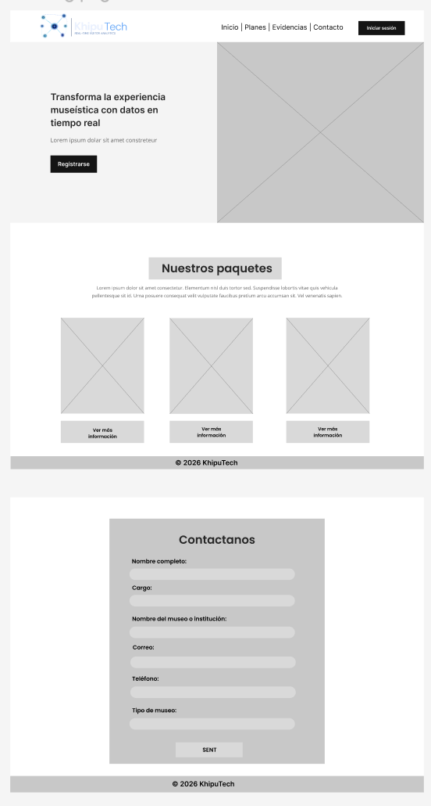

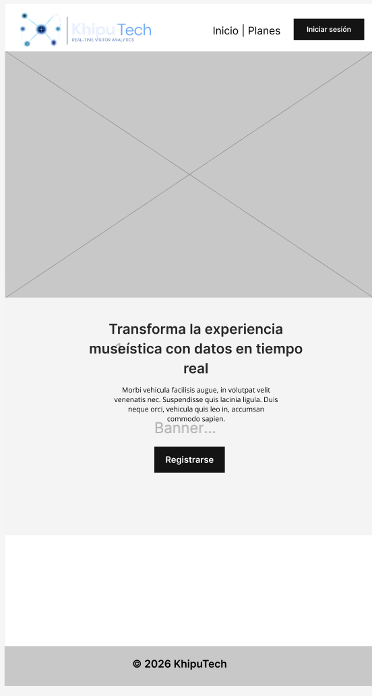

---

**2. Planes (Pricing Section)**

La sección de "Nuestros paquetes" adopta un layout centrado que facilita la comparación visual entre opciones de suscripción. El wireframe muestra un título principal "Nuestros paquetes" centrado en la parte superior, seguido de un párrafo descriptivo en texto regular que explica brevemente las opciones disponibles.

Debajo se presenta una grilla de tres columnas equitativas (grid de 3 columnas en desktop, apiladas en mobile), cada una representando un plan de suscripción. Cada tarjeta de plan contiene:

- Placeholder de imagen cuadrada (indicado con diagonales cruzadas) de aproximadamente 200×200px
- Botón de acción "Ver más información" centrado debajo de cada tarjeta
  Esta estructura permite al usuario escanear rápidamente las opciones disponibles y acceder a información detallada mediante los CTAs individuales. El espaciado generoso entre tarjetas (aproximadamente 32px de gap) facilita la legibilidad y evita la sobrecarga visual.

El footer de la sección incluye el copyright "© 2026 KhipuTech" centrado en una franja horizontal de fondo sólido, estableciendo el cierre visual de la landing page.

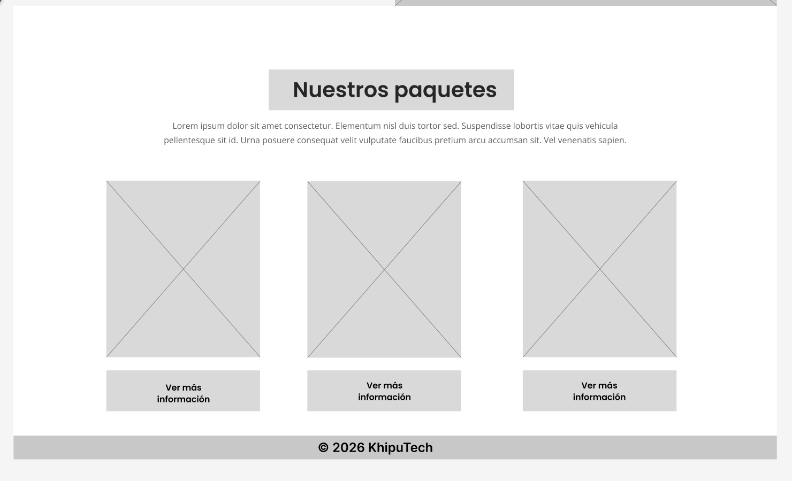

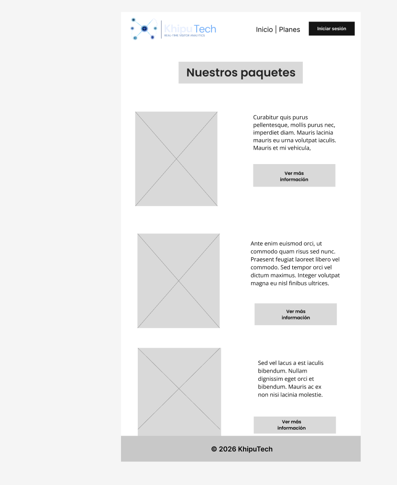

---

**3. Planes (Detalle Expandido)**

El wireframe de la vista expandida de planes presenta una estructura vertical alternada que combina imagen y contenido descriptivo. Cada bloque de plan utiliza un layout de dos columnas con imagen a la izquierda (placeholder cuadrado de 300×300px) y contenido textual a la derecha.

El contenido textual incluye:

- Párrafo descriptivo del plan (4-5 líneas de texto)
- Botón "Ver más información" alineado a la derecha del bloque de texto
  Esta disposición se repite tres veces en la página, una por cada plan disponible (Basic, Pro, Enterprise). El espaciado vertical entre bloques es de aproximadamente 48px para establecer separación clara entre opciones.

El footer mantiene la consistencia con "© 2026 KhipuTech" en la misma franja horizontal de cierre.

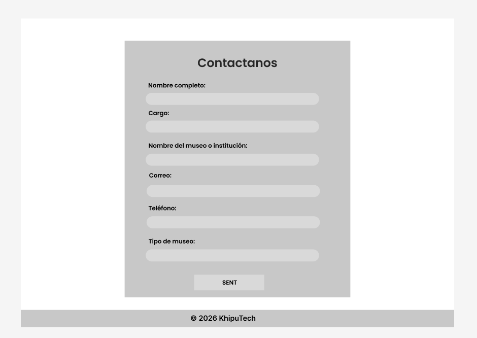

---

**4. Contacto (Contact Form)**

El wireframe de la sección de contacto presenta un formulario centrado en la página con un ancho máximo de 600px para optimizar la legibilidad. La estructura incluye:

**Encabezado:**

- Título principal "Contáctanos" centrado
- Sin subtítulo adicional para mantener simplicidad
  **Campos del formulario (apilados verticalmente):** 
- Nombre completo (input text)
- Cargo (input text)
- Nombre del museo o institución (input text)
- Correo (input email)
- Teléfono (input tel)
- Tipo de museo (select dropdown)
  Todos los campos tienen labels alineadas a la izquierda arriba de cada input, con placeholders sutiles dentro de los campos. El espaciado vertical entre campos es uniforme (24px) para mantener ritmo visual consistente.

**Botón de envío:**

- CTA "SEND" centrado debajo del último campo
- Tratamiento destacado para indicar acción primaria
  **Footer:**
- Franja horizontal con "© 2026 KhipuTech" centrado
  El diseño prioriza la facilidad de completado del formulario, reduciendo fricción mediante un flujo vertical claro y campos bien etiquetados.


---

##### 4.3.2. Landing Page Mock-up

[Link de Landing Page Mock-up](https://www.figma.com/design/Qj8btan6UPcFOfTvSSsdpA/Untitled?node-id=87-152&t=qUeaejZg6K80xug7-1)

Los mockups de alta fidelidad de la Landing Page de KhipuTech aplican el sistema de diseño establecido en las guías de estilo, incorporando la paleta de colores institucional, tipografías DM Sans y DM Mono, iconografía de Lucide Icons y componentes visuales consistentes con la identidad de marca.

**1. Home (Hero Section) - Desktop**

El mockup de la sección Home presenta una estética moderna y tecnológica que transmite innovación en el sector cultural.

**Header:**

- Fondo blanco (#FFFFFF) con sombra sutil para elevación
- Logotipo KhipuTech (nodos interconectados) alineado a la izquierda con dimensiones 180×40px
- Navegación principal en DM Sans Medium 16px, color Navy (#0B1A3E), espaciado horizontal de 32px entre enlaces
- Botón "Iniciar sesión" con fondo Navy (#0B1A3E), texto blanco, padding 12px 24px, border-radius 6px
  **Hero Section:**
- Fondo degradado sutil de Ice (#E8F0FF) a blanco para profundidad visual
- Columna izquierda (50% del ancho):
  - Titular "Transforma la experiencia museística con datos en tiempo real" en DM Sans Bold 48px, color Navy (#0B1A3E), line-height 1.2
  - Subtítulo descriptivo en DM Sans Regular 18px, color Steel (#4A7ABA), line-height 1.6, max-width 520px
  - Botón CTA "Registrarse" con fondo Electric (#00C8FF), texto Navy (#0B1A3E), DM Sans SemiBold 18px, padding 16px 32px, border-radius 8px, hover state con fondo Sky (#62B1FF)
- Columna derecha (50% del ancho):
  - Imagen hero ilustrando dashboard de analítica de museo con gráficos en tiempo real
  - Tratamiento visual con borde sutil en Sky (#62B1FF) de 2px
  - Dimensiones: 600×450px
  - La imagen muestra elementos de UI como gráficos de barras, mapas de calor y contadores de visitantes en la paleta de KhipuTech
    El diseño transmite profesionalismo y claridad, estableciendo inmediatamente la propuesta de valor de la plataforma mediante un balance equilibrado entre texto e imagen.

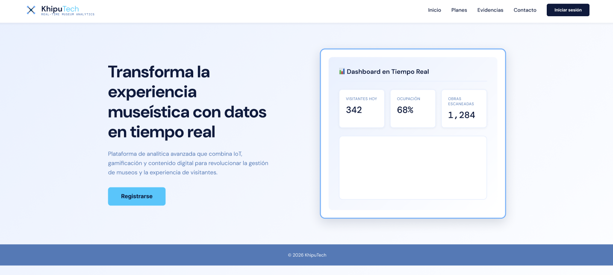


---

**2. Home (Hero Section) - Mobile**

La versión mobile del hero section adapta el layout a un flujo vertical optimizado para pantallas táctiles:

**Header:**

- Fondo blanco con logotipo centrado (140×32px)
- Menú hamburguesa icon (Lucide Menu) a la derecha, color Navy (#0B1A3E)
- Botón "Iniciar sesión" compacto en esquina superior derecha, padding 8px 16px
  **Hero Section (apilado verticalmente):**
- Imagen hero arriba, ocupando 100% del ancho, height auto (ratio 4:3)
- Titular reducido a DM Sans Bold 32px, centrado
- Subtítulo en DM Sans Regular 16px, centrado, max-width 90%
- Botón CTA "Registrarse" en ancho completo (100% width), padding 14px, centrado
  El espaciado vertical entre elementos es de 24px para mantener respiración visual en viewport reducido.


---

**3. Planes (Pricing Section) - Desktop**

La sección de planes presenta las opciones de suscripción con tarjetas visuales diferenciadas:

**Título de sección:**

- "Nuestros paquetes" en DM Sans Bold 40px, color Navy (#0B1A3E), centrado
- Fondo de título en color Ice (#E8F0FF) con padding 16px 32px, border-radius 8px
- Párrafo descriptivo debajo en DM Sans Regular 16px, color Steel (#4A7ABA), max-width 800px centrado
  **Grid de planes (3 columnas):**

Cada tarjeta de plan tiene las siguientes características:

- Fondo blanco (#FFFFFF)
- Borde de 2px en color Sky (#62B1FF)
- Border-radius de 12px
- Padding interno de 24px
- Box-shadow sutil: 0 4px 12px rgba(11, 26, 62, 0.08)
  **Contenido de cada tarjeta:**
- Imagen ilustrativa (placeholder) de 280×280px con border-radius 8px
- Espaciado de 16px entre imagen y botón
- Botón "Ver más información" con:
  - Fondo Ice (#E8F0FF)
  - Texto Navy (#0B1A3E) en DM Sans Medium 14px
  - Padding 10px 20px
  - Border-radius 6px
  - Hover state con fondo Sky (#62B1FF) y texto blanco
    **Espaciado:**
- Gap entre tarjetas: 32px horizontal
- Margen inferior de sección: 64px
  **Footer:**
- Fondo Steel (#4A7ABA)
- Texto "© 2026 KhipuTech" en DM Sans Regular 14px, color blanco, centrado
- Padding vertical: 24px
  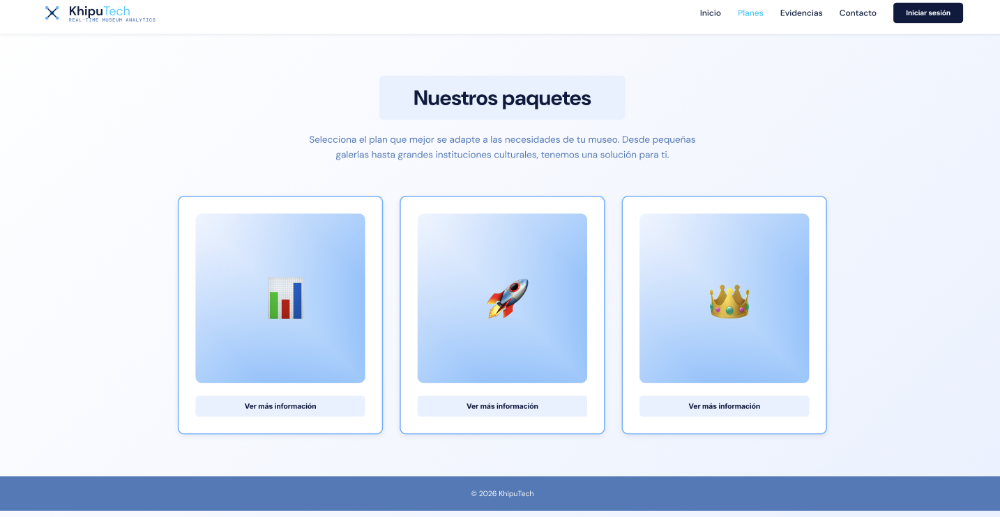
---

**4. Planes (Detalle Expandido) - Desktop**

La vista expandida de planes presenta una estructura alternada imagen-texto que facilita la lectura:

**Bloques de plan (layout alternado):**

Cada bloque utiliza un layout de dos columnas (50/50) con las siguientes características:

**Columna de imagen:**

- Placeholder de imagen cuadrada 400×400px
- Border-radius de 12px
- Borde de 2px en Sky (#62B1FF)
  **Columna de contenido:**
- Padding interno de 32px
- Párrafo descriptivo en DM Sans Regular 16px, color Steel (#4A7ABA), line-height 1.7
- Texto justificado para bloques de contenido extenso
- Botón "Ver más información":
  - Fondo Ice (#E8F0FF)
  - Texto Navy (#0B1A3E) en DM Sans Medium 14px
  - Padding 12px 24px
  - Border-radius 6px
  - Alineado a la derecha del bloque de texto
    **Espaciado vertical entre bloques:**
- Margen de 64px entre cada bloque de plan para separación clara
  **Alternancia visual:**
- Bloque 1: Imagen izquierda, contenido derecha
- Bloque 2: Contenido izquierda, imagen derecha
- Bloque 3: Imagen izquierda, contenido derecha
  Esta alternancia crea un ritmo visual dinámico y evita la monotonía en el scrolleo.

**Footer:**

- Mantiene el mismo estilo que la sección anterior
- Fondo Steel (#4A7ABA), texto centrado, padding 24px vertical
  

---

**5. Contacto (Contact Form) - Desktop**

El mockup del formulario de contacto presenta un diseño limpio y accesible optimizado para conversión:

**Contenedor del formulario:**

- Ancho máximo: 600px, centrado horizontalmente
- Fondo Ice (#E8F0FF) con padding 48px
- Border-radius 16px
- Box-shadow: 0 8px 24px rgba(11, 26, 62, 0.12)
  **Título:**
- "Contáctanos" en DM Sans Bold 36px, color Navy (#0B1A3E), centrado
- Margen inferior: 32px
  **Campos del formulario:**

Cada campo tiene el siguiente estilo consistente:

- Label en DM Sans Medium 14px, color Navy (#0B1A3E)
- Input field:
  - Fondo blanco (#FFFFFF)
  - Borde de 1px en color Steel (#4A7ABA)
  - Border-radius 6px
  - Padding 12px 16px
  - Font: DM Sans Regular 16px
  - Placeholder en color Steel (#4A7ABA) con opacidad 0.6
  - Focus state: borde de 2px en Electric (#00C8FF) con box-shadow sutil
    **Campos incluidos (en orden vertical):**

1. Nombre completo
2. Cargo
3. Nombre del museo o institución
4. Correo
5. Teléfono
6. Tipo de museo (dropdown con icono Lucide ChevronDown)
   **Espaciado:**

- Gap vertical entre campos: 24px
- Margen entre label e input: 8px
  **Botón de envío:**
- Texto "SEND" en DM Sans SemiBold 16px, color blanco
- Fondo Electric (#00C8FF)
- Padding 16px 48px
- Border-radius 8px
- Width: 100% (full width del contenedor)
- Hover state: fondo Sky (#62B1FF)
- Centrado en el formulario
- Margen superior: 32px
  **Estados de validación:**
- Error state: borde rojo (#E74C3C) con mensaje de error en DM Sans Regular 12px
- Success state: borde verde (#27AE60) con icono Lucide Check
  **Footer:**
- Fondo Steel (#4A7ABA)
- Texto "© 2026 KhipuTech" centrado en blanco
- Padding 24px vertical
  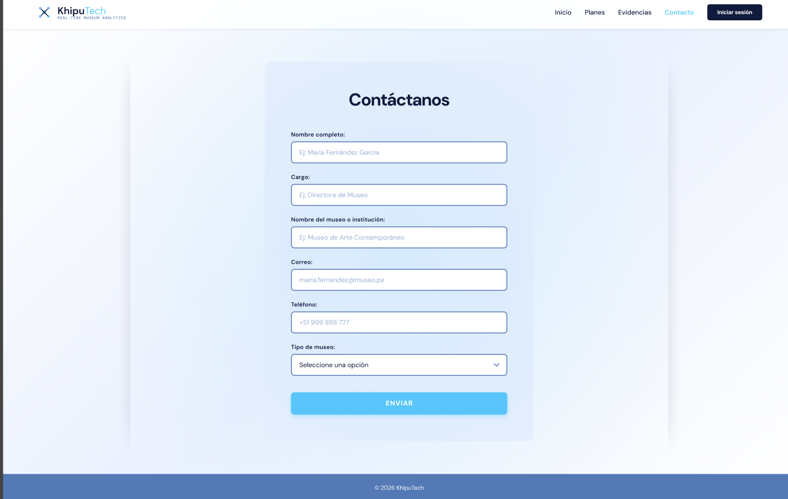

---

**Consideraciones de Diseño Responsivo:**

Todos los mockups han sido diseñados siguiendo un enfoque mobile-first con breakpoints definidos:

- **Mobile:** 320px - 767px
- **Tablet:** 768px - 1023px
- **Desktop:** 1024px+
  **Adaptaciones clave en mobile:**
- Navegación colapsada en menú hamburguesa
- Grid de planes se apila en columna única
- Formulario de contacto mantiene ancho completo con padding lateral de 16px
- Botones se expanden a full-width para facilitar interacción táctil
- Imágenes hero se redimensionan manteniendo aspect ratio 4:3
  **Accesibilidad:**
- Contraste mínimo WCAG AAA (7:1) entre Navy (#0B1A3E) y fondos claros
- Todos los inputs tienen labels asociados
- Estados de focus claramente visibles
- Tamaño de botones mínimo de 44×44px para touch targets
- Iconografía complementada con texto descriptivo

---

### 4.4. Web Applications UX/UI Design

#### 4.4.1. Web Applications Wireframes

Se presentan los wireframes de la aplicación web de KhipuTech:


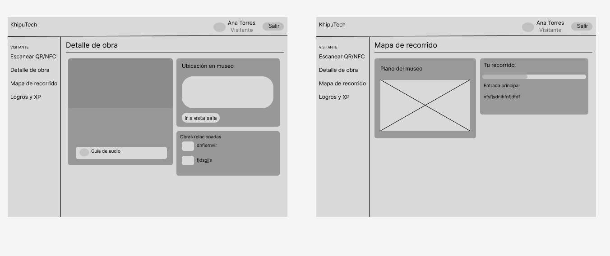


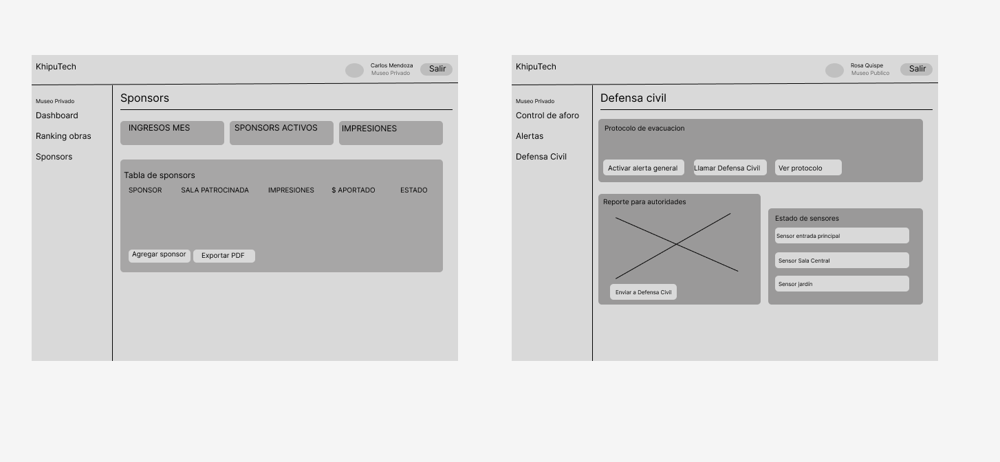

#### 4.4.2. Web Applications Wireflow Diagrams

Se presentan los Web Applications Wireflow Diagrams:


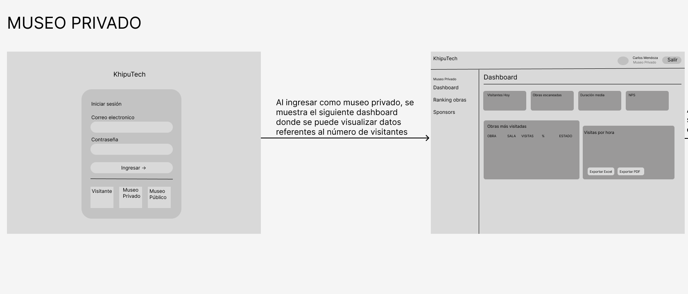


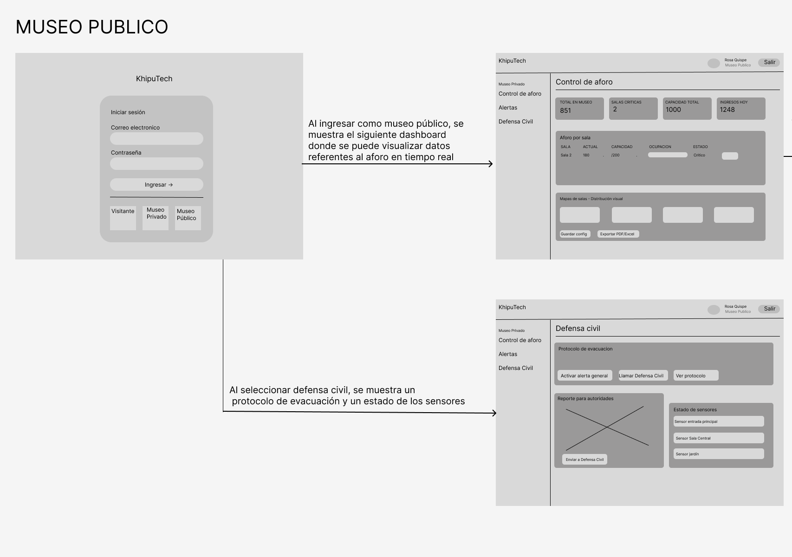

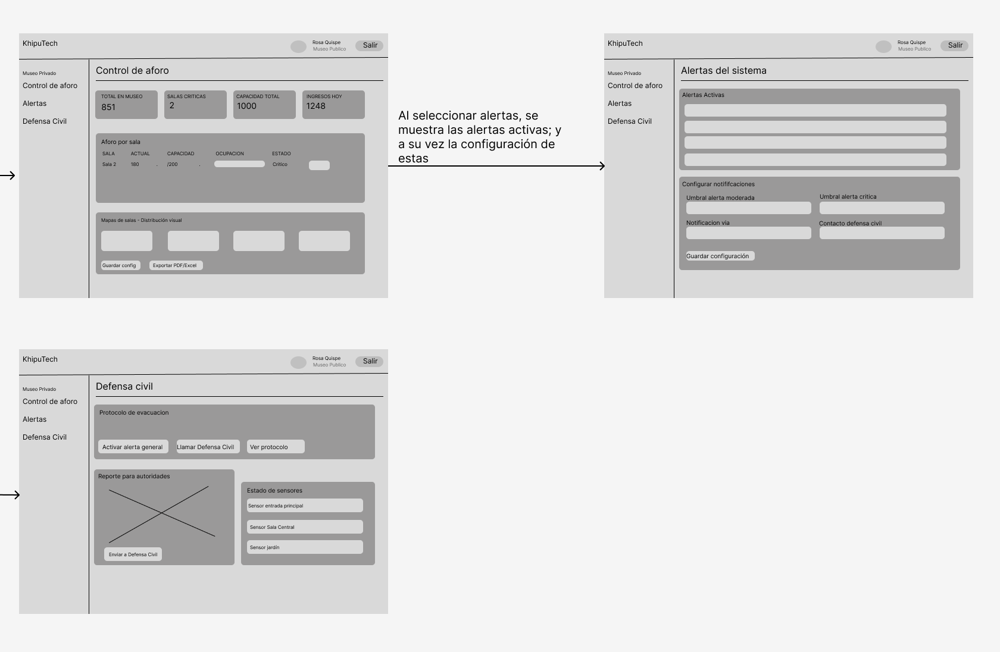

#### 4.4.3. Web Applications Mock-ups

##### Descripción general

El mock-up presentado corresponde al Dashboard de monitoreo general del sistema, diseñado para administradores del museo. Su objetivo principal es ofrecer una visión centralizada, en tiempo real, del comportamiento de los visitantes, el uso de las exhibiciones y el estado operativo del museo.

Este diseño responde a las épicas relacionadas con:

- Analítica (EP02, EP06)
- Operación (EP03, EP04)
- Alertas inteligentes (US51)

#### Principios de diseño aplicados

#### 1. Jerarquía visual

Se prioriza la información más relevante en la parte superior:

- KPIs principales (visitantes, interacciones, permanencia, alertas)
- Luego gráficos y análisis
- Finalmente detalles (tablas y alertas)

#### 2. Consistencia

- Uso uniforme de colores (azules oscuros + acentos)
- Tipografía homogénea
- Componentes reutilizables (cards, tablas, alertas)

#### 3. Feedback visual

- Indicadores de crecimiento (+12%, +7%)
- Colores de estado:
  - 🔴 Saturación
  - 🟡 Atención
  - 🟢 Normal

#### 4. Minimalismo funcional

Se evita saturar la interfaz:

- Solo métricas clave visibles
- Espacios amplios
- Separación clara por secciones

#### Elementos de diseño

#### Cards de métricas (KPIs)

Ubicadas en la parte superior:

- Visitantes
- Interacciones QR/NFC
- Tiempo de permanencia
- Alertas activas

#### Gráfico de afluencia por hora

- Visualiza entradas y salidas
- Permite detectar picos de tráfico

#### Ocupación por sala

Panel lateral con:

- Capacidad vs ocupación
- Estado visual (color + etiqueta)

#### Alertas recientes

Lista de eventos relevantes:

- Aforo crítico
- Umbrales superados
- Baja interacción

#### Diseño inclusivo

El sistema considera accesibilidad mediante:

- Contraste alto (modo oscuro)
- Tipografía legible
- Uso de colores + texto (no solo color)
- Información jerárquica clara

Mejora la experiencia para:

- usuarios con fatiga visual
- entornos con poca iluminación
- distintos perfiles de usuarios

#### Arquitectura de la información

La navegación lateral está organizada en:

#### 1. Principal

- Dashboard
- Afluencia en vivo
- Mapa de salas

#### 2. Analítica

- Interacciones
- Permanencia
- Tendencias
- Exportar reportes

#### 3. Contenido

- QR / NFC
- Obras

#### 4. Sistema

- Acceso y roles
- Configuración

#### Relación con el Design System

El mock-up evidencia un sistema de diseño consistente:

#### Paleta:

- Azul oscuro (base)
- Verde (positivo)
- Amarillo (advertencia)
- Rojo (crítico)

#### Componentes reutilizables:

- Cards
- Tabs (Hoy / Semana / Mes)
- Listas
- Indicadores de estado
- Espaciado uniforme
- Bordes redondeados (modern UI)

#### Valor del diseño

Este dashboard permite:

- Monitoreo en tiempo real
- Toma de decisiones basada en datos
- Detección de problemas (aforo, interacción)
- Optimización de la experiencia del visitante

#### 4.4.4. Web Applications User Flow Diagrams

#### USER FLOW 1 — Visitante accede a contenido

#### User Persona

Visitante del museo

#### User Goal

Acceder al contenido digital de una obra de forma rápida y sin fricción.

#### 🟢 Happy Path

1. Escanea QR
2. Se abre contenido en navegador
3. Visualiza contenido multimedia
4. Navega a otra obra (opcional)

#### 🔴 Unhappy Paths

- QR inválido → “Contenido no disponible”
- Sin internet → mensaje de error
- Dispositivo no compatible → fallback

#### Pantallas involucradas

- Vista QR
- Vista contenido

#### Explicación

El flujo inicia cuando el visitante escanea un código QR ubicado en la obra. El sistema redirige automáticamente a una vista web donde se presenta contenido multimedia. El usuario puede explorar información adicional o navegar a otras obras. En caso de errores, el sistema muestra mensajes claros para mantener la experiencia.


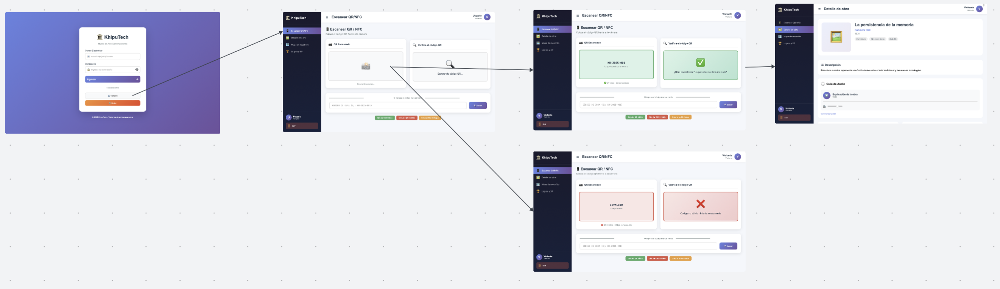

#### 🟣 USER FLOW 2 — Administrador monitorea el museo

#### User Persona

Administrador del museo

#### User Goal

Supervisar en tiempo real el estado del museo para tomar decisiones rápidas.

#### 🟢 Happy Path

1. Accede al sistema
2. Ingresa al dashboard
3. Visualiza métricas principales
4. Revisa ocupación por sala
5. Identifica alertas
6. Toma decisión

#### 🔴 Unhappy Paths

- Datos no cargan → mensaje de error
- Sin datos → estado vacío
- Error en sensores → alerta técnica

#### Pantallas involucradas

- Dashboard

#### Explicación

El flujo comienza cuando el administrador accede al sistema y visualiza el dashboard principal. Este presenta métricas clave como afluencia, interacción y alertas. El usuario puede identificar rápidamente situaciones críticas y tomar decisiones operativas. En caso de fallos en los datos, el sistema informa el problema sin afectar la navegación.


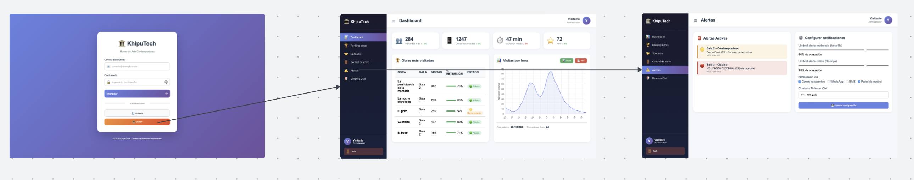

#### 🟡 USER FLOW 3 — Acceso con suscripción

#### User Persona

Visitante recurrente

#### User Goal

Acceder a contenido premium sin restricciones mediante suscripción.

#### 🟢 Happy Path

1. Usuario accede al contenido
2. Sistema valida suscripción
3. Acceso permitido
4. Navega libremente

#### 🔴 Unhappy Paths

- Suscripción vencida → pedir renovación
- No suscrito → acceso limitado
- Error de validación → mensaje

#### Pantallas involucradas

- Vista contenido
- Pantalla de acceso/restricción

#### Explicación

El flujo inicia cuando el visitante intenta acceder a contenido digital. El sistema valida si cuenta con una suscripción activa. Si es válida, el acceso es ilimitado; de lo contrario, se restringe y se invita a renovar. Esto permite implementar un modelo de acceso controlado y monetización del contenido.

### 4.5. Web Applications Prototyping

Enlance al Web applications Prototyping video: [Click Aqui](https://upcedupe-my.sharepoint.com/:v:/g/personal/u20231e492_upc_edu_pe/IQCnEyFKUKpBTKZ2yyOjUt3AAUSOVECJll4gyIoRlKTirW8?e=TV3cN5&nav=eyJyZWZlcnJhbEluZm8iOnsicmVmZXJyYWxBcHAiOiJTdHJlYW1XZWJBcHAiLCJyZWZlcnJhbFZpZXciOiJTaGFyZURpYWxvZy1MaW5rIiwicmVmZXJyYWxBcHBQbGF0Zm9ybSI6IldlYiIsInJlZmVycmFsTW9kZSI6InZpZXcifX0%3D)

### 4.6. Domain-Driven Software Architecture

#### 4.6.1. Design-Level Event Storming.

#### 4.6.2. Software Architecture Context Diagram

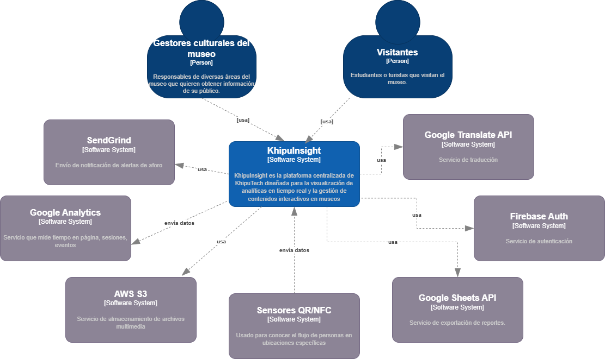

#### 4.6.3. Software Architecture Container Diagrams


#### 4.6.4. Software Architecture Components Diagrams


#### 4.7. Software Object-Oriented Design

En esta sección se presenta el diseño orientado a objetos de KhipuTech, aplicando principios de Domain-Driven Design (DDD) para estructurar el sistema en bounded contexts cohesivos. Cada contexto encapsula lógica de negocio específica, separando claramente las capas de dominio, aplicación e infraestructura para facilitar la mantenibilidad, escalabilidad y evolución independiente del software.

---

##### 4.7.1. Class Diagrams

Los diagramas de clases de KhipuTech reflejan la arquitectura hexagonal implementada en cada bounded context, separando agregados, entidades y value objects (Domain Layer) de la lógica de aplicación (Command/Query Handlers) y la infraestructura de persistencia (Repositories). Esta separación permite que la lógica de negocio permanezca agnóstica a detalles técnicos, facilitando pruebas unitarias y migraciones tecnológicas futuras.

---

###### Identity and Access Management

El bounded context de Identity and Access Management (IAM) se encarga de gestionar la autenticación, autorización y administración de usuarios dentro de la plataforma KhipuTech. Este contexto define las entidades principales como User (usuario) y Role (rol), estableciendo la base para controlar quién tiene acceso al sistema y qué permisos posee. Además, implementa servicios de hashing de contraseñas mediante BCryptPasswordHasher y generación de tokens JWT a través de JwtTokenService, asegurando la seguridad en cada interacción. Los repositorios y servicios de comandos/consultas facilitan la creación, actualización y consulta de usuarios, mientras que las políticas de autorización protegen los recursos críticos del sistema.

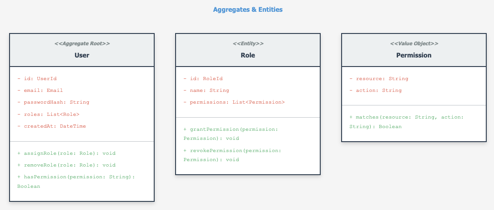
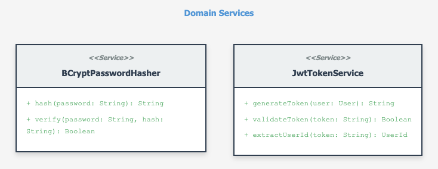
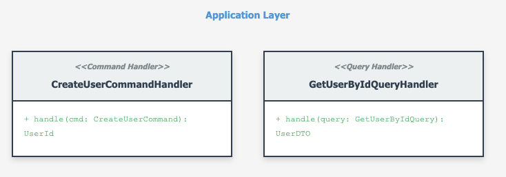
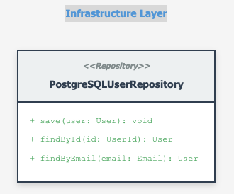

**Capa de Dominio (Domain Layer):**

**Agregados y Entidades:**

- **User** (Aggregate Root): Representa un usuario del sistema con id, email, passwordHash, roles y timestamps. Métodos principales: `assignRole()`, `removeRole()`, `hasPermission()`.
- **Role** (Entity): Define un rol con name y lista de permissions. Métodos: `grantPermission()`, `revokePermission()`.
- **Permission** (Value Object): Encapsula un permiso mediante resource y action. Método: `matches()` para validar permisos.
  **Servicios de Dominio:**
- **BCryptPasswordHasher**: Servicio para hashear y verificar contraseñas usando BCrypt con factor de costo 12.
- **JwtTokenService**: Generación y validación de tokens JWT para autenticación stateless.
  **Capa de Aplicación (Application Layer):**
- **CreateUserCommandHandler**: Maneja el comando de creación de usuarios, coordinando hasheado de contraseña y persistencia.
- **GetUserByIdQueryHandler**: Procesa consultas de usuario por ID, retornando DTOs para la capa de presentación.
  **Capa de Infraestructura (Infrastructure Layer):**
- **PostgreSQLUserRepository**: Implementación concreta del repositorio de usuarios usando PostgreSQL y Entity Framework.
  **Patrones aplicados:**
- Aggregate Root para encapsular invariantes de User
- CQRS mediante separación de Commands y Queries
- Dependency Inversion mediante interfaces de repositorios

---

###### Content Management

El bounded context de Content Management administra el catálogo de obras culturales y su contenido multimedia dentro de KhipuTech. El agregado principal Artwork encapsula información como título, artista, descripción y sala, permitiendo que curadores organicen y supervisen el contenido cultural del museo. Las entidades MultimediaContent representan archivos digitales (imágenes, audio) vinculados a obras, almacenados en CDN para optimizar tiempos de carga. El agregado QRCode gestiona códigos únicos por obra que facilitan la interacción sin fricción de visitantes mediante escaneo. Este contexto define servicios de comandos y consultas que permiten crear, actualizar, listar y eliminar obras, manteniendo una separación clara entre la lógica de dominio y la infraestructura de persistencia.

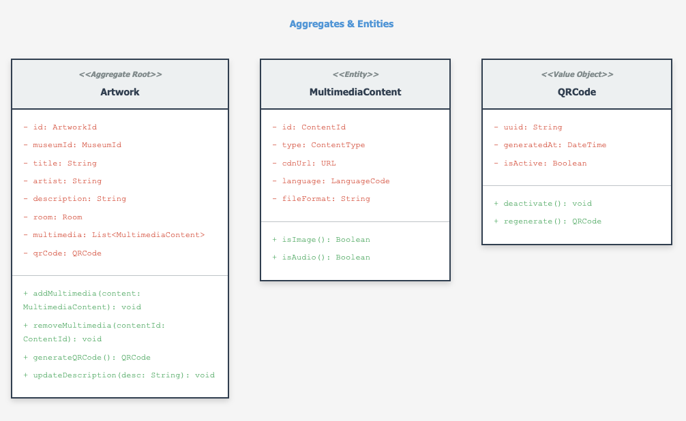
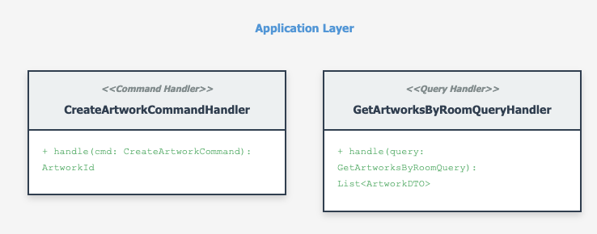
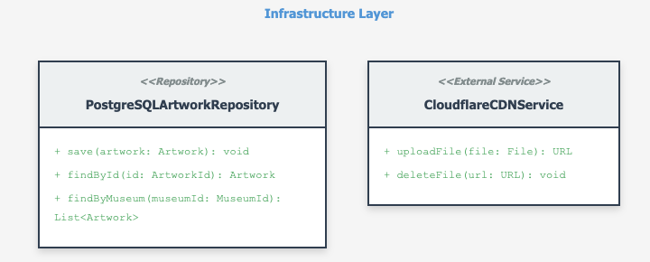

**Capa de Dominio (Domain Layer):**

**Agregados y Entidades:**

- **Artwork** (Aggregate Root): Obra cultural con id, museumId, title, artist, description, room, lista de multimedia y qrCode. Métodos: `addMultimedia()`, `removeMultimedia()`, `generateQRCode()`, `updateDescription()`.
- **MultimediaContent** (Entity): Contenido multimedia con type, cdnUrl, language, fileFormat. Métodos: `isImage()`, `isAudio()` para validación de tipo.
- **QRCode** (Value Object): Código QR único con uuid, generatedAt, isActive. Métodos: `deactivate()`, `regenerate()`.
  **Capa de Aplicación (Application Layer):**
- **CreateArtworkCommandHandler**: Procesa creación de obras incluyendo generación automática de QR.
- **GetArtworksByRoomQueryHandler**: Consulta obras filtradas por sala, retornando lista de DTOs.
  **Capa de Infraestructura (Infrastructure Layer):**
- **PostgreSQLArtworkRepository**: Persistencia de agregados Artwork en PostgreSQL.
- **CloudflareCDNService**: Servicio externo para upload/delete de archivos multimedia en Cloudflare CDN.
  **Patrones aplicados:**
- Aggregate pattern para mantener consistencia de Artwork y sus MultimediaContent
- Repository pattern con abstracción de infraestructura
- External Service integration mediante interfaces

---

###### IoT Sensors and Visitor Tracking

El bounded context de IoT Sensors and Visitor Tracking se enfoca en la administración y monitoreo de sensores IoT dentro de los espacios culturales. El agregado raíz Sensor representa cada dispositivo físico conectado (sensores de movimiento, contadores), almacenando su tipo, ubicación, estado operativo y configuración. Las entidades SensorTelemetry permiten registrar métricas en tiempo real (conteo de visitantes, tasa de ocupación), mientras que VisitorSession facilita el seguimiento de sesiones individuales con hora de entrada/salida y XP acumulado. Los servicios de comandos y consultas posibilitan el registro, actualización, eliminación y búsqueda de sensores, garantizando que gestores culturales puedan administrar su infraestructura IoT de forma centralizada y eficiente.

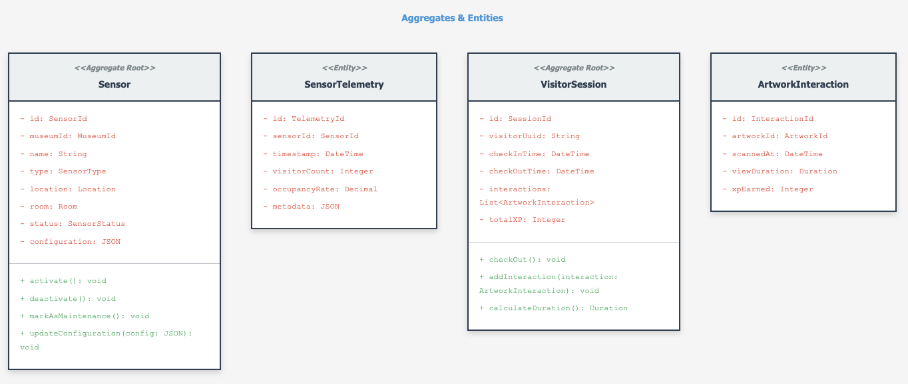
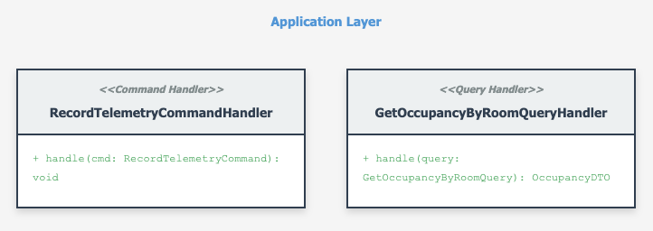
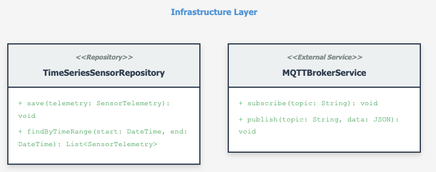

**Capa de Dominio (Domain Layer):**

**Agregados y Entidades:**

- **Sensor** (Aggregate Root): Dispositivo IoT con id, museumId, name, type, location, room, status, configuration (JSON). Métodos: `activate()`, `deactivate()`, `markAsMaintenance()`, `updateConfiguration()`.
- **SensorTelemetry** (Entity): Datos de telemetría con sensorId, timestamp, visitorCount, occupancyRate, metadata (JSON).
- **VisitorSession** (Aggregate Root): Sesión de visitante con visitorUuid, checkInTime, checkOutTime, lista de interactions, totalXP. Métodos: `checkOut()`, `addInteraction()`, `calculateDuration()`.
- **ArtworkInteraction** (Entity): Interacción QR con artworkId, scannedAt, viewDuration, xpEarned.
  **Capa de Aplicación (Application Layer):**
- **RecordTelemetryCommandHandler**: Registra datos de telemetría desde sensores vía MQTT.
- **GetOccupancyByRoomQueryHandler**: Consulta ocupación actual por sala para dashboard en tiempo real.
  **Capa de Infraestructura (Infrastructure Layer):**
- **TimeSeriesSensorRepository**: Base de datos optimizada para series temporales (TimescaleDB) para almacenar telemetría.
- **MQTTBrokerService**: Integración con broker MQTT (Mosquitto/HiveMQ) para pub/sub de datos de sensores.
  **Patrones aplicados:**
- Event-driven architecture mediante MQTT
- Time-series optimization para consultas históricas eficientes
- Domain Events para notificar cambios de estado de sensores

---

###### Gamification and Visitor Engagement

El bounded context de Gamification administra el sistema de recompensas y engagement de visitantes en KhipuTech. El agregado VisitorProfile encapsula datos como nombre de usuario, nivel actual y XP total acumulado, vinculándose directamente con el visitante anónimo identificado por UUID. Las entidades Achievement definen insignias desbloqueables con condiciones específicas (ej: escanear 50 obras), mientras que el agregado WeeklyLeaderboard mantiene rankings semanales reseteables cada lunes. Los servicios de comandos y consultas permiten actualizar perfiles, otorgar insignias y calcular rankings, garantizando que la experiencia del visitante sea personalizada y motivadora mediante mecánicas de juego que incrementan tiempo de permanencia y reexploración del museo.

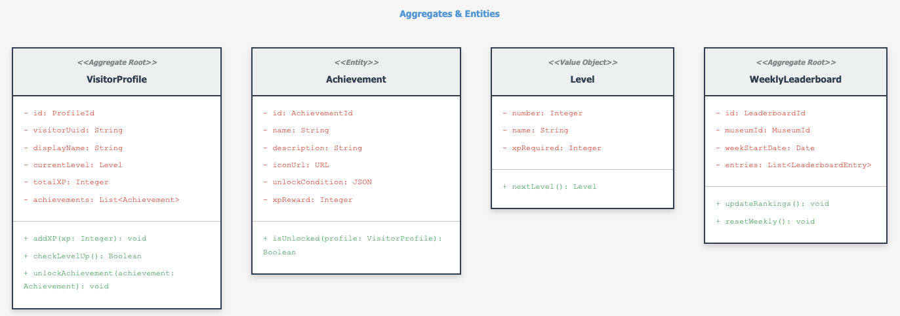
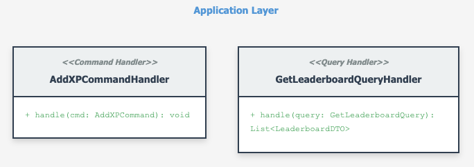
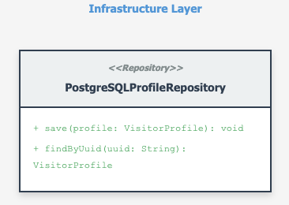

**Capa de Dominio (Domain Layer):**

**Agregados y Entidades:**

- **VisitorProfile** (Aggregate Root): Perfil de visitante con visitorUuid, displayName, currentLevel, totalXP, lista de achievements. Métodos: `addXP()`, `checkLevelUp()`, `unlockAchievement()`.
- **Achievement** (Entity): Logro con name, description, iconUrl, unlockCondition (JSON), xpReward. Método: `isUnlocked()` para validar condiciones.
- **Level** (Value Object): Nivel con number, name, xpRequired. Método: `nextLevel()`.
- **WeeklyLeaderboard** (Aggregate Root): Ranking semanal con museumId, weekStartDate, lista de entries. Métodos: `updateRankings()`, `resetWeekly()`.
  **Capa de Aplicación (Application Layer):**
- **AddXPCommandHandler**: Agrega XP al perfil y verifica subida de nivel automáticamente.
- **GetLeaderboardQueryHandler**: Retorna top 10 visitantes del ranking semanal actual.
  **Capa de Infraestructura (Infrastructure Layer):**
- **PostgreSQLProfileRepository**: Persistencia de perfiles de visitantes.
  **Patrones aplicados:**
- Strategy pattern para diferentes condiciones de unlock de achievements
- Scheduled jobs (cron) para reset semanal de leaderboard
- Value Object para encapsular lógica de niveles

---

###### Analytics and Reporting

El bounded context de Analytics se especializa en la recopilación, procesamiento y visualización de métricas operativas dentro de KhipuTech. Los agregados principales OccupancyAnalytics y ArtworkPopularityMetrics registran datos clave como el consumo de afluencia por sala y los niveles de interacción con obras en diferentes períodos de tiempo. Estos datos permiten a gestores culturales tomar decisiones informadas sobre distribución de contenido, optimización de flujos de visitantes y planificación de recursos basada en tendencias históricas. Los servicios de consulta y repositorios asociados facilitan la extracción de información histórica y la generación de reportes personalizados, contribuyendo al objetivo de crear museos inteligentes, sostenibles y eficientes mediante analítica avanzada.

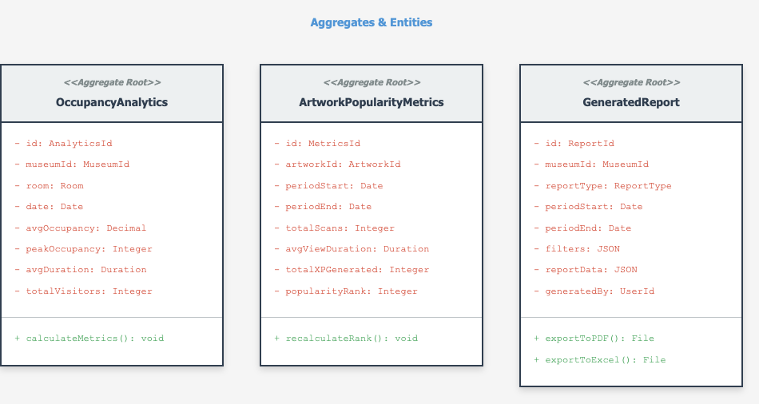
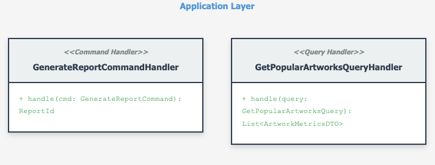
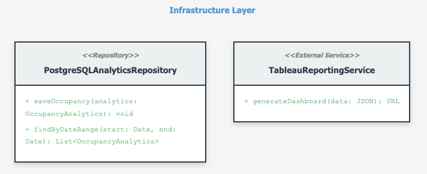

**Capa de Dominio (Domain Layer):**

**Agregados y Entidades:**

- **OccupancyAnalytics** (Aggregate Root): Análisis de ocupación con museumId, room, date, avgOccupancy, peakOccupancy, avgDuration, totalVisitors. Método: `calculateMetrics()`.
- **ArtworkPopularityMetrics** (Aggregate Root): Métricas de obra con artworkId, periodStart, periodEnd, totalScans, avgViewDuration, totalXPGenerated, popularityRank. Método: `recalculateRank()`.
- **GeneratedReport** (Aggregate Root): Reporte generado con museumId, reportType, period, filters (JSON), reportData (JSON), generatedBy. Métodos: `exportToPDF()`, `exportToExcel()`.
  **Capa de Aplicación (Application Layer):**
- **GenerateReportCommandHandler**: Genera reportes bajo demanda aplicando filtros y agregaciones complejas.
- **GetPopularArtworksQueryHandler**: Retorna ranking de obras más populares por período.
  **Capa de Infraestructura (Infrastructure Layer):**
- **PostgreSQLAnalyticsRepository**: Almacena métricas agregadas pre-calculadas para consultas rápidas.
- **TableauReportingService**: Integración con Tableau/PowerBI para dashboards interactivos.
  **Patrones aplicados:**
- CQRS con queries optimizadas mediante vistas materializadas
- Report generation con patrón Template Method
- External BI integration mediante adapters

---

##### Consideraciones Generales de Diseño Orientado a Objetos

**Principios SOLID aplicados:**

- **Single Responsibility**: Cada clase tiene una única razón para cambiar (ej: User maneja solo lógica de usuario, no persistencia).
- **Open/Closed**: Extensible mediante herencia/interfaces sin modificar código existente (ej: nuevos tipos de sensores).
- **Liskov Substitution**: Implementaciones de repositorios son intercambiables sin afectar lógica de dominio.
- **Interface Segregation**: Interfaces específicas por contexto (IUserRepository, IArtworkRepository).
- **Dependency Inversion**: Capas superiores dependen de abstracciones, no de implementaciones concretas.
  **Patrones de diseño clave:**
- **Aggregate Pattern**: Encapsula invariantes de negocio y mantiene consistencia transaccional.
- **Repository Pattern**: Abstrae persistencia permitiendo cambiar infraestructura sin afectar dominio.
- **CQRS (Command Query Responsibility Segregation)**: Separa operaciones de escritura (Commands) de lectura (Queries).
- **Domain Events**: Comunicación asíncrona entre bounded contexts.
- **Factory Pattern**: Creación de agregados complejos (ej: Artwork con multimedia y QR).
  **Manejo de transacciones:**
- Unit of Work implementado a nivel de repositorio para garantizar atomicidad.
- Transacciones distribuidas mediante Saga pattern para operaciones cross-context.
- Optimistic locking para prevenir conflictos de concurrencia.
  **Validación de dominio:**
- Invariantes validadas en constructores de agregados.
- Value Objects inmutables garantizan consistencia.
- Domain Events publicados solo después de validación exitosa.

---

#### 4.8. Database Design

En esta sección se presenta el diseño de la base de datos de KhipuTech, estructurada para soportar la gestión integral de museos inteligentes mediante analítica en tiempo real, gamificación de visitantes, control de aforo IoT y gestión de contenido cultural.

---

##### 4.8.1. Database Diagram

El diseño de base de datos de KhipuTech está organizado en cinco dominios principales que reflejan los Bounded Contexts identificados durante el Event Storming: Identity and Access Management, Content Management, IoT Sensors and Visitor Tracking, Gamification and Visitor Engagement, y Analytics and Reporting. Cada dominio está optimizado para escalabilidad, rendimiento y cumplimiento de normativas de protección de datos.

---

###### Identity and Access Management

El diagrama de base de datos de Identity and Access Management (IAM) modela la estructura para gestionar usuarios, roles y permisos dentro de la plataforma KhipuTech. La tabla **users** almacena la información básica de autenticación (nombre de usuario, email y hash de contraseña). Los **roles** definen conjuntos de permisos que pueden ser asignados a usuarios mediante la tabla intermedia **user_roles**. Los permisos específicos (**permissions**) detallan qué acciones están permitidas sobre qué recursos, y se vinculan a roles mediante **role_permissions**. Este diseño permite una gestión flexible y escalable de la seguridad, facilitando la asignación dinámica de permisos según el contexto y las necesidades del museo.

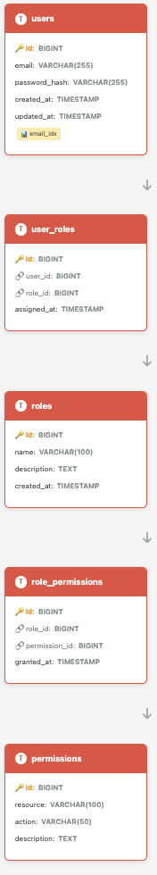

**Tablas principales:**

- **users**: Información de autenticación (id, email, password_hash, created_at, updated_at)
- **roles**: Definición de roles del sistema (id, name, description, created_at)
- **permissions**: Permisos específicos sobre recursos (id, resource, action, description)
- **user_roles**: Relación muchos-a-muchos entre usuarios y roles (id, user_id, role_id, assigned_at)
- **role_permissions**: Relación muchos-a-muchos entre roles y permisos (id, role_id, permission_id, granted_at)

**Índices estratégicos:**

- `email_idx` en users para optimizar búsquedas de autenticación
- Claves foráneas indexadas para joins eficientes

---

###### Content Management

El diagrama de base de datos de Content Management modela la gestión de obras culturales y su contenido multimedia dentro de KhipuTech. La tabla **artworks** almacena información esencial de cada obra (título, artista, descripción, sala). La tabla **multimedia_content** vincula archivos multimedia (imágenes, audio) a las obras, especificando tipo de contenido, URL del CDN, idioma y formato. Los códigos QR/NFC se gestionan en **qr_codes**, asociando un UUID único a cada obra. Este diseño facilita la gestión curatorial de contenido, permite escalabilidad para nuevos idiomas y optimiza la entrega de multimedia mediante CDN.

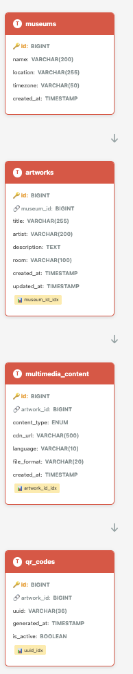

**Tablas principales:**

- **museums**: Información de museos (id, name, location, timezone, created_at)
- **artworks**: Catálogo de obras (id, museum_id, title, artist, description, room, created_at, updated_at)
- **multimedia_content**: Archivos multimedia vinculados a obras (id, artwork_id, content_type, cdn_url, language, file_format, created_at)
- **qr_codes**: Códigos únicos por obra (id, artwork_id, uuid, generated_at, is_active)

**Índices estratégicos:**

- `museum_id_idx` en artworks para filtrado por museo
- `artwork_id_idx` en multimedia_content para carga rápida de contenido
- `uuid_idx` en qr_codes para escaneos instantáneos

**Consideraciones de diseño:**

- `content_type` usa ENUM para validar tipos (image, audio, video, text)
- `cdn_url` almacena URLs de CloudFront/Cloudflare para distribución global
- `language` soporta códigos ISO 639-1 (es, en) con capacidad de extensión

---

###### IoT Sensors and Visitor Tracking

El diagrama de base de datos de IoT Sensors and Visitor Tracking representa la gestión y monitoreo de sensores IoT dentro de la plataforma KhipuTech. La tabla **sensors** almacena información esencial de cada sensor (nombre, tipo, ubicación, sala, estado y configuración en formato JSON). Los datos de telemetría se registran en **sensor_telemetry**, capturando métricas en tiempo real con sus timestamps correspondientes. La tabla **visitor_sessions** registra las sesiones de visitantes con hora de entrada y salida. Las interacciones con obras se almacenan en **artwork_interactions**, vinculando visitantes con obras mediante tiempo de visualización y XP ganado. Este diseño permite control granular sobre el estado operativo de los sensores, facilita el análisis histórico de afluencia y soporta la toma de decisiones basada en datos para optimización de espacios y gestión de contenido.

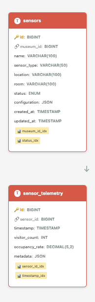
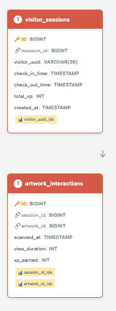

**Tablas principales:**

- **sensors**: Dispositivos IoT instalados (id, museum_id, name, sensor_type, location, room, status, configuration, created_at, updated_at)
- **sensor_telemetry**: Datos de telemetría en tiempo real (id, sensor_id, timestamp, visitor_count, occupancy_rate, metadata)
- **visitor_sessions**: Sesiones de visitantes (id, museum_id, visitor_uuid, check_in_time, check_out_time, total_xp, created_at)
- **artwork_interactions**: Interacciones QR/NFC con obras (id, session_id, artwork_id, scanned_at, view_duration, xp_earned)

**Índices estratégicos:**

- `museum_id_idx`, `status_idx` en sensors para monitoreo por museo y filtrado por estado
- `sensor_id_idx`, `timestamp_idx` en sensor_telemetry para series temporales
- `visitor_uuid_idx` en visitor_sessions para recuperación rápida de perfil
- `session_id_idx`, `artwork_id_idx` en artwork_interactions para análisis de popularidad

**Consideraciones de diseño:**

- `status` usa ENUM (active, inactive, maintenance, error) para monitoreo de salud
- `configuration` en JSON permite parámetros flexibles por tipo de sensor (MQTT topics, umbrales)
- `metadata` en sensor_telemetry almacena datos adicionales (temperatura, humedad) sin cambios de schema
- `occupancy_rate` es DECIMAL(5,2) para porcentajes con precisión (ej: 87.53%)

---

###### Gamification and Visitor Engagement

El diagrama de base de datos de Gamification modela el sistema de recompensas y engagement de visitantes en KhipuTech. La tabla **visitor_profiles** almacena información del perfil del visitante (nombre, nivel actual, XP total acumulado). Los **achievements** definen insignias y logros desbloqueables con sus condiciones. La tabla intermedia **visitor_achievements** registra qué insignias ha obtenido cada visitante y cuándo. El **weekly_leaderboard** mantiene el ranking semanal de visitantes por XP, reseteable cada lunes. Este diseño permite personalizar la experiencia del visitante, fomenta la reexploración del museo mediante desafíos y crea una capa de gamificación que incrementa engagement y tiempo de permanencia.

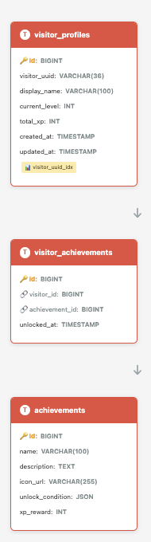
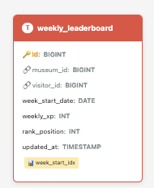

**Tablas principales:**

- **visitor_profiles**: Perfiles de visitantes (id, visitor_uuid, display_name, current_level, total_xp, created_at, updated_at)
- **achievements**: Catálogo de logros (id, name, description, icon_url, unlock_condition, xp_reward)
- **visitor_achievements**: Logros desbloqueados por visitante (id, visitor_id, achievement_id, unlocked_at)
- **weekly_leaderboard**: Ranking semanal (id, museum_id, visitor_id, week_start_date, weekly_xp, rank_position, updated_at)

**Índices estratégicos:**

- `visitor_uuid_idx` en visitor_profiles para identificación anónima
- `week_start_idx` en weekly_leaderboard para consultas de ranking actual

**Consideraciones de diseño:**

- `unlock_condition` en JSON define reglas (ej: `{"type": "scan_count", "threshold": 50}`)
- `weekly_xp` se resetea cada lunes mediante cron job, pero `total_xp` persiste
- `rank_position` se calcula mediante window functions de SQL para eficiencia
- Niveles se calculan con umbrales: Nivel 1 (0-99 XP), Nivel 2 (100-499 XP), Nivel 3 (500+ XP)

---

###### Analytics and Reporting

El diagrama de base de datos de Analytics modela la captura y análisis de métricas operativas en KhipuTech. La tabla **occupancy_analytics** registra estadísticas de ocupación por sala, incluyendo promedio de visitantes, picos de afluencia y tiempo promedio de permanencia. Las **artwork_popularity_metrics** capturan métricas de cada obra (total de escaneos, tiempo promedio de visualización, XP total generado, ranking de popularidad). Los **generated_reports** almacenan reportes generados bajo demanda, especificando tipo de reporte, período analizado, sala o museo asociado y datos completos en formato JSON. Este diseño permite a gestores culturales tomar decisiones informadas sobre distribución de obras, optimización de flujos de visitantes y planificación de recursos basada en datos históricos y tendencias detectadas.

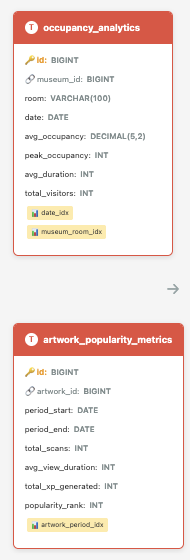
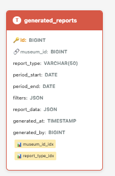

**Tablas principales:**

- **occupancy_analytics**: Estadísticas de ocupación (id, museum_id, room, date, avg_occupancy, peak_occupancy, avg_duration, total_visitors)
- **artwork_popularity_metrics**: Métricas de popularidad de obras (id, artwork_id, period_start, period_end, total_scans, avg_view_duration, total_xp_generated, popularity_rank)
- **generated_reports**: Reportes generados (id, museum_id, report_type, period_start, period_end, filters, report_data, generated_at, generated_by)

**Índices estratégicos:**

- `date_idx`, `museum_room_idx` en occupancy_analytics para consultas temporales por sala
- `artwork_period_idx` en artwork_popularity_metrics para rankings por período
- `museum_id_idx`, `report_type_idx` en generated_reports para historial de reportes

**Consideraciones de diseño:**

- `report_type` define categorías: "weekly_attendance", "artwork_ranking", "hourly_flow", "room_heatmap"
- `filters` en JSON almacena parámetros de filtrado aplicados (ej: `{"room": "S3", "min_scans": 100}`)
- `report_data` en JSON contiene resultados agregados para exportación a PDF/Excel sin recalcular
- `avg_duration` se mide en minutos (INT) calculado desde check_in/check_out de visitor_sessions

---

##### Consideraciones Generales de Diseño

**Escalabilidad:**

- Base de datos diseñada para crecer horizontalmente mediante particionamiento por `museum_id`
- Telemetría de sensores usa tabla time-series optimizada con retention policies (7 días granular, 1 año agregado)
- Índices compuestos en campos frecuentemente consultados juntos (museum_id + date, artwork_id + period)

**Seguridad:**

- Hashes de contraseñas mediante bcrypt con factor de costo 12
- `visitor_uuid` anónimo (UUID v4) sin vincular a datos personales para cumplir GDPR
- Campos sensibles cifrados a nivel de aplicación antes de persistir (AES-256)

**Rendimiento:**

- JSON usado estratégicamente para datos flexibles no consultables (configuration, metadata, report_data)
- TIMESTAMP con zona horaria para sincronización global de museos en diferentes regiones
- BIGINT para IDs primarios preparado para >4 mil millones de registros por tabla

**Integridad Referencial:**

- Foreign keys con ON DELETE CASCADE para limpieza automática (visitor_sessions → artwork_interactions)
- ON DELETE SET NULL para preservar datos históricos (users → generated_reports.generated_by)
- Check constraints para validar rangos (occupancy_rate BETWEEN 0 AND 100)

---

## Capítulo V: Product Implementation, Validation & Deployment

### 5.1. Software Configuration Management

#### 5.1.1. Software Development Environment Configuration

| Producto           | Propósito en el proyecto                                 | Categoría                       | Ruta de descarga / acceso                       | Descripción                                                                                                   |
| ------------------ | -------------------------------------------------------- | ------------------------------- | ----------------------------------------------- | ------------------------------------------------------------------------------------------------------------- |
| HTML5              | Estructura base de las páginas web del sistema.          | Frontend Development            | https://developer.mozilla.org/es/docs/Web/HTML  | Lenguaje de marcado utilizado para definir la estructura y contenido de las páginas web.                      |
| CSS3               | Diseño visual y estilos de la interfaz de usuario.       | Frontend Development            | https://developer.mozilla.org/es/docs/Web/CSS   | Lenguaje utilizado para definir la presentación visual, incluyendo colores, layouts y diseño responsivo.      |
| Vue.js             | Desarrollo de interfaces dinámicas e interactivas.       | Frontend Development            | https://vuejs.org/guide/introduction.html       | Framework progresivo de JavaScript para construir interfaces de usuario de forma eficiente.                   |
| JetBrains WebStorm | Desarrollo y edición del código del frontend.            | Software Development            | https://www.jetbrains.com/webstorm/             | IDE especializado en desarrollo web con soporte para JavaScript, TypeScript y frameworks modernos.            |
| Git CLI (Git)      | Control de versiones y gestión de cambios en el código.  | Version Control                 | https://git-scm.com/                            | Sistema de control de versiones distribuido que permite trabajar con ramas y mantener historial del proyecto. |
| GitHub             | Almacenamiento y trabajo colaborativo del código fuente. | Collaboration & Version Control | https://github.com/                             | Plataforma para alojar repositorios, gestionar versiones y colaborar en equipo.                               |
| MySQL Workbench    | Diseño y gestión de la base de datos del sistema.        | Database Management             | https://dev.mysql.com/downloads/workbench/      | Herramienta visual para modelar bases de datos, ejecutar consultas SQL y administrar servidores MySQL.        |
| Docker Desktop     | Contenerización del sistema para facilitar despliegues.  | DevOps / Containerization       | https://www.docker.com/products/docker-desktop/ | Plataforma que permite crear y ejecutar contenedores, asegurando entornos consistentes.                       |
| Swagger UI         | Documentación y prueba de la API del sistema.            | API Documentation               | https://swagger.io/tools/swagger-ui/            | Herramienta que permite visualizar y probar endpoints de APIs REST de forma interactiva.                      |
| Structurizr        | Modelado de arquitectura basado en C4.                   | Software Architecture           | https://structurizr.com/                        | Herramienta para documentar y visualizar la arquitectura del sistema mediante el modelo C4.                   |
| UXPressia          | Diseño de experiencia de usuario (journeys y personas).  | UX/UI Design                    | https://uxpressia.com/                          | Plataforma para crear mapas de experiencia del usuario y analizar interacciones.                              |

#### 5.1.2. Source Code Management

El proyecto KhipuTech, desarrollado por el startup WebStone, consiste en una plataforma SaaS orientada a la analítica de flujo de visitantes y la gestión de contenido interactivo en museos y centros culturales. Este sistema se construye bajo un enfoque profesional que prioriza buenas prácticas de desarrollo, trabajo colaborativo y una arquitectura escalable, permitiendo integrar componentes de software con dispositivos IoT de bajo costo.

La configuración del entorno de desarrollo se basa en principios de separación de responsabilidades y modularidad, tomando como referencia el modelo C4 (Context, Container, Component, Code). Esto permite estructurar el sistema en diferentes capas, facilitando su mantenimiento, evolución y comprensión por parte del equipo. Asimismo, se busca garantizar la escalabilidad del proyecto, considerando futuras integraciones con sensores y servicios en tiempo real.

Para el desarrollo frontend, el equipo utiliza WebStorm como entorno principal, lo que permite mantener una configuración homogénea entre los integrantes. Este IDE ofrece soporte completo para tecnologías web modernas y facilita tareas como la navegación del código, depuración, refactorización y gestión de dependencias. Además, se integra de manera eficiente con Vue.js, framework seleccionado para la construcción de la interfaz de usuario.

El uso de Vue.js permite desarrollar una interfaz dinámica basada en componentes reutilizables, favoreciendo una arquitectura modular. Gracias a su enfoque reactivo, se logra una mejor gestión del estado de la aplicación y una experiencia de usuario más fluida. Esta estructura también facilita el trabajo paralelo del equipo, permitiendo dividir responsabilidades sin afectar la coherencia del sistema.

En cuanto al control de versiones y colaboración, el equipo utiliza Git junto con GitHub, lo que permite gestionar cambios, trabajar con ramas y mantener un historial organizado del desarrollo. El repositorio principal del proyecto se encuentra disponible en el siguiente enlace:
https://github.com/upc-pre-202610-1asi0730-12242-Web-Stone/TF_Aplicaciones_Web.git

Este repositorio funciona como el núcleo del desarrollo colaborativo, donde se integran los avances del equipo y se gestionan las diferentes versiones del sistema. A través de este enfoque, KhipuTech asegura un flujo de trabajo ordenado, controlado y alineado con las necesidades del proyecto, permitiendo validar funcionalidades antes de su implementación final.

#### 5.1.3. Source Code Style Guide & Conventions

El uso de un estilo de código unificado y una arquitectura bien definida es clave para asegurar la escalabilidad, la mantenibilidad y la colaboración efectiva en el desarrollo de KhipuTech. Para ello, el proyecto incorpora prácticas de programación y convenciones estructurales que promueven la calidad técnica, la claridad y la consistencia en cada módulo del sistema, tomando como referencia estándares reconocidos de la industria.

En cuanto a la arquitectura, KhipuTech adopta el modelo C4, lo que permite visualizar el sistema en distintos niveles de abstracción, facilitando la comprensión de su estructura y funcionamiento. Asimismo, se basa en principios de Clean Architecture y Domain-Driven Design, lo que permite mantener una separación clara entre las distintas capas del sistema, reduciendo el acoplamiento y mejorando la mantenibilidad del código.

Para el desarrollo del frontend, se emplea Vue.js como framework principal, permitiendo la construcción de interfaces dinámicas basadas en componentes reutilizables. La estructura del proyecto se organiza en directorios como components, views y store, lo que facilita la modularidad del sistema. Además, se siguen convenciones de nomenclatura como el uso de PascalCase para componentes y kebab-case para archivos, en línea con las buenas prácticas recomendadas por la comunidad.

En relación con el control de versiones, el proyecto utiliza Git y GitHub para gestionar los cambios en el código fuente, permitiendo trabajar de manera colaborativa mediante el uso de ramas y manteniendo un historial organizado del desarrollo.

Finalmente, se emplean herramientas como WebStorm para el desarrollo del frontend, Docker para la contenerización del sistema, MySQL Workbench para la gestión de la base de datos y Swagger UI para la documentación de APIs. Estas herramientas contribuyen a mantener un flujo de trabajo ordenado, eficiente y alineado con prácticas profesionales de desarrollo de software.

#### 5.1.4. Software Deployment Configuration

Para gestionar el desarrollo de KhipuTech de manera colaborativa, el equipo utilizó la funcionalidad de forks en GitHub. Cada integrante creó una copia del repositorio principal en su cuenta personal, lo que permitió trabajar de forma independiente en nuevas funcionalidades o pruebas sin afectar el código base.

Este enfoque permitió mantener la estabilidad del repositorio principal, al mismo tiempo que facilitó la organización del trabajo en equipo y la validación de cambios antes de su integración final.

### 5.2. Landing Page, Services & Applications Implementation

#### 5.2.1. Sprint 1

##### 5.2.1.1. Sprint Planning 1

##### 5.2.1.2. Aspect Leaders and Collaborators

##### 5.2.1.3. Sprint Backlog 1

##### 5.2.1.4. Development Evidence for Sprint Review

##### 5.2.1.5. Execution Evidence for Sprint Review

##### 5.2.1.6. Services Documentation Evidence for Sprint Review

##### 5.2.1.7. Software Deployment Evidence for Sprint Review

##### 5.2.1.8. Team Collaboration Insights during Sprint

---

#### 5.2.2. Sprint 2

##### 5.2.2.1. Sprint Planning 2

##### 5.2.2.2. Aspect Leaders and Collaborators

##### 5.2.2.3. Sprint Backlog 2

##### 5.2.2.4. Development Evidence for Sprint Review

##### 5.2.2.5. Execution Evidence for Sprint Review

##### 5.2.2.6. Services Documentation Evidence for Sprint Review

##### 5.2.2.7. Software Deployment Evidence for Sprint Review

##### 5.2.2.8. Team Collaboration Insights during Sprint

---

#### 5.2.3. Sprint 3

##### 5.2.3.1. Sprint Planning 3

##### 5.2.3.2. Aspect Leaders and Collaborators

##### 5.2.3.3. Sprint Backlog 3

##### 5.2.3.4. Development Evidence for Sprint Review

##### 5.2.3.5. Execution Evidence for Sprint Review

##### 5.2.3.6. Services Documentation Evidence for Sprint Review

##### 5.2.3.7. Software Deployment Evidence for Sprint Review

##### 5.2.3.8. Team Collaboration Insights during Sprint

---

#### 5.2.4. Sprint 4

##### 5.2.4.1. Sprint Planning 4

##### 5.2.4.2. Aspect Leaders and Collaborators

##### 5.2.4.3. Sprint Backlog 4

##### 5.2.4.4. Development Evidence for Sprint Review

##### 5.2.4.5. Execution Evidence for Sprint Review

##### 5.2.4.6. Services Documentation Evidence for Sprint Review

##### 5.2.4.7. Software Deployment Evidence for Sprint Review

##### 5.2.4.8. Team Collaboration Insights during Sprint

---

#### 5.3. Validation Interviews

##### 5.3.1. Diseño de entrevistas

##### 5.3.2. Registro de entrevistas

##### 5.3.3. Evaluaciones según heurísticas

### 5.4. Video About-the-Product

---

---

## Bibliografía

---

### Referencias Técnicas

**Domain-Driven Design:**

- Evans, E. (2003). _Domain-Driven Design: Tackling Complexity in the Heart of Software_. Addison-Wesley Professional.
- Vernon, V. (2013). _Implementing Domain-Driven Design_. Addison-Wesley Professional.
  **Arquitectura de Software:**
- Brown, S. (2018). _Software Architecture for Developers_. Leanpub.
- Richardson, C. (2018). _Microservices Patterns: With examples in Java_. Manning Publications.
  **Internet of Things (IoT):**
- Patel, K. K., & Patel, S. M. (2016). Internet of Things-IOT: Definition, Characteristics, Architecture, Enabling Technologies, Application & Future Challenges. _International Journal of Engineering Science and Computing_, 6(5).
  **Gamification:**
- Deterding, S., Dixon, D., Khaled, R., & Nacke, L. (2011). From game design elements to gamefulness: defining "gamification". _Proceedings of the 15th International Academic MindTrek Conference_, 9-15.

---

### Sitios Web Consultados

**Documentación Técnica:**

- React Documentation. (2024). _React – A JavaScript library for building user interfaces_. Recuperado de https://react.dev/
- PostgreSQL Documentation. (2024). _PostgreSQL: The World's Most Advanced Open Source Relational Database_. Recuperado de https://www.postgresql.org/docs/
- MQTT.org. (2024). _MQTT: The Standard for IoT Messaging_. Recuperado de https://mqtt.org/
  **Diseño y UX:**
- Nielsen Norman Group. (2024). _Evidence-Based User Experience Research, Training, and Consulting_. Recuperado de https://www.nngroup.com/
- Material Design. (2024). _Material Design Guidelines_. Recuperado de https://material.io/design
  **Analítica y Museos:**
- ICOM – International Council of Museums. (2024). Recuperado de https://icom.museum/
- American Alliance of Museums. (2024). _Digital Transformation in Museums_. Recuperado de https://www.aam-us.org/

---

### Normas y Estándares

- ISO/IEC 25010:2011. _Systems and software engineering — Systems and software Quality Requirements and Evaluation (SQuaRE)_
- WCAG 2.1. _Web Content Accessibility Guidelines_. W3C. Recuperado de https://www.w3.org/WAI/WCAG21/quickref/
- IEEE 830-1998. _IEEE Recommended Practice for Software Requirements Specifications_

---

### Herramientas Utilizadas

**Desarrollo:**

- Visual Studio Code. (2024). _Code Editing. Redefined_. Microsoft. https://code.visualstudio.com/
- Git. (2024). _Git - Distributed version control system_. https://git-scm.com/
- GitHub. (2024). _Where the world builds software_. https://github.com/
  **Diseño:**
- Figma. (2024). _Collaborative Interface Design Tool_. https://www.figma.com/
- Miro. (2024). _The Visual Workspace for Innovation_. https://miro.com/
  **Documentación:**
- Pandoc. (2024). _A universal document converter_. https://pandoc.org/
- Markdown Guide. (2024). https://www.markdownguide.org/

---
