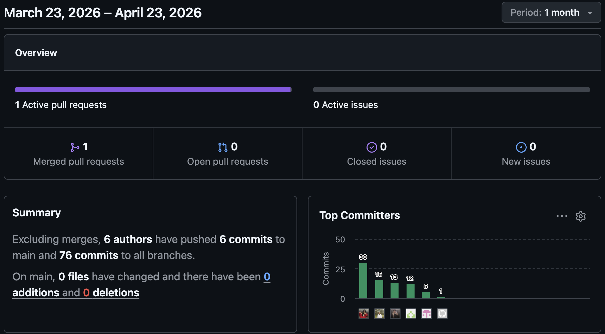
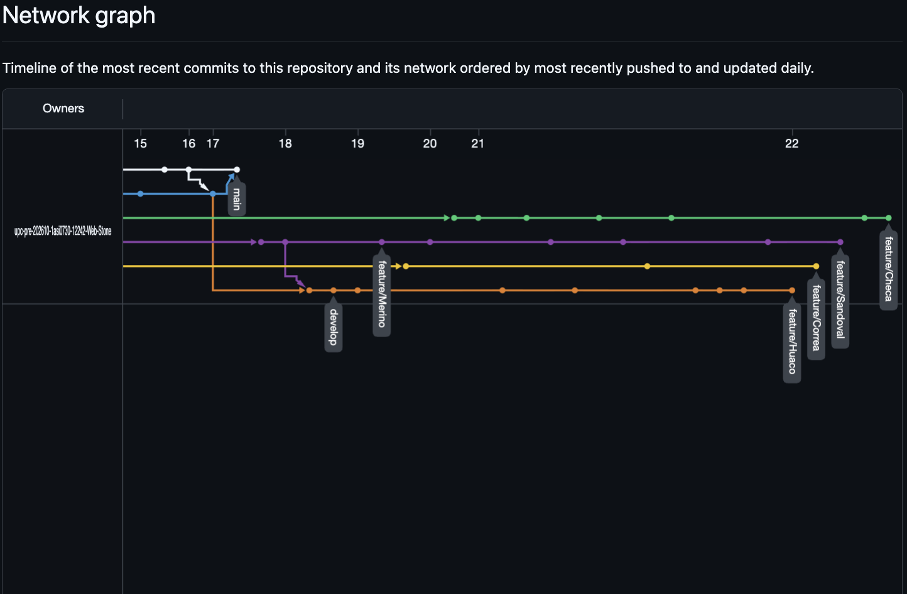
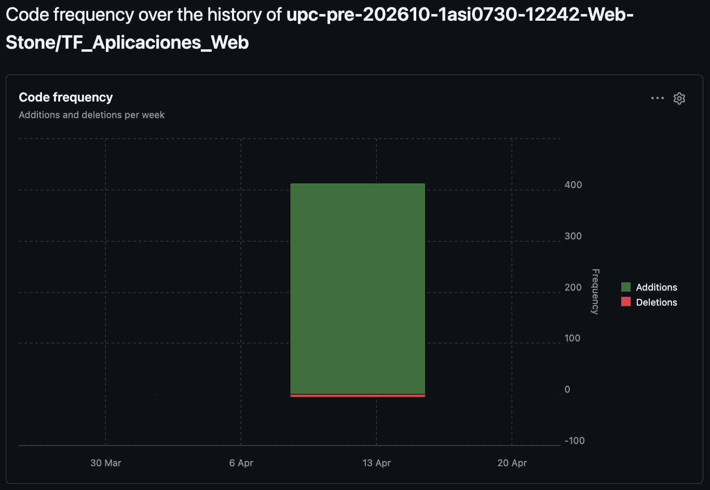

### Project Report Collaboration Insights

A continuación se presenta el análisis de contribuciones del equipo durante la elaboración del informe TB1, reflejando el trabajo colaborativo mediante Git y GitHub.

---

#### Pulse of Worked Members

_Gráfico que muestra la frecuencia de commits por semana durante el desarrollo del TB1._

---

#### Network Graph & Collaboration

_Visualización de ramas y merges durante el desarrollo colaborativo._

**Estrategia de Branching:**

- `main` — Versión estable para entregas
- `develop` — Integración de capítulos
- `feature/lastname` — Desarrollo individual por capítulo
<!---`feature/style-guide` — Diseño UI/UX-->
- `fix/corrections` — Correcciones post-revisión

---

#### Contribution Activity

| Integrante      | Commits | Líneas Añadidas | Líneas Eliminadas | Capítulos Principales                           |
| --------------- | ------- | --------------- | ----------------- | ----------------------------------------------- |
| Fabian Sandoval | 13      | +24             | -2                | Cap. I, Coordinación general                    |
| Oscar Checa     | 15      | +148            | -0                | Cap. IV (Product Design), Wireframes            |
| Andrea Correa   | 30      | +5              | -4                | Cap. V (Requirements), Event Storming           |
| Winnie Merino   | 5       | +0              | -0                | Cap. II (Implementation), Arquitectura          |
| Luis Huaco      | 12      | +236            | -1                | Cap. III (Specification), Documentación técnica |

**Total:** 75 commits | +413 líneas añadidas | -7 líneas eliminadas

---

#### Code Frequency

_Evolución de adiciones y eliminaciones de líneas a lo largo del proyecto._

**Insights:**

- **Pico de actividad:** Semana 3 (desarrollo intensivo de User Stories y Requirements)
- **Refinamiento:** Semana 4 más eliminaciones que adiciones (limpieza de código/documentación)

---

#### Observaciones de Colaboración

**Fortalezas:**

- Uso efectivo de GitFlow con ramas feature por capítulo
- Revisiones cruzadas mediante Pull Requests (promedio 2 revisores por PR)
- Comunicación activa en commits descriptivos siguiendo Conventional Commits

**Áreas de Mejora:**

- Aumentar frecuencia de commits pequeños vs. commits grandes
- Implementar CI/CD para validación automática de Markdown
- Agregar templates de PR para estandarizar revisiones

---

**Nota:** Las capturas de pantalla de GitHub (Pulse, Network, Contributors, Code Frequency) deben ser insertadas en `assets/img/insights/` antes de la compilación final del PDF.
